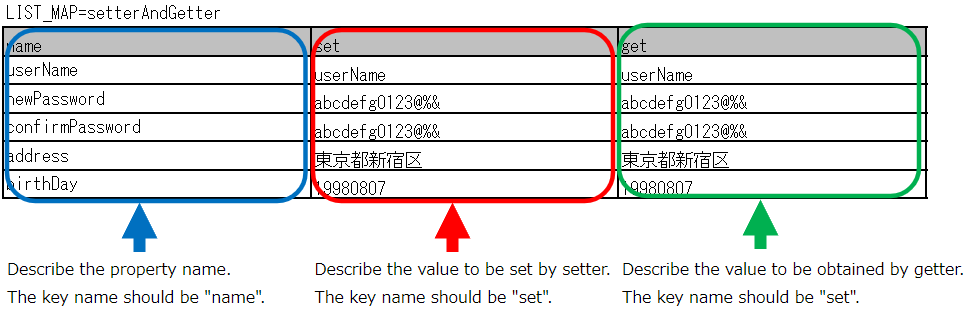

.. _entityUnitTestWithBeanValidation:

=============================================================
Class Unit Testing of Form/Entity supporting Bean Validation
=============================================================
This chapter describes the class unit test for Form and Entity in which input value checks are performed using :ref:`bean_validation`.
Since both can perform unit tests in almost the same way, common content shall be described based on the Form unit test, and the specific processing shall be described separately.

.. tip::
   For the responsibilitiy of Form and Entity, see the responsibility assignment for each processing archetecture.
   e.g. :ref:`Responsibility assignment of web application<application_design>` , :ref:`Responsibility assignment of Nablarch batch application<nablarch_batch-application_design>`

-------------------------------------
How to write a Form/Entity unit test
-------------------------------------
The test class and test data used as examples in this chapter are as follows (right click -> Download and Save).

* :download:`Test class(UserRegistrationFormTest.java)<../_download/UserRegistrationFormTest.java>`
* :download:`Test data(UserRegistrationFormTest.xlsx)<../_download/UserRegistrationFormTest.xlsx>`
* :download:`Test target class(UserRegistrationForm.java)<../_download/UserRegistrationForm.java>`

Create test data
==================
Describes how to create the Excel file that contains the test data itself. The Excel file containing the test data is stored with the same name in the same directory as the test source code (only the extension is different).\
It is a prerequisite that the
\ :ref:`test cases for validation <entityUnitTest_ValidationCase_BeanValidation>` and
\ :ref:`test cases for setters and getters <entityUnitTest_SetterGetterCase_BeanValidation>`
will be used one sheet at a time respectively.

For details on how to describe the test data, see \ :doc:`../../../06_TestFWGuide/01_Abstract`\ , \ :doc:`../../../06_TestFWGuide/02_DbAccessTest`\.

It is a prerequisite that the static master data stored in the database, such as message data and code master,
has been input with data managed by the project in advance (these data are not created as individual test data).

Create a test class
====================
The test class of form/entity unit test should be created to satisfy the following conditions.

* The package of the test class is the same as the Form/Entity to be tested.
* Create a test class with the class name <Form/Entity class name> Test.
* Inherit nablarch.test.core.db.EntityTestSupport.

.. code-block:: java

   package com.nablarch.example.app.web.form; // [Description] Package is the same as UserRegistrationForm
   
   import nablarch.test.core.db.EntityTestSupport;
   import org.junit.Test;
   
   /**
    * Class that executes tests for the UserRegistrationForm class.  
    * Refer to the Excel sheet for test content.
    *
    * @author Takayuki Uchida
    * @since 1.0
    */
   public class UserRegistrationFormTest extends EntityTestSupport {
   // [Description] Class name is UserRegistrationForm and it inherits from EntityTestSupport

   // ~ Rest is omitted ~

For details on how to describe the test method, see the code examples described below.

.. _entityUnitTest_ValidationCase_BeanValidation:

Single item validation test case of character type and string length
=====================================================================

Most of the test cases for single item validation are related to the input character type and string length. \
For example, assume the following the property.

* Property name "Furigana"
* Maximum string length is 50 characters
* Required items
* Only full-width katakana is allowed

In this case, the following test case should be created.

 =================================================================================== =========================
 Case                                                                                 Perspective
 =================================================================================== =========================
 Validation should be successful when full-width Katakana 50 characters are entered.   Check maximum string length and character type
 Validation should fail when full-width Katakana 51 characters are entered.            Check of maximum string length
 Validation should be successful when 1 full-width Katakana character is entered.      Check of minimum string length and character type
 Validation should fail when empty string is entered.                                  Check of required validation
 Validation should fail when Half-width Katakana is entered.                           Check character type\ [#]_\
 =================================================================================== =========================

\ 
 
 .. [#] Similarly, there is a need for cases in which Half-width alphabetic characters, Full-width Hiragana, Kanji ..., etc. are input and the detailed examination fails.

There are a large number of test cases for single item validation, and data creation requires time and labor.\
Therefore, a test method is provided exclusively for single item validation test.As a result, the following effects are expected.

* Facilitates the creation of test cases for single item validation.
* Creates test data with high maintainability, making it easier to review and maintain.

.. tip::
   This test method cannot be used for a form that holds another form as a property. In that case, implement your own validation processing test.
   A form that holds another form as a property is the parent form that accesses the property in the following format:
   
   .. code-block:: none
   
      <Parent Form>.<child Form>.<child form property name>.

.. _entityUnitTest_CharsetAndLengthInputData_BeanValidation:

How to create a test case table
--------------------------------

Prepare the following columns.

+-----------------------------------------------+--------------------------------------------------------------------------------------------------------------+
| Column name                                   | Contents to be mentioned                                                                                     |
+===============================================+==============================================================================================================+
|propertyName                                   |The property name to be tested.                                                                               |
+-----------------------------------------------+--------------------------------------------------------------------------------------------------------------+
|allowEmpty                                     |Whether the property allows for no input                                                                      |
+-----------------------------------------------+--------------------------------------------------------------------------------------------------------------+
|group                                          |Group in Bean Validation (optional) \ [#]_\                                                                   |
+-----------------------------------------------+--------------------------------------------------------------------------------------------------------------+
|min                                            |Minimum string length allowed by the property as input value (optional)                                       |
+-----------------------------------------------+--------------------------------------------------------------------------------------------------------------+
|max                                            |Maximum string length allowed by the property as input value (optional)                                       |
+-----------------------------------------------+--------------------------------------------------------------------------------------------------------------+
|messageIdWhenEmptyInput                        |Message to expect when input is empty (optional) \ [#]_\                                                      |
+-----------------------------------------------+--------------------------------------------------------------------------------------------------------------+
|messageIdWhenInvalidLength                     |Message to expect when input length is incompatible (optional) \ [#]_\                                        |
+-----------------------------------------------+--------------------------------------------------------------------------------------------------------------+
|messageIdWhenNotApplicable                     |Message to expect when character type is incompatible                                                         |
+-----------------------------------------------+--------------------------------------------------------------------------------------------------------------+
|interpolateKey\_\ *n*                          |Key of pad characters (\ *n*\ is a sequential number from 1, optional) \ [#]_                                 |
+-----------------------------------------------+--------------------------------------------------------------------------------------------------------------+
|interpolateValue\_\ *n*                        |Value of pad characters (\ *n*\ is a sequential number from 1, optional)                                      |
+-----------------------------------------------+--------------------------------------------------------------------------------------------------------------+
|Half-width alphabetic characters (半角英字)    |Whether half-width alphabetic characters are allowed?                                                         |
+-----------------------------------------------+--------------------------------------------------------------------------------------------------------------+
|Half-width numbers (半角数字)                  |Whether half-width numbers are allowed?                                                                       |
+-----------------------------------------------+--------------------------------------------------------------------------------------------------------------+
|Half-width symbols (半角記号)                  |Whether half-width symbols are allowed?                                                                       |
+-----------------------------------------------+--------------------------------------------------------------------------------------------------------------+
|Half-width kana (半角カナ)                     |Whether half-width kana are allowed?                                                                          |
+-----------------------------------------------+--------------------------------------------------------------------------------------------------------------+
|Full-width alphabets (全角英字)                |Whether full-width alphabets are allowed?                                                                     |
+-----------------------------------------------+--------------------------------------------------------------------------------------------------------------+
|Full-width numbers (全角数字)                  |Whether full-width numbers are allowed?                                                                       |
+-----------------------------------------------+--------------------------------------------------------------------------------------------------------------+
|Full-width Hiragana (全角ひらがな)             |Whether full-width Hiragana are allowed?                                                                      |
+-----------------------------------------------+--------------------------------------------------------------------------------------------------------------+
|Full-width Katakana (全角カタカナ)             |Whether full-width Katakana are allowed?                                                                      |
+-----------------------------------------------+--------------------------------------------------------------------------------------------------------------+
|Full-width Kanji (全角漢字)                    |Whether full-width Kanji are allowed?                                                                         |
+-----------------------------------------------+--------------------------------------------------------------------------------------------------------------+
|Full-width symbols and others (全角記号その他) |Whether full-width symbols and others are allowed?                                                            |
+-----------------------------------------------+--------------------------------------------------------------------------------------------------------------+
|External characters (外字)                     |Whether external characters are allowed?                                                                      |
+-----------------------------------------------+--------------------------------------------------------------------------------------------------------------+

.. [#] For groups in Bean Validation, the class to be specified for the group is specified in FQCN. When specifying internal classes, separate the classes with ``$``.

\

.. [#] If messageIdWhenEmptyInput is omitted, the value of emptyInputMessageId set in :ref:`entityUnitTest_EntityTestConfiguration_BeanValidation` is used.

\

.. [#] If messageIdWhenInvalidLength is omitted, the default value set in :ref:`entityUnitTest_EntityTestConfiguration_BeanValidation` is used. Which default value is used when omitted is determined by the descriptions in the max and min fields, as follows.

+--------------+--------------+---------------------------------+---------------------------------------------------------------+
| max column   | min column   | compiration between max and min | Default value used when omitted                               |
+==============+==============+=================================+===============================================================+
| set          | unset        | N/A                             | maxMessageId                                                  |
+--------------+--------------+---------------------------------+---------------------------------------------------------------+
| set          | set          | max > min                       | maxAndMinMessageId(exceed), underLimitMessageId (insufficient)|
+--------------+--------------+---------------------------------+---------------------------------------------------------------+
| set          | set          | max = min                       | fixLengthMessageId                                            |
+--------------+--------------+---------------------------------+---------------------------------------------------------------+
| unset        | set          | N/A                             | minMessageId                                                  |
+--------------+--------------+---------------------------------+---------------------------------------------------------------+

\

.. [#] If there are :ref:`pad characters<message-format-spec>`, add columns interpolateKey_1 and interpolateValue_1, where interpolateKey_1 is the key name of pad characters and interpolateValue_1 is the value of pad characters.
       If there are multiple pad characters, add more columns like interpolateKey_2 and interpolateValue_2.

Configure the following values in the column to indicate the permission.

 ====================== =================== ========================
 Configuration details  Configuration value   Remarks
 ====================== =================== ========================
 allowed                   o                Half-width lower-case O
 Not allowed               x                lower-case alphabet X
 ====================== =================== ========================

The column specifying the message should contain the message expected in case of a validation error.
Parts of the message enclosed in ``{}`` are considered to be pad characters in the :ref:`message-format-spec`.
If the whole message is enclosed in ``{}``, it is considered to be a message ID, and is resolved with :ref:`message`.

An example of how to specify a message is described below.

=================================================== =====================================================
Example                                             Description
=================================================== =====================================================
Input required.                                     Message as is (without pad characters)
Please enter between {min} and {max} characters.    Message as is (with pad characters)
{nablarch.core.validation.ee.SystemChar.message}    Message as a message ID
=================================================== =====================================================

A specific example is shown below.

.. image:: ../_image/entityUnitTest_CharsetAndLengthExample_BeanValidation.png
   :scale: 100

How to create a test method
----------------------------

 
Invoke the following methods of the superclass:

.. code-block:: java

   void testValidateCharsetAndLength(Class entityClass, String sheetName, String id)

\ 

.. code-block:: java

   // [Description] ~ Previous is omitted ~
   public class UserRegistrationFormTest extends EntityTestSupport {
   
       /**
        * Form class to be tested
        */
       private static final Class<?> TARGET_CLASS = UserRegistrationForm.class;
   
       /**
        * Test cases for character type and string length
        */
       @Test
       public void testCharsetAndLength() {
   
           // [Description] Sheet name containing the test data
           String sheetName = "testCharsetAndLength";
   
           // [Description] ID of test data
           String id = "charsetAndLength";
   
           // [Description] Test execution
           testValidateCharsetAndLength(TARGET_CLASS, sheetName, id);
       }
   
       // [Description] ~ Rest is omitted ~

When this method is executed, the test is executed for each row of test data from the following perspectives.

+---------------------------+--------------------------------+-----------------------------------------------------------+
| Perspective               |Input value                     | Remarks                                                   |
+===========================+================================+===========================================================+
| Character type            |Half-width alphabetic characters| | Consists of a string of length described                |
+---------------------------+--------------------------------+ | in the character type max (maximum string length) field |
| Character type            |Half-width numbers              | | If the max column is omitted, the string consists of    |
+---------------------------+--------------------------------+ | the length described in the min (minimum string length) |
| Character type            |Half-width numbers              | | column.                                                 |
+---------------------------+--------------------------------+ | If both the max and min columns are omitted,            |
| Character type            |Half-width symbols              | | it consists of a string of length 1.                    |
+---------------------------+--------------------------------+                                                           |
| Character type            |Half-width kana                 |                                                           |
+---------------------------+--------------------------------+                                                           |
| Character type            |Full-width alphabets            |                                                           |
+---------------------------+--------------------------------+                                                           |
| Character type            |Full-width numbers              |                                                           |
+---------------------------+--------------------------------+                                                           |
| Character type            |Full-width Hiragana             |                                                           |
+---------------------------+--------------------------------+                                                           |
| Character type            |Full-width Katakana             |                                                           |
+---------------------------+--------------------------------+                                                           |
| Character type            |Full-width Kanji                |                                                           |
+---------------------------+--------------------------------+                                                           |
| Character type            |Full-width symbols and others   |                                                           |
+---------------------------+--------------------------------+                                                           |
| Character type            |External characters             |                                                           |
+---------------------------+--------------------------------+-----------------------------------------------------------+
| Not entered               |Empty character                 | | Zero-length string                                      |
+---------------------------+--------------------------------+-----------------------------------------------------------+
| Minimum string            |Minimum string-length string    | | The minimum character string input value                |
+---------------------------+--------------------------------+ | consists of the character type marked with o            |
| Maximum string            |Maximum string length string    | | If the max field is omitted, the maximum string and     |
+---------------------------+--------------------------------+ | exceeded length tests are not performed.                |
| String length insufficient|Minimum string length -1 string | | If the min field is omitted, the test for insufficient  |
+---------------------------+--------------------------------+ | string length is not performed.                         |
| String length exceeded    |Maximum string length +1 string |                                                           |
+---------------------------+--------------------------------+-----------------------------------------------------------+

Other single item validation test cases
========================================

Most of the single item validation can be tested using the single item validation test cases for character type and string length mentioned above, \
but some validation is not covered.
For example, the format validation for date entry items is possible.

A simple test system has also been prepared for such single item validation.
By describing a pair of one input value and expected message ID for each property,
it is possible to test the single item validation using any value.

.. tip::
   This test method cannot be used for a form that holds another form as a property.In that case, implement your own validation processing test.
   A form that holds another form as a property is the parent form that accesses the property in the following format:
   
   .. code-block:: none
   
      <Parent Form>.<child Form>.<child form property name>.

How to create a test case table
--------------------------------

Prepare the following columns.

+-----------------------------+-------------------------------------------------------------------------------+
| Column name                 | Contents to be mentioned                                                      |
+=============================+===============================================================================+
|propertyName                 |The property name to be tested.                                                |
+-----------------------------+-------------------------------------------------------------------------------+
|case                         |Brief description of the test case                                             |
+-----------------------------+-------------------------------------------------------------------------------+
|group                        |Group in Bean Validation (optional) \ [#]_\                                    |
+-----------------------------+-------------------------------------------------------------------------------+
|input1\ [#]_                 |Input value [#]_                                                               |
+-----------------------------+-------------------------------------------------------------------------------+
|messageId\ [#]_              |Message that is expected to be generated when the                              |
|                             |above input value is used for single item validation                           |
|                             |(blank space if no validation error is expected).                              |
+-----------------------------+-------------------------------------------------------------------------------+
|interpolateKey\_\ *n*        |Key of pad characters (\ *n*\ is a sequential number from 1, optional)         |
+-----------------------------+-------------------------------------------------------------------------------+
|interpolateValue\_\ *n*      |Value of pad characters (\ *n*\ is a sequential number from 1, optional)       |
+-----------------------------+-------------------------------------------------------------------------------+

.. [#] The way to specify groups is the same as the way described in :ref:`How to create a test case table<entityUnitTest_CharsetAndLengthInputData_BeanValidation>`.

\

.. [#] When specifying multiple parameters for a single key, add columns such as input2 and input3.

\

.. [#] Input values can be created efficiently using the \ :ref:`special_notation_in_cell`\  notation.

\

.. [#] The way to specify message is the same as the way described in :ref:`How to create a test case table<entityUnitTest_CharsetAndLengthInputData_BeanValidation>`.

\

A specific example is shown below.

.. image:: ../_image/entityUnitTest_singleValidationDataExample_BeanValidation.png
   :scale: 70           

How to create a test method
----------------------------

 
Invoke the following methods of the superclass:

.. code-block:: java

   void testSingleValidation(Class entityClass, String sheetName, String id)

.. code-block:: java

   // [Description] ~ Previous is omitted ~
   public class UserRegistrationFormTest extends EntityTestSupport {
   
       /**
        * Form class to be tested
        */
       private static final Class<?> TARGET_CLASS = UserRegistrationForm.class;
   
       // [Description] ~ Middle is omitted ~

       /**
        * Test cases for single item validation (not listed above)
        */
       @Test
       public void testSingleValidation() {
   
           // [Description] Sheet name containing the test data
           String sheetName = "testSingleValidation";
   
           // [Description] ID of test data
           String id = "singleValidation";
   
           // [Description] Test execution
           testSingleValidation(TARGET_CLASS, sheetName, id);
       }
   
       // [Description] ~ Rest is omitted ~

Test case for validation between items
=======================================
For validation between items with :java:extdoc:`@AssertTrue <javax.validation.constraints.AssertTrue>` that cannot be tested with the single-item validation described above, it is necessary to create another test.

Create a test case table
------------------------

* ID is fixed to "testShots".
* Prepare the following columns.

 +------------------------------------+--------------------------------------------------------------------------+
 | Column name                        | Contents to be mentioned                                                 |
 +====================================+==========================================================================+
 | title                              | | Title of the test case                                                 |
 +------------------------------------+--------------------------------------------------------------------------+
 | description                        | | Brief description of the test case                                     |
 +------------------------------------+--------------------------------------------------------------------------+
 | group                              | | Group in Bean Validation (optional) \ [#]_\                            |
 +------------------------------------+--------------------------------------------------------------------------+
 | expectedMessageId\ *n* \ [#]_\     | | Expected message (\ *n*\ is a sequential number from 1)                |
 +------------------------------------+--------------------------------------------------------------------------+
 | propertyName\ *n*                  | | Expected property (\ *n*\ is a sequential number from 1)               |
 +------------------------------------+--------------------------------------------------------------------------+
 | interpolateKey\ *n*\_\ *k* \ [#]_\ | | Key of pad characters ( *n* corresponds to *n* in expectedMessageId.   |
 |                                    | | *k* is a sequential number from 1. optional)                           |
 +------------------------------------+--------------------------------------------------------------------------+
 | interpolateValue\ *n*\_\ *k*       | | Value of pad characters ( *n* corresponds to *n* in expectedMessageId. |
 |                                    | | *k* is a sequential number from 1. optional)                           |
 +------------------------------------+--------------------------------------------------------------------------+

.. [#] The way to specify groups is the same as the method described in :ref:`How to create a test case table<entityUnitTest_CharsetAndLengthInputData_BeanValidation>`.

\

.. [#] The way to specify message is the same as the method described in :ref:`How to create a test case table<entityUnitTest_CharsetAndLengthInputData_BeanValidation>`.
       When multiple messages are expected, add more numerical values such as expectedMessageId2 and propertyName2 on the right.

\

.. [#] When pad characters corresponding to multiple messages are expected, add more numerical values, such as interpolateKey2_1, interpolateValue2_1, interpolateKey2_2, interpolateValue2_2 on the right.

\
        
* Create an input parameter table

  * ID is fixed to "params".
  * Enter the input parameters\ [#]_ \ corresponding to the above test case table, one row at a time.

\

    .. [#] Using the notation \ :ref:`special_notation_in_cell`\, input values can be created efficiently.

\

    The input parameter table should include the values of the properties to be verified in the validation between items.
    If there are properties other than those to be validated by validation between items that must be entered, they must also be listed.
    
    A specific example is shown below.
    In the figure below, cases for a property (validPassword) are created, that verifies "whether newPassword and confirmPassword are equal or not".

    .. image:: ../_image/entityUnitTest_validationTestData_BeanValidation.png
      :scale: 70

.. tip::

   When creating a test case or test data for the Form unit test, \
   specifying another **property of another Form that is held in the property** may be required. \
   In this case, it can be specified as follows.
   
   * Example code for Form
   
   .. code-block:: java
   
     public class SampleForm {

         /** System user */
         private SystemUserEntity systemUser;

         /** Telephone number array */
         private UserTelEntity[] userTelArray;
     
         // [Description] Omitted except for properties
     
     }

   * How to specify the Form property being held (when specifying SystemUserEntity.userId)
   
   .. code-block:: none
   
      sampleForm.systemUser.userId

   * How to specify the property of the Form array element (when specifying the property of the first UserTelEntity array element)
   
   .. code-block:: none
   
      sampleForm.userTelArray[0].telNoArea

How to create a test method
----------------------------

Invoke the following methods of the superclass:

.. code-block:: java

   void testBeanValidation(Class entityClass, String sheetName)

.. code-block:: java

   // [Description] ~ Previous is omitted ~
   public class UserRegistrationFormTest extends EntityTestSupport {

       /**
        * Form class to be tested
        */
       private static final Class<?> TARGET_CLASS = UserRegistrationForm.class;
   
       // [Description] ~ Middle is omitted ~

       /**
        * Test cases for validation between items
        */
       @Test
       public void testWholeFormValidation() {

           // [Description] Sheet name containing the test data
           String sheetName = "testWholeFormValidation";
   
           // [Description] Test execution
           testBeanValidation(TARGET_CLASS, sheetName);
       }

     // [Description] ~ Rest is omitted ~

.. _entityUnitTest_SetterGetterCase_BeanValidation:

Test cases for setters and getters
===================================

In the test for setters and getters, a case to check whether the value set by the setter and the value obtained by the getter are as expected is created. \
At this time, the target properties are all the properties defined in Form.

For each property, prepare the data to be transferred to the setter and the expected value (data to be compared with the value obtained by the getter).
In the test method, the setter is called with the data to be transferred to the aforementioned setter as an argument and whether the value obtained\
by the getter and the expected value are equal is checked immediately.

In the actual test code, setting of value to the setter and checking of the value (comparing it with the expected value)
are performed in the method provided by the automated test framework. For more information, see the :ref:`test code<test-setterGetter-java-label>` .

.. tip::
   
   Since the Entity is automatically generated, setters/ getters that are not used in the application may be generated. \
   In that case, make sure to test the setter/ getter with the Entity unit test since they cannot be tested with the request unit test.
   
   On the other hand, only the setter/ getter used in the application are created in the case of a general Form.\
   Therefore, the setter/ getter can be tested with the request unit test.\
   Thus, for a general Form, the setter/ getter need not be tested with the class unit test.

Definition to Excel
--------------------

.. _test-setterGetter-java-label:

The following test methods use this data:

.. code-block:: java

   // [Description] ~ Previous is omitted ~

   public class UserRegistrationFormTest extends EntityTestSupport {
       /**
        * Form class to be tested
        */
       private static final Class<?> TARGET_CLASS = UserRegistrationForm.class;
   
       // [Description] ~ Middle is omitted ~

       /**
        * test case for setter and getter
        */
       @Test
       public void testSetterAndGetter() {
   
           String sheetName = "testSetterAndGetter";
   
           String id = "setterAndGetter";
   
           testSetterAndGetter(TARGET_CLASS, sheetName, id);
       }
   }

.. tip::

  There are restrictions on the type (class) of properties that can be tested with testSetterAndGetter.
  If the property does not correspond to the following types (class), the setter and getter in each test class must be explicitly called to test it.

  * String and String array
  * BigDecimal and BigDecimal array
  * java.util.Date and java.util.Date array (write in yyyy-MM-dd format or yyyy-MM-dd HH:mm:ss format to excel)
  * Class with valueOf(String) method and its array class (ex: Integer or Long, java.sql.Date or java.sql.Timestamp etc.)

  Examples of individual test execution methods are given below.
  This example assumes that Form has the property ``users`` of type ``List<String>``.

    * Example of data description to Excel

      .. image:: ../_image/entityUnitTest_SetterAndGetterOther.png
        :scale: 80

    * Test code example

      .. code-block:: java

       /** test for setter, getter */
       @Test
       public void testSetterAndGetter() {
           // [Description]
           // The items that can be commonly tested are tested by using testSetterAndGetter.
           Class<?> entityClass = UserRegistrationForm.class;
           String sheetName = "testSetterAndGetter";
           String id = "setterAndGetter";
           testSetterAndGetter(entityClass, sheetName, id);

           // [Description]
           // The items that cannot be tested commonly are tested individually.

           // [Description]
           // getParamMap is called to acquire the test data of properties to be tested individually.
           // (If there are multiple properties for testing, getListParamMapis used.)
           Map<String, String[]> data = getParamMap(sheetName, "setterAndGetterOther");

           // [Description] Converts from String[] to List<String>, which is the argument of the setter of Form
           List<String> users = Arrays.asList(data.get("set"));

           // [Description] Generate the default constructor and set the value with setter.
           UserRegistrationForm form = new UserRegistrationForm();
           form.setUsers(users);

           // [Description] Call getter and verify that the value is returned as expected.
           assertEquals(form.getUsers(), Arrays.asList(data.get("get")));

       }

.. tip::

  When describing logic in a setter or getter (for example, when a setter is divided into the first 3 digits and last 4 digits of a zip code, but a getter acquires 7 digits altogether),
  create a test case to check the logic.

  When defining the above test in Excel, define it as shown in the image below. ::

    Example for checking that a 7-digit zip code (0010001) is acquired correctly when the following is set for the zip code
      First 3 digits of the zip code: 001
      Last 4 digits of postal code: 0001

  .. image:: ../_image/entityUnitTest_SetterAndGetter_PostNo.png
    :scale: 80

.. _entityUnitTest_EntityTestConfiguration_BeanValidation:

Automated test framework configuration values
=============================================

Describes the initial value configuration required when executing :ref:`test cases for validation<entityUnitTest_ValidationCase_BeanValidation>`\.

Configuration items list
------------------------

Use ``nablarch.test.core.entity.EntityTestConfiguration``\, \
and configure the following values in the component configuration file (all items required).

+------------------------+---------------------------------------------------------------------------------------------------+
|Configuration item name |Description                                                                                        |
+========================+===================================================================================================+
|maxMessageId            |Message when the maximum string length is exceeded                                                 |
+------------------------+---------------------------------------------------------------------------------------------------+
|maxAndMinMessageId      |Message outside the range of the maximum and minimum string length (variable length, exceeded)     |
+------------------------+---------------------------------------------------------------------------------------------------+
|underLimitMessageId     |Message outside the range of the maximum and minimum string length (variable length, insufficient) |
+------------------------+---------------------------------------------------------------------------------------------------+
|fixLengthMessageId      |Message outside the range of the maximum and minimum string length (fixed length)                  |
+------------------------+---------------------------------------------------------------------------------------------------+
|minMessageId            |Message when the maximum string length is exceeded \ [#]_\                                         |
+------------------------+---------------------------------------------------------------------------------------------------+
|emptyInputMessageId     |Message when there is no input                                                                     |
+------------------------+---------------------------------------------------------------------------------------------------+
|characterGenerator      |String generation class \ [#]_\                                                                    |
+------------------------+---------------------------------------------------------------------------------------------------+
|validationTestStrategy  |Validation strategy for test \ [#]_\                                                               |
+------------------------+---------------------------------------------------------------------------------------------------+

.. [#]
   This must be specified if you want to create a test case that omits max in :ref:`entityUnitTest_ValidationCase_BeanValidation` .

.. [#]
 Specify the implementation class of ``nablarch.test.core.util.generator.CharacterGenerator``\.
 This class generates input values for the test.
 Normally, you can use\ ``nablarch.test.core.util.generator.BasicJapaneseCharacterGenerator``\.

.. [#]
   When using Bean Validation, specify ``nablarch.test.core.entity.BeanValidationTestStrategy``.

Example of component configuration file description
----------------------------------------------------

An example of a component configuration file description is shown below.

.. code-block:: xml
 
  <!-- Entity test configuration -->
  <component name="entityTestConfiguration" class="nablarch.test.core.entity.EntityTestConfiguration">
    <property name="maxMessageId"        value="{nablarch.core.validation.ee.Length.max.message}"/>
    <property name="maxAndMinMessageId"  value="{nablarch.core.validation.ee.Length.min.max.message}"/>
    <property name="fixLengthMessageId"  value="{nablarch.core.validation.ee.Length.fixed.message}"/>
    <property name="underLimitMessageId" value="{nablarch.core.validation.ee.Length.min.max.message}"/>
    <property name="maxMessageId"        value="{nablarch.core.validation.ee.Length.min.message}"/>
    <property name="emptyInputMessageId" value="{nablarch.core.validation.ee.Required.message}"/>
    <property name="characterGenerator">
      <component name="characterGenerator"
                 class="nablarch.test.core.util.generator.BasicJapaneseCharacterGenerator"/>
    </property>
    <property name="validationTestStrategy">
      <component class="nablarch.test.core.entity.BeanValidationTestStrategy"/>
    </property>
  </component>
