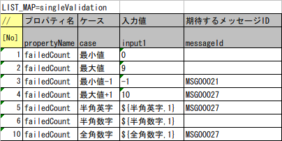
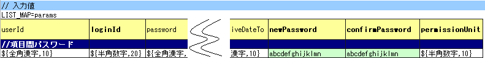
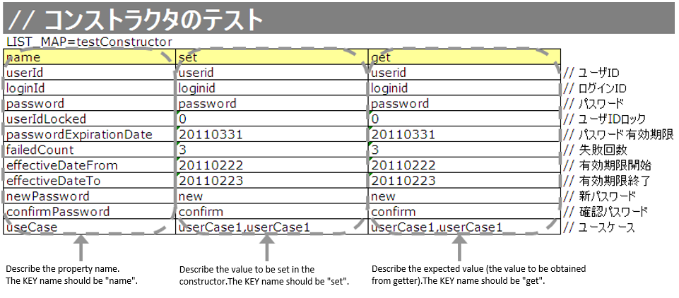

.. _entityUnitTest:

====================================================================
Class Unit Testing of Form/Entity supporting Nablarch Validation
====================================================================
This chapter describes the class unit test for Form and Entity in which input value checks are performed using :ref:`nablarch_validation`.
Since both can perform unit tests in almost the same way, common content shall be described based on the Entity unit test, and the specific processing shall be described separately.

.. tip::
   For the responsibilitiy of Form and Entity, see the responsibility assignment for each processing archetecture.
   e.g. :ref:`Responsibility assignment of web application<application_design>` , :ref:`Responsibility assignment of Nablarch batch application<nablarch_batch-application_design>`

-------------------------------------
How to write a Form/Entity unit test
-------------------------------------
The test class and test data used as examples in this chapter are as follows (right click -> Download and Save).

* :download:`Test class(SystemAccountEntityTest.java)<../_download/SystemAccountEntityTest.java>`
* :download:`Test data(SystemAccountEntityTest.xlsx)<../_download/SystemAccountEntityTest.xlsx>`
* :download:`Test target class(SystemAccountEntity.java)<../_download/SystemAccountEntity.java>`

Create test data
==================
Describes how to create the Excel file that contains the test data itself. The Excel file containing the test data is stored with the same name in the same directory as the test source code (only the extension is different).\
It is a prerequisite that the
\ :ref:`test cases for validation <entityUnitTest_ValidationCase>`,
\ :ref:`test cases for constructors <entityUnitTest_ConstructorCase>`, and
\ :ref:`test cases for setters and getters <entityUnitTest_SetterGetterCase>`
will be used one sheet at a time respectively.

For details on how to describe the test data, see \ :doc:`../../../06_TestFWGuide/01_Abstract`\ , \ :doc:`../../../06_TestFWGuide/02_DbAccessTest`\.

It is a prerequisite that the static master data stored in the database, such as message data and code master,
has been input with data managed by the project in advance (these data are not created as individual test data).

Create a test class
====================
The test class of form/entity unit test should be created to satisfy the following conditions.

* The package of the test class is the same as the Form/Entity to be tested.
* Create a test class with the class name <Form/Entity class name> Test.
* Inherit nablarch.test.core.db.EntityTestSupport.

.. code-block:: java

   package nablarch.sample.management.user; // [Description] Package is the same as SystemAccountEntity

   import java.util.HashMap;
   import java.util.Map;

   import org.junit.Test;

   import nablarch.test.core.db.EntityTestSupport;

   import static org.junit.Assert.assertArrayEquals;
   import static org.junit.Assert.assertEquals;

   /**
    * Class that executes tests for the SystemAccountEntity class.  
    * Refer to the Excel sheet for test content.
    *
    * @author Miki Habu
    * @since 1.0
    */
   public class SystemAccountEntityTest extends EntityTestSupport {
   // [Description] Class name is SystemAccountEntityTest and it inherits from EntityTestSupport
   

   // ~ Rest is omitted ~

For details on how to describe the test method, see the code examples described below.

.. _entityUnitTest_ValidationCase:

Single item validation test case of character type and string length
=====================================================================

Most of the test cases for single item validation are related to the input character type and string length. \
For example, assume the following the property.

* Property name "Furigana"
* Maximum string length is 50 characters
* Required items
* Only full-width katakana is allowed

In this case, the following test case should be created.

 =================================================================================== =========================
 Case                                                                                 Perspective
 =================================================================================== =========================
 Validation should be successful when full-width Katakana 50 characters are entered.   Check maximum string length and character type
 Validation should fail when full-width Katakana 51 characters are entered.            Check of maximum string length
 Validation should be successful when 1 full-width Katakana character is entered.      Check of minimum string length and character type
 Validation should fail when empty string is entered.                                  Check of required validation
 Validation should fail when Half-width Katakana is entered.                           Check character type\ [#]_\
 =================================================================================== =========================

\ 
 
 .. [#] Similarly, there is a need for cases in which Half-width alphabetic characters, Full-width Hiragana, Kanji ..., etc. are input and the detailed examination fails.

There are a large number of test cases for single item validation, and data creation requires time and labor.\
Therefore, a test method is provided exclusively for single item validation test.As a result, the following effects are expected.

* Facilitates the creation of test cases for single item validation.
* Creates test data with high maintainability, making it easier to review and maintain.

.. tip::
   This test method cannot be used for a form that holds another form as a property. In that case, implement your own validation processing test.
   A form that holds another form as a property is the parent form that accesses the property in the following format:
   
   .. code-block:: none
   
      <Parent Form>.<child Form>.<child form property name>.

How to create a test case table
--------------------------------

Prepare the following columns.

+-----------------------------------------------+--------------------------------------------------------------------------------------------------------------+
| Column name                                   | Contents to be mentioned                                                                                     |
+===============================================+==============================================================================================================+
|propertyName                                   |The property name to be tested.                                                                               |
+-----------------------------------------------+--------------------------------------------------------------------------------------------------------------+
|allowEmpty                                     |Whether the property allows for no input                                                                      |
+-----------------------------------------------+--------------------------------------------------------------------------------------------------------------+
|         min                                   |Minimum string length allowed by the property                                                                 |
|                                               |as input value (optional)                                                                                     |
+-----------------------------------------------+--------------------------------------------------------------------------------------------------------------+
|         max                                   |Maximum string length allowed by the property as input value                                                  |
+-----------------------------------------------+--------------------------------------------------------------------------------------------------------------+
|messageIdWhenEmptyInput                        |Message ID to expect when input is empty (optional) \ [#]_\                                                   |
+-----------------------------------------------+--------------------------------------------------------------------------------------------------------------+
|messageIdWhenInvalidLength                     |Message ID to expect when input length is incompatible (optional) \ [#]_\                                     |
+-----------------------------------------------+--------------------------------------------------------------------------------------------------------------+
|messageIdWhenNotApplicable                     |Message ID to expect when character type is incompatible                                                      |
+-----------------------------------------------+--------------------------------------------------------------------------------------------------------------+
|Half-width alphabetic characters (半角英字)    |Whether half-width alphabetic characters are allowed?                                                         |
+-----------------------------------------------+--------------------------------------------------------------------------------------------------------------+
|Half-width numbers (半角数字)                  |Whether half-width numbers are allowed?                                                                       |
+-----------------------------------------------+--------------------------------------------------------------------------------------------------------------+
|Half-width symbols (半角記号)                  |Whether half-width symbols are allowed?                                                                       |
+-----------------------------------------------+--------------------------------------------------------------------------------------------------------------+
|Half-width kana (半角カナ)                     |Whether half-width kana are allowed?                                                                          |
+-----------------------------------------------+--------------------------------------------------------------------------------------------------------------+
|Full-width alphabets (全角英字)                |Whether full-width alphabets are allowed?                                                                     |
+-----------------------------------------------+--------------------------------------------------------------------------------------------------------------+
|Full-width numbers (全角数字)                  |Whether full-width numbers are allowed?                                                                       |
+-----------------------------------------------+--------------------------------------------------------------------------------------------------------------+
|Full-width Hiragana (全角ひらがな)             |Whether full-width Hiragana are allowed?                                                                      |
+-----------------------------------------------+--------------------------------------------------------------------------------------------------------------+
|Full-width Katakana (全角カタカナ)             |Whether full-width Katakana are allowed?                                                                      |
+-----------------------------------------------+--------------------------------------------------------------------------------------------------------------+
|Full-width Kanji (全角漢字)                    |Whether full-width Kanji are allowed?                                                                         |
+-----------------------------------------------+--------------------------------------------------------------------------------------------------------------+
|Full-width symbols and others (全角記号その他) |Whether full-width symbols and others are allowed?                                                            |
+-----------------------------------------------+--------------------------------------------------------------------------------------------------------------+
|External characters (外字)                     |Whether external characters are allowed?                                                                      |
+-----------------------------------------------+--------------------------------------------------------------------------------------------------------------+

.. [#] If messageIdWhenEmptyInput is omitted, the value of emptyInputMessageId set in :ref:`entityUnitTest_EntityTestConfiguration` is used.

\

.. [#] If messageIdWhenInvalidLength is omitted, the default value set in :ref:`entityUnitTest_EntityTestConfiguration` is used. Which default value is used when omitted is determined by the descriptions in the max and min fields, as follows.

+--------------+---------------------------------+---------------------------------------------------------------+
| min column   | compiration between max and min | Default value used when omitted                               |
+==============+=================================+===============================================================+
| unset        | N/A                             | maxMessageId                                                  |
+--------------+---------------------------------+---------------------------------------------------------------+
| set          | max > min                       | maxAndMinMessageId(exceed), underLimitMessageId (insufficient)|
+--------------+---------------------------------+---------------------------------------------------------------+
| set          | max = min                       | fixLengthMessageId                                            |
+--------------+---------------------------------+---------------------------------------------------------------+

Configure the following values in the column to indicate the permission.

 ====================== =================== ========================
 Configuration details  Configuration value   Remarks
 ====================== =================== ========================
 allowed                   o                Half-width lower-case O
 Not allowed               x                lower-case alphabet X
 ====================== =================== ========================

A specific example is shown below.

.. image:: ../_image/entityUnitTest_CharsetAndLengthExample.png
   :scale: 100

How to create a test method
----------------------------

 
Invoke the following methods of the superclass:

.. code-block:: java

   void testValidateCharsetAndLength(Class entityClass, String sheetName, String id)

\ 

.. code-block:: java

   // [Description] ~ Previous is omitted ~

  public class SystemAccountEntityTest extends EntityTestSupport {
    
       /** Entity class to be tested*/
       private static final Class<SystemAccountEntity> ENTITY_CLASS = SystemAccountEntity.class;

       /**
        * Test cases for character type and string length
        */
       @Test
       public void testCharsetAndLength() {
            // [Description] Sheet name containing the test data
            String sheetName = "testCharsetAndLength";        

            // [Description] ID of test data
            String id = "charsetAndLength";

            // [Description] Test execution
            testValidateCharsetAndLength(ENTITY_CLASS, sheetName, id);
       }

       // [Description] ~ Rest is omitted ~

When this method is executed, the test is executed for each row of test data from the following perspectives.

+---------------------------+--------------------------------+-----------------------------------------------------------+
| Perspective               |Input value                     | Remarks                                                   |
+===========================+================================+===========================================================+
| Character type            |Half-width alphabetic characters| | Consists of a string of length described                |
+---------------------------+--------------------------------+ | in the character type max (maximum string length) field |
| Character type            |Half-width numbers              |                                                           |
+---------------------------+--------------------------------+                                                           |
| Character type            |Half-width numbers              |                                                           |
+---------------------------+--------------------------------+                                                           |
| Character type            |Half-width symbols              |                                                           |
+---------------------------+--------------------------------+                                                           |
| Character type            |Half-width kana                 |                                                           |
+---------------------------+--------------------------------+                                                           |
| Character type            |Full-width alphabets            |                                                           |
+---------------------------+--------------------------------+                                                           |
| Character type            |Full-width numbers              |                                                           |
+---------------------------+--------------------------------+                                                           |
| Character type            |Full-width Hiragana             |                                                           |
+---------------------------+--------------------------------+                                                           |
| Character type            |Full-width Katakana             |                                                           |
+---------------------------+--------------------------------+                                                           |
| Character type            |Full-width Kanji                |                                                           |
+---------------------------+--------------------------------+                                                           |
| Character type            |Full-width symbols and others   |                                                           |
+---------------------------+--------------------------------+                                                           |
| Character type            |External characters             |                                                           |
+---------------------------+--------------------------------+-----------------------------------------------------------+
| Not entered               |Empty character                 | | Zero-length string                                      |
+---------------------------+--------------------------------+-----------------------------------------------------------+
| Minimum string            |Minimum string-length string    | | The minimum character string input value                |
+---------------------------+--------------------------------+ | consists of the character type marked with o            |
| Maximum string            |Maximum string length string    | | If the min field is omitted, the test for insufficient  |
+---------------------------+--------------------------------+ | string length is not performed.                         |
| String length insufficient|Minimum string length -1 string |                                                           |
+---------------------------+--------------------------------+                                                           |
| String length exceeded    |Maximum string length +1 string |                                                           |
+---------------------------+--------------------------------+-----------------------------------------------------------+

Other single item validation test cases
========================================

Most of the single item validation can be tested using the single item validation test cases for character type and string length mentioned above, \
but some validation is not covered.
For example, the range validation for numerical input items is possible.

A simple test system has also been prepared for such single item validation.
By describing a pair of one input value and expected message ID for each property,
it is possible to test the single item validation using any value.

.. tip::
   This test method cannot be used for a form that holds another form as a property.In that case, implement your own validation processing test.
   A form that holds another form as a property is the parent form that accesses the property in the following format:
   
   .. code-block:: none
   
      <Parent Form>.<child Form>.<child form property name>.

How to create a test case table
--------------------------------

Prepare the following columns.

+-----------------------------+-----------------------------------------------------+
| Column name                 | Contents to be mentioned                            |
+=============================+=====================================================+
|propertyName                 |The property name to be tested.                      |
+-----------------------------+-----------------------------------------------------+
|case                         |Brief description of the test case                   |
+-----------------------------+-----------------------------------------------------+
|input1\ [#]_                 |Input value [#]_                                     |
+-----------------------------+-----------------------------------------------------+
|messageId                    |Message ID that is expected to be generated when the |
|                             |above input value is used for single item validation |
|                             |(blank space if no validation error is expected).    |
+-----------------------------+-----------------------------------------------------+

.. [#] When specifying multiple parameters for a single key, add columns such as input2 and input3.

\

.. [#] Input values can be created efficiently using the \ :ref:`special_notation_in_cell`\  notation.

A specific example is shown below.

How to create a test method
----------------------------

 
Invoke the following methods of the superclass:

.. code-block:: java

   void testSingleValidation(Class entityClass, String sheetName, String id)

.. code-block:: java

 // [Description] ~ Previous is omitted ~

 public class SystemAccountEntityTest extends EntityTestSupport {
    
      /** Entity class to be tested*/
      private static final Class<SystemAccountEntity> ENTITY_CLASS = SystemAccountEntity.class;

      /**
       * Single item validation test case of character type and string length
       */
      // [Description] ~ Middle is omitted ~

      /**							  
       * Test cases for single item validation (not listed above)		  
       */							  
      @Test						  
      public void testSingleValidation() {		  
          String sheetName = "testSingleValidation";	  
          String id = "singleValidation";			  
          testSingleValidation(ENTITY_CLASS, sheetName, id);
      }                                                     

       // [Description] ~ Rest is omitted ~

Test case for validation method
====================================

In the single item validation test mentioned above, the annotation given to the setter method of the entity is tested for correctness, \
and the validation method \ [#]_\ implemented in the entity is not executed.

Therefore, a separate test must be created
if you implement your own validation method in the entity.

.. [#] Static method with ``@ValidateFor``\  annotation.

Create a test case table
------------------------

* ID is fixed to "testShots".
* Prepare the following columns.

 +------------------------------------+-----------------------------------------------------------+
 | Column name                        | Contents to be mentioned                                  |
 +====================================+===========================================================+
 | title                              | Title of the test case                                    |
 +------------------------------------+-----------------------------------------------------------+
 | description                        | Brief description of the test case                        |
 +------------------------------------+-----------------------------------------------------------+
 | expectedMessageId\ *ｎ* \ [#]_\    | Expected message (\ *ｎ*\ is a sequential number from 1)  |
 +------------------------------------+-----------------------------------------------------------+
 | propertyName\ *ｎ*                 | Expected property (\ *ｎ*\ is a sequential number from 1) |
 +------------------------------------+-----------------------------------------------------------+

.. [#]  When multiple messages are expected, add more numerical values such as expectedMessageId2 and propertyName2 on the right.

* Create an input parameter table

  * ID is fixed to "params".
  * Enter the input parameters\ [#]_ \ corresponding to the above test case table, one row at a time.

\

    .. [#] Using the notation \ :ref:`special_notation_in_cell`\, input values can be created efficiently.

\

    A specific example is shown below.

    .. image:: ../_image/entityUnitTest_validationTestData.png
      :scale: 70

Create test cases and test data
--------------------------------

.. _entityUnitTest_ValidationMethodSpecifyNormal:

Check for validation target
~~~~~~~~~~~~~~~~~~~~~~~~~~~

When the properties to be validated are specified (see \ :ref:`nablarch_validation`\), \
create a case to check whether they are correctly specified.

Prepare data that will cause an error in each single item validation for all properties.\
If the specification of the properties to be validated are correct, only the properties to be validated should undergo single item validation.\
Therefore, the names of all properties to be validated, and the message ID when a single item validation error occurs for each property are entered as expected values.\

.. tip::
 If a property for validation is accidentally omitted from the validation target, \
 the message ID assertion will fail since the expected message is not output. \
 Also, if a property that is not a target for validation accidentally becomes a target for validation, \
 single item validation will fail due to invalid input value and an unexpected message is output. \
 As a result, validation target errors can be detected.

The property name of all properties for validation and the single item validation error message ID \
of those properties are listed in the test case table.

.. image:: ../_image/entityUnitTest_ValidationPropTestCases.png
 :scale: 70

The values that result in single item validation errors for all the properties are listed in the input parameters table.

.. image:: ../_image/entityUnitTest_ValidationPropParams.png
 :scale: 68

.. tip::

   When creating a test case or test data for the Form unit test, \
   specifying another **property of another Form that is held in the property** may be required. \
   In this case, it can be specified as follows.
   
   * Example code for Form
   
   .. code-block:: java
   
     public class SampleForm {

         /** System user */
         private SystemUserEntity systemUser;

         /** Telephone number array */
         private UserTelEntity[] userTelArray;
     
         // [Description] Omitted except for properties
     
     }

   * How to specify the Form property being held (when specifying SystemUserEntity.userId)
   
   .. code-block:: none
   
      sampleForm.systemUser.userId

   * How to specify the property of the Form array element (when specifying the property of the first UserTelEntity array element)
   
   .. code-block:: none
   
      sampleForm.userTelArray[0].telNoArea

Validation between items
~~~~~~~~~~~~~~~~~~~~~~~~

Create a case to confirm communications other than the validation target specification that is performed by the \ :ref:`entityUnitTest_ValidationMethodSpecifyNormal`
validation method, such as validation between items.

In the figure below, a normal case is created for the validation method "newPassword and confirmPassword are the same".

How to create a test method
----------------------------

The test cases created so far and the test methods that use the data are shown below. \
Validation tests can be performed for different Entities simply by changing the variable contents of the following code.

.. code-block:: java

    // ~ Previous is omitted ~

    /** Entity class to be tested*/
    private static final Class<SystemAccountEntity> ENTITY_CLASS = SystemAccountEntity.class;

    // ~ Middle is omitted ~
    /**
     * {@link SystemAccountEntity#validateForRegisterUser(nablarch.core.validation.ValidationContext)} test.
     */
    @Test
    public void testValidateForRegisterUser() {
        // Execution of validation
        String sheetName = "testValidateForRegisterUser";
        String validateFor = "registerUser";
        testValidateAndConvert(ENTITY_CLASS, sheetName, validateFor);
    }

   // ~ Rest is omitted ~

.. _entityUnitTest_ConstructorCase:

Test case for constructor
==================================

In the test for constructors, create a case to check whether the value specified in the argument is set correctly in the property.\
At this time, the target properties are all the properties defined in Entity.\
For the test data, prepare the property name, the data to be set for it, and the expected value (data to be compared with the value obtained by the getter).

In the figure below, values have been specified for each property as follows.
When the constructor is given a combination of these values, the test checks whether each property is configured to the specified value (Can the expected value be obtained by calling the getter).

In the actual test code, setting of value to the constructor and checking of the value are performed in the method provided by the automated test framework.
For more information, see :ref:`test code<test-constructor-java-label>`.

.. tip::
   
   Since the Entity is automatically generated, a constructor that is not used in the application may be generated. \
   In that case, make sure to test the constructor with the Entity unit test since it cannot be tested with the request unit test.
   
   On the other hand, only a constructor used in the application is created in the case of a general Form.\
   Therefore, the constructor can be tested with the request unit test.\
   Thus, for a general Form, the constructor need not be tested with the class unit test.

Definition to Excel
--------------------

Test contents of the above configuration values (excerpt)

=============== ============================== ================================================
Property        Value set to the constructor   Expected value (value obtained from the getter)
=============== ============================== ================================================
userId          userid                         userid
loginId         loginid                        loginid
password        password                       password
=============== ============================== ================================================

.. _test-constructor-java-label:

The following test methods use this data:

.. code-block:: java

   // [Description] ~ Previous is omitted ~

   public class SystemAccountEntityTest extends EntityTestSupport {

        /** Constructor test */
        @Test
        public void testConstructor() {
            Class<?> entityClass = SystemAccountEntity.class;
            String sheetName = "testAccessor";
            String id = "testConstructor";
            testConstructorAndGetter(entityClass, sheetName, id);
        }

   }

.. _testConstructorAndGetter-note-label:

.. tip::

  There are restrictions on the type (class) of properties that can be tested with testConstructorAndGetter.
  If the property does not correspond to the following types (class), the constructor and getter in each test class must be explicitly called to test it.

  * String and String array
  * BigDecimal and BigDecimal array
  * java.util.Date and java.util.Date array (write in yyyy-MM-dd format or yyyy-MM-dd HH:mm:ss format to excel)
  * Class with valueOf(String) method and its array class (ex: Integer or Long, java.sql.Date or java.sql.Timestamp etc.)

  Examples of individual test execution methods are given below.
  This example assumes that Form has the property ``users`` of type ``List<String>``.

    * Example of data description to Excel

      .. image:: ../_image/entityUnitTest_ConstructorOther.png
        :scale: 80

    

    * Test code example

      .. code-block:: java

       /** Constructor test */
       @Test
       public void testConstructor() {
           // [Description]
           // The items that can be commonly tested are tested by using testConstructorAndGetter.
           Class<?> entityClass = SystemAccountEntity.class;
           String sheetName = "testAccessor";
           String id = "testConstructor";
           testConstructorAndGetter(entityClass, sheetName, id);

           // [Description]
           // The items that cannot be tested commonly are tested individually.

           // [Description]
           // getParamMap is called to acquire the test data of properties to be tested individually.
           // (If there are multiple properties for testing, getListParamMapis used.)
           Map<String, String[]> data = getParamMap(sheetName, "testConstructorOther");

           // [Description] Convert Map<String, String[]> to Map<String, Object>, which is the argument of the Entity's constructor
           Map<String, Object> params = new HashMap<String, Object>();
           params.put("users", Arrays.asList(data.get("set")));

           // [Description] Generate Entity with Map<String, Object> generated above as the argument.
           SystemAccountEntity entity = new SystemAccountEntity(params);

           // [Description] Call getter and confirm that the expected value is returned.
           assertEquals(entity.getUsers(), Arrays.asList(data.get("get")));

       }

.. _entityUnitTest_SetterGetterCase:

Test cases for setters and getters
===================================

Refer to :ref:`entityUnitTest_SetterGetterCase_BeanValidation` .

\

.. _entityUnitTest_EntityTestConfiguration:

Automated test framework configuration values
=============================================

Describes the initial value configuration required when executing :ref:`entityUnitTest_ValidationCase`\.

Configuration items list
------------------------

Use ``nablarch.test.core.entity.EntityTestConfiguration``\, \
and configure the following values in the component configuration file (all items required).

+------------------------+---------------------------------------------------------------------------------------+
|Configuration item name |Description                                                                            |
+========================+=======================================================================================+
|maxMessageId            |Message ID when the maximum string length is exceeded                                  |
+------------------------+---------------------------------------------------------------------------------------+
|maxAndMinMessageId      |Message ID outside the range of the maximum and minimum string length (variable length)|
+------------------------+---------------------------------------------------------------------------------------+
|fixLengthMessageId      |Message ID outside the range of the maximum and minimum string length (fixed length)   |
+------------------------+---------------------------------------------------------------------------------------+
|underLimitMessageId     |Message ID when the string length is insufficient                                      |
+------------------------+---------------------------------------------------------------------------------------+
|emptyInputMessageId     |Message ID when there is no input                                                      |
+------------------------+---------------------------------------------------------------------------------------+
|characterGenerator      |String generation class \ [#]_\                                                        |
+------------------------+---------------------------------------------------------------------------------------+

.. [#]
 Specify the implementation class of ``nablarch.test.core.util.generator.CharacterGenerator``\.
 This class generates input values for the test.
 Normally, you can use\ ``nablarch.test.core.util.generator.BasicJapaneseCharacterGenerator``\.

The set message ID matches the value set in the validator.

(See the example described below)

Example of component configuration file description
----------------------------------------------------

An example of a component configuration file description when the following setting values are used is shown below.

**[Component configuration file of the validation class]**

.. code-block:: xml

    <property name="validators">
      <list>
        <component class="nablarch.core.validation.validator.RequiredValidator">
          <property name="messageId" value="MSG00010"/>
        </component>
        <component class="nablarch.core.validation.validator.LengthValidator">
          <property name="maxMessageId" value="MSG00011"/>
          <property name="maxAndMinMessageId" value="MSG00011"/>
          <property name="fixLengthMessageId" value="MSG00023"/>
        </component>
        <!-- Omitted -->
    </property>

**[Component configuration file of the test]**

.. code-block:: xml
 
  <!-- Entity test configuration -->
  <component name="entityTestConfiguration" class="nablarch.test.core.entity.EntityTestConfiguration">
    <property name="maxMessageId"        value="MSG00011"/>
    <property name="maxAndMinMessageId"  value="MSG00011"/>
    <property name="fixLengthMessageId"  value="MSG00023"/>
    <property name="underLimitMessageId" value="MSG00011"/>
    <property name="emptyInputMessageId" value="MSG00010"/>
    <property name="characterGenerator">
      <component name="characterGenerator"
                 class="nablarch.test.core.util.generator.BasicJapaneseCharacterGenerator"/>
    </property>
  </component>
