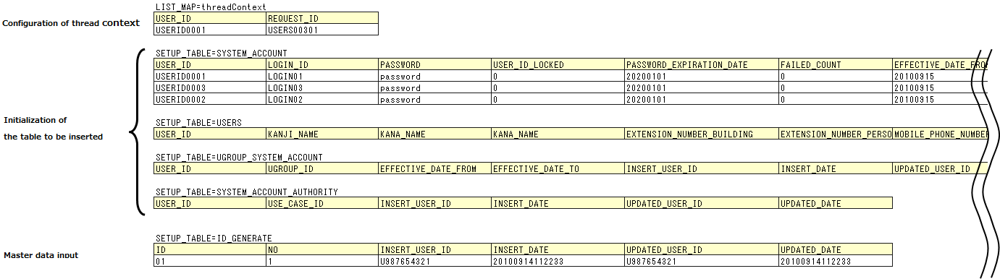
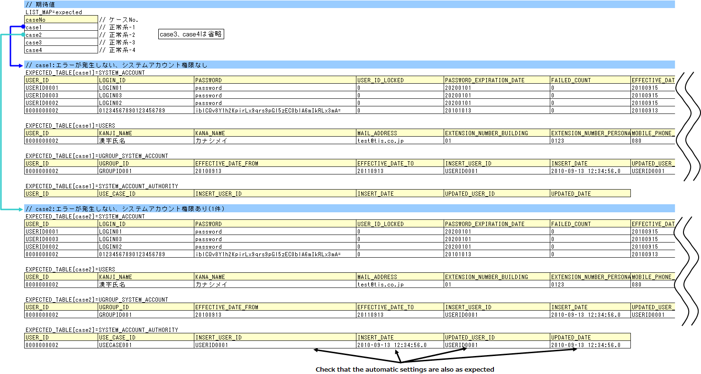
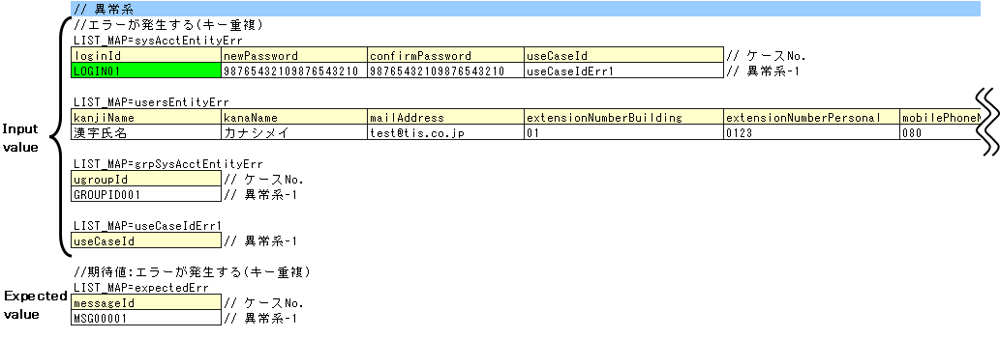

.. _componentUnitTest:

=========================================
Class Unit Test of Action/Component
=========================================
This chapter describes the component class unit test of Action/Component (hereinafter referred to as Component unit test). 
The difference in the case of Action class unit test (hereinafter referred to as Action unit test) is the test class name.

-------------------------------------------
How to write action/component unit test
-------------------------------------------
The test class and test data used as examples in this chapter are as follows (right click -> Download and Save).

* :download:`Test case list (UserRegistration_UserComponent_ClassUnitTestCase.xlsx)<./_download/UserRegistration_UserComponent_ClassUnitTestCase.xlsx>`
* :download:`Test class(UserComponentTest.java)<./_download/UserComponentTest.java>`
* :download:`Test data(UserComponentTest.xlsx)<./_download/UserComponentTest.xlsx>`
* :download:`Tested class(UserComponent.java)<./_download/UserComponent.java>`

This chapter describes the method for user registration (UserComponent#registerUser) as an example.

Pattern division of test case execution
================================================
The test cases are classified into the following four categories from the list of test cases and methods to be tested. 
This is because there are differences in the test class and data creation methods depending on the pattern they belong to.

=================================================================================== ==================================
Pattern                                                                             Example of a matching process
=================================================================================== ==================================
Test cases whose return value (database search result) must be checked              Search process
Test cases whose return value (other than database search results) must be checked  Calculation, judgment process
Test cases whose database status must be checked after processing is completed      Update process (including insert and delete)
Test cases whose message ID must be checked                                         Error handling
=================================================================================== ==================================

Since this example shows DB insertion processing and error handling during double registration, the test cases are classified into "Test cases whose database status must be checked after processing is completed " and "Test cases whose message ID must be checked".

Create test data and test class
======================================
This section explains how to create test data and a test class for \ :ref:`componentUnitTest_Setup`\ 、\ :ref:`componentUnitTest_DB`\ 、\ :ref:`componentUnitTest_messageID`\  respectively. 
First of all, the test data (Excel file) itself and the method of creating a test class (class that should be inherited, etc.) is described.Next, the data for each pattern and how a test method is created is described.

Create test data
----------------------------
Similar to \ :ref:`entityUnitTest`\ , the Excel file containing the test data is stored with the same name in the same directory as the test source code (only the extension is different). 
It is a prerequisite that all the test data is entered in the same Excel sheet.

For details on how to describe the test data, see \ :doc:`../../06_TestFWGuide/01_Abstract`\ 、\ :doc:`../../06_TestFWGuide/02_DbAccessTest`\ .

It is a prerequisite that the static master data stored in the database, such as message data and code master, has been input with data managed by the project in advance (these data are not created as individual test data).

Create a test class
----------------------------
The test class of component unit test should be created to satisfy the following conditions. For more information, see \ :doc:`../../06_TestFWGuide/02_DbAccessTest`\ .

* The package of the test class is the same as the Action/Component to be tested.
* Create a test class with the class name <Action/Component class name> Test.
* Inherit nablarch.test.core.db.DbAccessTestSupport.

.. code-block:: java

   package nablarch.sample.management.user; // [Description] The package is the same as UserComponent

   import static org.junit.Assert.assertEquals;
   import static org.junit.Assert.assertTrue;
   import static org.junit.Assert.fail;

   import java.util.HashMap;
   import java.util.List;
   import java.util.Map;
   import java.util.Map.Entry;

   import nablarch.core.db.statement.SqlResultSet;
   import nablarch.core.message.ApplicationException;
   import nablarch.test.core.db.DbAccessTestSupport;

   import org.junit.Test;

   /** Test class of
    * {@link UserComponentTest}.
    * 
    * @author Tsuyoshi Kawasaki
    * @since 1.0
    */
   public class UserComponentTest extends DbAccessTestSupport {
   // [Description] The class name is UserComponentTest and it inherits DbAccessTestSupport
   
   // ~ Rest is omitted ~

.. _componentUnitTest_Setup:

Process of creating pre-prepared data
---------------------------------------------------
Create the pre-data and pre-data input process. In this example, the following data is created.

* Configuration of thread context　\ [#]_\
  
  * USER_ID: User ID. USERID0001.
  * REQUEST_ID: Request ID. USERS00301.

* Initialization of the table to be inserted

  * SYSTEM_ACCOUNT:System account table. Initial item is 3 records.
  * USERS:User table. Initial item is 0 records.
  * UGROUP_SYSTEM_ACCOUNT:Group system account table. Initial item is 0 records.
  * SYSTEM_ACCOUNT_AUTHORITY:System account permission table. Initial item is 0 records.

* Master data input

  * ID_GENERATE:Numbering table. For performing the numbering process at the time of registration.If the numbering table is not initialized, the numbering result when the test is run will not be known, and the insertion result cannot be verified.

.. [#]

  A thread context is an object that stores data that is commonly required by multiple methods in the call stack when executing a series of processes, such as user IDs, request IDs, and languages used. 

The process of reading these data is shown below.

.. code-block:: java

   // ~ Previous is omitted ~

   /** Test class of
    * {@link UserComponent#registerUser()} test1。  
    * Normal pattern.
    */
   @Test
   public void testRegisterUser1() {
       String sheetName = "registerUser";

       setThreadContextValues(sheetName, "threadContext"); // [Description] Thread context setting

   // ~ Middle is omitted

        for (int i = 0; i < sysAcctDatas.size(); i++) { 

   // ~ Middle is omitted

           // Database preparation
           setUpDb(sheetName); // [Description] Pre-data input.
                               // [Description] Executed in a loop to initialize each case.

   // ~ Rest is omitted ~

.. _componentUnitTest_DB:

Test cases whose database status must be checked after processing is completed
---------------------------------------------------------------------------------------------

.. _componentUnitTest_inputData_normal:

Create test data (input values)
~~~~~~~~~~~~~~~~~~~~~~~~~~~~~~~~~~~~~~~~~~
Prepare arguments for the methods to be tested. In this example, the following 3 are required. The same row for each data is considered as a set of test data (For example, the first row of sysAcctEntity, the first row of usersEntity and the first row of grpSysAcctEntity will be the test data for 1 case).

* sysAcctEntity: System account entity data
* usersEntity: User entity data
* grpSysAcctEntity: Group system account entity data

useCaseId in sysAcctEntity are not values set in the useCaseId property itself (the useCaseId property of SystemAccountEntity is an array), but points to data in other tables indicated by the arrows in the figure. 
The acquired values in the test code are used as a key to further acquire data, create an array, and set in the useCaseId property.

.. image:: ./_image/componentUnitTest_inputData.png
 :width: 800px

.. code-block:: java

   // ~ Previous is omitted ~

   public void testRegisterUser1() {
       String sheetName = "registerUser";
               
       setThreadContextValues(sheetName, "threadContext");
       
       List<Map<String, String>> sysAcctDatas = getListMap(sheetName, "sysAcctEntity");
       List<Map<String, String>> usersDatas = getListMap(sheetName, "usersEntity");
       List<Map<String, String>> grpSysAcctDatas = getListMap(sheetName, "grpSysAcctEntity");
       // Map, List that receive the Excel data temporarily
       Map<String, Object> work = new HashMap<String, Object>();
       List<Map<String, String>> useCaseData = null;
       
       SystemAccountEntity sysAcct = null;
       UsersEntity users = null;
       UgroupSystemAccountEntity grpSysAcct = null;
       for (int i = 0; i < sysAcctDatas.size(); i++) {

   // ~ Middle is omitted

           // System account  // [Description] Preparation of SystemAccountEntity
           work.clear();
           for (Entry<String, String> e : sysAcctDatas.get(i).entrySet()) {
               work.put(e.getKey(), e.getValue());
           }
           // Create arguments for useCaseId
           String id = sysAcctDatas.get(i).get("useCaseId"); // [Description] Obtains the table ID at the base of the arrows in the figure
           useCaseData = getListMap(sheetName, id); // [Description] Uses the ID acquired to obtain the data of the array at the tip of the arrow in the figure
           String[] useCaseId = new String[useCaseData.size()]; // [Description] Create an array
           for (int j = 0; j < useCaseData.size(); j++) {
               useCaseId[j] = useCaseData.get(j).get("useCaseId");
           }
           work.put("useCase", useCaseId); // [Description] Configures the created array in the Map that is transferred to the SystemAccountEntity constructor
           sysAcct = new SystemAccountEntity(work);
           
           // User  //  [Description] Preparation of UsersEntity
           work.clear();
           for (Entry<String, String> e : usersDatas.get(i).entrySet()) {
               work.put(e.getKey(), e.getValue());
           }
           users = new UsersEntity(work);

           // Group system account  // [Description] Preparation of UgroupSystemAccountEntity
           work.clear();
           for (Entry<String, String> e : grpSysAcctDatas.get(i).entrySet()) {
               work.put(e.getKey(), e.getValue());
           }
           grpSysAcct = new UgroupSystemAccountEntity(work);

           // Execution
           target.registerUser(sysAcct, users, grpSysAcct);
           commitTransactions();   //  [Description] Commits all transactions

           // Verification
           String expectedGroupId = getListMap(sheetName, "expected").get(i).get("caseNo");
           assertTableEquals(expectedGroupId, sheetName, expectedGroupId);

   // ~ Rest is omitted ~

.. tip::

 In the above source code, data is read from the Excel sheet using the getListMap method. 
 For more information on getListMap, 
 see "\ :ref:`how_to_get_data_from_excel`\ " of \ :doc:`../../06_TestFWGuide/03_Tips`\.

Transaction control by the framework is not performed in the class unit test since the class that accesses the database is directly launched from the test class.
If the database status is required to be checked after processing, it is necessary to commit the transaction in the test class.\

Launch the ``commitTransactions()`` method of the superclass and commit. 
If the transaction is not committed, the test results cannot be confirmed normally. \
(A transaction need not be committed in the case of a reference test)

Create test data (Expected result)
~~~~~~~~~~~~~~~~~~~~~~~~~~~~~~~~~~~~~~~~~~
Prepare the expected result for each test case.
In addition to the items configured by the application, prepare the expected results for automatic configuration items as well (see \ :ref:`database-common_bean`\ ). Use the "assertTableEquals" method for verification.

The sample application handles multiple expected results by preparing data (expected) that defines the group ID (see \ :ref:`tips_groupId`\) and transferring it to the arguments of assertTableEquals.

.. code-block:: java

   // ~ Previous is omitted ~

   /** Test class of
    * {@link UserComponent#registerUser()} test1。  
    * Normal pattern.
    */
   @Test
   public void testRegisterUser1() {
       String sheetName = "registerUser";

   // ~ Middle is omitted

        for (int i = 0; i < sysAcctDatas.size(); i++) {

   // ~ Middle is omitted

            // Verification
            // [Description] Acquire group ID
            String expectedGroupId = getListMap(sheetName, "expected").get(i).get("caseNo"); 
            // [Description] Execution of assertTableEquals with the acquired group ID as an argument
            assertTableEquals(expectedGroupId, sheetName, expectedGroupId); 

   // ~ Rest is omitted ~

Taking case1 as an example, the expected result is as follows.

======================== ===============================================================================================================================================
Table name               Expected
======================== ===============================================================================================================================================
SYSTEM_ACCOUNT           Add the record shown in \ :ref:`componentUnitTest_Setup`\  + 1 record. Total 4 records.
USERS                    Added 1 record. (Initialized to 0 records with \ :ref:`componentUnitTest_Setup`\  and added 1 record in the test target process)
UGROUP_SYSTEM_ACCOUNT    Added 1 record. (Initialized to 0 records with \ :ref:`componentUnitTest_Setup`\  and added 1 record in the test target process)
SYSTEM_ACCOUNT_AUTHORITY No change (no new additions).
======================== ===============================================================================================================================================

.. _componentUnitTest_messageID:

Test cases whose message ID must be checked
----------------------------------------------------

Create test data (input values and expected values)
~~~~~~~~~~~~~~~~~~~~~~~~~~~~~~~~~~~~~~~~~~~~~~~~~~~~~~~~~~~~~~~~~~

Create test data (input values) in the same way as create :ref:`test data (input values) of the previous section<componentUnitTest_inputData_normal>`. 
Here, "Err" is added to the end of the ID specified of the :ref:`previous section<componentUnitTest_inputData_normal>` so that normal pattern and abnormal pattern data can be consolidated in the same Excel sheet. 
The expected value is the message ID.

The content to be checked here is the occurrence of an exception caused by unique key constraint violation. The test code catches the intended exception and verifies it by comparing the message IDs.

.. important::

  The exceptions to be caught are those that are expected to occur, and exception classes higher in the inheritance tree such as RuntimeException are not used. 
  Although there are message IDs, the bug that mistakes the exception itself cannot be detected.

.. code-block:: java

   // ~ Previous is omitted ~

   /** Test class of
    * {@link UserComponent#registerUser()}2。  
    * Abnormal pattern.
    */
   @Test
   public void testRegisterUser2() {
       String sheetName = "registerUser";

   // ~ Middle is omitted

           // Execution
           try {
               target.registerUser(sysAcct, users, grpSysAcct); // [Description] Executes the method to be tested
               fail(); // [Description] Test failure if an exception is not thrown
           } catch (ApplicationException ae) { // [Description] Catches exceptions that should be thrown
               // [Description] Verification of message ID
               assertEquals(expected.get(i).get("messageId"), ae.getMessages().get(0).getMessageId()); 
           }
       }
   }

   // ~ Rest is omitted ~

