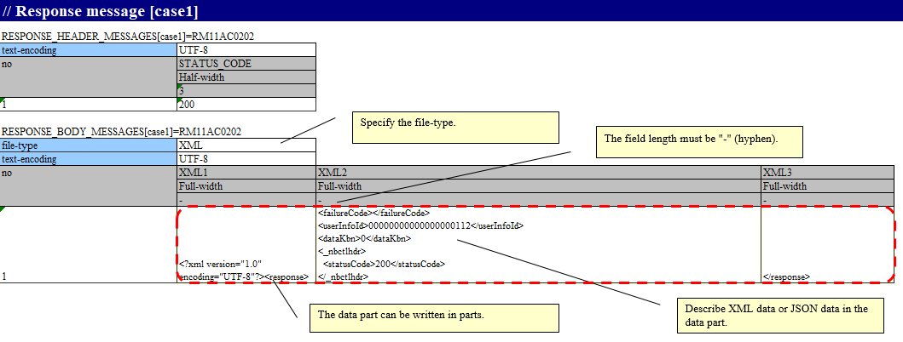
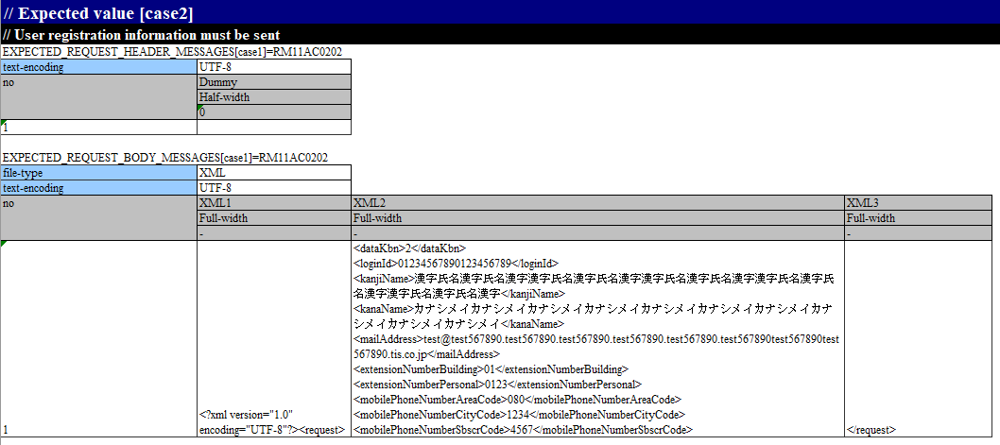
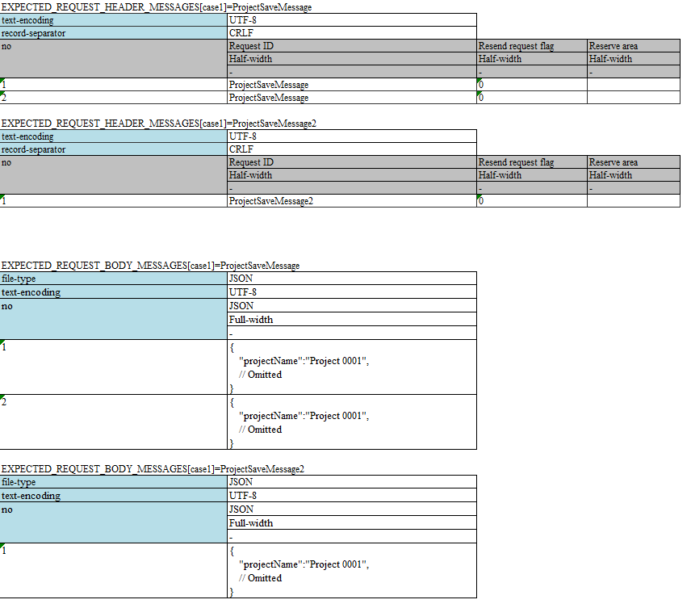
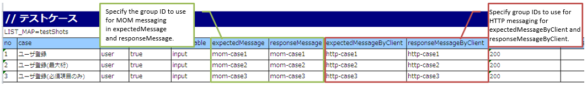

.. _`message_httpSendSyncMessage_test`:

=============================================================================
How to Execute a Request Unit Test (Sending Synchronous Message)
=============================================================================

For information on how to execute a request unit test, see :ref:`message_sendSyncMessage_test`.

However, "send queue" and "receive queue" should be read as "communication destination".

In this section, the differences with :ref:`message_sendSyncMessage_test`.

.. _`http_send_sync_request_write_test_data`:

-----------------------
How to write test data
-----------------------

An example of the expected value of a request message when a message is sent once and the response message (response message) that is returned
~~~~~~~~~~~~~~~~~~~~~~~~~~~~~~~~~~~~~~~~~~~~~~~~~~~~~~~~~~~~~~~~~~~~~~~~~~~~~~~~~~~~~~~~~~~~~~~~~~~~~~~~~~~~~~~~~~~~~~~~~~~~~~~~~~~~~~~~~~~~~~

The following is an example of the description of a response message that is returned when a message is sent once.

.. tip::
 RESPONSE_BODY_MESSAGES (and EXPECTED_REQUEST_BODY_MESSAGES used in the examples below) can be described by dividing into multiple fields.

 When a string is long and cannot be read if written in one cell, the string is divided and written.

 When dividing, "field name" can be an arbitrary string. In the above example, ``XML1``, ``XML2`` and ``XML3`` is used.

The following is a description example of the expected value of a request message that is returned when a message is sent once.

.. tip::
 When using JSON or XML data format, only one test case should be written in one Excel sheet.
 
 This is due to the limitation of NTF, which expects the string length of each Excel line to be the same for the message body. In JSON and XML data formats, the request message length is generally different for each request, so only one test case can be described in practice.

An example of the expected value of a request message when a message is sent more than once and the response message (response message) that is returned
~~~~~~~~~~~~~~~~~~~~~~~~~~~~~~~~~~~~~~~~~~~~~~~~~~~~~~~~~~~~~~~~~~~~~~~~~~~~~~~~~~~~~~~~~~~~~~~~~~~~~~~~~~~~~~~~~~~~~~~~~~~~~~~~~~~~~~~~~~~~~~~~~~~~~~~~

When sending a message multiple times, the test should be written with attention to the following specifications of the testing framework.

* The same data types (``RESPONSE_HEADER_MESSAGES`` and ``RESPONSE_BODY_MESSAGES`` in the following example) are described together, respectively. For more information, see :ref:`tips_groupId` and \ :ref:`auto-test-framework_multi-datatype`.
* For messages with the same request ID, the value of no is changed and the messages are described together.
* If the message has the same request ID, the length of the message is matched (The limitations are the same as for sending a single message. If the test case does not allow for the same length, then perform the test manually)

The following is a description example of the response message that is returned when the message is sent multiple times.

.. image:: ./_image/http_send_sync_ok_pattern_response.png
    :scale: 80

The following is a description example of the expected value of a request message that is returned when a message is sent multiple times.

.. tip::
 If there are multiple request IDs to be sent, testing the order is not possible. In the above example, the test is successful even if ``ProjectSaveMessage2`` is sent before ``ProjectSaveMessage``.

Failure pattern test
--------------------

The failure pattern can be tested by configuring a specific value starting with "errorMode:" in the table of the response message.\ [#http_send_sync_abnormal_test]_\ 

The correspondence between the configuration values and failure pattern tests is shown below.

 +-------------------------------------------+-------------------------------------------------------------+-----------------------------------------------------------------------------------+
 | Value to be configured for the first field| Failure description                                         | Operation of the automated test framework                                         |
 +===========================================+=============================================================+===================================================================================+
 |  ``errorMode:timeout``                    | Test if timeout error occurs while sending the message      | Throws **HttpMessagingTimeoutException**                                          |
 |                                           |                                                             | (subclass of **MessagingException**) \ [#http_send_sync_abnormal_test_behavior]_\ |
 +-------------------------------------------+-------------------------------------------------------------+-----------------------------------------------------------------------------------+
 |  ``errorMode:msgException``               | Test when a message send and receive error occurs           | Throws **MessagingException**                                                     |
 +-------------------------------------------+-------------------------------------------------------------+-----------------------------------------------------------------------------------+

This value should be in the **first field, excluding "no", in both the header and the body** of the table in the response message.

.. [#http_send_sync_abnormal_test]
 If the business action does not explicitly control **MessagingException**,
 there is no need to perform fault testing in individual request unit tests.

.. [#http_send_sync_abnormal_test_behavior]
 It throws out a different class than \ :ref:`message_sendSyncMessage_test`\.

Description for using the mockup
~~~~~~~~~~~~~~~~~~~~~~~~~~~~~~~~

Configure ``expectedMessageByClient`` in testShots and group ID in ``responseMessageByClient``. For information on mockup, see :ref:`dealUnitTest_send_sync`.

The relevance of group IDs is the same as for ``expectedMessage`` and  ``responseMessage`` in :ref:`message_sendSyncMessage_test`, and is therefore omitted.

.. image:: ./_image/http_send_sync_shot.png
    :scale: 80

| If sending synchronous messages by MOM and HTTP sending synchronous message take place simultaneously in the same action,
| the group ID used in the sending synchronous message process by MOM is configured to "expectedMessage" and "responseMessage",
| and the group ID used in the HTTP sending synchronous message process is configured to
| "expectedMessageByClient" and "responseMessageByClient" respectively.

.. tip::

  The Group ID should be configured to a different value in the sending synchronous message process by MOM and HTTP sending synchronous message process.
  Note that if the same group ID is specified, the result verification will not be performed correctly.

Asserting the request message
~~~~~~~~~~~~~~~~~~~~~~~~~~~~~~

The value of the file-type set in the directive line of the test data changes the way in which the request message is asserted.

For details on how to configure and the assert details, refer to response message section of :ref:`real_request_test`.

----------------------------------------------------
Configuring the classes to be used in the framework
----------------------------------------------------

Usually, the classes are configured by the architect and do not need to be set by the application programmer.

Mockup class configuration
~~~~~~~~~~~~~~~~~~~~~~~~~~~~~~~~~~~~~~~~

Configure mockup class to be used in request unit test in the component configuration file.

 .. code-block:: xml
  
      <!-- Client for HTTP communication -->
      <component name="defaultMessageSenderClient" 
                 class="nablarch.test.core.messaging.RequestTestingMessagingClient">
        <property name="charset" value="Shift-JIS"/>
      </component>

The character code output to the log can be changed by specifying the character code name in the ``charset`` field.
Normally character code is optional, and UTF-8 will be used if omitted.

