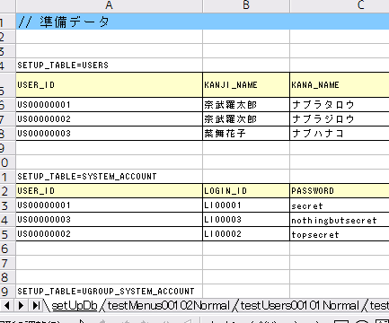
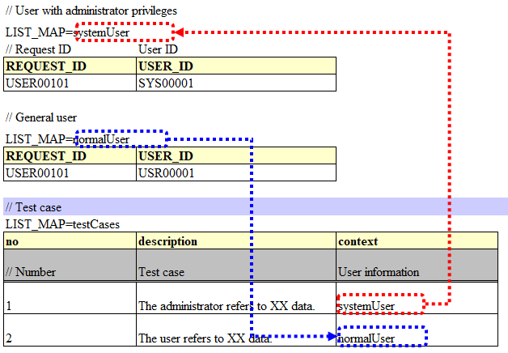
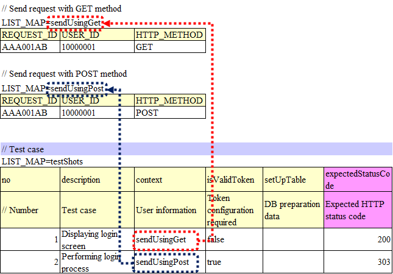
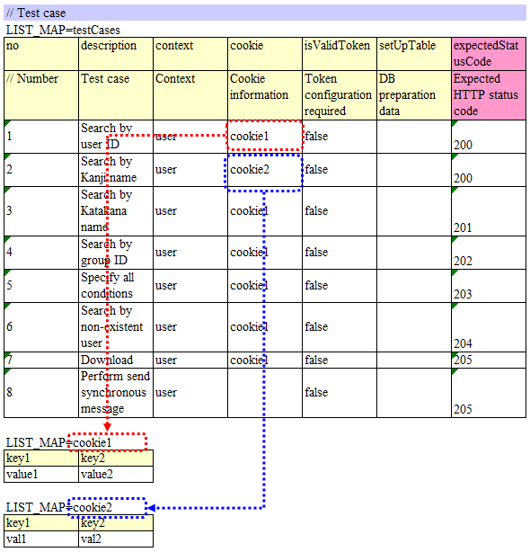
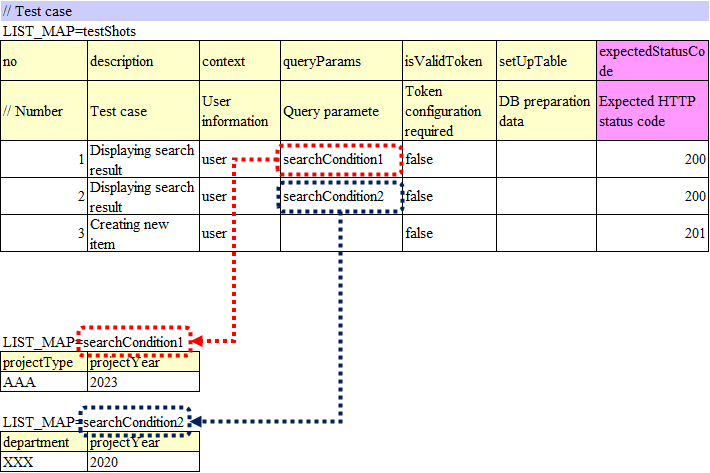
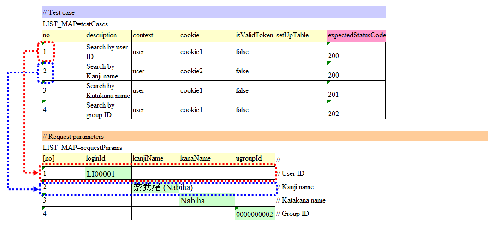
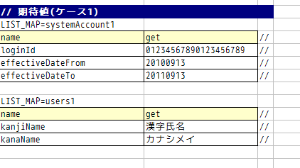

.. _requestUnitTest:

===================================
How to Execute a Request Unit Test
===================================

--------------------------
How to write a test class
--------------------------

The test class should be created in such a way that the following conditions are met.

* The test class package should be the same as the Action class to be tested.
* The test class should be created with the class name <Action class name>RequestTest.
* Inherit nablarch.test.core.http.BasicHttpRequestTestTemplate.
  (This is not applicable if there is an extended Template implementation in the project)

For example, if the Action class to be tested is nablarch.sample.management.user.UserSearchAction,
then the test class would be as follows:

.. code-block:: java

  package nablarch.sample.management.user;
  
  // ~ Middle is omitted ~

  public class UserSearchActionRequestTest extends BasicHttpRequestTestTemplate {

.. tip::
 The superclass BasicHttpRequestTestTemplate provides various methods necessary for request unit test.
 As the DbAccessTestSupport functionality is also provided, you can configure the database
 in the same way as the class unit test.

---------------------
Test method division
---------------------

The test method to be created is determined by the following procedure:

* For each request ID (each Action method), classify test cases into normal pattern and abnormal pattern, and create a test method for each.

  * If there are no cases of abnormal pattern, such as during simple screen transition from the menu, create a test method only for the normal pattern.

* For screen display verification items, examine whether the items can be included in the method for normal pattern or abnormal pattern.

  * Create a test method separately for screen display verification if conditional branching on the same sheet is complicated.
  * If this is not the case, then instead of creating a method for screen verification, include screen verification in the test method for normal pattern or abnormal pattern.

**Example of dividing a method (when dividing into normal pattern, abnormal pattern and screen display verification)**

+------------+---------------------+-----------------------------------------------------------------+
|Request ID  |Action Method Name   |Test data sheet name                                             |
|            |                     +---------------------+-----------------------+-------------------+
|            |                     |Normal pattern       |Abnormal pattern       |Screen verification|
+============+=====================+=====================+=======================+===================+
|USERS00101  |doUsers00101         |testUsers00101Normal |testUsers00101Abnormal |testUsers00101View |
+------------+---------------------+---------------------+-----------------------+-------------------+

.. tip::
 Dividing a method as shown above is to avoid decrease in readability due to complex test data sheet.
 Even if this is not the case, test data sheet is split if readability decreases when various test cases are packed into one test data sheet.

-----------------------
How to write test data
-----------------------

The Excel file containing the test data should be stored in the same directory with the same name as the test source code,
same as in the class unit test (only the extension differs).

For information on how to write test data, refer to :ref:`how_to_write_excel`.

.. _`request_test_setup_db`:

Common database initial values for test classes
===============================================

In the Excel file containing test data, a sheet with the name **setUpDb** is provided,
on which the common database default values are written.
The data written here is submitted when the test method is executed by the automated test framework.

.. _`request_test_testcases`:

List of test cases
===================

Case table for a single test method is described in the data type of LIST_MAP. The ID is **testShots**.

.. image:: ./_image/testShots.png
   :scale: 45

Each case should have the following elements:

+------------------------+-----------------------------------------------------------------------------------------------+--------+
|Column name             | Description                                                                                   |Required|
+========================+===============================================================================================+========+
|no                      |Write the test case numbers sequentially from 1.                                               |        |
|                        |                                                                                               |Required|
+------------------------+-----------------------------------------------------------------------------------------------+--------+
|description             |Write an explanation of the test case.                                                         |        |
|                        |Used for the filename of the HTML dump file output in the request unit test of                 |        |
|                        |the web application. \ [#]_\                                                                   |Required|
+------------------------+-----------------------------------------------------------------------------------------------+--------+
|context                 |Describe the user information used to send the request in that test case.                      |Required|
|                        |For more information, see :ref:`request_test_user_info`.                                       |        |
+------------------------+-----------------------------------------------------------------------------------------------+--------+
|cookie                  |Describe the cookie information required for that test case.                                   |        |
|                        |For more information, see :ref:`request_test_cookie_info`.                                     |        |
+------------------------+-----------------------------------------------------------------------------------------------+--------+
|queryParams             |Describe the query parameter information required for that test case.                          |        |
|                        |For more information, see :ref:`request_test_queryparams_info`.                                |        |
+------------------------+-----------------------------------------------------------------------------------------------+--------+
|isValidToken            |Set to true when configuring a token. For more information on tokens, refer to                 |        |
|                        |:ref:`server-side double submission prevention <tag-double_submission_server_side>`.           |        |
|                        |                                                                                               |        |
+------------------------+-----------------------------------------------------------------------------------------------+--------+
|setUpTable              |Describe the :ref:`group ID <tips_groupId>` of data written within the same sheet, when        |        |
|                        |registering the data in the database before executing each test case.                          |        |
|                        |Data submission is carried out by the automated test framework.                                |        |
+------------------------+-----------------------------------------------------------------------------------------------+--------+
|expectedStatusCode      |Describe the expected HTTP status code.                                                        |Required|
|                        |                                                                                               |        |
+------------------------+-----------------------------------------------------------------------------------------------+--------+
|expectedMessageId       |When a message is expected to be output, describe the **message ID** of that message.          |        |
|                        |If more than one message is output, the messages are enumerated by a comma. Leave blank        |        |
|                        |when a message is not expected. After leaving this field blank, if in reality,                 |        |
|                        |a message is output, then the test fails.                                                      |        |
+------------------------+-----------------------------------------------------------------------------------------------+--------+
|expectedSearch          |When database search result is expected to be set in the request scope, describe               |        |
|                        |the **expected search result**. Specify the search result with the LIST_MAP data type          |        |
|                        |ID within the same sheet. The key for fetching the result from                                 |        |
|                        |the request scope is **searchResult**.                                                         |        |
+------------------------+-----------------------------------------------------------------------------------------------+--------+
|expectedTable           |Describe the :ref:`group ID <tips_groupId>` of the expected table                              |        |
|                        |when comparing the contents of the database.                                                   |        |
+------------------------+-----------------------------------------------------------------------------------------------+--------+
|forwardUri              |Describe the expected forward destination URI. Describe the URI to the forward                 |        |
|                        |destination JSP specified in the Action class. When left blank, the field is asserted          |        |
|                        |as a field for which no forwarding to JSP will be performed.In a test case where               |        |
|                        |transition to the system error screen or the authentication error screen is assumed,           |        |
|                        |describe the URI to the JSP rendering that screen. For example, in the case of                 |        |
|                        |transition to the system error screen, `/jsp/systemError.jsp` is the expected forward          |        |
|                        |destination URI (in the case of default value).                                                |        |
+------------------------+-----------------------------------------------------------------------------------------------+--------+
|expectedContentLength   |Describe the expected value of the content length header.                                      |        |
|                        |Specify in this column when testing a file download.                                           |        |
+------------------------+-----------------------------------------------------------------------------------------------+--------+
|expectedContentType     |Describe the expected value of the content type header.                                        |        |
|                        |Specify in this column when testing a file download.                                           |        |
+------------------------+-----------------------------------------------------------------------------------------------+--------+
|expectedContentFileName |Describe the expected value of the filename specified in the content disposition header.       |        |
|                        |Specify in this column when testing a file download.                                           |        |
+------------------------+-----------------------------------------------------------------------------------------------+--------+
|expectedMessage         |Describe the :ref:`group ID<tips_groupId>` of the expected request messages when performing    |        |
|                        |synchronous transmission of messages. Messages are created by an automated test framework.     |        |
+------------------------+-----------------------------------------------------------------------------------------------+--------+
|responseMessage         |If sending synchronous message, the :ref:`group ID<tips_groupId>` of the response message      |        |
|                        |to be returned is described. Messages are created by an automated test framework.              |        |
+------------------------+-----------------------------------------------------------------------------------------------+--------+
|expectedMessageByClient |Describe the :ref:`group ID<tips_groupId>` of the expected request messages when performing    |        |
|                        |synchronous transmission of HTTP messages. Messages are created by an automated test framework.|        |
+------------------------+-----------------------------------------------------------------------------------------------+--------+
|responseMessageByClient |If sending synchronous HTTP message, the  :ref:`group ID<tips_groupId>` of the response        |        |
|                        |message to be returned is described. Messages are created by an automated test framework.      |        |
+------------------------+-----------------------------------------------------------------------------------------------+--------+

Describe the HTTP `Request parameter`_ to be sent in the test case in a separate table instead of this table（ :ref:`described later<request_test_req_params>` ）.

.. [#] 
  Since the content of the description is used for the file name, IOException is raised if characters other than those specified as usable for the file name in the OS are used,
  or if the length limit for the file name is exceeded. Hence, the content allowed as the file name should be entered.
  For example, if a line feed code is included in the description, an error will occur when the test is executed since line feed code is invalid as a file name.

.. _`request_test_user_info`:

User information
=================

In that test case, describe the request ID, user, and HTTP method used to send the request, using the LIST_MAP data type.
By using multiple user information, it is possible to test functions that are processed differently depending on the user permissions and the HTTP method used.
The HTTP method information is an optional item. If omitted, POST is set.

For example, when the accessible data differs depending on the permissions, user information is used differently as follows:

For another example, when multiple HTTP methods are accepted with the same request ID, user information is used differently as follows:

.. _`request_test_cookie_info`:

Cookie information
==============================

Describe the cookie information required for that test case with the data type of LIST_MAP.
This makes it possible to perform the test by sending different cookie information for each case.

There is no need to describe cookie information for cases not requiring cookies for optional items.

For example, when it is required to change the value of the cookie depending on the case, configure the cookie information as follows:
For cases not requiring cookies, cookie information should be left blank without describing the value as in Case 8 of the example below.

.. _`request_test_queryparams_info`:

Query parameter information
==============================

Describe the query parameter information required for that test case with the data type of LIST_MAP.
This makes it possible to perform the test by sending different query parameter information for each case.

There is no need to describe query parameter information for cases not requiring query parameters for optional items.

For example, when it is required to change the value of the query parameter depending on the case, configure the query parameter information as follows:
For cases not requiring query parameter, query parameter information should be left blank without describing the value as in Case 3 of the example below.

.. _`request_test_req_params`:

Request parameter
====================

The HTTP parameters sent in each test case are described with the data type of LIST_MAP.\

Create data for request parameters using :ref:`http_dump_tool`.
Use this tool to create data for request parameters except for initial screen display request (e.g. transition from the menu screen).

The HTTP request parameter is described in the data type of LIST_MAP. ID is **requestParams**.
This data is associated with :ref:`request_test_testcases` on a per-row basis.
For example, the topmost data in the request parameter table is used in the topmost test case in the list of test cases (same thereafter).

To make it easy to understand the test case linking, test case number should be written in the :ref:`marker_column`.

.. tip::

  Request parameter must be written without fail.

  For example, even in the case of initial screen display request, where request parameter does not exist, the column must be defined in LIST_MAP=requestParams.

  When request parameter is not required, describe only the column for the test case number as described below:
  Define as many rows of data as the number of test cases. (Define 3 rows for 3 cases, 10 rows for 10 cases )

  * The [no] column is not included in the request parameter as the column is a visual representation of the test case number (:ref:`marker_column`).

    .. image:: ./_image/dummy_request_param.png
        :scale: 100

When configuring multiple values for a single key
--------------------------------------------------

For HTTP request parameters, multiple values can be set for a single key.
In the request unit test, **multiple values can be expressed by delimiting the values with commas**.

In the following example, multiple values, namely, one and two, are set for the key foo.

  ======== ===========  
  foo      bar  
  ======== ===========
  one,two  three      
  ======== ===========  

To include a comma itself in the value, perform escape using \ `\\`\ mark.
To include \\ mark itself in the value, prefix it with another \ `\\\\`\ mark.

For example, to represent the value 1000, write as follows:

  =========== ===========  
  foo         bar   
  =========== ===========   
  \\\\1\\,000 three     
  =========== ===========  

Various expected values
=======================

When comparing the search results and database with expected values,
link each data with the list of test cases using ID.

Expected search result
-----------------------

Link the expected search result with the list of test cases.

.. image:: ./_image/expected_search_result.png

.. _`request_test_expected_tables`:

Expected database status
--------------------------

In the test cases for the update, in order to check the expected status of the database,
the expected status is linked with the list of test cases.

.. image:: ./_image/expected_table.png
   :scale: 80

.. _`05_02_howToCodingTestMethod`:

--------------------------
How to write a test method
--------------------------

Super class
====================

Superclass inherits the BasicHttpRequestTestTemplate class.
In this class, the request unit test is executed by the following procedure based on the prepared test data.

* Fetching test case list (testShots LIST_MAP) from the data sheet
* For the fetched test cases, the following are executed in a loop

  *  Database Initialization
  *  ExecutionContext, generating HTTP request
  *  Extension point call for operation test code (beforeExecuteRequest method)
  *  Setting a token if a token is required
  *  Execution of the request to be tested
  *  Verification of the execution result

    * HTTP status code and message ID
    * HTTP response value (request scope value)
    * Search result
    * Table update result

  *  Extension point call for operation test code (afterExecuteRequest method)

The following methods are overridden as they are defined as abstract methods in the superclass.

.. code-block:: java

 public class UserSearchActionRequestTest extends BasicHttpRequestTestTemplate {
    
    /**
     * {@inheritDoc}
     * [Description] This function returns the common part of a URI.
     */
    @Override
    protected String getBaseUri() {
        return "/action/management/user/UserSearchAction/";
    }

Create a test method
=====================

Create a method corresponding to the prepared test sheet.

.. code-block:: java
    
    @Test
    public void testMenus00101() {
    }

Call a superclass method
==============================

In the test method, call one of the following methods of the superclass.

* void execute()
* void execute(Advice advice)

Normally, execute() is used.

.. code-block:: java
    
    @Test
    public void testUsers00101Normal() {
        execute();
    }

When adding specific processes
-------------------------------

Though processes that are required in all the test cases are standardized in the superclass,
sometimes some test cases require specific processes.
(For example, to check the contents of an entity stored in the request scope)

When sheet specific preparation process and result check process are required,
you can insert the processes before and after sending a request, using execute(Advice advice).
The following methods are provided in the BasicAdvice class, which are called back before and after sending a request.

* void beforeExecute(TestCaseInfo testCaseInfo, ExecutionContext context)
* void afterExecute(TestCaseInfo testCaseInfo, ExecutionContext context)

.. tip::
  There is no need to override both of these methods.Override only the method you need to.
  Also, it is not required to write all the processes within these methods
  If the description is too long, or if there is a common process between test methods, the processes should be extracted to a private method.

.. code-block:: java
    
    @Test
    public void testMenus00102Normal() {
        execute(new BasicAdvice() {
            // [Description] This method is called before sending a request.
            @Override
            public void beforeExecute(TestCaseInfo testCaseInfo,
                    ExecutionContext context) {
                // [Description] The preparation process is described here.
            }

            // [Description] This method is called after sending a request.
            @Override
            public void afterExecute(TestCaseInfo testCaseInfo,
                    ExecutionContext context) {
                // [Description] The confirmation process of the result is described here.
            }
        });
    }

Example of a request scope in which multiple types of search results are stored
~~~~~~~~~~~~~~~~~~~~~~~~~~~~~~~~~~~~~~~~~~~~~~~~~~~~~~~~~~~~~~~~~~~~~~~~~~~~~~~~~~

In the following example, the request scope contains two types of search results,
"user group" and "use case", and verify that each of the search results is as expected.

.. code-block:: java
    
    @Test
    public void testMenus00103() {
        execute(new BasicAdvice() {
            @Override
            public void afterExecute(TestCaseInfo testCaseInfo,
                    ExecutionContext context) {
                
                String message = testCaseInfo.getTestCaseName();   // [Description] Message when the comparison fails
                String sheetName = testCaseInfo.getSheetName();    // [Description] Sheet name
                String no = testCaseInfo.getTestCaseNo();          // [Description] Test case number
                
                // Verification of group search result
                SqlResultSet actualGroup =(SqlResultSet) context.getRequestScopedVar("allGroup");
                assertSqlResultSetEquals(message, sheetName, "expectedUgroup" + no, actualGroup);
                        
                // Verification of use case search result
                SqlResultSet actualUseCase =(SqlResultSet) context.getRequestScopedVar("allUseCase");
                assertSqlResultSetEquals(message, sheetName, "expectedUseCase" + no, actualUseCase);
            }
        });
    }

Example of a request scope that contains form or entity instead of a search result (SqlResultSet)
~~~~~~~~~~~~~~~~~~~~~~~~~~~~~~~~~~~~~~~~~~~~~~~~~~~~~~~~~~~~~~~~~~~~~~~~~~~~~~~~~~~~~~~~~~~~~~~~~~

In the following example, an entity is stored in the request scope
and we are verifying that each of the search results is as expected.

.. code-block:: java
        
    @Test
    public void testUsers00302Normal() {
        execute(new BasicAdvice() {
            @Override
            public void afterExecute(TestCaseInfo testCaseInfo,
                    ExecutionContext context) {
                String sheetName = testCaseInfo.getSheetName();
                // Comparison of system account
                // [Description] ID of the expected value (Prefix “systemAccount” + Case number)
                String expectedSystemAccountId = "systemAccount" + testCaseInfo.getTestCaseNo();
                // [Description] Retrieve the actual value from the request scope
                Object actualSystemAccount = context.getRequestScopedVar("systemAccount");
                // [Description] Calling a method to compare entities.
                assertEntity(sheetName, expectedSystemAccountId, actualSystemAccount);

                // Compare users
                String expectedUsersId = "users" + testCaseInfo.getTestCaseNo();
                Object actualUsers = context.getRequestScopedVar("users");
                assertEntity(sheetName, expectedUsersId, actualUsers);
            }
        });
    }

Write the expected value in the same format as the entity's class unit test (:ref:`entityUnitTest_SetterGetterCase`).
However, in this case the “setter” filed is not necessary.

.. tip::
   If a form is stored in the request scope, it can be tested in the same way as an entity if a different form is not set in the property.
   
   If a different form is set in the property, you can fetch that form and test it in the same way as an entity. An example is shown below.
   
   
   .. code-block:: java
   
       @Test
       public void testSampleNormal() {
           execute(new BasicAdvice() {
               @Override
               public void afterExecute(TestCaseInfo testCaseInfo,
                       ExecutionContext context) {
                   String sheetName = testCaseInfo.getSheetName();
                   // Comparison of system account
                   // [Description] ID of the expected value (Prefix “systemAccount” + Case number)
                   String expectedSystemAccountId = "systemAccount" + testCaseInfo.getTestCaseNo();
                   // [Description] Retrieve the form from the request scope
                   Object actualForm = context.getRequestScopedVar("form");
                   // [Description] Acquire a different form that is configured in the property of the form
                   Object actualSystemAccount = actualForm.getSystemAccount();
                   // [Description] Calling a method to compare entities.
                   assertEntity(sheetName, expectedSystemAccountId, actualSystemAccount);
               }
           });
       }

Example of a request scope in which SqlRow is stored instead of SqlResultSet
~~~~~~~~~~~~~~~~~~~~~~~~~~~~~~~~~~~~~~~~~~~~~~~~~~~~~~~~~~~~~~~~~~~~~~~~~~~~

The following example verifies that a single search result (SqlRow) is stored
in the request scope instead of a list of search results (SqlResultSet),
and that search result is as expected.

.. code-block:: java
        
    @Test
    public void testUsers00302Normal() {
        execute(new BasicAdvice() {
            @Override
            public void afterExecute(TestCaseInfo testCaseInfo, ExecutionContext context) {
                String message = testCaseInfo.getTestCaseName();   // [Description] Message when the comparison fails
                String sheetName = testCaseInfo.getSheetName();    // [Description] Sheet name
                String no = testCaseInfo.getTestCaseNo();          // [Description] Test case number
                
                // Verification of group search result
                SqlRow actual =(SqlRow) context.getRequestScopedVar("user");
                // [Description] Call a method to compare SqlRow.
                assertSqlRowEquals(message, sheetName, "expectedUser" + no, actual);
            }
        });
    }

When you want to verify the value of a request parameter
~~~~~~~~~~~~~~~~~~~~~~~~~~~~~~~~~~~~~~~~~~~~~~~~~~~~~~~~~

The request parameter may be overwritten in the function to be tested
so as to reset the value of :ref:`window scope <tag-window_scope>`.

The following example verifies that the request parameter after execution of the test is as expected.

.. code-block:: java
        
    @Test
    public void testUsers00302Normal() {
        execute(new BasicAdvice() {
            @Override
            public void afterExecute(TestCaseInfo testCaseInfo, ExecutionContext context) {

                HttpRequest request = testCaseInfo.getHttpRequest();   // [Description] HttpRequest after execution of the test
                // Request parameter should be reset
                assertEquals("", getParam(request, "resetparameter"));
            }
        });
    }

In other cases
~~~~~~~~~~~~~~~

As mentioned above, for frequently used objects such as SqlResultSet and SqlRow,
methods for direct comparison with the expected values written in Excel are provided,
however, if a method is not provided, then it is necessary to write a process for reading the expected value.

Specifically, the following procedure is used for verification:

* Fetch the test data from the Excel file
* Fetch the actual value from the request scope
* Perform result verification with the automated test framework or using JUnit API

.. code-block:: java
        
    @Test
    public void testUsers00303Normal() {
        execute(new BasicAdvice() {
            @Override
            public void afterExecute(TestCaseInfo testCaseInfo, ExecutionContext context) {
                // [Description] Acquire the expected value from the Excel file
                List<Map<String, String>> expected = getListMap("doRW25AA0303NormalEnd", "result_1");
                // [Description] Acquire the actual value from the request scope after execution of the test
                List<Map<String, String>> actual = context.getRequestScopedVar("pageData");
                // [Description] Result verification
                assertListMapEquals(expected, actual);
            }
        });
    }

\    

.. tip::
 Click on the link below for how to fetch the test data.
  * " :ref:`how_to_get_data_from_excel` "

Testing downloaded file
============================

When testing a downloaded file,
write the expected value of the file using the same method as :ref:`batch_request_test` and perform the test.
The following is a test example when downloading a CSV file.

**Definition example of expected file**

 Specify a dump file in the file path.
 In the case of the download process, the downloaded file is dumped
 and the dump file is output with the naming conventions described below.
 For more information on the directory in which dump output result is stored, refer to :ref:`html_dump_dir`.

  .. code-block:: bash

   Naming conventions of the dump file:
     Excel file sheet name ＋"_" ＋ Test case name ＋"_" ＋ Downloaded file name

 .. image:: ./_image/expected_download_csv.png
    :scale: 60
   
**Test method implementation example**

 Assert the downloaded file using assertFile method of the FileSupport class.

 .. code-block:: java

    private FileSupport fileSupport = new FileSupport(getClass());
    
    @Test
    public void testRW11AC0104Download() {
        execute(new BasicAdvice() {
            @Override
            public void afterExecute(TestCaseInfo testCaseInfo, ExecutionContext context) {
                String msgOnFail = "Failed to assert the CSV file of the downloaded user list inquiry result.";
                fileSupport.assertFile(msgOnFail, "testRW11AC0104Download");
            }
        });
    }

-----------------------
How to launch the test
-----------------------

Same as the class unit test. Execute the test in the same way as a normal JUnit test.

-------------------------------------
Confirmation of test result (visual)
-------------------------------------

An HTML dump file is output for each request. Open the file in your browser and check visually.

.. tip::
 HTML files generated in the request unit test are automatically checked by the automated test framework.
 The automated test framework checks the generated HTML files using :doc:`../../08_TestTools/03_HtmlCheckTool/index`.
 If there is a violation such as a syntax error in the HTML file, then an exception is raised according to the violation content, and the test case fails.\

.. _html_dump_dir:

HTML output results
====================

When the test is executed, tmp/html_dump directory is created under the root directory of the project for testing,
and the HTML dump file is output under that directory.
Refer to the section :ref:`dump-dir-label` for more information on the directory where the HTML dump output result is stored.

 .. image:: ./_image/htmlDumpDir.png

.. tip::
 For HTML dump file name, the content described in the `List of test cases`_ test case description (description field of testShots)
 of the test case list, is used.

-----------------------------------------------------------
Points to be noted when creating request unit test classes
-----------------------------------------------------------

The request unit test is different from the class unit test in that it is called via the Web Framework handler.
Owing to this difference, there are some points that should be noted, which are described below.

No need to set a value for ThreadContext
==========================================

In the request unit test, since the Web Framework handler is used,
the value setting for ThreadContext is performed by the handler.
Therefore, **configuring a value for ThreadContext from the test class is not required**.

Refer to :ref:`request_test_user_info` described above for how to configure the user ID in the request unit test.

No transaction control in the test class is required
====================================================

In the class unit test, since the Web Framework handler is not used,
commit the transaction explicitly within the test class.
In the request unit test, since transaction control is done by the handler,
**explicitly performing a transaction commit within the test class is not necessary.**
