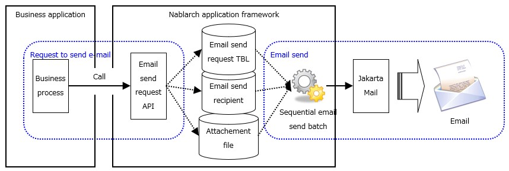

.. _`mail_request_test`:

================================================
How to Execute a Request Unit Test (Email Send)
================================================

Structure and test scope of the email send process
==================================================

:ref:`To send mail <mail>` using this framework,
a business application only needs to call the email sending request API provided by this framework.

Therefore, the scope of the request unit test is up to confirming
that the email send request is successfully accepted and stored in the database.

The following figure shows the outline of the email send process and test scope of the business application.

How to conduct the test
=======================

As described above, the only check in the request unit test for sending email
is that it is stored correctly in :ref:`each table (email send request table, email send recipient table, mail attachment table)<mail>`.

It is only necessary to describe the expected state of the above three tables in an Excel sheet, as in the other methods of conducting unit tests.
