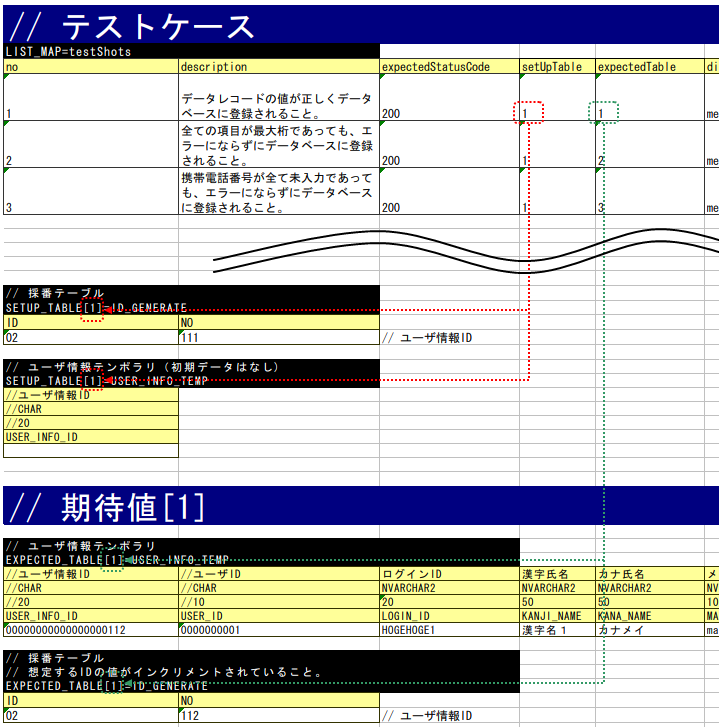

.. _`real_request_test`:

============================================================================
How to Execute a Request Unit Test (Receiving Synchronous Message Process)
============================================================================

-------------------------
How to write a test class
-------------------------

The test class should be created in such a way that the following conditions are met.

* The test class package should be the same as the Action class to be tested.
* The test class should be created with the class name <Action class name>RequestTest.
* Inherits ``nablarch.test.core.http.MessagingRequestTestSupport``.

For example, if the Action class to be tested is ``nablarch.sample.ss21AA.RM21AA001Action``,
the test class would be as follows.

.. code-block:: java

  package nablarch.sample.ss21AA;
  
  // ~ Middle is omitted ~

  public class RM21AA001ActionRequestTest extends MessagingRequestTestSupport {

--------------------
Test method division
--------------------

In principle, one test method and one test sheet per test class.

If the case is complex or the data volume is large, the method or sheet can be divided.

----------------------
How to write test data
----------------------

The Excel file containing the test data should be stored in the same directory with the same name as the test source code,
same as in the class unit test (only the extension differs).

For information on how to write test data, refer to :ref:`how_to_write_excel`.

Common database initial values for test classes
===============================================

The same applies for web applications. See :ref:`request_test_setup_db`.

Test shot List
==================

The test shot table for one test method is described in the data type of LIST_MAP. The ID is **testShots**.

..    .. image:: ./_image/new_testCases.png
..    :scale: 80

Each case should have the following elements:

================== ========================================================================================== ========
Column name           Description                                                                             Required
================== ========================================================================================== ========
no                 Write the test case numbers sequentially from 1.                                           Required
description        Write an explanation of the test case.                                                     Required
expectedStatusCode Expected status code -                                                                     Required
setUpTable         When registering in the database before each test case execution,
                   the :ref:`group ID <tips_groupId>` of the data described in the same sheet should be
                   described \ [1]_\. Data is input by an automated test framework.
expectedTable      escribe the :ref:`group ID <tips_groupId>` of the expected table when comparing
                   the contents of the database. \ [1]_\
expectedLog        Describe the ID of the expected log message.
                   The automated test framework verifies whether the log message was actually output.
diConfig           Describe the path to the component configuration file when executing the resident process. Required
                   See (\ :ref:`Command line arguments <main-run_application>`\ )\ [2]_\
requestPath        Describe the request path when executing the resident process.                             Required
                   See (\ :ref:`Command line arguments <main-run_application>`\)\ [2]_\
userId             Describe the resident process execution user ID.                                           Required
                   See (\ :ref:`Command line arguments <main-run_application>`\ )\ [2]_\
================== ========================================================================================== ========

\

.. [1]
 To use the default group ID (but not the group ID), write `default`.
 Default group ID and individual groups can be used together.
 When both data are mixed, both data of the default group ID and data of the specified group ID are valid.

.. [2]
 The "resident process" here refers to the process of sending and receiving messages.

Various preparation data
==========================

This section explains how to describe the various preparation data required for testing.
The database and request message are prepared in batches.

Database preparation
----------------------

Map with groupID in the same way as :ref:`online <request_test_testcases>`.

If there is no setUpTable column or it is blank in the `Test shot List`_\, the database is not prepared.

Request message
--------------------

The request statement that is the input data for the test is described. An example is shown below.

-----

 MESSAGE=setUpMessages

 // Common information (directives, framework control headers)

 +------------------+--------------+------------+
 | text-encoding    | Windows-31J  |            |
 +------------------+--------------+------------+
 | record-separator | CRLF         |            |
 +------------------+--------------+------------+
 | requestId        | RM11AC0101   |            |
 +------------------+--------------+------------+

 // Message body

 +------------------+-----------------------+------------+
 | no               | Record classification |   User ID  |
 +------------------+-----------------------+------------+
 |                  | 半角                  |       半角 |
 +------------------+-----------------------+------------+
 |                  | 1                     |         10 |
 +==================+=======================+============+
 | 1                | 7                     | 0000000001 |
 +------------------+-----------------------+------------+
 | 2                | 2                     | 0000000001 |
 +------------------+-----------------------+------------+

------

1. First line

 Prepare a request message for the request to be tested. The name should be fixed to ``MESSAGE=setUpMessages``.

2. Common information

 Enter the following information in the next line after the name. These values are common to all request messages.

 * Directive
 * Framework control header

 The format is in key-value format.

  +----+-----+
  |Key |Value|
  +----+-----+

.. important::

  If the item of the framework control header is changed by project,
  it is necessary to specify the framework control header name with the key ``reader.fwHeaderfields`` in the properties file as follows.

  .. code-block:: properties

    # Specify the framework control header name separated by a comma.
    reader.fwHeaderfields=requestId,addHeader

3. Message body

Describe the messages after the framework control header.
The first to third rows are the same as the description of the external interface design document,
and it can be efficiently created by transposing and copying the matrix from the design document.

 +----------------+-------------------+----------------------------------------+
 |行              |Description content|Remarks                                 |
 +================+===================+========================================+
 |First line      |Field name         |First cell is set to "no"               |
 +----------------+-------------------+----------------------------------------+
 |Second line     |Data type          |First cell is blank                     |
 +----------------+-------------------+----------------------------------------+
 |Third line      |Field length       |First cell is blank                     |
 +----------------+-------------------+----------------------------------------+
 |From fourth line|Data               |The first cell is a serial number from 1|
 +----------------+-------------------+----------------------------------------+

.. important::
 **Duplicate names are not allowed** for field names.
 For example, there should be not more than 1 field named as "Name".
 (Usually, in such cases, a unique field name is assigned, such as "member name" and "family member name")

 

This table corresponds to no in the \ `test shot list`_\.
In other words, the request message used in the test shot no1 is the data of the first row of the table (no 1).

.. image:: ./_image/msg_shot_to_req.png

Various expected values
=========================

When comparing the search results and database with expected values,
link each data with the list of test cases using ID.

Response message
--------------------

Same as \ `Request message`_\.

However, the name is ``MESSAGE=expectedMessages``.

The assertion method of the response message changes as follows depending on the file-type value configured in the test data directive.

 +------------------------+------------------------------------------------------------------------------+
 | File-type value        | Assertion method                                                             |
 +========================+==============================================================================+
 | Fixed or not specified | Assert the message after dividing into each item described in the test data. |
 +------------------------+------------------------------------------------------------------------------+
 | Other value            | Assert the entire message by handling it as a character string.              |
 +------------------------+------------------------------------------------------------------------------+

Note that the file-type has to be configured in the test data and not the format definition file.

The value of file-type that asserts each item can be changed by defining the following values in the environment configuration file.

  .. code-block:: text
  
    messaging.assertAsMapFileType=<comma delimited file-type list>

.. tip::
 | Since each message has a different length in XML and JSON, it is automatically calculated according to the contents of the test data.
 | Since the message is read according to the message length of the test data, if the message length and test message length is different the message may not be read correctly.
 | Therefore, when using XML or JSON, it is necessary to set file-type and assert the entire message as a string.

Expected database status
--------------------------

Link the expected database status with the test case list in the same way as `Database preparation`_ .

--------------------------
How to write a test method
--------------------------

Super class
====================

Inherits ``MessagingRequestTestSupport``.
In this class, the request unit test is executed by the following procedure based on the prepared test data.

Create a test method
======================

Create a method corresponding to the prepared test sheet.

.. code-block:: java
    
    @Test
    public void testRegisterUser() {
    }

Call a superclass method
==============================

In the test method, call one of the following methods of the superclass.

* void execute()
* void execute(String sheetName)

In the execute method with arguments, the sheet name of the test data can be specified.
If the execution method without arguments is used,
the operation will be the same as when the test method name is specified in the test data sheet name in the execution method with parameters.

Since the test sheet name and test method name are usually the same,
execution method without arguments should be used.

.. code-block:: java
    
    @Test
    public void testRegisterUser() {
        execute();   // [Description] Equivalent to execute ("testRegisterUser").
    }

-----------------------
How to launch the test
-----------------------

Same as the class unit test. Execute the test in the same way as a normal JUnit test.

------------------------
Test result verification
------------------------

The following results are verified by the automated test framework.

* Result verification of the response message (required)
* Result verification of database
* Log result verification

Database and log result verification is skipped if there is no description of the expected value in the `Test shot List`_ (if it is blank).

