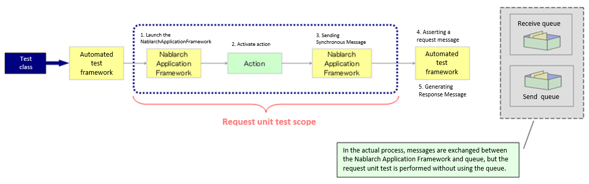
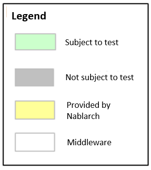
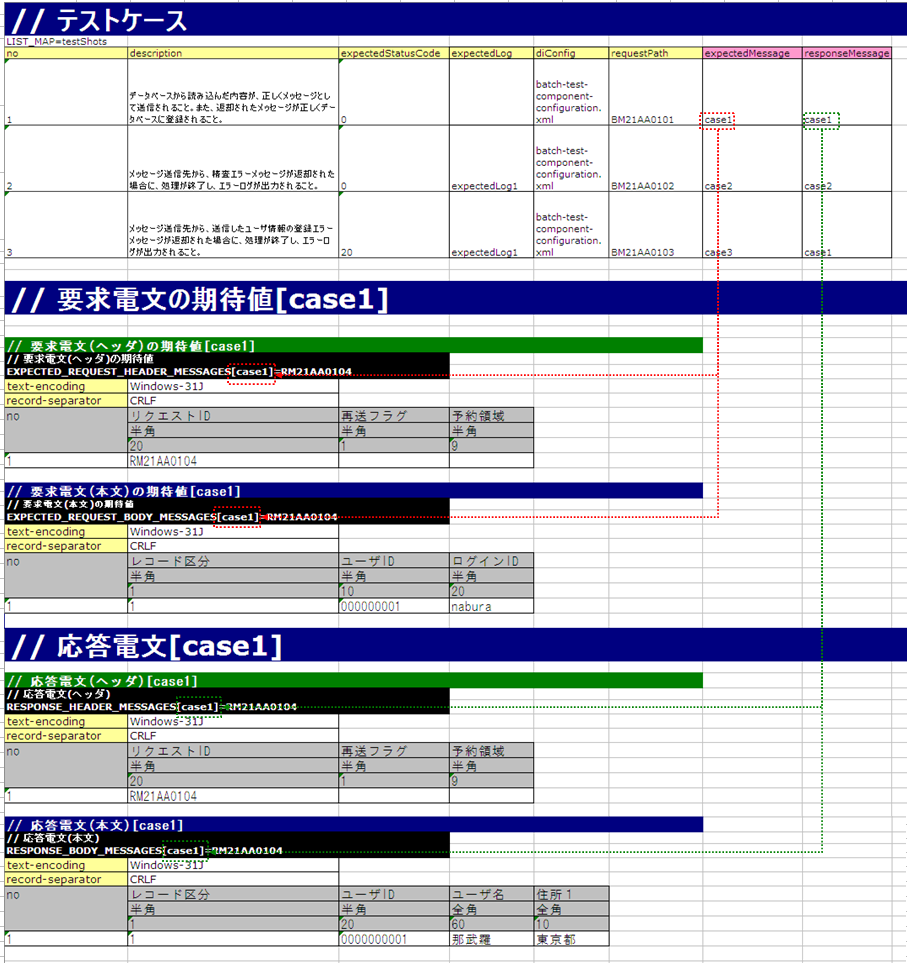
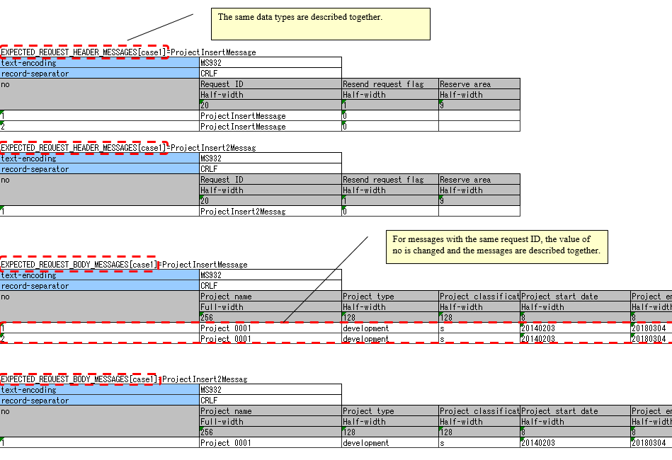

.. _`message_sendSyncMessage_test`:

=============================================================================
How to Execute a Request Unit Test (Sending Synchronous Message Process)
=============================================================================

Structure and test scope of the output library (sending synchronous message process)
-------------------------------------------------------------------------------------

The request unit test for the sending synchronous message process is done in the request ID \ [#]_\ unit granted to the process.

.. [#] 
 Note that the request ID used here refers to an ID that is defined to uniquely identify the function of the destination system to which a message is sent,
 and has a different meaning from the request ID used in web applications and batch processes.
 The format, format of the request and response messages, send queue name, and receive queue name are determined based on this request ID.

* In this section, a message sent by action to a queue is referred as a "request message" and a message received from the queue by an action is referred a "response message".

The following is an image of a request unit test

| (1) The automated test framework starts the Nablarch Application Framework.
| (2) The Nablarch Application Framework reads the parameter (request in the case of screen, file or DB in the case of batch) that is the input for the action and starts the action.
| (3) Action executes the message synchronous send process of the Nablarch Application Framework. Nablarch Application Framework converts the parameters received from the action into a request message.
| (4) The automated test framework asserts the request statement based on the test data. (request message is not put into the queue)
| (5) The automated test framework generates a response message based on the test data and returns it to the action. (response message is not got from the queue)

.. tip::
 The automated test framework does not use "send queue" or "receive queue" but asserts the request message and generates the response message before the queue.
 Therefore, no special middleware installation or configuration is required.

The features and advantages of the request unit test of the sending synchronous message process executed using the automated test framework are listed below.

1. Easy-to-write test data
 
 In most cases, the field length of the message layout is fixed,
 and it is difficult to describe it as test data like a fixed-length file.
 However, the automated test framework can describe test data according to the format definition
 of the external interface design document by using the Excel file.

 In addition, a test data format for sending synchronous message processes is provided.
 By conforming to this, test data can be easily created.
 These features make it easy to create and maintain test data.

2. No need to write test code for sending synchronous messages

 Test data (expected value of request message and response message) can be described in Excel, and the automated test framework automatically asserts request message and returns response message based on the test data.

 A super class that implements such a typical routine is provided, and by using it, test preparation, test target execution, and confirmation of test result are possible.
 As a result, the test can be executed with almost no coding using only the test data.
 
 
How to conduct the test
------------------------------------------------------------------------

The testing of sending synchronous message process follows the testing architectures of web applications and batch processing.
For information on how to write test classes and prepare various preparatory data, refer to How to conduct these tests. \

This section describes only how to execute the sending synchronous message process.

.. _`send_sync_request_write_test_data`:

------------------------
How to write test data
------------------------

The Excel file containing the test data should be stored in the same directory
with the same name as the test source code, same as in the class unit test (only the extension differs).

For information on how to write test data, refer to :ref:`how_to_write_excel`.

The expected value of the request message and the preparation of the response message to be returned
=====================================================================================================

When sending a sending synchronous message, the formats and data of the header and body parts of the request and response messages are defined for each request ID.

The test case, the expected value of the request message, and the response message are associated with the group ID.
Specifically, the group IDs listed in the expectedMessage and responseMessage fields
of the test case correspond to a table with the corresponding identifier.

If the expectedMessage and responseMessage fields are not found in the list of test cases, no verification is performed.
If this field is blank and sending of the synchronous message process is performed, the test will fail.
When sending of the synchronous message process is performed, expectedMessage and responseMessage must be included.

If more than one message with the same group ID and the same request ID is sent in a single test case, the data lines for the number of request and response messages should be described. The order of the no columns (sequential number) matches the order in which they are sent.

See below for more information on how to write a test case.
 * \ :ref:`List of web application test cases<request_test_testcases>`\
 * \ :ref:`List of test cases for batch processing<batch_test_testcases>`\

The following is the test data written in Excel. (Group ID association is also shown)

.. tip::

 In the sending synchronous message function provided as standard by Nablarch, the header part of the request message and response message uses a common format,
 so the format definition of the header part of the test data should also be unified for each request.
 Regarding the body part, different formats can be defined in the request message and the response message.

-----

The table of expected value of the request message and response message to be returned are described in the following format.

+---------------------+------------------------------+------------------+--------------+
|Identifier           |                                                                |
+---------------------+------------------------------+------------------+--------------+
|Directive line       | Directive configuration value|                                 |
+---------------------+------------------------------+------------------+--------------+
|    ...  [#]_\       |    ...                       |                  |              |
+---------------------+------------------------------+------------------+--------------+
|no                   |Field name(1)                 |Field name(2)     |...  [#]_\    |
|                     +------------------------------+------------------+--------------+
|                     |Data type(1)                  |Data type(2)      |...           |
|                     +------------------------------+------------------+--------------+
|                     |Field length(1)               |Field length(2)   |...           |
|                     +------------------------------+------------------+--------------+
|                     |Data(1-1)                     |Data(2-1)         |...           |
|                     +------------------------------+------------------+--------------+
|                     |Data(1-2)                     |Data(2-2)         |...           |
|                     +------------------------------+------------------+--------------+
|                     |... \ [#]_\                   |...               |...           |
+---------------------+------------------------------+------------------+--------------+

.. [#] 
 Below this, the number of directives continues in the same way.
 
.. [#] 
 On the right side, the number of fields continues in the same way.

.. [#]
 Below this, the number of data continues in the same way.

\

========================== =============================================================================================================================================================================================================================================================================================================
Name                       Description
========================== =============================================================================================================================================================================================================================================================================================================
Identifier                 Specifies an ID that indicates the message type. This item is associated with the group ID described in expectedMessage and responseMessage in the test case list.
                  
                           The format of the identifier is shown below.
                  
                           * Header of the expected value of a request message … EXPECTED_REQUEST_HEADER_MESSAGES[Group ID]=Request ID
                           * Body of the expected value of a request message … EXPECTED_REQUEST_BODY_MESSAGES[Group ID]=Request ID
                           * Response message header … RESPONSE_HEADER_MESSAGES[Group ID]=Request ID
                           * Response message body … RESPONSE_BODY_MESSAGES[Group ID]=Request ID
Directive line \ [#]_\     Describes the directive. The cell to the right of the directive name cell contains the configuration value (multiple lines are allowed).
no                         Write "no" in the line below the directive line.
Field name                 Describes the field name. Describes only the number of fields.
Data type                  Describes the data type of the field. Describes only the number of fields.

                           The data type is described with a Japanese name such as "half-width alphabets(半角英字)".

                           Refer to the member variable DEFAULT_TABLE of `BasicDataTypeMapping <https://github.com/nablarch/nablarch-testing/blob/master/src/main/java/nablarch/test/core/file/BasicDataTypeMapping.java>`_ for the mapping between data types in the format definition file and data types with Japanese names.
Field length               Describes the field type of the field. Describes only the number of fields.
Data                       Describe the data stored in that field.If multiple records exist, the entry of data should be continued in the next line.
                           Describe the data stored in that field.When the same request ID is sent synchronously multiple times in the same test case, the data is described following the next line.
========================== =============================================================================================================================================================================================================================================================================================================

.. [#]
 When writing a directive, the contents corresponding to the following in the format definition file need not be described.

 ============== ==============================================================
 Items          Reason
 ============== ==============================================================
 file-type      Because the testing framework only supports fixed length.
 record-length  For padding with the size specified in the field length.
 ============== ==============================================================

.. important::
 **Duplicate names are not allowed** for field names. For example, there should be not more than 1 field named as "Name".
 (Usually, in such cases, a unique field name is assigned, such as "member name" and "family member name")

.. tip::
 Field names, data types and field lengths can be efficiently created by copying and pasting them from the external interface design document.
 (Check the "**transpose matrix**" option when pasting)

-----

The following is an example of a description of the expected value in the body of a specific request message.

The expected value of the header of a request message and the body and header of a response message are described in the same way as the expected value of the body of a request message, except for the identifier, which is described here.

In this example, it is expected that a request message that satisfies the following specifications will be sent.

* Request ID is ``RM21AA0104``\
* Character code is ``Windows-31J``\
* Record delimiting character is CRLF ``CRLF``\
* Record classification is ``1``, ``User ID is 0000000001``, ``Login ID is nabura``\

 .. image:: ./_image/send_sync_example.png
    :scale: 80

 
.. important::

  When there are multiple records in a request message, you may want to describe multiple business data in a single header as follows.

    * Header
    * Business data (first record)
    * Business data (second record)
    * Business data (third record)

  However, in the automated test framework, it is necessary to describe the header and the record alternately as follows.
  If the header is not defined in duplicate, an assertion error occurs because the number of business data and the header does not match.

    * Header
    * Business data (first record)
    * Header
    * Business data (second record)
    * Header
    * Business data (third record)

----

When sending a message multiple times, the test should be written with attention to the following specifications of the testing framework.

* The same data types (``RESPONSE_HEADER_MESSAGES`` and ``RESPONSE_BODY_MESSAGES`` in the following example) are described together, respectively. For more information, see :ref:`tips_groupId` and :ref:`auto-test-framework_multi-datatype`.
* For messages with the same request ID, the value of no is changed and the messages are described together.

The following is a description example of the expected value of the request message body when a message is sent multiple times.

.. tip::
 If there are multiple request IDs to be sent, testing the order is not possible. In the above example, the test is successful even if ``ProjectInsert2Messag`` is sent before ``ProjectInsertMessage``.

.. _`send_sync_failure_test`:

 
Failure pattern test
=====================

The failure pattern can be tested by configuring a specific value starting with "errorMode:" in the table of the response message.\ [#]_\

The correspondence between the configuration values and failure pattern tests is shown below.

 +-------------------------------------------+-------------------------------------------------------------+--------------------------------------------------+
 | Value to be configured for the first field| Failure description                                         | Operation of the automated test framework        |
 +===========================================+=============================================================+==================================================+
 |  ``errorMode:timeout``                    | Test if timeout error occurs while sending the message      | Throws **MessageSendSyncTimeoutException**       |
 |                                           |                                                             | (subclass of **MessagingException**)             |
 +-------------------------------------------+-------------------------------------------------------------+--------------------------------------------------+
 |  ``errorMode:msgException``               | Test when a message send and receive error occurs           | Throws **MessagingException**                    |
 +-------------------------------------------+-------------------------------------------------------------+--------------------------------------------------+
 
This value should be in the **first field, excluding "no", in both the header and the body** of the table in the response message.

The following is an image of the setting in Excel.

 .. image:: ./_image/send_sync_error.png
   :width: 100%

.. [#]
 If the business action does not explicitly control **MessagingException**,
 there is no need to perform fault testing in individual request unit tests.

-------------------------
Test result verification
-------------------------

When the expected value of the request message is defined, the following verification is performed in the automated test framework.

* Verification of the request message contents
* Verification of the number of send request messages
