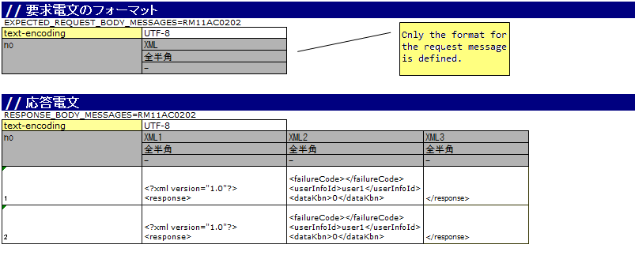

.. _dealUnitTest_http_send_sync:

=====================================================================================
How to Perform a Subfunction Unit Test with HTTP Sending Synchronous Message Process
=====================================================================================

The mockup class provided by Nablarch should be used to perform a subfunction unit test in the case of a web application that uses the HTTP sending synchronous message process.

For information on how to execute a subfunction unit test, see \ :ref:`dealUnitTest_send_sync`\ .

However, "send queue" and "receive queue" should be read as "communication destination".

In this section, the differences with \ :ref:`dealUnitTest_send_sync`\  are explained.

-------------------------------------------------------------------------------------
How to run a subfunction unit test using a mockup class
-------------------------------------------------------------------------------------

~~~~~~~~~~~~~~~~~~~~~~~~~~~~~~~~~~~~~~~~~~~~~~~~~~~~~~~~~~~~~~~~~~~~~~~~~~~~~~~~~~~~~~~~~~~~~~~~~~~~~~~~~~~~~~~~~~~~~~~~
How to write an Excel file
~~~~~~~~~~~~~~~~~~~~~~~~~~~~~~~~~~~~~~~~~~~~~~~~~~~~~~~~~~~~~~~~~~~~~~~~~~~~~~~~~~~~~~~~~~~~~~~~~~~~~~~~~~~~~~~~~~~~~~~~

When conducting a subfunction unit test, an Excel file should be written in accordance with the prescribed description rules.

The format and data of the response messages defined in the Excel file are used to generate the response message returned by the mockup class. 
The format of the request message is also used by the mockup class to output a log of the request message.

Example of description
~~~~~~~~~~~~~~~~~~~~~~~~

A description example for Excel file is shown below.

Formatting of the message and how to describe the data
~~~~~~~~~~~~~~~~~~~~~~~~~~~~~~~~~~~~~~~~~~~~~~~~~~~~~~~~
It is the same as \ :ref:`send_sync_test_data_format`\  of the sending synchronous message process.

However, only the body of the HTTP communication is defined because there is no header for both the request and response messages.

~~~~~~~~~~~~~~~~~~~~~~~~~~~~~~~~~~~~~~~~~~~~~~~~~~~~~~~~~~~~~~
Configuring the classes to be used in the framework
~~~~~~~~~~~~~~~~~~~~~~~~~~~~~~~~~~~~~~~~~~~~~~~~~~~~~~~~~~~~~~

Usually, the classes are configured by the architect and do not need to be set by the application programmer.

Mockup class configuration
~~~~~~~~~~~~~~~~~~~~~~~~~~~~~~~~~~~~~~~~

Configure mockup class to be used in subfunction unit test in the component configuration file.

 .. code-block:: xml
  
      <!-- Client for HTTP communication -->
      <component name="defaultMessageSenderClient" 
                 class="nablarch.test.core.messaging.MockMessagingClient">
        <property name="charset" value="Shift-JIS"/>
      </component>

The character code output to the log can be changed by specifying the character code name in the \ ``charset``\ field. 
Normally character code is optional, and UTF-8 will be used if omitted.

