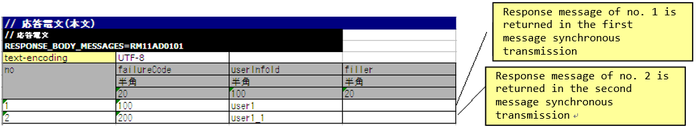
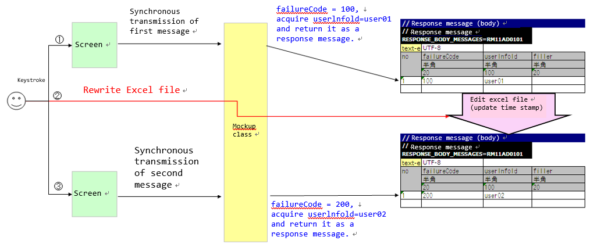
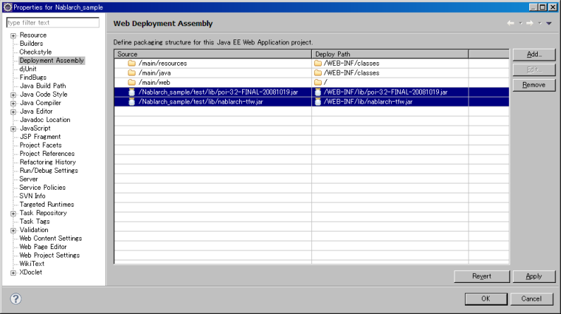

.. _dealUnitTest_send_sync:

=======================================================================================
How to Perform a Subfunction Unit Test with Sending Synchronous Message Process
=======================================================================================

The mockup class provided by Nablarch should be used to perform a subfunction unit test in the case of a web application that uses the sending synchronous message process.

The normal process flow for sending synchronous messages in a web application and the process flow for using a mockup class to perform a subfunction unit test.

* The normal process flow of a web application with sending synchronous message process.

 .. image:: ./_images/send_sync_online_base.png
    :width: 100%

* Process flow when using a mockup class to perform a subfunction unit test of a web application with sending synchronous message process.

 .. image:: ./_images/send_sync_online_mock.png
    :width: 100%

The mockup class provides the following functions.

* Function to return a predetermined response message \ [#f1]_\ .

  When the sending synchronous message process is performed from the screen, the response message required to perform the subfunction unit test can be returned without connecting to the send and receive queues.
  
* Function to output request message \ [#f1]_\  to the log

  The request message sent synchronously from the screen can be output to the log.
  The output log can be checked to confirm whether the message was sent normally.
  The output logs can be used as evidence.

* Function to test the fault pattern

  Timeout errors and message send and receive errors that occur when the sending synchronous message process is performed can be generated.
  A fault pattern can be tested by using this function.

Using the mockup class eliminates the need to prepare queues, and unit tests can be conducted without installing special middleware or configuring the environment.

-------------------------------------------------------------------------------------
How to run a subfunction unit test using a mockup class
-------------------------------------------------------------------------------------

When using a mockup class, define the format and data of response message in the Excel file. 
Only the format is defined for the request message.

Prepare an Excel file for each request ID \ [#]_\ The file name should match the request ID.
For example, if the request ID is "RM21AA0101", the file name will be "RM21AA0101.xlsx".
The deployment directory of the file is defined in the configuration file. For more information, see \ :ref:`send_sync_test_data_path`\.
 
.. [#] 
 Note that the request ID used here refers to an ID that is defined to uniquely identify the function of the destination system to which a message is sent, 
 and has a different meaning from the request ID used in web applications and batch processes. 
 The format, format of the request and response messages, send queue name, and receive queue name are determined based on this request ID. 

 
~~~~~~~~~~~~~~~~~~~~~~~~~~~~~~~~~~~~~~~~~~~~~~~~~~~~~~~~~~~~~~~~~~~~~~~~~~~~~~~~~~~~~~~~~~~~~~~~~~~~~~~~~~~~~~~~~~~~~~~~
How to write an Excel file
~~~~~~~~~~~~~~~~~~~~~~~~~~~~~~~~~~~~~~~~~~~~~~~~~~~~~~~~~~~~~~~~~~~~~~~~~~~~~~~~~~~~~~~~~~~~~~~~~~~~~~~~~~~~~~~~~~~~~~~~

When conducting a subfunction unit test, an Excel file should be written in accordance with the prescribed description rules.

The rules to follow when writing an Excel file are given below.

* The sheet name is fixed to "message".
* Define the format of the FW control header and body of the response message to be returned.
* Define the data of the FW control header and body of the response message to be returned.
* Define the FW control header and body format of the request message.

The format and data of the response messages defined in the Excel file are used to generate the response message returned by the mockup class. 
The format of the request message is also used by the mockup class to output a log of the request message.

Example of description
~~~~~~~~~~~~~~~~~~~~~~~~

A description example for Excel file is shown below.

.. image:: ./_images/send_sync_test_data.png
    :scale: 70

.. _send_sync_test_data_format:

Formatting of the message and how to describe the data
~~~~~~~~~~~~~~~~~~~~~~~~~~~~~~~~~~~~~~~~~~~~~~~~~~~~~~~~

The format and data of the message are described in the following format:

+---------------------+-------------------------------+------------------+--------------+
|Identifier           |                                                                 |
+---------------------+-------------------------------+------------------+--------------+
|Directive line       | Directive configuration value |                                 |
+---------------------+-------------------------------+------------------+--------------+
|    ...  [#]_\       |    ...                        |                  |              |
+---------------------+-------------------------------+------------------+--------------+
|no                   |Field name(1)                  |Field name(2)     |...  [#]_\    |
|                     +-------------------------------+------------------+--------------+
|                     |Data type(1)                   |Data type(2)      |...           |
|                     +-------------------------------+------------------+--------------+
|                     |Field length(1)                |Field length(2)   |...           |
|                     +-------------------------------+------------------+--------------+
|                     |Data(1-1)                      |Data(2-1)         |...           |
|                     +-------------------------------+------------------+--------------+
|                     |Data(1-2)                      |Data(2-2)         |...           |
|                     +-------------------------------+------------------+--------------+
|                     |... \ [#]_\                    |...               |...           |
+---------------------+-------------------------------+------------------+--------------+

.. [#] 
 Below this, the number of directives continues in the same way. 
 
.. [#] 
 On the right side, the number of fields continues in the same way.

.. [#]
 Below this, the number of data continues in the same way.

\

========================== =========================================================================================================================================================================================================================================================================================================
Name                       Description
========================== =========================================================================================================================================================================================================================================================================================================
Identifier                 Specifies an ID that indicates the message type. This item is associated with the group ID described in expectedMessage and responseMessage in the test case list.
                  
                           The format of the identifier is shown below.
                  
                           * Request message header … EXPECTED_REQUEST_HEADER_MESSAGES = Request ID
                           * Request message body… EXPECTED_REQUEST_BODY_MESSAGES = Request ID
                           * Response message header … RESPONSE_HEADER_MESSAGES = Request ID
                           * Response message body … RESPONSE_BODY_MESSAGES = Request ID
Directive line \ [#]_\     Describes the directive. The cell to the right of the directive name cell contains the configuration value (multiple lines are allowed).
no                         Write "no" in the line below the directive line.
Field name                 Describes the field name. Describes only the number of fields.
Data type                  Describes the data type of the field. Describes only the number of fields.

                           The data type is described with a Japanese name such as "half-width alphabets(半角英字)".

                           Refer to the member variable DEFAULT_TABLE of `BasicDataTypeMapping <https://github.com/nablarch/nablarch-testing/blob/master/src/main/java/nablarch/test/core/file/BasicDataTypeMapping.java>`_  for the mapping between data types in the format definition file and data types with Japanese names.
Field length               Describes the field type of the field. If "-" is specified, the size will be calculated automatically based on the description in the "Data" column.
                  
                           Describes only the number of fields.
Data                       Describe the data only in the case of response message.Describe the data stored in that field.If multiple response messages are to be returned, the entry of data should be continued in the next line.
========================== =========================================================================================================================================================================================================================================================================================================

.. [#]
 When writing a directive, the contents corresponding to the following in the format definition file need not be described.

 ============== ==============================================================
 Item           Reason
 ============== ==============================================================
 file-type      The testing framework supports fixed lengths only.
 record-length  To pad with the size specified in the field length.
 ============== ==============================================================

.. tip::
 Field names, data types and field lengths can be efficiently created by copying and pasting them from the external interface design document.\
 (Check the "\ **transpose matrix**\ " option when pasting.)

Reload an Excel file
~~~~~~~~~~~~~~~~~~~~~~~~~~~~~~~~~~~~~~~~~~~~~~~~~~~~~~~~~~~~~~~~~~~~~~~

The mockup class provides a function to reload an Excel file when the timestamp of the Excel file is updated, 
assuming that the Excel file is edited manually and tested again, or the test is repeated with the same data.

Normally, no is incremented each time the following response message is returned, and the value of no is not initialized while the application server is running.

If the following response message data is defined, the response message of no. 1 is returned in the first message synchronization transmission and the no is incremented. 
The response message of no. 2 is returned in the second message synchronous transmission.

However, updating the timestamp by editing or overwriting the Excel file, the Excel file can be reloaded while the application server is running.

An example of editing the Excel file and restarting the test is given below.

.. _`send_sync_response_count_change.png`:

Failure pattern test
~~~~~~~~~~~~~~~~~~~~~~~~~~~~~~~~~~~~~~~~~~~~~~~~~~~~~~~~~~~~~~

The failure system can be tested by configuring a specific value starting with "errorMode:" in the first field of the table of the response message body.

The correspondence between the configuration values and failure pattern tests is shown below.

 +--------------------------------------------+-------------------------------------------------------------+-----------------------------------------------------------+
 | Value to be configured for the first field | Failure description                                         |  Operation of the automated test framework                |
 +============================================+=============================================================+===========================================================+
 |  errorMode:timeout                         | Test if timeout error occurs while sending the message      |  null is returned as the return value of sendSync method. |
 +--------------------------------------------+-------------------------------------------------------------+-----------------------------------------------------------+
 |  errorMode:msgException                    | Test when a message send and receive error occurs           |  Throws a MessagingException.                             |
 +--------------------------------------------+-------------------------------------------------------------+-----------------------------------------------------------+
 
 
A description example is shown below.

 .. image:: ./_images/send_sync_test_data_error.png

.. _send_sync_test_data_path:

~~~~~~~~~~~~~~~~~~~~~~~~~~~~~~~~~~~~~~~~~~~~~~~~~~~~~~~~~~~~~~
Configure the location of the Excel file
~~~~~~~~~~~~~~~~~~~~~~~~~~~~~~~~~~~~~~~~~~~~~~~~~~~~~~~~~~~~~~

The location path of the Excel file is configured in filepath.config as shown in the following example.

The Excel file is placed in the directory specified in this path. If this location has been changed, correct the path.

 .. code-block:: bash
  
  # Excel file path
  file.path.send.sync.test.data=file:///C:/nablarch/workspace/Nablarch_sample/test/message

A deployment image of an Excel file is shown below.

 .. image:: ./_images/send_sync_test_data_structure.png

.. tip::

 It is recommended that the path of the deployment directory be specified by the file system path (file:) instead of the classpath (classpath:). 
 By specifying the file system path, the contents of an Excel file can be edited and tested directly while the server is running.

~~~~~~~~~~~~~~~~~~~~~~~~~~~~~~~~~~~~~~~~~~~~~~~~~~~~~~~~~~~~~~
Log output of the request message
~~~~~~~~~~~~~~~~~~~~~~~~~~~~~~~~~~~~~~~~~~~~~~~~~~~~~~~~~~~~~~

Request message log is output in Map and CSV formats.

The log in Map format is assumed to be used for debugging, and log in CSV format is assumed to be used for acquiring evidence.

In the sample, Map format log is output to standard output and application log file, and CSV format log is output to dedicated log file, but it is possible to switch the output destination by modifying the log configuration.
    
An example of the log output is shown below.

* For Map format

 .. code-block:: bash
  
  2011-10-26 13:16:10.958 MESSAGING_SEND_MAP request id=[RM11AD0101]. following message has been sent: 
    message fw header = {requestId=RM11AD0101, testCount=, resendFlag=0, reserved=}
    message body      = {authors=test3, title=test1, publisher=test2}

* For CSV format

 .. code-block:: bash
  
  2011-10-26 13:16:10.958 MESSAGING_SEND_CSV request id=[RM11AD0102]. following message has been sent: 
  header: 
  "requestId","testCount","resendFlag","reserved"
  "RM11AD0102","","0",""
  body: 
  "authors","title","publisher"
  "test3","test1","test2"

The log output is configured in log.properties. The configuration example shown below.

 .. code-block:: bash
  
  # CSV format message log writer (output to ./messaging-evidence.log)
  writer.MESSAGING_CSV.className=nablarch.core.log.basic.FileLogWriter
  writer.MESSAGING_CSV.filePath=./messaging-evidence.log
  writer.MESSAGING_CSV.formatter.className=nablarch.core.log.basic.BasicLogFormatter
  writer.MESSAGING_CSV.formatter.format=$message$

  # CSV format message log logger
  loggers.MESSAGING_CSV.nameRegex=MESSAGING_CSV
  loggers.MESSAGING_CSV.level=DEBUG
  loggers.MESSAGING_CSV.writerNames=MESSAGING_CSV

  # Map format message log logger
  loggers.MESSAGING_MAP.nameRegex=MESSAGING_MAP
  loggers.MESSAGING_MAP.level=DEBUG
  loggers.MESSAGING_MAP.writerNames=stdout,appFile

~~~~~~~~~~~~~~~~~~~~~~~~~~~~~~~~~~~~~~~~~~~~~~~~~~~~~~~~~~~~~~
Configuring the classes to be used in the framework
~~~~~~~~~~~~~~~~~~~~~~~~~~~~~~~~~~~~~~~~~~~~~~~~~~~~~~~~~~~~~~

Usually, the classes are configured by the architect and do not need to be set by the application programmer.

Mockup class configuration
~~~~~~~~~~~~~~~~~~~~~~~~~~~~~~~~~~~~~~~~

Configure mockup class to be used in subfunction unit test in the component configuration file.

 .. code-block:: xml
  
      <!-- Mock messaging provider -->
      <component name="messagingProvider"
                 class="nablarch.test.core.messaging.MockMessagingProvider">
      </component>

Configure the property file path to describe the location of the Excel file.
~~~~~~~~~~~~~~~~~~~~~~~~~~~~~~~~~~~~~~~~~~~~~~~~~~~~~~~~~~~~~~~~~~~~~~~~~~~~~~

In the component configuration file, configure the path of the property file that describes the path where the Excel file is placed, and the property key.

 .. code-block:: xml

    <!-- Specify the path of the property file that describes the path to the Excel file location  -->
    <config-file file="web/filepath.config" />
  
    <component name="filePathSetting"
             class="nablarch.core.util.FilePathSetting" autowireType="None">
       <property name="basePathSettings">
         <map>
           <!- Specify the key name of the property that describes the path to the location of the Excel file -->
           <entry key="sendSyncTestData" value="${file.path.send.sync.test.data}" />
           <entry key="format" value="classpath:web/format" /> 
         </map>
       </property>
       <property name="fileExtensions">
         <map>
           <!- Define the extension (xlsx) of an Excel file -->
           <entry key="sendSyncTestData" value="xlsx" />
           <entry key="format" value="fmt" />
         </map>
       </property>
    </component>

Configuring the test data analysis class
~~~~~~~~~~~~~~~~~~~~~~~~~~~~~~~~~~~~~~~~~
Set up a test data analysis class to be used in subfunction unit tests in the component configuration file.

 .. code-block:: xml
 
   <!-- TestDataParser -->
  <component name="messagingTestDataParser" class="nablarch.test.core.reader.BasicTestDataParser">
    <property name="testDataReader">
      <component name="xlsReaderForPoi" class="nablarch.test.core.reader.PoiXlsReader"/>
    </property>
    <property name="interpreters" ref="messagingTestInterpreters" />
  </component>
   <!-- Classes for interpreting test data notation -->
  <list name="messagingTestInterpreters">
    <component class="nablarch.test.core.util.interpreter.NullInterpreter"/>
    <component class="nablarch.test.core.util.interpreter.QuotationTrimmer"/>
    <component class="nablarch.test.core.util.interpreter.CompositeInterpreter">
      <property name="interpreters">
        <list>
          <component class="nablarch.test.core.util.interpreter.BasicJapaneseCharacterInterpreter"/>
        </list>
      </property>
    </component>
  </list>

Add the necessary unit test libraries to pom.xml
~~~~~~~~~~~~~~~~~~~~~~~~~~~~~~~~~~~~~~~~~~~~~~~~~
Add the following dependency to pom.xml

 .. code-block:: xml
 
        <dependency>
          <groupId>com.nablarch.framework</groupId>
          <artifactId>nablarch-testing</artifactId>
          <exclusions>
            <exclusion>
              <groupId>org.mortbay.jetty</groupId>
              <artifactId>*</artifactId>
            </exclusion>
            <exclusion>
              <groupId>com.google.code.findbugs</groupId>
              <artifactId>*</artifactId>
            </exclusion>
          </exclusions>
        </dependency>

Configuring the library to be used for subfunction unit test
~~~~~~~~~~~~~~~~~~~~~~~~~~~~~~~~~~~~~~~~~~~~~~~~~~~~~~~~~~~~~~~~~~~

The following jar files are required be passed to the classpath of application server in the subfunction unit test.

 * nablarch-tfw.jar
 * Apache POI jar

The classpath of jar is configured by default in the standard sample applications provided by Nablarch. 
Specifically, these jars are placed in the test/lib directory of the sample application, and the classpath is configured using the Eclipse function as shown below.

Since the jars are used only for the unit tests, it is recommended to place the jars in another directory instead of WEB-INF/lib as in the above example.

-----------

.. [#f1] 
 A message sent to a queue is called a "request message" and a message received from a queue is called a "response message".
 
