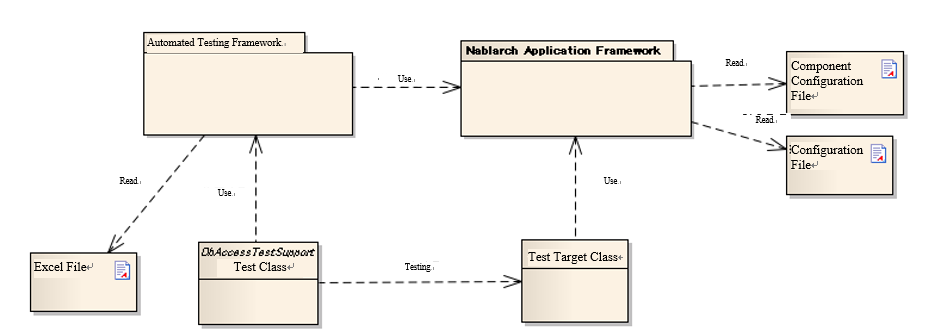
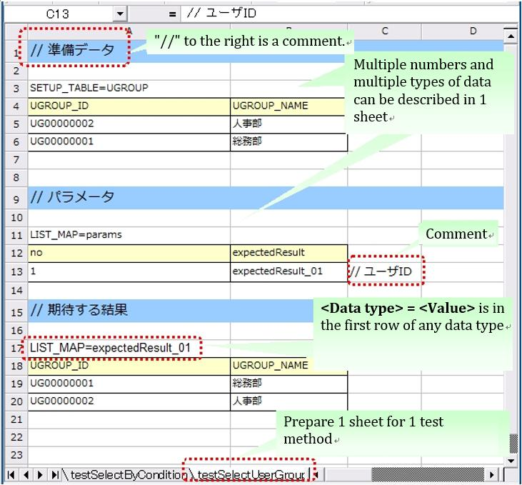

.. _auto-test-framework:

============================
Automated Testing Framework
============================

--------
Features
--------

Junit4 base
============
The automated testing framework is based on JUnit4. 
The framework uses the functions provided in JUnit 4, such as various annotations, the assert method, and the Matcher class.

Externalization of test data
==============================
Test data can be written in an Excel file. 
An Excel file containing the data for database preparation and expected test results can be used through the APIs of the automated testing framework.

Provision of test helper functions specific to Nablarch
============================================================
The framework provides APIs specific to the Nablarch applications, such as transaction control and system date configuration.

.. ----
.. 要求
.. ----

.. 実装済み
.. ========

.. * データセットアップ

..   * EXCELにデータベース(テーブル)データの準備データが記述できる。
 

.. * テスト実行機能
   

.. * 判定（アサート機能）

..   * テーブルの更新結果がアサートできる
..   * SELECT文の実行結果(取得結果)がアサートできる
..   * メソッドの戻り値となる値がアサートできる

..     * List<Map<String, String>

..   * セル内のデータについて、空白やnullを明示的に記述できる。

.. 未実装
.. ======
.. * データセットアップ

..   * マスタデータが高速にセットアップできる。

..     * マスタデータ(メッセージ、コードなど、、)の投入。※テストケース毎に変わらないデータは、ダンプ等から高速にロードができる。

..   * データシートから、各テスト環境へデータ投入ができる。
..   * データバックアップ。
..   * バックアップからの復元。
..   * テストデータの記述形式が見やすく記述できる。
..   * テストデータが任意の単位で記述できる。
..   * テストデータが文字コードに依存せずに記述できる。
..   * 自動テストのケース修正・追加が容易にできる。
..   * ターゲットモジュールのリファクタリングを行った際にデータシートに与える影響が最小限であること。
..   * 下記のデータを記述できること

..     * DB データ
..     * ファイル(XML, CSV, 固定長)
..     * メソッドの戻り値となる値（Java のオブジェクト等）
..     * 終了コード、ログ出力メッセージ(JOBLOGも含む)
..     * HTTPリクエスト/レスポンス
..     * その他電文（MQ 等）
..     * バイナリーデータ

..   * EXCELで作成したデータファイルから、ファイル(固定長、CSV、可変長、XML等)を作成し各テスト環境へ配置できる。

.. * テスト実行機能

..   * インプットデータ（バッチの起動パラメータ/ユーザーの入力等）を EXCEL に記述できること。
..   * 準備データをインプットとして自動テストを実行できること。（当然、DB/ファイル共に実行可能。）
..   * スタブを使用して自動テストが実行できる(MQ、暗号化、外部接続、プロダクト依存等)。
..   * 項目精査の自動テストは、テスト毎のデータを用意せずに実行できる。
..   * 同じ自動テストが繰り返し実行できる。
..   * 自動テストを実行する範囲を指定できる。
..   * 自動テスト全実行時に実行順番によって結果が変わらない。
..   * 自動テスト全実行が高速に実行できる。
..   * 準備データシート上から自動テストを実行できる。
..   * 異常系のテスト用に、環境起因で発生するエラーも擬似的に発生させることができる。
..   * OS 等の環境に依存しないでテストを実行できる。
..   * ターゲットモジュールの全てのロジック（メソッド、プロシージャ等）に対してテストが実行できる。
..   * デッドロックや、ロック要求タイムアウトのリトライが透過的に実行できる。

.. * 判定（アサート機能）

..   * XMLファイルがアサートできる。
..   * 画面レイアウトがアサートできる。
..   * 帳票データーがアサートできる。

.. 未検討
.. ======

..   * Excelデータから任意のJavaオブジェクト(例：Entityのリスト、JMSメッセージ…)を生成するロジックを、既存機能に変更を加えずに追加できる。

..   * リンク機能の搭載。例えば、あるセルに"\*LINK1"と書いてあると、"\*LINK1"というIDを持ったデータの中身を取ってこれる。
..   * Excel fileを、単なる外部ファイルではなく、テスト仕様書として使用することができる。テスト仕様書をもとにテストを駆動できる。
    
..   * JUnitテストコードを書かなくても、Excel fileを用意するだけでテストを実行できる。

.. 取り下げ
.. ========

.. 現状無し。

.. _`testing_fw_components`:

--------------------------------------------
Structure of the automated testing framework
--------------------------------------------

+-----------------------------+--------------------------------------+----------------------------------------------------+
|Component                    |Description                           |Prepared by                                         |
+=============================+======================================+====================================================+
|Test class                   |Test process is described.            |Application programmer                              |
+-----------------------------+--------------------------------------+----------------------------------------------------+
|Class to be tested           |Class to be tested.                   |Application programmer                              |
+-----------------------------+--------------------------------------+----------------------------------------------------+
|Excel file                   |Contains test data.                   |Application programmer                              |
|                             |The data can be read by using         |                                                    |
|                             |the automated test framework.         |                                                    |
+-----------------------------+--------------------------------------+----------------------------------------------------+
|Component configuration file |The various settings at the time      |Application programmer（if a specific configuration |
|and configuration file       |of executing a test are described.    |is required for individual tests）                  |
+-----------------------------+--------------------------------------+----------------------------------------------------+
|Automated Testing Framework  |Provides the functions necessary      | \－                                                |
|                             |for testing.                          |                                                    |
+-----------------------------+--------------------------------------+----------------------------------------------------+
|Nablarch Application         |The main framework                    | \－                                                |
|Framework                    |(out of scope of this function)       |                                                    |
+-----------------------------+--------------------------------------+----------------------------------------------------+

---------------------------
How to write a test method
---------------------------

Use JUnit4 annotations. 
Assign @Test annotation to the test method.

 .. code-block:: java 

    public class SampleTest {

        @Test
        public void testSomething() {
            // Test process
        }
    }

.. tip::
  Annotations such as @Before and @After can also be used. 
  If you want to use these annotations to perform common processes such as resource acquisition and release before and after the test method, 
  refer to the next section ( :ref:`using_junit_annotation`).

.. _`how_to_write_excel`:

---------------------------------
Test data description using Excel
---------------------------------

Spreadsheets have an advantage over Java source code in terms of readability and ease of editing, 
for representing data such as preparation data for database and database search results. 
Excel files can be used to handle such data in a spreadsheet format.

Naming conventions
====================

There are recommended conventions for Excel file names and file paths.By following these conventions, you don't need to explicitly specify a directory or file name in the test class to read a file, and the test source code can be written concisely.It is also possible to read an Excel file from any location by explicitly specifying the path.

Path and file name conventions
-----------------------------------

The recommended conventions for file names and paths are as follows:

- The Excel file name should be the same name as the test source code (only the extension is different).

- The Excel file should be placed in the same directory as the test source code.

An example is shown below.

+--------------------+----------------------+-----------------------------+
|File type           |Deployment directory  |File name                    |
+====================+======================+=============================+
|Test source file    |<PROJECT_ROOT>/test   |ExampleDbAcessTest.java      |
+--------------------+/jp/co/tis/example/db/+-----------------------------+
|Excel file          |                      |ExampleDbAcessTest.xlsx [#]_ |
+--------------------+----------------------+-----------------------------+

.. [#] Excel files are compatible with Excel 2003 and earlier file formats (extension xls format) and Excel 2007 and later file formats (extension xlsx format).  

Excel sheet name conventions
--------------------------------

The recommended conventions for an Excel sheet are as follows:

- One sheet should be prepared per test method.

- The sheet name should be the same as the test method name.

An example is shown below.

+--------------------+--------------------------------+
|Test method         |@Test public void testInsert()  |
+--------------------+--------------------------------+
|Excel sheet name    |testInsert                      |
+--------------------+--------------------------------+

.. tip::
  The conventions for a sheet are not “restrictions”. 
  Test method name and Excel sheet name need not be the same for proper functioning. 
  In the future, additional functions will be developed using the above conventions as default. 
  Therefore, it is recommended to follow the naming conventions. 
  Even if the naming conventions are changed, they should be consistent within a project.

Structure in the sheet
=======================

Here is an explanation about the conventions to describe an Excel sheet. 
The following is a description example of a sheet.

 

Various types of data can be written in a sheet, such as data to be stored in a database and database search results.In order to determine the type of test data, it is necessary to assign meta information called "data type" to the test data.The "data type" indicates what the test data represents.

Currently, the following data types are available.

================================= ==============================================================================  ========================================
Data type name                    Description                                                                     Set value                    
================================= ==============================================================================  ========================================
SETUP_TABLE                       Data to be registered in the database before test execution.                    Table name to be registered
EXPECTED_TABLE                    The expected data in the database after the test is executed.                   Table name to be checked
EXPECTED_COMPLETE_TABLE           The expected data in the database after the test is executed.                   Table name to be checked
                                  An omitted column is treated as having been configured to                               
                                  \ :ref:`default_values_when_column_omitted`\.                                  
LIST_MAP                          List<Map<String,String>>                                                        ID that is unique in the sheet
                                                                                                                  ID of expected value (arbitrary string)
SETUP_FIXED                       Fixed length file for advance preparation                                       Location of the preparation file
EXPECTED_FIXED                    Fixed length file showing expected values                                       Location of the file to be compared
SETUP_VARIABLE                    Variable length file for advance preparation                                    Location of the preparation file
EXPECTED_VARIABLE                 Variable length file showing expected values                                    Location of the file to be compared
MESSAGE                           Data to be used in testing of the messaging process                             Fixed value \ [#]_\ 
EXPECTED_REQUEST_HEADER_MESSAGES  Fixed length file showing the expected value of the request message (header)    Request ID
EXPECTED_REQUEST_BODY_MESSAGES    Fixed length file showing the expected value of the request message (body)      Request ID
RESPONSE_HEADER_MESSAGES          Fixed length file showing the request message (header)                          Request ID
RESPONSE_BODY_MESSAGES            Fixed length file showing the request message (body)                            Request ID
================================= ==============================================================================  ========================================

\

.. [#] \ `setUpMessages`\  or \ `expectedMessages`\ 

In addition, multiple data can be described.

The common format, which is not dependent on data type, is as follows.

* The first row of data should be in the format "data type = value" and should contain the data type and value.
* The format from the second row onward varies depending on the data type.

　The data type is the information that identifies what that data represents. 
For example, if the data has to be submitted to the database, the data type "SETUP_TABLE" is used.

For example, the following data type indicates that the data should be registered as preparation data in the COMPOSER table.

SETUP_TABLE=COMPOSER

+--------+------------+-----------+
|     NO | FIRST_NAME | LAST_NAME |
+========+============+===========+
|  00001 | Steve      | Reich     |
+--------+------------+-----------+
|  00002 | Phillip    | Glass     |
+--------+------------+-----------+

Comment
========

If there is a string starting with "//" in a cell, all the cells to the right of that cell will not be read. For additional information that you want to write to improve readability, which you do not want to include in the test data itself, you can use the comment function.

In the following example, a comment regarding the logical name of the table is written in Row 2, while a comment regarding the expected result is written at the end of Row 4.

EXPECTED_TABLE=PLAYER

+----------+----------+----------+----------+----------------------------+
|NO        |FIRST_NAME|LAST_NAME |ADDRESS   |                            |
+==========+==========+==========+==========+============================+
|// Number |Name      |Surname   |Address   |                            |
+----------+----------+----------+----------+----------------------------+
|0001      |Andres    |Segovia   |Spain     |                            |
+----------+----------+----------+----------+----------------------------+
|0002      |Julian    |Bream     |England   | // This record is added    | 
+----------+----------+----------+----------+----------------------------+

.. _`marker_column`:  

Marker column
==============

When writing test data, sometimes you want to write some information on the Excel sheet but do not want to include that information in the actual data. \
The "comment" mentioned above can be used to describe information that is not included in the actual data, \
however, “comment” has a property due to which the cells to right of that cell are not read, \
because of which the leftmost (or middle) cell cannot be used for a comment.

In such cases, "marker columns" can be used to describe data that is not included in the actual data, 
but which appears on the Excel sheet.

In the header row of the test data, \
if the **column name is enclosed in half-width square brackets, the column is considered to be a "marker column"**\. 
The column corresponding to the marker column is not read when a test is executed.

For example, suppose you have test data as follows:

LIST_MAP=EXAMPLE_MARKER_COLUMN

+----+----------+----------+
|[no]|id        |name      |
+====+==========+==========+
|1   |U0001     |Yamada    |
+----+----------+----------+ 
|2   |U0002     |Tanaka    |
+----+----------+----------+

The above test data is equivalent to the following test data at the time of executing a test because the column [no] enclosed in half-width square brackets is ignored.

LIST_MAP=EXAMPLE_MARKER_COLUMN

  +----------+----------+
  |id        |name      |
  +==========+==========+
  |U0001     |Yamada    |
  +----------+----------+
  |U0002     |Tanaka    |
  +----------+----------+

Though the example of LIST_MAP is given here, other data types can be used in the same way.

Cell format
=============

String is the only format that can be used for cells. 
The format of all cells should be configured to String before test data is created.

Coloring of borders and cells can be set as per your choice. By setting colors for borders and cells, data readability, review quality and maintainability can be improved.

.. important::
 | When data is written in a format other than String in an Excel file, the data cannot be read correctly.

.. _`special_notation_in_cell`:

Special ways to write in a cell
==================================
A number of special notations are provided to improve the convenience of automated testing. 
The following table is written with a special method of writing provided in this framework.

+---------------------------------------+-------------------------------------+----------------------------------------------------------------------------------------------------------------+
|Description method \                   | Value in automated test [#]_\       |Description                                                                                                     |
|(value described in cell)              |                                     |                                                                                                                |
+=======================================+=====================================+================================================================================================================+
|null                                   | null                                |If "null" **(half-width uppercase and lowercase letters are not distinguished)**  is described in the cell, \   |
+---------------------------------------+                                     |it is treated as "null" value. For example, use when you want to register a null value in the database\         |
|Null                                   |                                     |or when you want to set a null value with an expected value.                                                    |
+---------------------------------------+-------------------------------------+----------------------------------------------------------------------------------------------------------------+
|"null"                                 |null string                          |When double quotes (both half-width and full-width) are enclosed before and after the character string,\        |
+---------------------------------------+                                     |the character string with double quotes removed is used.\ [#]_                                                  |
|"NULL"                                 |                                     |                                                                                                                |
+---------------------------------------+-------------------------------------+For example, if it is necessary to handle "null" or "NULL" as a character string, \                             |
|"1(half-width space)"                  | 1(half-width space)                 |describe as ""null"" or ""NULL"" as described in the description method.                                        |
+---------------------------------------+-------------------------------------+                                                                                                                |
|"(half-width space)"                   | (half-width space)                  |In addition, for the purpose of making it easy to understand that there is a space in the value of the cell,    |
+---------------------------------------+-------------------------------------+"1?" or "?" can be used as described in the description method.                                                 |
| "１(full-width space)"                | １(full-width space)                |                                                                                                                |
|                                       |                                     |                                                                                                                |
+---------------------------------------+-------------------------------------+                                                                                                                |
| "(full-width space)(full-width space)"| (full-width space)(full-width space)|                                                                                                                |
+---------------------------------------+-------------------------------------+                                                                                                                |
| """                                   | "                                   |                                                                                                                |
+---------------------------------------+-------------------------------------+                                                                                                                |
| "" [#]_                               | Empty string                        |                                                                                                                |
+---------------------------------------+-------------------------------------+----------------------------------------------------------------------------------------------------------------+
|${systemTime}                          |System date and time [#]_            |Use when you want to enter the system date and time.                                                            |
+---------------------------------------+                                     +----------------------------------------------------------------------------------------------------------------+
|${updateTime}                          |                                     |An alias for ${systemTime}. Especially, it is used as an expected value when updating the database time stamp.\ |
+---------------------------------------+-------------------------------------+----------------------------------------------------------------------------------------------------------------+
|${setUpTime}                           |Fixed value described in             |It is used when you want to use a fixed value for the time stamp at database setup.                             |
|                                       |the component settings file          |                                                                                                                |
+---------------------------------------+-------------------------------------+----------------------------------------------------------------------------------------------------------------+
|${Character type,word count} [#]_      |A value obtained by amplifying       |The character strings that can be used are as follows.                                                          |
|                                       |the specified character type         |                                                                                                                |
|                                       |up to the specified number           |半角英字,半角数字,半角記号,半角カナ,全角英字,全角数字,                                                          |
|                                       |of characters                        |全角ひらがな,全角カタカナ,全角漢字,全角記号その他,外字                                                          |
|                                       |                                     |                                                                                                                |
+---------------------------------------+-------------------------------------+----------------------------------------------------------------------------------------------------------------+
|${binaryFile:File Path}                |Binary data stored in BLOB column    |Used when you want to store file data in BLOB column.                                                           |
|                                       |                                     |The file path is described as a relative path from Excel file.                                                  |
+---------------------------------------+-------------------------------------+----------------------------------------------------------------------------------------------------------------+
|\\r                                    |\ *CR*\                              |It is used to explicitly describe the line feed code. [#]_                                                      |
+---------------------------------------+-------------------------------------+                                                                                                                |
|\\n                                    |\ *LF*\                              |                                                                                                                |
+---------------------------------------+-------------------------------------+----------------------------------------------------------------------------------------------------------------+

.. tip::
  **Legend**
  
  *  (half-width space): stands for half-width space
  *  (full-width space): stands for full-width space
  * *CR*: stands for the carriage return CR(0x0D).
  * *LF*: LF stands for the line feed code LF(0x0A).

.. [#]
 Converted by Automated Testing Framework after reading from cell.
                                                                                                 
\ 

.. [#]

  Even when this description method is used, it is not necessary to escape the double quotes in the character string.
  An example is shown below.

 +----------------------+--------------------------------------------------------------------------------------------------+ 
 |  Description example | Description                                                                                      |
 +======================+==================================================================================================+ 
 |"ab"c"                | Treated as ab"c.(Double quotes at the front and back are removed.)                               |
 +----------------------+--------------------------------------------------------------------------------------------------+
 |"abc""                | Treated as abc"(Double quotes at the front and back are removed.)                                |
 +----------------------+--------------------------------------------------------------------------------------------------+
 | ab"c                 | Treated as ab"c.(Since the front and rear are not double quotes, they are treated as they are.)  |
 +----------------------+--------------------------------------------------------------------------------------------------+
 | abc"                 | Treated as abc"(Since the front and rear are not double quotes, they are treated as they are.)   |
 +----------------------+--------------------------------------------------------------------------------------------------+

\

.. [#] 
 This notation can be used to represent a blank row. 
 For more information, see item "\ :ref:`how_to_express_empty_line`\ ". 

.. [#] It is converted to Timestamp string format acquired from SystemTimeProvider implementation class configured in the component configuration file. \
 Specifically, it is converted to a value such as \ `2011-04-11 01:23:45.0` 

\

.. [#]
 This notation can be used alone or in combination.
 An example is shown below.

 +--------------------------+-----------------------------+-----------------------------------------------------+
 |Description example       | Examples of converted values| Description                                         |
 +==========================+=============================+=====================================================+
 |${半角英字,5}             | geDSfe                      |Converted to 5 single-byte alphabetic characters.    |
 +--------------------------+-----------------------------+-----------------------------------------------------+
 |${全角ひらがな,4}         | ぱさぇん                    |Converted to full-width Hiragana 4 characters.       |
 +--------------------------+-----------------------------+-----------------------------------------------------+
 |${半角数字,2}-{半角数字4} | 37-3425                     |Anything other than - is converted.                  |
 +--------------------------+-----------------------------+-----------------------------------------------------+
 |${全角漢字,4}123          | 山川海森123                 |Anything other than the end 123 is converted.        |
 +--------------------------+-----------------------------+-----------------------------------------------------+
 
.. [#]
 
 Line breaks (Alt + Enter) in Excel cells are treated as *LF*. This is an Excel specification that has nothing to do with this feature.
 If you want to show a line feed code LF, you just need to insert a new line (Alt+Enter) in a cell.
 
 Examples are shown below.

 +--------------------------+------------------------------+--------------------------------------------------------------------+
 | Description example      | Examples of converted values | Description                                                        |
 +==========================+==============================+====================================================================+
 |こんにちは |br|           |こんにちは\ *LF*\             |The line break (Alt+Enter) in the cell                              |
 |さようなら                |さようなら                    |becomes LF(0x0A).                                                   |
 +--------------------------+------------------------------+--------------------------------------------------------------------+
 |こんにちは\\n             |こんにちは\ *LF*\             |'\\n' is converted to LF(0x0A)                                      |
 |さようなら                |さようなら                    |by this function.                                                   |
 +--------------------------+------------------------------+--------------------------------------------------------------------+
 |こんにちは\\r |br|        |こんにちは\ *CRLF*\           |'\\r' is converted to CR(0x0D)                                      |
 |さようなら                |さようなら                    |by this function. The Carriage return and Line feed (Alt+Enter)     |
 |                          |                              |in the cell（Alt+Enter）becomes LF(0x0A).                           |
 +--------------------------+------------------------------+--------------------------------------------------------------------+

--------
Note
--------

Creating tests that do not depend on the execution order of test methods
============================================================================

When creating the test source code and test data, take care that the test result does not change depending on the order of execution of the test methods. Not only the order, but also the results must be the same whether the class is tested individually or collectively.

In particular, since commits are executed in this framework during testing, there is a high possibility that the contents of the database will be changed by a preceding or succeeding test. \
Therefore, all preconditions required for a self-testing class must be prepared within the self-testing class.

This is effective from the following perspectives:

* Prevents accidental failure or accidental success of a test, depending on the order in which the test is executed.
* You can know the preconditions by looking only at the data or source code of the test.

For the preparation of tables that are basically read-only, such as the master data, a common Excel file must be prepared and the tables should be written in that file. Either execute the test by preparing the tables only once before execution, or execute the test on the assumption that the tables have been prepared in advance prior to execution of the test.

This method has the following advantages.

* The master data can be reused in the entire project.
* It is easy to maintain test data.
* Test execution speed increases.

.. tip::
 Use \ :ref:`master_data_setup_tool`\  to input the master data. \
 In addition, using \ :doc:`04_MasterDataRestore`\ , the master data changes that occur during a test can be automatically reverted to the original state at the end of the test.
 As a result, even if there are test cases for which master data needs to be changed, they can be executed without affecting other test cases.

Write all test data to an Excel sheet
=======================================

If test data is described both in Excel and test source code, readability and maintainability will reduce. All test data should be described in an Excel sheet, and not in the test source code.

* Looking at the Excel sheet, you can figure out the variations in the test case.
* The division of roles is done such that an Excel sheet is used for test data and test source code is used for test logic.
* You can easily add test cases by facilitating reading of the Excel sheet.
* Duplication of test source code can be reduced to a great extent (if you simply describe data using literals in the test source code, duplicate code will be created as data variation increases).

.. _auto-test-framework_multi-datatype:

Describing data by grouping together based on data types when using multiple data types
================================================================================================
When multiple data types are used, the data should be described by grouping together based on the data types used. 
If data of multiple data types is mixed when describing, reading of data is aborted in the middle and the test is not executed correctly.

For example, if data types are described as follows, then the data only up to  ``TABLE2`` is evaluated and even if there is an error in the data from ``TABLE3``  onward, the test ends successfully.

.. code-block:: text

  EXPECTED_TABLE=TABLE1
  :
  EXPECTED_COMPLETE_TABLE=TABLE2
  :
  EXPECTED_TABLE=TABLE3
  :
  EXPECTED_COMPLETE_TABLE=TABLE4
  :

In order to ensure that all data is properly evaluated, 
the data should be grouped together and described based on data types as follows:

.. code-block:: text

  EXPECTED_TABLE=TABLE1
  :
  EXPECTED_TABLE=TABLE3
  :
  EXPECTED_COMPLETE_TABLE=TABLE2
  :
  EXPECTED_COMPLETE_TABLE=TABLE4
  :

.. |br| raw:: html

   