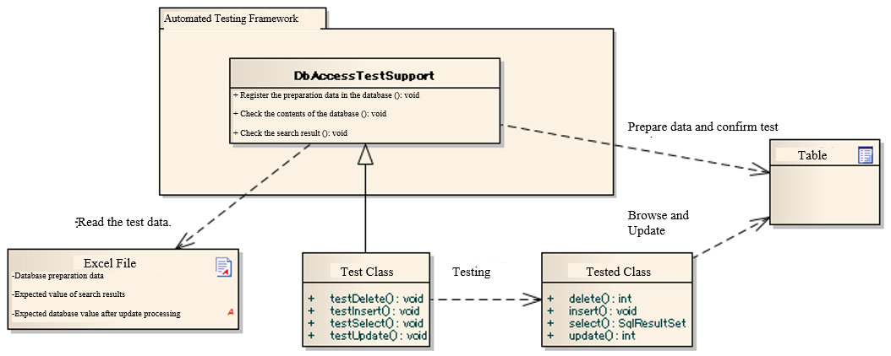
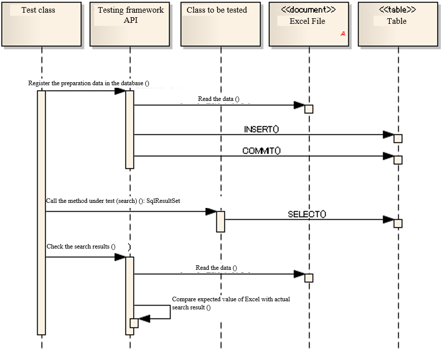
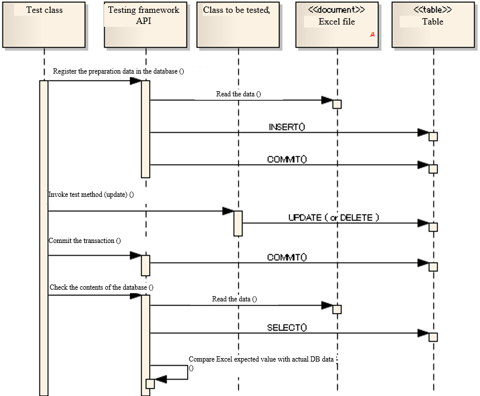

=======================================
Testing a Class that Uses the Database
=======================================

--------
Summary
--------

We will describe how to test classes that use the database, such as database access class.

When testing the classes that use the database, operations related to database (test data input, data verification) can be performed by using the classes provided by this framework.

Overall picture
================

Main Classes, resources
------------------------

+---------------------------+-------------------------------------------------------+------------------------------------+
|Name                       |Role                                                   | Creation unit                      |
+===========================+=======================================================+====================================+
|Test class                 |Implement the test logic.                              |Creating one per class to be tested |
|                           |Inherit DbAccessTestSupport.                           |                                    |
+---------------------------+-------------------------------------------------------+------------------------------------+
|Test data (Excel file)     |Describe the test data, such as preliminary            |Create one per test class           |
|                           |data stored in a table and expected results.           |                                    |
+---------------------------+-------------------------------------------------------+------------------------------------+
|Class to be tested         |The class to be tested.                                | －                                 |
+---------------------------+-------------------------------------------------------+------------------------------------+
|DbAccessTestSupport        |Provides the necessary functions for testing using     | －                                 |
|                           |the database, such as preparation data input. Also,    |                                    |
|                           |starts and ends a database transaction before and after|                                    |
|                           |the execution of a test(:ref:`using_transactions`)     |                                    |
+---------------------------+-------------------------------------------------------+------------------------------------+

------------------
Basic test methods
------------------

How to use APIs of this framework in accordance with the purpose, is described below.

Testing read process pattern
=============================

During read process testing, to check that the class to be tested fetches the data as expected, you can check the lookup result from the database by the following procedure:

 #. Registers the preparation data to the database.
 #. Invoke the method of the class to be tested.
 #. Check whether the search result received as a return value is the expected value.

Sequence
----------

Example of test source code implementation
-------------------------------------------

 .. code-block:: java 

    public class DbAccessTestSample extends DbAccessTestSupport {

        /**
         * Test all searches.  
         * Check that all the * records registered in
         * Employee table can be acquired.
         */ 
        @Test
        public void testSelectAll() {

            // Register preparation data in the database
            // Write sheet name in the argument.
            setUpDb("testSelectAll");
                        
            // Invoke the method to be tested.
            EmployeeDbAcess target = new EmployeeDbAccess(); 
            SqlResultSet actual = target.selectAll();
            
            // Confirmation of results
            // Confirm that the expected value described in Excel is equal to the actual value
            // In the argument, specify the name of the sheet containing the expected value, ID of the expected value, and the actual value
            assertSqlResultSetEquals("testSelectAll", "expected", actual);
        }
    }

Test data description example
------------------------------

.. _how_to_write_setup_table:

Preparation data to be pre-registered in the database
~~~~~~~~~~~~~~~~~~~~~~~~~~~~~~~~~~~~~~~~~~~~~~~~~~~~~~~

Enter the data as follows.

* Line 1: SETUP_TABLE=<Name of table to be registered>

* Line 2: Column name of the table

* Line 3 ~ : Records to be registered (corresponding to the column name of the second row)

SETUP_TABLE=EMPLOYEE

=========== =============== ===========
ID          EMP_NAME        DEPT_CODE
=========== =============== ===========
      00001  Yamada Taro          0001 
      00002  Tanaka Ichiro        0002
=========== =============== ===========

SETUP_TABLE=DEPT

============ ============================
         ID  DEPT_NAME
============ ============================
       0001  Human Resources Department          
       0002  Administration Department          
============ ============================

Expected value after test execution
~~~~~~~~~~~~~~~~~~~~~~~~~~~~~~~~~~~~~

Enter the data as follows.

* Row 1: LIST_MAP=< ID of the expected value, which is unique in the sheet (arbitrary string)

* Row 2: Column name or alias specified in the SELECT statement

* Row 3 ~ : Search results (corresponding to the column name of Row 2)

LIST_MAP=expected

=========== =============== ==============================
ID          EMP_NAME        DEPT_NAME
=========== =============== ==============================
      00001  Yamada Taro      Human Resources Department
      00002  Tanaka Ichiro    Administration Department
=========== =============== ==============================

.. _how_to_test_update_method:

Testing update process
========================

When checking that the class to be tested updates the data as expected, you can check the update result of the database by the following procedure:

 #. Registers the preparation data to the database.
 #. Invoke the method of the class to be tested.
 #. Commits the transaction.
 #. Check that the database values are updated as expected.

.. important::
  In the Nablarch Application Framework, it is assumed that multiple types of transactions will be used together.
  Therefore, when checking the database contents after executing the class to be tested,
  you must commit the transaction. If the transaction is not committed,
  the test result is not checked normally.

.. tip::
  You need not commit when testing the read process.

Sequence
----------

Example of test source code implementation
------------------------------------------

 .. code-block:: java

    public class DbAccessTestSample extends DbAccsessTestSupport {
        @Test
        public void testDeleteExpired() {

            // Register preparation data in the database
            // Specify the sheet name in the argument.
            setUpDb("testDeleteExpired");
                        
            // Invoke the method to be tested.
            EmployeeDbAcess target = new EmployeeDbAccess(); 
            SqlResultSet actual = target.deleteExpired();  // Delete the expired data
            
            // Commit the transaction
            commitTransactions();

            // Confirmation of results
            // Confirm that the expected value described in Excel is equal to the actual value
            // In the argument, specify the name of the sheet containing the expected value, and the actual value
            assertTableEquals("testDeleteExpired", actual);
        }

Test data description example
-----------------------------

Preparation data to be pre-registered in the database
~~~~~~~~~~~~~~~~~~~~~~~~~~~~~~~~~~~~~~~~~~~~~~~~~~~~~

Enter the data as follows.

* Line 1: SETUP_TABLE=<Name of the table to be registered>

* Line 2: Column name of the table

* Line 3 ~ : Records to be registered (corresponding to the column name of the second row)

SETUP_TABLE=EMPLOYEE

=========== =============== =============
ID          EMP_NAME         EXPIRED
=========== =============== =============
      00001  Yamada Taro      TRUE
      00002  Tanaka Ichiro    FALSE
=========== =============== =============

Expected value after test execution
~~~~~~~~~~~~~~~~~~~~~~~~~~~~~~~~~~~

Enter the data as follows.

* Line 1: EXPECTED_TABLE=<Name of the table to be checked>

* Line 2: Column name of the table to be checked

* Line 3 ~: Expected value

EXPECTED_TABLE=EMPLOYEE

=========== =============== =============
ID          EMP_NAME         EXPIRED
=========== =============== =============
 // CHAR(5)  VARCHAR(64)      BOOLEAN
      00002  Tanaka Ichiro    FALSE
=========== =============== =============

-------------------------------------------------
How to omit description of database test data
-------------------------------------------------

When describing the preparation data of the database and the expected values,
description in columns not relevant to the test can be omitted.
:ref:`default_values_when_column_omitted` configured for the omitted columns by the automated testing framework.
By using this function, readability of the test data improves.
Also, even if the table definition is changed, data modification work is saved for columns that are not relevant,
thereby improving maintainability.

This function is especially useful for test cases related to the update process.
When only one out of the many columns is updated, there is no need to describe the unnecessary columns.

.. important::
 When describing the expected values of database **search results**,
 one must describe all the columns to be searched
 (it is not possible to check only the primary key of a record).
 
 Even when testing the **registration process**, since all the columns of the newly registered records need to be checked,
 it is not possible to omit columns using this function.

When omitting a column of DB preparation data
==============================================

If you omit a column when writing the data for database preparation,
the omitted column is treated as having :ref:`default_values_when_column_omitted` configured.

However, **the column of the primary key cannot be omitted**.

When omitting a column of DB expected values
============================================

If you simply omit a column that is not relevant from the DB expected values, the omitted column is excluded from comparison.
When testing the update process, “checking that an irrelevant column is not updated” is also a necessary perspective.
In this case, use `EXPECTED_COMPLETE_TABLE` for data type, instead of `EXPECTED_TABLE`.
If `EXPECTED_TABLE` is used, the omitted column is excluded from comparison,
whereas if `EXPECTED_COMPLETE_TABLE` is used, comparison is carried out assuming
that the omitted column contains the :ref:`Default values<default_values_when_column_omitted>`.

Specific examples
==================

Examples when all the columns are described and when only the relevant columns are described, are shown below.

Test case example
-----------------

The following test cases are used as examples:

**For records that have passed the “expiration date”, the “Delete flag” should be updated to 1.**\ [#]_

.. [#] The date on which this test is executed is January 1, 2011.

The table to be used (SAMPLE_TABLE) has the following columns:

================== ===================================================================================
 Column name        Description
================== ===================================================================================
 PK1                Primary key
 PK2                Primary key
 COL_A              Columns that are not used by the function under test
 COL_B              Columns that are not used by the function under test
 COL_C              Columns that are not used by the function under test
 COL_D              Columns that are not used by the function under test
 Expiration date    Data that has passed the expiration data will be processed            
 Delete flag        The value of records that have passed the expiration date, will be updated to “1”
================== ===================================================================================

When all the columns are described without omission (bad example)
--------------------------------------------------------------------

Readability decreases as all the columns are described.\ [#]_\
Also, if there is a change in the table definition, even a column that is not relevant must be modified.

.. [#] The columns COL_A, COL_B, COL_C and COL_D are not relevant to this test case.

**Preparation data**

SETUP_TABLE=SAMPLE_TABLE

+-----+-----+-----+-----+-----+-----+----------------+-----------+
|PK_1 |PK_2 |COL_A|COL_B|COL_C|COL_D|Expiration date |Delete flag|
+=====+=====+=====+=====+=====+=====+================+===========+
| 01  |0001 |1a   |1b   |1c   |1d   |20101231        |0          |
+-----+-----+-----+-----+-----+-----+----------------+-----------+
| 02  |0002 |2a   |2b   |2c   |2d   |20110101        |0          |
+-----+-----+-----+-----+-----+-----+----------------+-----------+

**Expected value**

EXPECTED_TABLE=SAMPLE_TABLE

+-----+-----+-----+-----+-----+-----+----------------+-----------+
|PK_1 |PK_2 |COL_A|COL_B|COL_C|COL_D|Expiration date |Delete flag|
+=====+=====+=====+=====+=====+=====+================+===========+
| 01  |0001 |1a   |1b   |1c   |1d   |20101231        |1          |
+-----+-----+-----+-----+-----+-----+----------------+-----------+
| 02  |0002 |2a   |2b   |2c   |2d   |20110101        |0          |
+-----+-----+-----+-----+-----+-----+----------------+-----------+

When only the relevant columns are described (good example)
------------------------------------------------------------

By describing only the relevant columns, readability and maintainability improve.
The columns relevant to this test case are as follows:

* Primary key column to uniquely identify a record (PK_1, PK_2)
* “Expiration date” column, which is a condition for extracting records to be updated
* “Delete flag” column to be updated

In addition, even if there is a change in the table definition, there is no impact on columns that are not relevant.

**Preparation data**

Only the columns relevant to the test to be executed are described.

SETUP_TABLE=SAMPLE_TABLE

+-----+-----+----------------+-----------+
|PK_1 |PK_2 |Expiration date |Delete flag|
+=====+=====+================+===========+
| 01  |0001 |20101231        |0          |
+-----+-----+----------------+-----------+
| 02  |0002 |20110101        |0          |
+-----+-----+----------------+-----------+

**Expected value**

When describing expected value, use `EXPECTED_COMPLETE_TABLE` instead of  `EXPECTED_TABLE`.

EXPECTED_COMPLETE_TABLE=SAMPLE_TABLE

+-----+-----+----------------+-----------+
|PK_1 |PK_2 |Expiration date |Delete flag|
+=====+=====+================+===========+
| 01  |0001 |20101231        |1          |
+-----+-----+----------------+-----------+
| 02  |0002 |20110101        |0          |
+-----+-----+----------------+-----------+

.. _`default_values_when_column_omitted`:

Default values
===============

The following values are used as default values unless explicitly specified
in the component configuration file of the automated testing framework.

+---------------+----------------------+
|  Column       |Default values        |
+===============+======================+
|  Numeric type |0                     |
+---------------+----------------------+
| String type   |Half width spaces     |
+---------------+----------------------+
|  Date type    |1/1/1970 00:00:00.0   |
+---------------+----------------------+

How to change the default values
==================================

Settings items list
-------------------

You can configure the following values in the component configuration file using
nablarch.test.core.db.BasicDefaultValues

+--------------------------+-------------------------------+----------------------------------------------------------------------+
| Configuration item name  |Description                    |Configuration value                                                   |
+==========================+===============================+======================================================================+
| charValue                |Default value for string type  |A single ASCII character                                              |
+--------------------------+-------------------------------+----------------------------------------------------------------------+
| numberValue              |Default value for numeric type |0 or a positive integer                                               |
+--------------------------+-------------------------------+----------------------------------------------------------------------+
| dateValue                |Default value for date type    |JDBC time stamp escape format (yyyy-mm-dd hh:mm:ss.fffffffff)         |
+--------------------------+-------------------------------+----------------------------------------------------------------------+

Example of component configuration file description
----------------------------------------------------

An example of a component configuration file description when the following setting values are used is shown below.

+--------------------------+------------------------------+
| Configuration item name  |Configuration value           |
+==========================+==============================+
| charValue                | a                            |
+--------------------------+------------------------------+
| numberValue              | 1                            |
+--------------------------+------------------------------+
| dateValue                | 1/1/2000 12:34:56.123456789  |
+--------------------------+------------------------------+

.. code-block:: xml

  <!-- TestDataParser -->
  <component name="testDataParser" class="nablarch.test.core.reader.BasicTestDataParser">
    <!-- Database default values -->
    <property name="defaultValues">
      <component class="nablarch.test.core.db.BasicDefaultValues">
        <property name="charValue" value="a"/>
        <property name="dateValue" value="1/1/2000 12:34:56.123456789"/>
        <property name="numberValue" value="1"/>
      </component>
    </property>
    <!-- Middle is omitted -->
  </component>

------------------
Important points
------------------

Points to be noted related to setUpDb method
=============================================

  * It is not necessary to describe all the columns in the Excel file.
    Default values are set for omitted columns.

  * Multiple tables can be described on a single sheet of the Excel file.
    When setUpDb (String sheetName) is executed, all the records with the data type "SETUP_TABLE" in the specified sheet are registered.

 

Points to be noted related to assertTableEquals method
========================================================

  * Columns omitted in the description of expected values, are excluded from comparison.

  * Even if the order of records is different when carrying out comparison, records can be compared correctly by checking against the primary key.
    There is no need to create expected data with the order of the records in mind.

  * Multiple tables can be described on a single sheet. When assertTableEquals(String sheetName) is executed, all the data with the data type "EXPECTED_TABLE" in the specified sheet are compared.

  * The Java.sql.Timestamp type format, such as date of update, is "yyyy-mm-dd hh:mm:ss.fffffffff"(fffffffff" is nano seconds). Even if the nanosecond is not configured, it is displayed as 0 nanosecond in the format. For example, if the time is exactly 12 hours 34 minutes 56 seconds on January 1, 2010, it would be displayed as 2010-01-01 12:34:56.0. When you describe an expected value in an Excel sheet, it is necessary to add a decimal point + Zero at the end.

Points to be noted related to assertSqlResultSetEquals
========================================================

  * All column names (alias) specified in the SELECT statement are compared. No particular column can be excluded from comparison.

  * If the records are in a different order, they are considered not equivalent (assert failure).
    This is due to the following reasons:

    * The columns specified in the SELECT do not always contain the primary key.
    * In most cases, ORDER BY is specified when SELECT is executed, and the order also needs to be compared strictly.

Points to be noted related to registration and update process tests in the class unit test
===========================================================================================

 * Request ID and user ID must be configured in ThreadContext when registering or updating the database using the automatically configured items. These values should be configured to ThreadContext before invoking the class to be tested.
   Refer to the next section for information on how to configure ThreadContext.（  :ref:`using_ThreadContext`  ）

 * If a transaction other than the default is used, it is necessary to allow this framework to control the transaction. Refer to the next section for information on how configure transaction control.（  :ref:`using_transactions`  ）

To set up data in a table with a foreign key
=========================================================================
Delete and register data by determining the parent-child relationship of a table using the same function as :ref:`master_data_backup`.
For more information, see :ref:`MasterDataRestore-fk_key`.

Points to be noted related to data types of columns that can be described in an Excel file
===========================================================================================
In an Excel file, only the columns with types supported by :java:extdoc:`SqlPStatement <nablarch.core.db.statement.SqlPStatement>`
can be described as test data.

Therefore, it must be noted that columns with other data types (for example, ROWID of Oracle and OID of PostgreSQL, etc.) cannot be described as test data.
