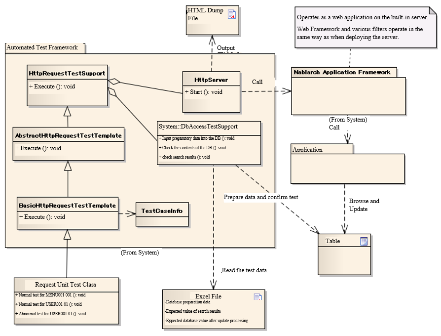
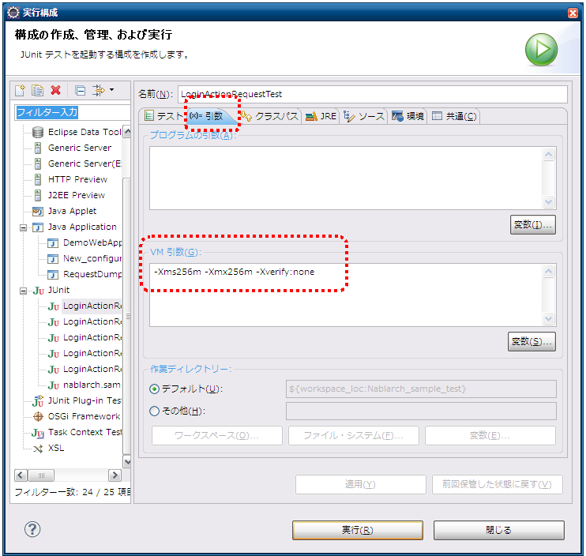
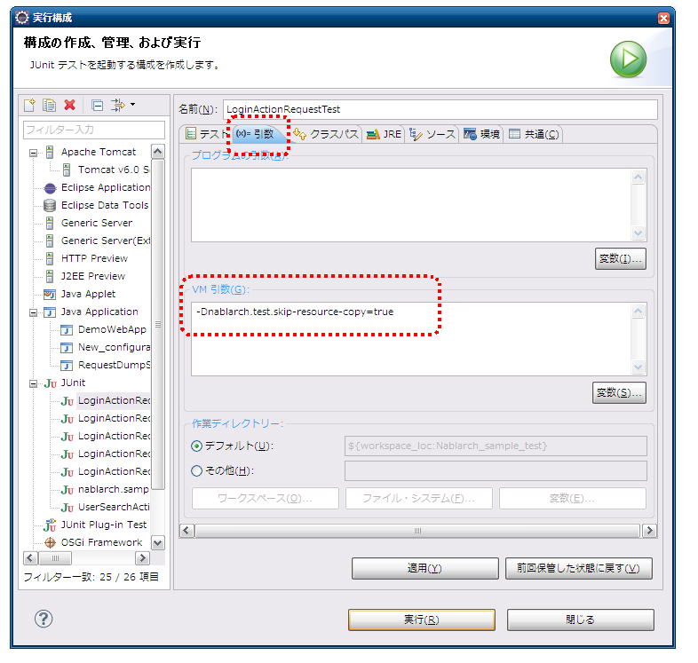

.. _request-util-test-online:

============================================================
Request Unit Test (Web Applications)
============================================================

--------
Summary
--------

In the request unit test (web application), the test is performed using the built-in server.
Here, we will describe how to use the test helper classes of the request unit test and the built-in server.

Overall picture
=================

 
Main Classes, resources
==========================

+----------------------------------+-------------------------------------------------------+-------------------------------------------+
|Name                              |Role                                                   | Creation unit                             |
+==================================+=======================================================+===========================================+
|Test class                        |Implement the test logic.                              |Create one per class (Action) to be tested.|
+----------------------------------+-------------------------------------------------------+-------------------------------------------+
|Test data (Excel file)            |Describe test data such as preparation data,           |Create one per test class                  |
|                                  |expected results, HTTP parameters, etc.                |                                           |
|                                  |to be stored in a table.                               |                                           |
+----------------------------------+-------------------------------------------------------+-------------------------------------------+
|Class to be tested (Action)       |Class to be tested (includes each class that           | Create one class per subfunction          |
|                                  |implements business logic after Action)                |                                           |
+----------------------------------+-------------------------------------------------------+-------------------------------------------+
|DbAccessTestSupport               |Provides the necessary functions for testing using     | \-                                        |
|                                  |the database, such as preparation data input.          |                                           |
|                                  |                                                       |                                           |
+----------------------------------+-------------------------------------------------------+-------------------------------------------+
|HttpServer                        |Built-in server. Operates as a servlet container       | \-                                        |
|                                  |having the function to output HTTP response to a file. |                                           |
+----------------------------------+-------------------------------------------------------+-------------------------------------------+
|HttpRequestTestSupport            |Provides various asserts that are required for starting| \-                                        |
|                                  |the built-in server and for the request unit test.     |                                           |
+----------------------------------+-------------------------------------------------------+-------------------------------------------+
|AbstractHttpReqestTestSupport |br||Class for templating the request unit test.            | \-                                        |
|BasicHttpReqestTestSupport        |Standardizes the test source and test data             |                                           |
|                                  |of the request unit test.                              |                                           |
+----------------------------------+-------------------------------------------------------+-------------------------------------------+
|TestCaseInfo                      |Class that stores test case information defined        |                                           |
|                                  |in a data sheet.                                       |                                           |
+----------------------------------+-------------------------------------------------------+-------------------------------------------+

All of the above classes, including the built-in server, run on the same JVM.
Therefore, server-side objects such as requests and sessions can be processed.

Prerequisites
================

The request unit test where an HTML dump is output using the built-in server,
is for a thin client web application with one request-one screen transition.
In the case of an application that uses Ajax or rich client,
you can't use HTML dump to check the layout.

.. tip::

 In this document, though JSP is used for View technology,
 if the entire screen is rendered on a servlet container,
 then View technologies other than JSP can be used to output HTML dump.

-----------
Structure
-----------

BasicHttpRequestTestTemplate
=========================================

Superclass of each test class.
By using this class, the test source and test data of the request unit test can be standardized,
and the amount of test source to be described can be greatly reduced.

For the specific usage method, refer to :doc:`../05_UnitTestGuide/02_RequestUnitTest/index`.

AbstractHttpRequestTestTemplate
======================================

Not used directly by the application programmers. This is used to extend the automated testing framework when you want to change the way you write test data.\

TestCaseInfo
============

Class that stores test case information defined in a data sheet. If you want to change the way you write test data, inherit this class and the AbstractionHttpRequestTestTemplate described above.

HttpRequestTestSupport
======================

Superclass provided for the request unit test. Provides methods for the request unit test.

Database related functions
--------------------------

The functions related to the database are implemented by delegating to the DbAccessTestSupport class.
For more information, see :doc:`02_DbAccessTest`.

However, the following methods in DbAccessTestSupport are not required for the request unit test,
and are not delegated deliberately so as not to mislead application programmers.

* public void beginTransactions()
* public void commitTransactions()
* public void endTransactions()
* public void setThreadContextValues(String sheetName, String id)

Advance preparation assistance function
----------------------------------------

To send a request to the built-in server, instances of HttpRequest and ExecutionContext are required.
In HttpRequestTestSupport class, a method is provided by which these objects can be easily created.

HttpRequest
~~~~~~~~~~~

.. code-block:: java

  HttpRequest createHttpRequest(String requestUri, Map<String, String[]> params)

The following values are passed as arguments.

* Request URI to be tested
* Request parameters acquired above

In this method, an HTTPRequest instance is created based on the received request URI and request parameters,
and the HTTP method is set to POST before returning.
To configure data other than request parameters and URI to HttpRequest,
configured with respect to an instance acquired by calling this method.

ExecutionContext
~~~~~~~~~~~~~~~~

Create an ExecutionContext instance.

.. code-block:: java

  ExecutionContext createExecutionContext(String userId)

The user ID is specified in the argument.The specified user ID is stored in the session.
By doing so, you are logged in with that user ID.\

.. _how_to_set_token_in_request_unit_test:

Token issuance
~~~~~~~~~~~~~~~

In order to test a URI with duplicate form submission protection,
it is necessary to issue a token and set it in the session before executing the test.
By calling the following method in HttpRequestTestSupport,
the token will be issued and stored in the session.

.. code-block:: java

 void setValidToken(HttpRequest request, ExecutionContext context)

To control whether or not to set a token for test data when a request unit is executed,
use the following method.

.. code-block:: java

 void setToken(HttpRequest request, ExecutionContext context, boolean valid)

If the third argument is boolean and true, the method works in the same way as setValidToken above.
If the third argument is false, the token information is removed from the session. By using the method as follows,
the need to write the branching process for whether or not to set a token in the test class, is eliminated.

 
.. code-block:: java

     // [Description] Assumed to be acquired from the test data.
     String isTokenValid; 

     // [Description] The token is configured, if true.
     setToken(req, ctx, Boolean.parseBoolean(isTokenValid)));

Execution
=========

By calling the following method in HttpRequestTestSupport,
the built-in server is started and the request is sent.

.. code-block:: java

 HttpResponse execute(String caseName, HttpRequest req, ExecutionContext ctx) 

The following values are passed as arguments.

* Test case description
* HttpRequest
* ExectionContext

The test case description is used for the file name at the time of HTML dump output.
For more information, see
:ref:`dump-dir-label`.

Initializing the system repository
----------------------------------

Inside the execute method, the system repository is reinitialized.
This allows continuous execution without separating the settings between class unit test and request unit test.

* Taking backup of the state of the current system repository
* Reinitializing the system repository using the component configuration file of the web application to be tested
* The backed up system repository is restored when the execute method ends

Refer to
:ref:`howToConfigureRequestUnitTestEnv`
for configuration related to the web application to be tested.

Confirmation of results
========================

Message
----------

Check that the message stored in the application exception is as expected,
by calling the following method in HttpRequestTestSupport.

.. code-block:: java

   
  void assertApplicationMessageId(String expectedCommaSeparated, ExecutionContext actual);

The following values are passed as arguments.

* Expected message (if there are more than one, specify by separating with a comma).
* Previously created ExecutionContext

If no exception is raised, or if an exception other than an application exception is raised,
the assertion fails.

.. tip::
 Since the comparison of message IDs is done after sorting the IDs,
 there is no need to worry about the order when describing the test data.

HTML dump output
================

.. _dump-dir-label:

HTML dump output directory
--------------------------

When the test is run, the tmp/html_dump directory is created in the root directory of the project for testing.
A directory with the same name is created for each test class under that directory,
and an HTML dump file with the same name as the description of the test case executed using the test class, is output.

In addition, since the HTML resources (resources such as style sheets and images) referenced by the HTML dump file are also output in this directory,
you can refer to HTML in the same way in any environment by saving this directory.

* If the html_dump directory already exists, then the directory is backed up with the name html_dump_bk.

.. image:: ./_images/htmlDumpDir.png

.. _howToConfigureRequestUnitTestEnv:

------------------------------
Various configuration values
------------------------------

Setting values that depend on the environment settings can be changed in the component configuration file.
The items that can be configured are shown below.

Configuration item list of component configuration file
========================================================

+----------------------------+---------------------------------------------------------------------------------------------------+-------------------------------------------------------+
| Configuration item name    | Description                                                                                       | Default values                                        |
+============================+===================================================================================================+=======================================================+
| htmlDumpDir                | Specifies the directory to output the HTML dump file.                                             | ./tmp/html_dump                                       |
+----------------------------+---------------------------------------------------------------------------------------------------+-------------------------------------------------------+
| webBaseDir                 | Root directory of the web application\ [#]_\                                                      | ../main/web                                           |
+----------------------------+---------------------------------------------------------------------------------------------------+-------------------------------------------------------+
| xmlComponentFile           | Component configuration file to be used when request unit test is executed\ [#]_\                 | (None)                                                |
+----------------------------+---------------------------------------------------------------------------------------------------+-------------------------------------------------------+
| userIdSessionKey           | Session key to store the user ID during login                                                     | user.id                                               |
+----------------------------+---------------------------------------------------------------------------------------------------+-------------------------------------------------------+
| exceptionRequestVarKey     | Key of the request scope where the ApplicationException is stored.                                | nablarch_application_error                            |
+----------------------------+---------------------------------------------------------------------------------------------------+-------------------------------------------------------+
| dumpFileExtension          | Dump file extension                                                                               | html                                                  |
+----------------------------+---------------------------------------------------------------------------------------------------+-------------------------------------------------------+
| httpHeader                 | Value stored as HTTP request header in HttpRequest                                                |Content-Type : application/x-www-form-urlencoded       |
|                            |                                                                                                   |                                                       |
|                            |                                                                                                   |Accept-Language : ja JP                                |
|                            |                                                                                                   |                                                       |
+----------------------------+---------------------------------------------------------------------------------------------------+-------------------------------------------------------+
| sessionInfo                | Value stored in the session                                                                       |(None)                                                 |
+----------------------------+---------------------------------------------------------------------------------------------------+-------------------------------------------------------+
| htmlResourcesExtensionList | Extension of HTML resource copied to the dump directory                                           | css, jpg, js                                          |
+----------------------------+---------------------------------------------------------------------------------------------------+-------------------------------------------------------+
| jsTestResourceDir          | The name of the directory to copy the resources used when executing the javascript automated test.| ../test/web                                           |
+----------------------------+---------------------------------------------------------------------------------------------------+-------------------------------------------------------+
| backup                     | Dump directory backup On/Off                                                                      | true                                                  |
+----------------------------+---------------------------------------------------------------------------------------------------+-------------------------------------------------------+
| htmlResourcesCharset       | Character code of CSS file (style sheet)                                                          | UTF-8                                                 |
+----------------------------+---------------------------------------------------------------------------------------------------+-------------------------------------------------------+
| checkHtml                  | Executing HTML check On/Off                                                                       | true                                                  |
+----------------------------+---------------------------------------------------------------------------------------------------+-------------------------------------------------------+
| htmlChecker                | Specify the object to check HTML. |br|                                                            | An instance of the                                    |
|                            | The object must implement the nablarch.test.tool.htmlcheck.HtmlChecker                            | nablarch.test.tool.htmlcheck.Html4HtmlChecker         |
|                            | interface. |br|                                                                                   | class. |br|                                           |
|                            | For more information, see :ref:`customize_html_check`.                                            | The configuration file configured in                  |
|                            |                                                                                                   | htmlCheckerConfig will be applied to the class.       |
+----------------------------+---------------------------------------------------------------------------------------------------+-------------------------------------------------------+
| htmlCheckerConfig          | HTML check tool configuration file path. |br|                                                     | test/resources/httprequesttest/html-check-config.csv  |
|                            | Valid only if htmlChecker is not configured.                                                      |                                                       |
+----------------------------+---------------------------------------------------------------------------------------------------+-------------------------------------------------------+
| ignoreHtmlResourceDirectory| LIST of directory names in the HTML resources that are not to be copied                           | (None)                                                |
|                            |                                                                                                   |                                                       |
|                            | .. tip::                                                                                          |                                                       |
|                            |  If version control directories (.svn or .git) are configured as not to                           |                                                       |
|                            |  be copied, the performance when copying HTML resources will improve.                             |                                                       |
+----------------------------+---------------------------------------------------------------------------------------------------+-------------------------------------------------------+
| tempDirectory              | JSP compilation destination directory                                                             | Depends on jetty's default behavior                   |
|                            |                                                                                                   |                                                       |
|                            |                                                                                                   | .. tip ::                                             |
|                            |                                                                                                   |  In the default behavior of jetty, The default        |
|                            |                                                                                                   |  behavior of jetty is to compile in "/work".          |
|                            |                                                                                                   |  If there is no ". When "/work" does not exist,       |
|                            |                                                                                                   |  the Temp folder (in the case of Windown,             |
|                            |                                                                                                   |  the user's Home directory/Local Settings/Temp)       |
|                            |                                                                                                   |  as the output destination.                           |
+----------------------------+---------------------------------------------------------------------------------------------------+-------------------------------------------------------+
| uploadTmpDirectory         | The directory where the upload files are temporarily stored.                                      | ./tmp                                                 |
|                            |                                                                                                   |                                                       |
|                            | The files to be uploaded, which are prepared at the time of testing,                              |                                                       |
|                            | are processed after being copied to this directory.                                               |                                                       |
|                            | Thus, even if files are moved by an action,                                                       |                                                       |
|                            | it is only the files under this directory that are moved,                                         |                                                       |
|                            | and the physical files can be prevented from being moved.                                         |                                                       |
|                            |                                                                                                   |                                                       |
+----------------------------+---------------------------------------------------------------------------------------------------+-------------------------------------------------------+
|dumpVariableItem            | Sets whether or not to output the variable items                                                  |false                                                  |
|                            | when the HTML dump file is output.                                                                |                                                       |
|                            | Here, the variable items are of the following two types:                                          |                                                       |
|                            |                                                                                                   |                                                       |
|                            | * JSESSIONID                                                                                      |                                                       |
|                            | * Token for duplicate form submission prevention                                                  |                                                       |
|                            |                                                                                                   |                                                       |
|                            | Different values are set for these items for each test execution.                                 |                                                       |
|                            |                                                                                                   |                                                       |
|                            | Set this item to OFF (false) when you want the HTML dump result                                   |                                                       |
|                            | to be the same every time. (If you want to check that the result                                  |                                                       |
|                            | is not different from the result of the previous execution, etc.)                                 |                                                       |
|                            |                                                                                                   |                                                       |
|                            | Set this item to ON (true) when outputting                                                        |                                                       |
|                            | a variable item as it is to HTML.                                                                 |                                                       |
+----------------------------+---------------------------------------------------------------------------------------------------+-------------------------------------------------------+
 

.. [#] 
  If there is a common web module in project, configure the directory in this property using a comma separator.
  If more than one directory is specified, the resources are read in order from the first one.
  
  An example is shown below.

  .. code-block:: xml

    <component name="httpTestConfiguration" class="nablarch.test.core.http.HttpTestConfiguration">
      <property name="webBaseDir" value="/path/to/web-a/,/path/to/web-common"/>

  In this case, the resources are searched in the order of web-a and web-common.

.. [#]
  If this item is configured, it will be initialized in the component configuration file specified just before the request is sent.
  Normally, there is no need to configure this item.
  Configure this item only when you need to change the configuration between class unit test and request unit test.

       

Example of component configuration file description
=====================================================

Here is a description example of the component configuration file.
In addition to the default values described above, the following values are set in the session (sessionInfo).

+----------------------------+------------------------------+--------------------------------------------------------------------+
| Key                        | Value                        | Description                                                        |
+============================+==============================+====================================================================+
| commonHeaderLoginUserName  | "Request unit test user"     | Login user name to be displayed in the common header area          |
+----------------------------+------------------------------+--------------------------------------------------------------------+
| commonHeaderLoginDate      | "20100914"                   | Login date and time to be displayed in the common header area      |
+----------------------------+------------------------------+--------------------------------------------------------------------+

.. code-block:: xml

    <component name="httpTestConfiguration" class="nablarch.test.core.http.HttpTestConfiguration">
        <property name="htmlDumpDir" value="./tmp/html_dump"/>
        <property name="webBaseDir" value="../main/web"/>
        <property name="xmlComponentFile" value="http-request-test.xml"/>
        <property name="userIdSessionKey" value="user.id"/>
        <property name="httpHeader">
            <map>
                <entry key="Content-Type" value="application/x-www-form-urlencoded"/>
                <entry key="Accept-Language" value="ja JP"/>
            </map>
        </property>
        <property name="sessionInfo">
            <map>
                <entry key="commonHeaderLoginUserName" value="Request unit test user"/>
                <entry key="commonHeaderLoginDate" value="20100914" />
            </map>
        </property>
        <property name="htmlResourcesExtensionList">
            <list>
                <value>css</value>
                <value>jpg</value>
                <value>js</value>
            </list>
        </property>
        <property name="backup" value="true" />
        <property name="htmlResourcesCharset" value="UTF-8" />    
        <property name="ignoreHtmlResourceDirectory">
            <list>
                <value>.svn</value>
            </list>
        </property>
        <property name="tempDirectory" value="webTemp" />
        <property name="htmlCheckerConfig"
          value="test/resources/httprequesttest/html-check-config.csv" />
    </component>

.. _`optional_settings`:  

Other configuration
=====================

If you are developing on a PC that does not have high performance and want to improve the execution speed of the request unit test,
you can improve the execution speed by doing the following configuration.

.. tip::
  The configuration is effective for PCs with low performance CPUs such as Pentium4 and Pentinum Dual-Core.
  On the contrary, for machines with newer CPUs, the configuration is not that effective; hence, there is no need to do the configuration unnecessarily.

Specifying JVM options
----------------------

The overhead of heap size expansion can be avoided by setting the same value
for maximum and minimum heap size.

 :strong:`-Xms256m -Xmx256m`

In addition, the execution speed is improved by omitting the verification of the class file.

 :strong:`-Xverfiy:none`

How to configure with Eclipse is as shown below.

* Select "Run(実行)" > "Run Configuration(実行構成)" from the menu bar.

* In the "Run Configuration(実行構成)" window, click on the "Arguments(引数)" tab and specify the above options in the "VM Arguments(VM引数)" field.

Also, you can set the default VM arguments with the following method without changing the execution configuration.

* Select "Window(ウィンドウ)" > "Settings(設定)" from the menu bar. In the "Settings(設定)" window that is displayed, select "Installed JREs(インストール済みのJRE)".

* Select the JRE you want to use from the list of installed JREs that is displayed, and click the "Edit(編集)" button.

.. image:: ./_images/installed_jre.png

* Specify the above-mentioned option in the "VM argument(VM引数)" field.

.. image:: ./_images/edit_jre.png

Specifying an alternate JRE
----------------------------

If you are developing with JavaSE5 JDK, then using JavaSE6 JRE only at the time of test execution will improve
the execution speed, especially the start-up speed.

How to configure with Eclipse is as shown below.

* Select "Run(実行)" > "Run Configuration(実行構成)" from the menu bar.

* On the "Execution Configuration(実行構成)" window that is displayed, click the "JRE" tab and select JRE of JavaSE6 in the "Alternate JRE(代替JRE)".

.. image:: ./_images/alternate_jre.png

.. tip::
  To configure this setting, you need to install the JavaSE6 JDK or JRE in advance and register it as "Installed JRE(インストール済みのJRE)" in Eclipse.

Suppression of HTML resource copying
-------------------------------------

If the following system properties are specified when executing a request unit, HTML resource copying can be suppressed at the time of :ref:`HTML dump output<dump-dir-label>`.

 :strong:`-Dnablarch.test.skip-resource-copy=true`

If you do not edit static HTML resources such as CSS or image files frequently,
you can set this system property because you don't need to copy
the HTML resources every time a test is executed.

.. important::
   When this system property is specified, the HTML resources are not copied.
   Therefore, even if HTML resources such as CSS are edited, it is not reflected in the :ref:`HTML dump output<dump-dir-label>`.

.. tip::
   If the HTML resource directory does not exist, the HTML resources will be copied
   regardless of whether this system property is set or not.

How to configure with Eclipse is as shown below.

* Select "Run(実行)" > "Run Configuration(実行構成)" from the menu bar.

* In the "Run Configuration(実行構成)" window, click on the "Arguments(引数)" tab and specify the above options in the "VM Arguments(VM引数)" field.

.. |br| raw:: html

   
