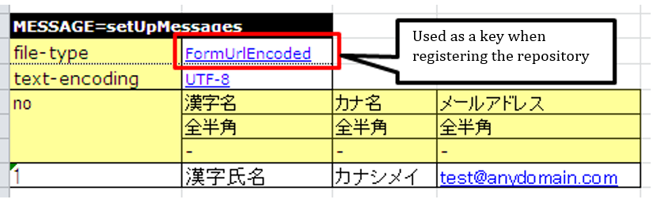
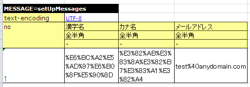

==================================
 How to Use Purpose-specific APIs
==================================

This section describes how to use purpose-specific APIs.

* :ref:`how_to_get_data_from_excel`
* :ref:`how_to_run_the_same_test`
* :ref:`tips_groupId`
* :ref:`how_to_fix_date`
* :ref:`how_to_numbering_sequence`
* :ref:`using_ThreadContext`
* :ref:`using_TestDataParser`
* :ref:`using_junit_annotation`
* :ref:`using_transactions`
* :ref:`using_ohter_class`
* :ref:`how_to_assert_property_from_excel`
* :ref:`tips_test_data`
* :ref:`how_to_express_empty_line`
* :ref:`how_to_change_master_data`
* :ref:`how_to_change_test_data_dir`
* :ref:`how_to_convert_test_data`

.. _how_to_get_data_from_excel:

---------------------------------------------------------------------------------------------
To acquire input parameters and expected values for return values, etc. from an Excel file
---------------------------------------------------------------------------------------------

It is possible to describe the arguments when you call a method of the class to be tested or return values of the method in an Excel file.
The described data can be acquired in List-Map format (List<Map<String, String>> format).

When acquiring data in this format, the data type LIST_MAP is used.
 LIST_MAP=<SETUP_TABLE[case_001]=EMPLOYEE_TABLE that is unique in the sheet (any string)

The second row of data is interpreted as a Map Key.
After the third row of data is interpreted as a Map Value.

Data can be acquired from an Excel file in Map or List-Map format using the following methods:
Specify sheet name in the first argument, and ID in the second argument.

 * ``TestSupport#getListMap(String sheetName, String id)``
 * ``DbAccessTestSupport#getListMap(String sheetName, String id)``

Example of test source code implementation
===========================================

 .. code-block:: java

    public class EmployeeComponentTest extends DbAccessTestSupport {

        // ＜Middle is omitted＞
        public void testGetName() {
           // Acquire data from Excel file
           List<Map<String, String>> parameters = getListMap("testGetName", "parameters");
           Map<String, String>> param = parameters.get(0);

           // Acquire arguments and expectations
           String empNo = parameter.get("empNo");
           String expected = parameter.get("expected");

           // Invoke a test method
           EmployeeComponent target = new EmployeeComponent();
           String actual = target.getName(empNo);

           // Confirmation of results
           assertEquals(expected, actual);

           // ＜Rest is omitted＞
        }

Example of Excel file description
===================================

LIST_MAP=parameters

============ ==============
empNo        expected
============ ==============
CHAR(4)       Yamada Taro
Yamada Taro   Ichiro Suzuki
============ ==============

The objects that can be acquired in the above table are equivalent to the list that can be fetched by the following code.

 .. code-block:: java

  List<Map<String, String>> list = new ArrayList<Map<String, String>>();
  Map<String, String> first = new HashMap<String, String>();
  first.put("empNo","CHAR(4)");
  first.put("expected", "Yamada Taro");
  list.add(first);
  Map<String, String> second = new HashMap<String, String>();
  second.put("empNo","Yamada Taro");
  map.put("expected", "Suzuki Ichiro");
  list.add(second);

.. _how_to_run_the_same_test:

----------------------------------------------------------
To execute the same test method with different test data
----------------------------------------------------------

If you want to execute the same test method with different test data, use a loop to run the test with the above-mentioned List-Map acquiring method.
This allows you to increase the data variation simply by adding Excel data.

In the following example, multiple tests are executed using a single method using the above-mentioned List-Map format.

Example of test source code implementation
===========================================

 .. code-block:: java

    public class EmployeeComponentTest extends DbAccessTestSupport {

        // ＜Middle is omitted＞
        public void testSelectByPk() {
           // Preparation data input
           setUpDb("testSelectByPk");

           // Acquire data from Excel file
           List<Map<String, String>> parameters = getListMap("testGetName", "parameters");

           for (Map<String, String> param : parameters) {
               // Acquire arguments and expectations
               String empNo = parameter.get("empNo");
               String expectedDataId = parameter.get("expectedDataId");

               // Invoke a test method
               EmployeeComponent target = new EmployeeComponent();
               SqlResultSet actual = target.selectByPk(empNo);

               // Confirmation of results
               assertSqlResultSetEquals("testSelectByPk", expectedDataId, actual);
            }
        }

Example of Excel file description
===================================

// Data to loop

LIST_MAP=parameters

=========== =================
empNo        expectedDataId
=========== =================
CHAR(4)       expected01
Yamada Taro   expected02
=========== =================

// Database preparation data

SETUP_TABLE=EMPLOYEE

=========== ==============
NO            NAME
=========== ==============
CHAR(4)      Yamada Taro
Yamada Taro  Ichiro Suzuki
=========== ==============

// Expected data 1

LIST_MAP=expected01

=========== ==============
NO            NAME
=========== ==============
CHAR(4)      Yamada Taro
=========== ==============

// Expected data 2

LIST_MAP=expected02

=========== ==============
NO            NAME
=========== ==============
CHAR(4)      Yamada Taro
=========== ==============

.. important::
  To test the update process, call the setUpDb method in a loop.
  If this is not done, then the success or failure of the test would depend on the order of the data.

.. _tips_groupId:

--------------------------------------------------------------
To describe the data of multiple test cases on a single sheet
--------------------------------------------------------------

If there are many test cases for a single test method to be tested,
then there is a concern that writing one test case per sheet will increase the number of sheets, thereby decreasing maintainability.

Assigning information (Group SETUP_TABLE[case_001]=EMPLOYEE_TABLE) for grouping of table data allows the data of multiple test cases to be included on a single sheet.

The supported data type is as follows.

* EXPECTED_TABLE
* SETUP_TABLE

The format is as follows.

 Data type[Group SETUP_TABLE[case_001]=EMPLOYEE_TABLE] = Table <Omitted>

For example, describe as follows when putting the data of two types of test cases (case_001, case_002) together.

In the test class, the argument Group ID is passed to the overload method with the same name as the above-mentioned API.
This allows only the data of the specified Group ID to be processed.

Example of test source code implementation
===========================================

 .. code-block:: java

    // Registering data in DB (only the data with Group ID "case_001" will be registered)
    setUpDb("testUpdate", "case_001");

    // Confirmation of results (only the data with Group ID "case_001" will be considered for assertion)
    assertTableEquals("Confirmation of database results", "testUpdate", "case_001");

Example of Excel file description
===================================

// Case 001: Change the department of employees.

SETUP_TABLE[case_001]=EMPLOYEE_TABLE

=========== =============== ===========
ID          EMP_NAME        DEPT_CODE
=========== =============== ===========
 // CHAR(5)  VARCHAR(64)     CHAR(4)
      00001  Yamada Taro        0001
      00002  Tanaka Ichiro      0002
=========== =============== ===========
                    
                    
EXPECTED_TABLE[case_001]=EMPLOYEE_TABLE

=========== =============== =========== ========
ID          EMP_NAME        DEPT_CODE
=========== =============== =========== ========
 // CHAR(5)  VARCHAR(64)     CHAR(4)
      00001  Yamada Taro        0001
      00002  Tanaka Ichiro      0010    //Update
=========== =============== =========== ========

//Case 002: Change the name of employees.
                    
SETUP_TABLE[case_002]=EMPLOYEE_TABLE

=========== =============== ===========
ID           EMP_NAME       DEPT_CODE
=========== =============== ===========
 // CHAR(5)  VARCHAR(64)     CHAR(4)
      00001  Yamada Taro         0001
      00002  Tanaka Ichiro       0002
=========== =============== ===========

                    
EXPECTED_TABLE[case_002]=EMPLOYEE_TABLE 

=========== =============== =========== =========
ID          EMP_NAME        DEPT_CODE
=========== =============== =========== =========
 // CHAR(5)  VARCHAR(64)      CHAR(4)
      00001  Satou Taro         0001    //Update
      00002  Tanaka Ichiro      0002
=========== =============== =========== =========

Note
========

When describing data with multiple Group IDs, the data should be described in groups based on the Group IDs, same as :ref:`auto-test-framework_multi-datatype`.
If the data is not described in groups based on the Group IDs, then reading of the data is aborted in the middle and the test is not executed correctly.

.. _how_to_fix_date:

---------------------------------------------------------
To fix the system date and time to a value of your choice
---------------------------------------------------------
In the case of items such as registration date and time, or update date and time, for which system date is set, it is not possible to check with an automated test that the set value is correct since the expected result changes depending on the date when the test is routinely executed.
Therefore, this framework provides a function to configure a fixed value for the system date.By using this function, it is possible to check with an automated test that the set value is correct, even for items having system date set.

In the Nablarch Application Framework, the implementation class of the SystemTimeProvider interface provides the system date and time. By replacing this implementation class with a testing class that returns a fixed value, it is possible to return the system date and time of your choice.

Configuration file example
===========================

In the component configuration file, specify FixedSystemTimeProvider at the place where implementation class
of the SystemTimeProvider interface is specified, and configure the date and time of your choice as its property.
For example, configure as follows when the system date and time is September 14, 2010 12:34:56.

.. code-block:: xml

  <component name="systemTimeProvider"
      class="nablarch.test.FixedSystemTimeProvider">
    <property name="fixedDate" value="20100913123456" />
  </component>

    

+-----------------------+--------------------------------------------------------------------------------+
|property name          |Settings                                                                        |
+=======================+================================================================================+
|fixedDate              |Specify the date and time as a string that matches one of the following formats:|
|                       | * yyyyMMddHHmmss (12 digits)                                                   |
|                       | * yyyyMMddHHmmssSSS (15 digits)                                                |
+-----------------------+--------------------------------------------------------------------------------+
  
.. code-block:: java 
     
     // Acquire system date and time
     SystemTimeProvider provider = (SystemTimeProvider) SystemRepository.getObject("systemTimeProvider");      
     Date now = provider.getDate();

.. _how_to_numbering_sequence:

--------------------------------------------------------
To test the numbering that uses sequence objects
--------------------------------------------------------
When sequence objects are used for numbering values, it is not possible to set an expected value since the value that will be numbered next cannot be predicted in advance.
Therefore, this framework provides a function to replace the numbering process that uses sequence objects, with table numbering, simply by a change in the configuration file.
By using this function, it is possible to check that the numbering is done correctly.

The procedure is as follows:

 | (1) Set up preparation data in a table.
 | (2) Set the expected values based on the values configured in the table.

Configuration example and use case are shown below.

Configuration file example
===========================
In this example, it is assumed that the sequence object numbering is defined in the configuration file for production, as follows:

 .. code-block:: xml

    <!-- Configuration of numbering that uses sequence objects -->
    <component name="idGenerator" class="nablarch.common.idgenerator.OracleSequenceIdGenerator">
        <property name="idTable">
            <map>
                <entry key="1101" value="SEQ_1"/> <!-- For ID1 numbering -->
                <entry key="1102" value="SEQ_2"/> <!-- For ID2 numbering -->
                <entry key="1103" value="SEQ_3"/> <!-- For ID3 numbering -->
                <entry key="1104" value="SEQ_4"/> <!-- For ID4 numbering -->
            </map>
        </property>
    </component>

In this case, in the configuration file for testing, the above configuration for production is overwritten by the configuration for table numbering.

 .. code-block:: xml

    <!-- Replace numbering configuration that uses sequence objects, with numbering configuration that uses tables -->
    <component name="idGenerator" class="nablarch.common.idgenerator.FastTableIdGenerator">
        <property name="tableName" value="TEST_SBN_TBL"/>
        <property name="idColumnName" value="ID_COL"/>
        <property name="noColumnName" value="NO_COL"/>
        <property name="dbTransactionManager" ref="dbTransactionManager" / >
    </component>

 .. tip :: For more information about setting values for table numbering, see :java:extdoc:`IdGenerator <nablarch.common.idgenerator.IdGenerator>`.

Example of Excel file description
=================================

We will explain based on an example when testing a numbering process where the ID to be numbered is 1101.

 | // Preparation data
 | // Numbering table
 | SETUP_TABLE=TEST_SBN_TBL

 =========== ============
 ID_COL      NO_COL     
 =========== ============
 1101        100
 =========== ============

 .. tip::
  Configure the preparation data in the table for numbering.
  In the preparation data, configure only those records with the ID to be numbered and are within testing scope.

 | // Expected value
 | // Numbering table
 | EXPECTED_TABLE=TEST_SBN_TBL

 =========== ============
 ID_COL      NO_COL     
 =========== ============
 1101        101
 =========== ============

 | // Expected value
 | // Table in which the numbered values are registered (the numbered value is registered in USER_ID.)
 | EXPECTED_TABLE=USER_INFO

 =========== ============ ============
 USER_ID     KANJI_NAME   KANA_NAME   
 =========== ============ ============
 0000000101  Kanji name   Kana name
 =========== ============ ============

 .. tip::
  In this example, it is assumed that the numbering process is done only once in the test.
  Therefore, the expected value is "the value in the preparation data + 1".

.. _using_ThreadContext:

-------------------------------------------------------
To configure user ID, request ID, etc. in ThreadContext
-------------------------------------------------------

In the Nablarch Application Framework, user IDs and request IDs are usually configured in advance in ThreadContext. In the case of automated testing of database access classes, values are not configured in ThreadContext since the class to be tested is invoked directly from the test class without going through the framework.

You can configure the values in ThreadContext by describing the values to be configured in an Excel file and calling the following methods:

  * ``TestSupport#setThreadContextValues(String sheetName, String id)``
  * ``DbAccessTestSupport#setThreadContextValues(String sheetName, String id)``

.. tip::

  In particular, when registering and updating the database using automatically configured items, it is necessary that the request ID and user ID are configured in ThreadContext. These values should be configured to ThreadContext before invoking the class to be tested.

Example of test source code implementation
==========================================

 .. code-block:: java

    public class DbAccessTestSample extends DbAccessTestSupport {
        // ＜Middle is omitted＞
        @Test
        public void testInsert() {
            // Configure the value for ThreadContext (specify the sheet name and ID)
            setThreadContextValues("testSelect", "threadContext");            

           // ＜Rest is omitted＞

Test data description example
=============================

Describe the data as follows in the sheet [testInsert]. (ID is optional)

LIST_MAP=threadContext

=========== ============ =============
USER_ID      REQUEST_ID   LANG
=========== ============ =============
U00001       RS000001     ja_JP
=========== ============ =============

.. _using_TestDataParser:

--------------------------------------------------------------------
To read an Excel file in any directory
--------------------------------------------------------------------
If an Excel file exists in the same directory as the test source code,
it can be read simply by specifying the sheet name, however, if you want to read a file in a different directory,
and the file can be acquired directly by using the TestDataParser implementation class directly.

An example of reading data from the file "Buz.xlsx", which exists under "/foo/bar/" is shown below.

Example of test source code implementation
==========================================

 .. code-block:: java

    TestDataParser parser = (TestDataParser) SystemRepository.getObject("testDataParser");
    List<Map<String, String>> list = parser.getListMap("/foo/bar/Baz.xlsx", "sheet001", "params");

.. _using_junit_annotation:

-----------------------------------------------------------------
To perform common processing before and after executing a test.
-----------------------------------------------------------------

By using the annotations (@Before, @After, @BeforeClass, and @AfterClass) provided in JUnit4,
it is possible to execute common processing before and after executing a test.

Note
========

The following points must be noted when using the above annotations.

Points to be noted when using @BeforeClass and @AfterClass
-----------------------------------------------------------

 * A method with the same name and the same annotations as the superclass must not be created in the subclass.
   If methods having the same name are assigned the same type of annotations, then the method of the superclass is not invoked.

 .. code-block:: java

    public class TestSuper {
        @BeforeClass
        public static void setUpBeforeClass() {
            System.out.println("super");   // Not displayed.
        }
    }

    public class TestSub extends TestSuper {   
                           
        @BeforeClass               
        public static void setUpBeforeClass() {
            // Override the superclass methods
        }                      
                               
        @Test                  
        public void test() {           
            System.out.println("test");    
        }                      
    }                                          

When the above TestSub is executed, “test” will be displayed.

.. _using_transactions:

--------------------------------------------
To use transactions other than the default
--------------------------------------------

When carrying out the unit test of a database access class, invoke the database access class from the test class.
Normally, since transaction control is not performed in the database access class, it is required to control the transaction in the test class.

Since transaction control is a routine process, a mechanism for transaction control is provided in the testing framework.If the transaction name is described in the property file, the testing framework will start the transaction before executing the test method and end the transaction after the test method ends.
This mechanism eliminates the need to explicitly start the transaction before executing a test in individual tests.Also, the transaction is ended without fail.

The procedure to use this function is as follows:
 * •	Inherit DbAccessTestSupport in the test class (This will automatically call the @Before and @After methods of the superclass).

.. _using_ohter_class:

--------------------------------------------------------
To use this framework without inheriting its class
--------------------------------------------------------

Normally, when a test class is created, the superclass provided in this framework can be inherited,
however, there are cases where the superclass of this framework cannot be inherited as it is necessary to inherit other classes, and so on. In such cases, substitution is possible by instantiating the superclass of this framework and delegating the process.

If delegation is used, it is necessary to pass a Class instance of the test class itself to the constructor.
In addition, preprocessing (@Before) and postprocessing (@After) methods need to be called explicitly.

Example of test source code implementation
===========================================

 .. code-block:: java

    public class SampleTest extends AnotherSuperClass {

        /** DbAcces test support */
        private DbAccessTestSupport dbSupport
              = new DbAccessTestSupport(getClass());
    
        /** Preprocessing */
        @Before
        public void setUp() {
            // Launch DbSupport pre-processs
            dbSupport.beginTransactions();
        }
    
        /** Post-processing */
        @After
        public void tearDown() {
            // Launch DbSupport post-process
            dbSupport.endTransactions();
        }

        @Test
        public void test() {
            // Preparation data input to database
            dbSupport.setUpDb("test");

            // ＜Middle is omitted＞
            dbSupport.assertSqlResultSetEquals("test", "id", actual);
        }
    }

.. _how_to_assert_property_from_excel:

-----------------------------------------------------------------------
To validate the properties of a class
-----------------------------------------------------------------------
Verification of properties of the class to be tested can be implemented easily.

How to describe test data is described in the same way as :ref:`how_to_get_data_from_excel`.

The data implies the property name in the second row and property value to be used at the time of verification from the third row onward.

With the following methods, it can be verified that the property value is the same as the data described in an Excel file.
The first argument is the message to be displayed in case of an error, the second is the sheet name, the third is the ID, and the fourth is the class, an array of classes, or a list of classes to be verified.

 * ``HttpRequestTestSupport#assertObjectPropertyEquals(String message, String sheetName, String id, Object actual)``
 * ``HttpRequestTestSupport#assertObjectArrayPropertyEquals(String message, String sheetName, String id, Object[] actual)``
 * ``HttpRequestTestSupport#assertObjectListPropertyEquals(String message, String sheetName, String id, List<?> actual)``

Example of test source code implementation
==========================================

 .. code-block:: java

    public class UserUpdateActionRequestTest extends HttpRequestTestSupport {
        
        @Test
        public void testRW11AC0301Normal() {
            execute("testRW11AC0301Normal", new BasicAdvice() {
                @Override
                public void afterExecute(TestCaseInfo testCaseInfo, 
                        ExecutionContext context) {
                    String message = testCaseInfo.getTestCaseName();
                    String sheetName = testCaseInfo.getSheetName();
    
                    UserForm form = (UserForm) context.getRequestScopedVar("user_form");
                    UsersEntity users = form.getUsers();
                    
                    // Validate the properties kanjiName, kanaName, and mailAddress of users.
                    assertObjectPropertyEquals(message, sheetName, "expectedUsers", users);
                }
            }
        }
        
Example of Excel file description
=================================

LIST_MAP=expectedUsers

===========    ===========   ===========================
kanjiName      kanaName      mailAddress
===========    ===========   ===========================
Kanji name      Kana name      test@anydomain.com
===========    ===========   ===========================

.. _tips_test_data:

--------------------------------------------------------
To enter whitespaces, line feeds and nulls in test data
--------------------------------------------------------

 For more information, see :ref:`special_notation_in_cell`.

\

.. _how_to_express_empty_line:

-----------------------------------
To write a blank row in test data
-----------------------------------

You may want to include a blank row in the test data, for example,
when you handle a file of variable length, etc.
Since all blank rows are ignored, you can write an empty string like
``""`` using double quotation marks of :ref:`special_notation_in_cell` to represent a blank row.

In the following example, the second record is a blank row.

**SETUP_VARIABLE=/path/to/file.csv**

 <Omitted>

+------+-------+
|name  |address|
+======+=======+
|Yamada|Tokyo  |
+------+-------+
|""    |       |
+------+-------+
|Tanaka|Osaka  |
+------+-------+

.. tip::
 You do not need to fill in all the cells with ``""`` if you want to represent a blank line.
 Only one cell of the row can be filled in.
 For readability, it is recommended to enter ``""`` in the leftmost cell.
 

.. _how_to_change_master_data:

----------------------------------------------
To conduct a test by changing the master data
----------------------------------------------

 See :doc:`04_MasterDataRestore`.

.. _how_to_change_test_data_dir:

------------------------------------------------------
To change the directory from which test data is read
------------------------------------------------------

In the default configuration, test data is read from under ``test/java``.

To change the test data directory according to the directory configuration of the project,
add the following configuration to the component configuration file .\ [#]_\

============================ ====================================================================================================================================
Key                          Value
============================ ====================================================================================================================================
nablarch.test.resource-root  Relative path from the current directory at the time of test execution  Multiple entries can be separated by semicolons (;) \ [#]_\
============================ ====================================================================================================================================

\

The configuration example shown below.

.. code-block:: bash

 nablarch.test.resource-root=path/to/test-data-dir
 
\

If you want to read test data from multiple directories,
multiple paths can be specified by separating with a semicolon.
The configuration example shown below.

.. code-block:: text

 nablarch.test.resource-root=test/online;test/batch

\

.. [#]
 To change the configuration temporarily, substitution is possible by specifying the VM argument
 at the time of test execution without changing the configuration file.
 
 Example \ ``-Dnablarch.test.resource-root=path/to/test-data-dir``\

\

.. [#] 
 If more than one directory is specified, the test data detected first is read
 if there is test data with the same name.

 
.. _how_to_convert_test_data:

--------------------------------------------------------------------------
To add a routine conversion process for test data in the messaging process
--------------------------------------------------------------------------

The data written in an Excel file for test data is simply converted to a byte sequence by default using the specified encoding.
For example, when URL-encoded data is linked from other systems, it is necessary to write the URL-encoded data in an Excel file,
but it is not practical in terms of readability, maintainability, and work efficiency.

By implementing the following interface and registering it in the system repository, you can add a routine conversion process such as URL encoding.

Interface to be implemented
============================

 * ``nablarch.test.core.file.TestDataConverter`` 

Contents registered in the system repository
===============================================

============================== ===================================================================
Key                            Value
============================== ===================================================================
TestDataConverter_<data type>  Class name of the class that implements the above interface.
                               Data type is the value specified for file-type of the test data.
============================== ===================================================================

Example of system repository registration
==========================================

.. code-block:: xml

  <!-- Test data converter definition -->
  <component name="TestDataConverter_FormUrlEncoded" 
             class="please.change.me.test.core.file.FormUrlEncodedTestDataConverter"/>

Example of Excel file description
==================================

When the converter specified above is implemented to perform URL encoding for each data within the cells,
it is handled in the same way as when the following data is described internally in the test framework.

.. |br| raw:: html

   
