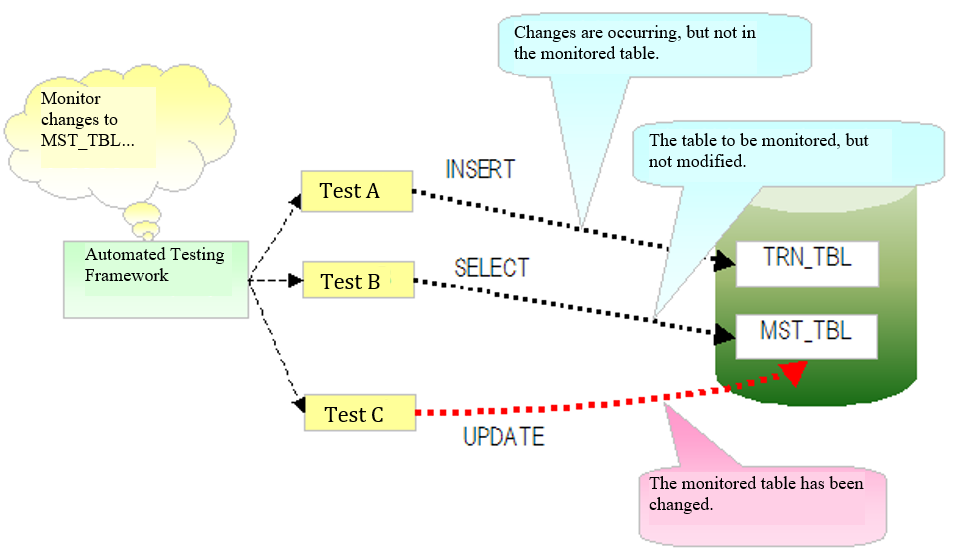
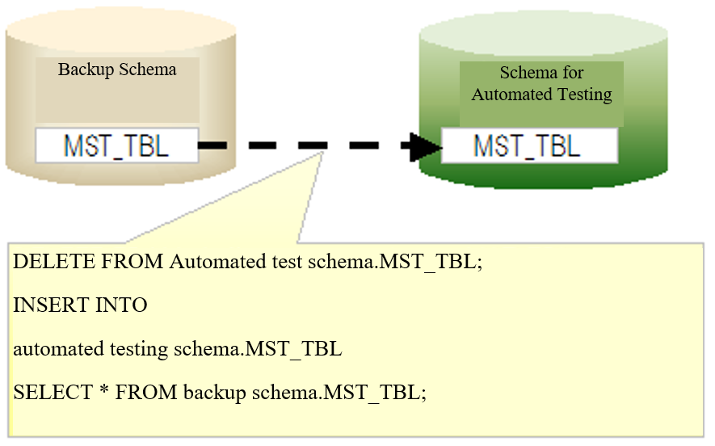

.. _`master_data_backup`:

===============================
 Master Data Recovery Function
===============================

.. contents:: Table of Contents
  :depth: 2
  :local:

Summary
========

In normal cases, the master data is not rewritten when testing.
However, in tests such as the master maintenance function, there are some test cases that cannot be executed without changing the master data.
For example, in the abnormal-type test cases such as those where the data that should have existed did not exist,
it is necessary to delete the records from the master data.

If the master data is changed during the test,
the test of subsequent test classes may fail because the master data is in an unexpected state.

In order to prevent such unintentional test failures due to master data changes,
when the master data is updated during an automated test,
a function is provided to restore the master data to its original state when the test method ends.

Features
========

* You can always test with the correct state of master data, regardless of the order in which the tests are executed.
* Since the master data restoration is performed automatically, there is no need to provide the restoration process and data for restoration in each test class.
* Since the master data is restored in batches for each table from the backup schema, restoration can be done faster as compared to inserting the records one by one.

Required schemas
==================

To use this function, the following two schemas are required.

.. list-table::
  :header-rows: 1
  :class: white-space-normal
  :widths: 2,6

  * - Schema
    - Description

  * - Schema for automated testing
    - The schema used for automated testing.

  * - Backup schema
    - A schema for storing the master data for use in restoration.

Operation image
===============

The automated testing framework fetches a list of table names to be monitored from the component configuration file.
During test execution, the automated testing framework monitors the SQL log
and detects whether an SQL statement was issued to change a monitored table.

If an SQL statement that changes a monitored table was issued, the changed table is restored after the test method ends.
When restoring the table, all the records in the table are temporarily deleted.
Then, all the records are inserted from the table in the backup schema.

.. _`master_data_backup_settings`:

Environment construction
========================

Build an environment as follows and enable the master data restoration function of the automated testing framework.

Create a backup schema and submit the data
-------------------------------------------

Create a schema for master data restoration.
Create the same tables as the schema for automated test in the master data restoration schema, and submit the data.

.. tip::
  It is not necessary to create all the tables in the master data restoration schema.
  Only the tables for which the master data is to be restored need to be created (it does not matter even if other tables exist).

.. _`MasterDataRestore-fk_key`:

When using a table with a foreign key
-----------------------------------------------------------
When restoring data from a table with a foreign key, it is necessary to perform the restoration process by keeping in mind the parent-child relationship.
For this reason, this function uses the JDBC function as the default action to acquire and build the parent-child relationship,
and controls deletion from the child table and insertion from the parent table in that order.

However, in the case of a project with a large number of tables, slow test problem may occur due to the process of building a parent-child relationship based on the JDBC function.
To avoid this problem, a function is provided for performing deletion and insertion from tables based on the description order (refer to :ref:`MasterDataRestore-configuration`) instead of using the JDBC function.

If you want to restore the master data based on the description order, add the following to the configuration file:

.. code-block:: jproperties

  nablarch.suppress-table-sort=true

Describing tables to be monitored, in the component configuration file
------------------------------------------------------------------------

Enumerate the tables to be monitored in the component configuration file for an automated test.

Settings items list
~~~~~~~~~~~~~~~~~~~~

.. list-table::
  :header-rows: 1
  :class: white-space-normal
  :widths: 3,7,2

  * - Configuration item name
    - Description
    - Default values

  * - backupSchema
    - Describe the schema name for master data restoration.
    - No

  * - tablesTobeWatched
    - Enumerate the names of the tables to be monitored, in a list format.
    - No

  * - testEventListeners
    - List of test event listeners.
      By registering the master data restoration class (nablarch.test.core.db.MasterDataRestorer) here,
      master data will be performed at the end of the test method.
    - No

.. _MasterDataRestore-configuration:

Configuration example
~~~~~~~~~~~~~~~~~~~~~

.. code-block:: xml

  <!-- Master data recovery class -->
  <component name="masterDataRestorer"
             class="nablarch.test.core.db.MasterDataRestorer">
    <!-- Backup schema -->
    <property name="backupSchema" value="nablarch_test_master"/>
    <!-- List of monitored tables -->
    <property name="tablesTobeWatched">
      <list>
        <value>MESSAGE</value>
        <value>ID_GENERATE</value>
        <value>BUSINESS_DATE</value>
        <value>PERMISSION_UNIT</value>
        <value>REQUEST</value>
        <value>PERMISSION_UNIT_REQUEST</value>
      </list>
    </property>
  </component>

Example of log output
----------------------

This function detects changes to the master data by monitoring the SQL log.
It is necessary to output a log for this purpose.

app-log.properties
~~~~~~~~~~~~~~~~~~

Specify the class to provide this function in the `sqlLogFormatter` class name.

.. code-block:: none

 sqlLogFormatter.className=nablarch.test.core.db.MasterDataRestorer$SqlLogWatchingFormatter

log.properties
~~~~~~~~~~~~~~

Configure in log.properties so as to output the SQL log at DEBUG level or higher.
In the following example, a dedicated logger (a logger that does not do anything) is configured
to prevent the SQL log from being displayed in the standard output.

.. code-block:: none

 # Logger factory implementation class								 
 loggerFactory.className=nablarch.core.log.basic.BasicLoggerFactory			 
 											 
 #  Log writer name									 
 writerNames=stdout,nop									 
 											 
 # Standard output for debugging									 
 writer.stdout.className=nablarch.core.log.basic.StandardOutputLogWriter			 
 writer.nop.className=nablarch.test.core.log.NopLogWriter   # [Description] A logger that does not do anything	 
 											 
 # Available logger name order								 
 availableLoggersNamesOrder=sql,root							 
 											 
 # For all logger acquisitions, the DEBUG level or higher is output in the standard output.			 
 loggers.root.nameRegex=.*								 
 loggers.root.level=DEBUG								 
 loggers.root.writerNames=stdout								 
 											 
 # The DEBUG level or higher is output for the logger acquisitions with "SQL" specified in the logger name.		 
 loggers.sql.nameRegex=SQL								 
 loggers.sql.level=DEBUG      #  [Description] Should be set to DEBUG level or higher			 
 loggers.sql.writerNames=nop                                                              
