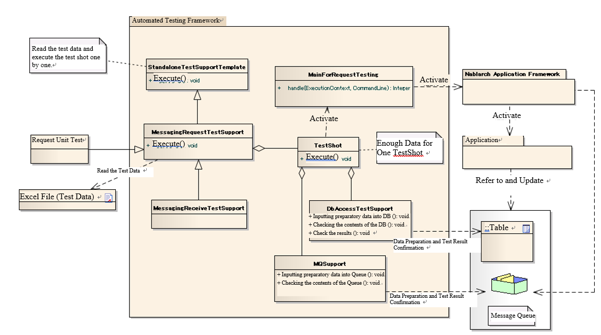

================================================
 Request Unit Test (Receive Messages Process)
================================================

Summary
========

In the request unit test (receive messages process), 
the operation when one request message is received is simulated and tested.

Overall picture
------------------

Main Classes, resources
==============================

+----------------------+---------------------------------------------------------------------------+-------------------------------------------+
|Name                  |Role                                                                       | Creation unit                             |
+======================+===========================================================================+===========================================+
|Request unit\         |Implement the test logic.                                                  |Create one per class (Action) to be tested.|
|Test class            |                                                                           |                                           |
+----------------------+---------------------------------------------------------------------------+-------------------------------------------+
|Excel file\           |Describe test data, such as preparation data to be stored in the table, \  |Create one per test class                  |
|（Test data）         |expected results and input files.                                          |                                           |
+----------------------+---------------------------------------------------------------------------+-------------------------------------------+
|StandaloneTest\       |It provides a test execution environment for batch, messaging, \           | \-                                        |
|SupportTemplate       |and other processes that run outside the container.                        |                                           |
+----------------------+---------------------------------------------------------------------------+-------------------------------------------+
|MessagingRequest\     |Provides test preparation functions and \                                  | \-                                        |
|TestSupport           |various assertions required for request unit tests \                       |                                           |
|                      |of receiving synchronous message process.                                  |                                           |
+----------------------+---------------------------------------------------------------------------+-------------------------------------------+
|MessagingReceive\     |Provides test preparation functions and \                                  | \-                                        |
|TestSupport           |various assertions required for request unit tests                         |                                           |
|                      |of receiving asynchronous message process.                                 |                                           |
+----------------------+---------------------------------------------------------------------------+-------------------------------------------+
|TestShot              |A class that stores information for one test case \                        | \-                                        |
|                      |defined in a datasheet.                                                    |                                           |
+----------------------+---------------------------------------------------------------------------+-------------------------------------------+
|MainForRequestTesting |Main class for testing. Absorb the differences during test execution.      | \-                                        |
+----------------------+---------------------------------------------------------------------------+-------------------------------------------+
|DbAccessTestSupport   |Provides the necessary functions for testing using the database, \         | \-                                        |
|                      |such as DB preparation data input.                                         |                                           |
+----------------------+---------------------------------------------------------------------------+-------------------------------------------+
|MQSupport             |Provides the necessary functions for testing messaging, \                  | \-                                        |
|                      |such as message creation.                                                  |                                           |
+----------------------+---------------------------------------------------------------------------+-------------------------------------------+
|TestDataConvertor     |Interface for editing the test data read from Excel. \                     | \-                                        |
|                      |If necessary, the architect implements the converter                       |                                           |
|                      |for each data type.                                                        |                                           |
+----------------------+---------------------------------------------------------------------------+-------------------------------------------+

Structure
============

StandaloneTestSupportTemplate
---------------------------------
It provides a test execution environment for batch, messaging, and other processes that run outside the container.
Reads test data and executes all test shots (\ `TestShot`_ \ ).

TestShot
--------

Executes by holding information of 1 TestShot. \
The TestShot consists of the following elements:

* Preparation of input data
* Launch the main class
* Confirmation of the output results

Provides common preparation process and result checking functions for testing processes that operate outside of containers, such as batch and messaging processes.

 +----------------------------+----------------------------+
 | Preparation process        | Confirmation of results    |
 +============================+============================+
 | Database setup             | Check for database updates |
 |                            +----------------------------+
 |                            | Check log output results   |
 |                            +----------------------------+
 |                            | Confirm the status code    |
 +----------------------------+----------------------------+

Since the input data preparation and result confirmation logic is different for each batch and various messaging processes, \
it can be customized according to the architecture.

MessagingRequestTestSupport
---------------------------

A superclass for testing the receiving synchronous message process. \
The application programmer creates a test class by inheriting this class.

This class adds the following functions to the preparation process and result confirmation provided by \ `TestShot`_ \.

 +----------------------------+---------------------------------------------+
 | Preparation process        |Confirmation of results                      |
 +============================+=============================================+
 |Prepare the request message |Confirm the contents of the response message |
 +----------------------------+---------------------------------------------+

By using this class, the test source and test data of the request unit test can be standardized, \
and description of test source can be significantly reduced.

For the specific usage method, refer to \ :doc:`../05_UnitTestGuide/02_RequestUnitTest/real`\ .

.. tip::
  This class reads the component configuration file on the main side to PUT the input data into the queue.
  \ ``nablarch.fw.messaging.FwHeaderDefinition``\ implementation class must be registered under the name \ ``fwHeaderDefinition``\ . 
  To use a different name, the FwHeaderDefinition component name used by this class can be changed by overriding getFwHeaderDefinitionName() of this class.

MessagingReceiveTestSupport
---------------------------

A superclass for testing response-free asynchronous message process. \
The application programmer creates a test class by inheriting this class.

This class adds the following functions to the preparation process and result confirmation provided by \ `TestShot`_ \.

 +----------------------------+
 | Preparation process        |
 +============================+
 |Prepare the request message |
 +----------------------------+

By using this class, the test source and test data of the request unit test can be standardized, \
and description of test source can be significantly reduced.

For the specific usage method, refer to \ :doc:`../05_UnitTestGuide/02_RequestUnitTest/delayed_receive`\ .

MainForRequestTesting
---------------------

Main class for request unit test. \ 
The primary differences from the main class for production are as follows.

* Initialize the system repository from the component configuration file of the test.
* Disable the resident function.

MQSupport
-----------

A class that provides operations related to message. 
Primarily, the following functions are provided.

* Create a request message from the test data and PUT to the receive queue.
* Get a response message from the send queue and compare the content with the expected value of the test data.

TestDataConvertor
---------------------

Interface for editing the test data read from Excel. 
If necessary, the architect implements the convertor for each data type, such as XML or JSON.

The implementation class implements the following functions.

* Edits any data read from Excel.
* Dynamically generates the layout definition data to read the edited data.

By implementing this interface, it is possible to add processes such as URL encoding of data written in Japanese to Excel.

The implementation class must be registered in the component configuration file for testing with the key name "TestDataConverter<data type>".

Test data
============

This section describes the test data specific to the messaging process.

Message
----------

For the specific usage method, 
refer to :doc:`../05_UnitTestGuide/02_RequestUnitTest/real`.

.. tip::
 The handling of padding and binary data is the same as \ :ref:`about_fixed_length_file`\ .

