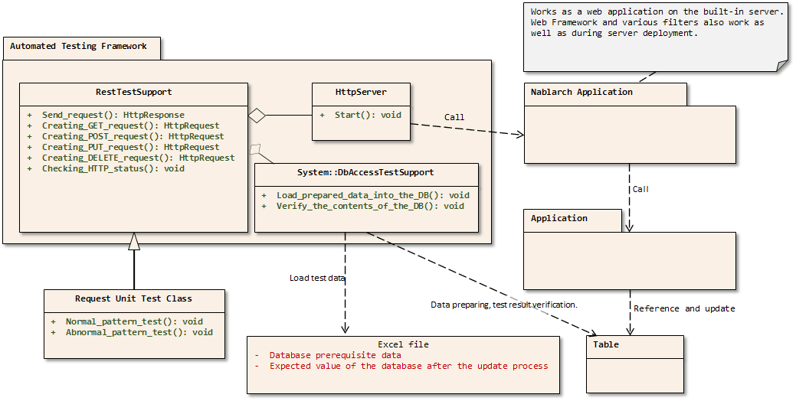

.. _rest_testing_fw:

============================================================
 Request Unit Test (RESTful Web Service)
============================================================

-------
Summary
-------

Request Unit Test (REST) uses the built-in server for testing in the same way as :ref:`Request Unit Test (web application) <request-util-test-online>` .
Only RESTful web services runtime platform requires more modules than the other platforms, so the modules listed in :ref:`Module List <rest_test_modules>` need to be added to the dependencies.

Overall picture
===============

Main Classes, resources
=======================

+----------------------------------+-------------------------------------------------------+-------------------------------------------+
|Name                              |Role                                                   | Creation unit                             |
+==================================+=======================================================+===========================================+
|Test class                        |Implement the test logic.                              |Create one per class (Action) to be tested.|
+----------------------------------+-------------------------------------------------------+-------------------------------------------+
|Test data (Excel file)            |Describe test data such as preparation data,           |Create one per test class                  |
|                                  |expected results, HTTP parameters, etc.                |                                           |
|                                  |to be stored in a table.                               |                                           |
+----------------------------------+-------------------------------------------------------+-------------------------------------------+
|Class to be tested (Action)       |Class to be tested (includes each class that           | Create one class per subfunction          |
|                                  |implements business logic after Action)                |                                           |
+----------------------------------+-------------------------------------------------------+-------------------------------------------+
|DbAccessTestSupport               |Provides the necessary functions for testing using     | \-                                        |
|                                  |the database, such as preparation data input.          |                                           |
|                                  |                                                       |                                           |
+----------------------------------+-------------------------------------------------------+-------------------------------------------+
|HttpServer                        |Built-in server. Operates as a servlet container       | \-                                        |
|                                  |having the function to output HTTP response to a file. |                                           |
+----------------------------------+-------------------------------------------------------+-------------------------------------------+
|RestTestSupport                   |Provides various asserts that are required for starting| \-                                        |
|                                  |the built-in server and for the request unit test.     |                                           |
+----------------------------------+-------------------------------------------------------+-------------------------------------------+

.. _rest_test_modules:

Module list
======================
.. code-block:: xml

    <!--  Testing Framework Mainframe  -->
    <dependency>
      <groupId>com.nablarch.framework</groupId>
      <artifactId>nablarch-testing-rest</artifactId>
      <scope>test</scope>
    </dependency>
    <!--  Default settings used by the testing framework  -->
    <dependency>
      <groupId>com.nablarch.configuration</groupId>
      <artifactId>nablarch-testing-default-configuration</artifactId>
      <scope>test</scope>
    </dependency>
    <!--  Implementation of an built-in server used by the testing framework  -->
    <dependency>
      <groupId>com.nablarch.framework</groupId>
      <artifactId>nablarch-testing-jetty6</artifactId>
      <scope>test</scope>
    </dependency>

.. important::
   ``nablarch-testing-rest`` depends on ``nablarch-testing`` (:ref:`Testing framework <unitTestGuide>`) . 
   Adding the above module to the dependencies allows you to use :ref:`Testing framework <unitTestGuide>`'s API as well.

.. tip::
  If you are using Java11 replace the built-in server as described in :ref:`Change of Jetty module used in automatic test (only for web projects or RESTful web service projects) <setup_java11_jetty9>` .

Configuration
=============

If you created a blank project from an archetype, the testing framework has been configured in ``src/test/resources/unit-test.xml`` .
Load the following configuration file provided by default to add the configuration of the testing framework for RESTful web service.

.. code-block:: xml

    <import file="nablarch/test/rest-request-test.xml"/>

See :ref:`rest-test-configuration` for request unit test settings.

.. tip::
  The above is already configured if you create a blank project for :doc:`RESTful web service <../../../../../application_framework/application_framework/blank_project/setup_blankProject/setup_WebService>` from the Nablarch5u18 and later archetypes. 
  For :doc:`web <../../../../../application_framework/application_framework/blank_project/setup_blankProject/setup_Web>` and :doc:`batch <../../../../../application_framework/application_framework/blank_project/setup_blankProject/setup_NablarchBatch>`  projects, the above must be added.

---------
Structure
---------

.. _rest_test_superclasses:

SimpleRestTestSupport
=========================================

Superclass prepared for the request unit test. Provides methods for the request unit test.
If you don't need database related features, use this class instead of ``RestTestSupport`` as described below.
It has the same features as RestTestSupport below for :ref:`Pre-preparation assistance features<rest_test_helper>`, :ref:`Execution<rest_test_execute>`, and :ref:`Results Check<rest_test_assert>`.

.. tip::

  In case of using RestTestSupport, you need to prepare a ``dbInfo`` or ``testDataParser`` component.
  If you do not need a database dependency, you can use ``SimpleRestTestSupport`` to simplify component definition.

RestTestSupport
=========================================

Superclass prepared for the request unit test. It provides methods for request unit testing.
It inherits from ``SimpleRestTestSupport`` and has database related features.

Database related features
=========================

Database related features is achieved by delegating processing from the ``RestTestSupport`` class to the ``DbAccessTestSupport`` class.
For more information on the ``DbAccessTestSupport`` class, see \ :doc:`02_DbAccessTest`\ .

However, the following methods of ``DbAccessTestSupport`` are not needed for Request Unit Testing (REST).
The following methods in DbAccessTestSupport are not delegated intentionally. Because it avoids misleading application programmers.

* ``public void beginTransactions()``
* ``public void commitTransactions()``
* ``public void endTransactions()``
* ``public void setThreadContextValues(String sheetName, String id)``
* ``public void assertSqlResultSetEquals(String message, String sheetName, String id, SqlResultSet actual)``
* ``public void assertSqlRowEquals(String message, String sheetName, String id, SqlRow actual)``

.. important::

  Database related features are delegated for the convenience of the users. \
  However, in unit testing of RESTful web service, recommend testing that does not rely on the database but checks the data in the system by querying the API exposed as a service,
  rather than testing that checks the database table contents using delegated ``assertTableEquals`` and the like.

.. _rest_test_helper:

Pre-preparation assistance features
===================================

Sending a request to the built-in server requires an instance of ``HttpRequest``.
``RestTestSupport`` class provides five methods to make it easy to create a ``RestMockHttpRequest`` object that extends ``HttpRequest`` for request unit testing.

.. code-block:: java

  RestMockHttpRequest get(String uri)
  RestMockHttpRequest post(String uri)
  RestMockHttpRequest put(String uri)
  RestMockHttpRequest patch(String uri)
  RestMockHttpRequest delete(String uri)

In the argument, the following values are passed on.

* Request URI for testing

These methods create a ``RestMockHttpRequest`` instance based on the received request URI and return it with the HTTP method set according to the method name. \
If you want to set data other than the URI, such as request parameters, set the data for the instance obtained by this method call.

If you want to create an object of ``RestMockHttpRequest`` using an HTTP method other than the above, use the following method.

.. code-block:: java

  RestMockHttpRequest newRequest(String httpMethod, String uri)

Pass the HTTP method in the first argument and the request URI for testing in the second argument.

.. tip::

  ``RestMockHttpRequest`` is implemented to override a method and return an instance of itself to allow you to set parameters and more in a fluent interface.
  See :java:extdoc:`Javadoc <nablarch.fw.web.RestMockHttpRequest>`  for more information on the available methods.

  An example of building a request

  .. code-block:: java

    RestMockHttpRequest request = post("/projects")
                                      .setHeader("Authorization","Bearer token")
                                      .setCookie(cookie);

.. _rest_test_execute:

Execution
=========

By calling the following method in ``RestTestSupport``, \
the built-in server will be started and the request will be sent.

.. code-block:: java

 HttpResponse sendRequest(HttpRequest request)

.. _rest_test_assert:

Result validation
==================

Status code
-----------------

validate that the response HTTP status code is as expected by calling the following method in ``RestTestSupport``.

.. code-block:: java

   
  void assertStatusCode(String message, HttpResponse.Status expected, HttpResponse response);

In the argument, the following values are passed on.

* Assert failure message
* Expected Status (Enum of ``HttpResponse.Status``)
* ``HttpResponse`` instance returned from the built-in server

Assert failure\
if the response status code does not match the expected status code.

Response body
----------------

The framework does not provide a mechanism for response body validation. Use libraries such as `JSONAssert(external site) <https://jsonassert.skyscreamer.org/>`_,
`json-path-assert(external site) <https://github.com/json-path/JsonPath/tree/master/json-path-assert>`_,
or `XMLUnit(external site) <https://github.com/xmlunit/user-guide/wiki>`_ according to the requirements of each project.

.. tip::
  If you have created a \ :doc:`RESTful web service blank project <../../../../../application_framework/application_framework/blank_project/setup_blankProject/setup_WebService>`\,
  the above `JSONAssert (external site) <https://jsonassert.skyscreamer.org/>`_,
  `json-path-assert(external site) <https://github.com/json-path/JsonPath/tree/master/json-path-assert>`_
  and `XMLUnit(external site) <https://github.com/xmlunit/user-guide/wiki>`_ are listed in pom.xml.
  Delete or replace libraries as necessary.

**Supplementary features of response body validation**

In some case of validating a response body, you may want to prepare the expected body as a JSON or XML file.
To assist testing when an external library accepts only a ``String`` as an expectation value argument, such as JSONAssert,
``RestTestSupport`` has a method to read the file and convert it to a ``String``.

.. code-block:: java

  String readTextResource(String fileName)

This method reads a file from a resource in a directory with the same name as the test class with the file name specified in the argument,
and converts it to a ``String`` as follows.

+-------------------------------------+------------------------------------------------------+---------------------------------------------------+
| File type                           | Directory                                            | File name                                         |
+=====================================+======================================================+===================================================+
| Test Class Source File              | <PROJECT_ROOT>/test/java/com/example/                | SampleTest.java                                   |
+-------------------------------------+------------------------------------------------------+---------------------------------------------------+
| Response body's expected value file | <PROJECT_ROOT>/test/resources/com/example/SampleTest | response.json(specified in the argument fileName) |
+-------------------------------------+------------------------------------------------------+---------------------------------------------------+

.. _rest-test-configuration:

----------------------------
Various configuration values
----------------------------

For preference-dependent configuration values, you can change them in the component configuration file.\
The configurable items are listed below.

Component configuration file list of configuration items
========================================================

+----------------------------+-------------------------------------------------------------------------+-------------------------------------------------------+
| items                      | Description                                                             | Default value                                         |
+============================+=========================================================================+=======================================================+
| webBaseDir                 | root directory of your web application\ [#]_\                           | src/main/webapp                                       |
+----------------------------+-------------------------------------------------------------------------+-------------------------------------------------------+
| webFrontControllerKey      | Web front controller repository keys\ [#]_\                             | webFrontController                                    |
+----------------------------+-------------------------------------------------------------------------+-------------------------------------------------------+ 

.. [#] 
  If there is a common web module in the project, specify a comma-separated directory for this property.
  If more than one module is specified, the resources are loaded in order from the head.
  
  Examples are shown below.

  .. code-block:: xml

    <component name="restTestConfiguration" class="nablarch.test.core.http.RestTestConfiguration">
      <property name="webBaseDir" value="/path/to/web-a/,/path/to/web-common"/>

  In this case, the resources are searched for web-a, then web-common, in that order.
       
.. [#]
  May want to register a :ref:`web front controller <web_front_controller>` as a component with a name other than the default "webFrontController",
  such as when the web application runtime platform
  and the web service runtime platform are executed in a single war.
  In such cases, Can control the handlers executed by the built-in server
  by configuring this property with the repository key of the web front controller used by the web service.

  Examples are shown below.

  A component definition in which the web front controller ( ``webFrontController`` ) for the web application runtime platform
  and the web front controller ( ``jaxrsController`` ) for the web service runtime platform are registered.

  .. code-block:: xml

    <!-- Handler queue configuration -->
    <component name="webFrontController" class="nablarch.fw.web.servlet.WebFrontController">
      <property name="handlerQueue">
        <list>
          <component class="nablarch.fw.web.handler.HttpCharacterEncodingHandler"/>
          <component class="nablarch.fw.handler.GlobalErrorHandler"/>
          <component class="nablarch.common.handler.threadcontext.ThreadContextClearHandler"/>
          <component class="nablarch.fw.web.handler.HttpResponseHandler"/>
          .
          .
          .
          (Omitted)
        </list>
      </property>
    </component>

    <component name="jaxrsController" class="nablarch.fw.web.servlet.WebFrontController">
      <property name="handlerQueue">
        <list>
          <component class="nablarch.fw.web.handler.HttpCharacterEncodingHandler"/>
          <component class="nablarch.fw.handler.GlobalErrorHandler"/>
          <component class="nablarch.fw.jaxrs.JaxRsResponseHandler"/>
          .
          .
          .
          (Omitted)
        </list>
      </property>
    </component>

  Using the testing framework for RESTful web services runtime platform with default settings will use the "webFrontController"
  and thus run a web front controller for the web application.
  Can use the web front controller for web services by overriding the settings as follows.

  .. code-block:: xml

    <import file="nablarch/test/rest-request-test.xml"/>
    <!--  Override the default component definition after import. -->
    <component name="restTestConfiguration" class="nablarch.test.core.http.RestTestConfiguration">
      <property name="webFrontControllerKey" value="jaxrsController"/>

