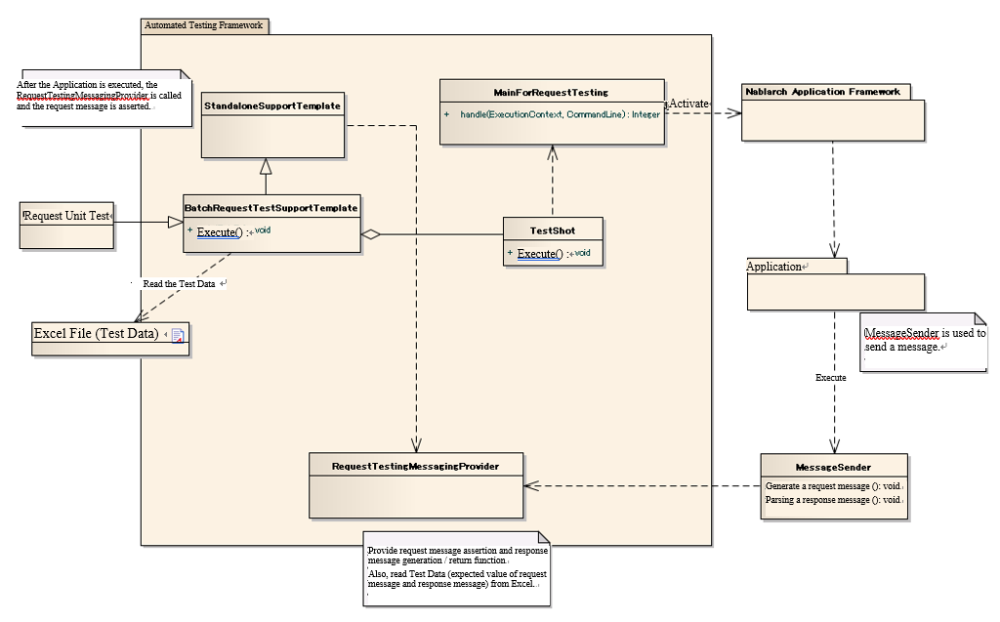

=====================================================================
 Request Unit Test (Sending Synchronous Message Process)
=====================================================================

Summary
========

In the request unit test (sending synchronous message process), one request message is sent to the queue, 
and the behavior when the result is received synchronously is simulated and tested.
    

.. tip:: 
 For an overview of the request unit test, 
 refer to :ref:`message_sendSyncMessage_test`.

Overall picture
------------------

The following is an overview of sending synchronous message performed as a batch process.

.. tip:: 
 When performing a request unit test of the sending synchronous message process, the parent class of the test case should inherit one of the following two classes.

 * StandaloneTestSupportTemplate
 * AbstractHttpRequestTestTemplate

Main Classes, resources
==========================

+----------------------------------------------+------------------------------------------------------------+-------------------------------------------+
|Name                                          |Role                                                        | Creation unit                             |
+==============================================+============================================================+===========================================+
|Request unit\                                 |Implement the test logic.                                   |Create one per class (Action) to be tested.|
|Test class                                    |                                                            |                                           |
+----------------------------------------------+------------------------------------------------------------+-------------------------------------------+
|Excel file \                                  |Describe test data such as expected value of                |Create one per test class                  |
|（Test data）                                 |request message and response message.\                      |                                           |
+----------------------------------------------+------------------------------------------------------------+-------------------------------------------+
|StandaloneTest\                               |After the action is executed,                               | \-                                        |
|SupportTemplate                               |MockMessagingContext is used to assert the request message. |                                           |
+----------------------------------------------+------------------------------------------------------------+-------------------------------------------+
|AbstractHttpRequest\                          |After the action is executed,                               | \-                                        |
|TestTemplate                                  |MockMessagingContext is used to assert the request message. |                                           |
+----------------------------------------------+------------------------------------------------------------+-------------------------------------------+
|MessageSender                                 |The component used for sending synchronous message.\        | \-                                        |
|                                              |                                                            |                                           |
+----------------------------------------------+------------------------------------------------------------+-------------------------------------------+
|RequestTestingMessagingProvider               |Provides a function to assert a request message \           | \-                                        |
|                                              |and a function to generate and return a request message \   |                                           |
|                                              |in the request unit test.                                   |                                           |
+----------------------------------------------+------------------------------------------------------------+-------------------------------------------+
|TestDataConvertor                             |Interface for editing the test data read from Excel. \      | \-                                        |
|                                              |If necessary, the architect implements the converter        |                                           |
|                                              |for each data type.                                         |                                           |
+----------------------------------------------+------------------------------------------------------------+-------------------------------------------+

Structure
============

StandaloneTestSupportTemplate
----------------------------------------

A function to assert the request message using the MockMessagingContext after the action is executed.

When performing a request unit test of the sending synchronous message process, 
it is necessary to use a test case that implements this class or the AbstractHttpRequestTestTemplate according to the process type.

AbstractHttpRequestTestTemplate
---------------------------------------------------

A function to assert the request message using the MockMessagingContext after the action is executed.

When performing a request unit test of the sending synchronous message process, 
it is necessary to use this class or a test case that implements the StandardaloneTestSupportTemplate according to the process type.

RequestTestingMessagingProvider
-------------------------------------------------

This class provides a function to assert the request message and generate/return the response message.

The class also reads the expected value of the request message and the response message written in Excel.

This class provides the following preparation process and result confirmation function.

 +-------------------------------+------------------------------+
 | Preparation process           | Confirmation of results      |
 +===============================+==============================+
 |Generation of response message |Asserting the request message |
 +-------------------------------+------------------------------+

.. tip:: 
 Assertion of request message is not performed each time the request message is sent but is performed collectively after execution of the action.

MessageSender
---------------------------------

The component used in the sending synchronous message process.

Primarily, the following functions are provided.

* Generates a request message from the parameters passed by a caller such as an action.
* Executes MockMessagingContext based on the request message.
* Parses the response message returned from MockMessagingContext.
* Returns the parsed result object to the caller.

TestDataConvertor
-----------------

Interface for editing the test data read from Excel. 
If necessary, the architect implements the convertor for each data type, such as XML or JSON.

The implementation class implements the following functions.

* Edits any data read from Excel.
* Dynamically generates the layout definition data to read the edited data.

By implementing this interface, it is possible to add processes such as URL encoding of data written in Japanese to Excel.

The implementation class must be registered in the component configuration file for testing with the key name "TestDataConverter<data type>".

Test data
============

The following table describes the test data specific to the process of sending synchronous message.

Sending synchronous message process
---------------------------------------

For the basic description, see \ :ref:`send_sync_request_write_test_data`\.

.. tip::
 The handling of padding and binary data is the same as \ :ref:`about_fixed_length_file`\ .

