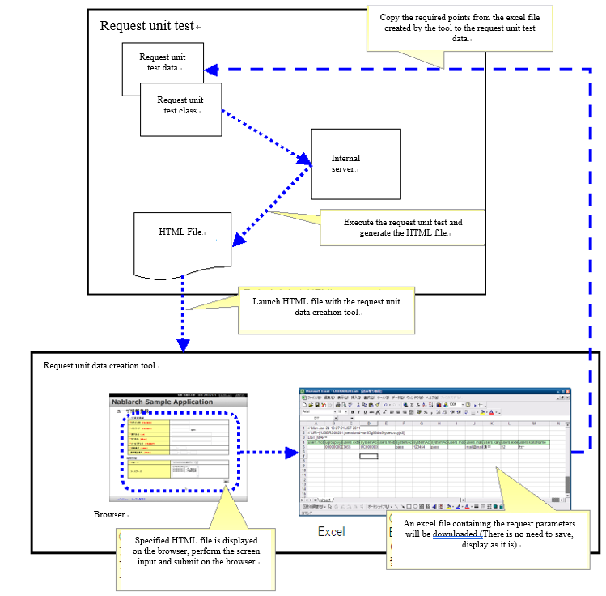

.. _`http_dump_tool`:

======================================
リクエスト単体データ作成ツール
======================================

概要
====

リクエスト単体テスト(ウェブアプリケーション)では、HTMLからのリクエストパラメータにあるキーと値をテストデータとして作成する必要がある\ [*]_ 。
このリクエストパラメータ作成を人手で実施すると、リクエストパラメータ名（form内のname属性）を\
写し間違える恐れがある。特に、登録画面などパラメータ数が多い画面ではその可能性が高くなる。

このような人手によるミスを解消するため、リクエスト単体テストで生成されたHTMLを使用して、\
次画面へのリクエストパラメータを作成できるツールを提供する。

 .. [*]
  リクエストパラメータのテストデータ記述方法については、\ :doc:`../../05_UnitTestGuide/02_RequestUnitTest/index`\ （特に「\  :ref:`request_test_req_params`\ 」の項 ）を参照

特徴
====

本ツールでは、リクエスト単体テストで生成されたHTMLをブラウザで操作することで、
次画面へのリクエストパラメータをExcel形式で取得できるようになっている。
ウェブアプリケーションを操作するような感覚で直感的にテストデータが作成できる。

使用方法
========

下記の図に沿って、本ツールの使用方法を説明する。

前提条件
--------------------

* 開発環境構築ガイドに従って開発環境を構築済みであること。
* :doc:`02_SetUpHttpDumpTool`\ の\ :ref:`http_dump_tool_prerequisite`\ 参照

入力となるHTML生成
--------------------

リクエスト単体テストを実行し、HTMLファイルを生成する。

初期画面表示のリクエスト単体テスト用データだけは、手動で用意する必要がある。
初期画面表示リクエスト（例えば、メニューからの単純な画面遷移）には
リクエストパラメータが含まれていないことがほとんどであるので、
通常は空のリクエストパラメータを作成すればよい。

ツール起動
------------

Eclipse上からHTMLファイルを右クリックし、ツールを起動する。\
（\ :ref:`howToExecuteFromEclipse` を参照）

.. tip::

 Windows上で本ツールを起動するとコマンドプロンプトが現れるが、これはツール内部で使用される内蔵サーバのプロセスである。本ツールを使用する間はこのコマンドプロンプトは実行したままにしておくとよい。ツール起動時に、既にサーバが起動されている場合はサーバ起動がスキップされるので、２回目以降のツール起動が速くなる。誤ってこのコマンドプロンプトを落としてしまっても、次回のツール起動時に自動的に起動されるので問題はない。

データ入力
------------
HTMLファイルがブラウザで起動されるので、ブラウザ上で画面入力を行いサブミットを実行する。

Excelダウンロード
-------------------

サブミットで発生したHTTPリクエストがExcelファイルに記載された状態で
ダウンロードできる。Excelファイルをローカル上に保存する必要はないので、
ブラウザから直接ExcelやOpenOfficeで起動すればよい。

データ編集
------------

ダウンロードしたExcelファイルに、HTTPリクエストパラメータのデータが記載されている。
そのデータをリクエスト単体テストのテストデータにコピーする。

