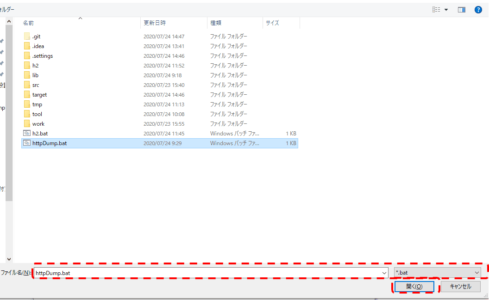

========================================================
Request Unit Data Creation Tool Installation Guide
========================================================

This section describes how to install the :doc:`index`\.

.. _http_dump_tool_prerequisite:

Prerequisites
================

The following prerequisites must be met to use this tool.

* The following tools have been installed.

  * Java
  * Maven

* The project is managed by Maven.
* HTML file must be associated with the browser.
* Browser proxy setting must exclude localhost.

Method of provision
=========================

This tool is provided in the following jar.

* nablarch-testing-XXX.jar
* nablarch-testing-jetty6-XXX.jar (for Java 8 and earlier versions)
* nablarch-testing-jetty9-XXX.jar (for Java 11 and later versions) 

Therefore, make sure that the following descriptions are included in the dependencies element of pom.xml.

.. code-block:: xml

  <dependencies>
    <!-- omit -->
    <dependency>
      <groupId>com.nablarch.framework</groupId>
      <artifactId>nablarch-testing</artifactId>
      <scope>test</scope>
    </dependency>
    <!-- For use with Java 8 or earlier versions -->
    <dependency>
      <groupId>com.nablarch.framework</groupId>
      <artifactId>nablarch-testing-jetty6</artifactId>
      <scope>test</scope>
    </dependency>
    <!-- For use with Java 11 or later versions -->
    <dependency>
      <groupId>com.nablarch.framework</groupId>
      <artifactId>nablarch-testing-jetty9</artifactId>
      <scope>test</scope>
    </dependency>
    <!-- omit -->
  </dependencies>

Execute the following command in the project directory to download the jar file.

.. code-block:: text

  mvn dependency:copy-dependencies -DoutputDirectory=lib

Place the following files in the same directory as project pom.xml.

* :download:`httpDump.bat <download/httpDump.bat>`

Integration with Eclipse
==============================

This tool can be launched from Eclipse with the following settings.

Configuration Screen Startup
---------------------------------

From the toolbar, select Window → Preference. 
Select General → Editors → File Associations from the left pane, 
select * .html from the right pane and click the Add button.

.. image:: ./_image/01_Eclipse_Preference.png
   :scale: 100

 
External program selection
--------------------------------

Select External Program from the radio button and click the Browse button.

.. image:: ./_image/02_Eclipse_EditorSelection.png
   :scale: 100

Select batch file (shell script) for startup
-----------------------------------------------

Select the batch file (httpDump.bat) for Windows, 
and the shell script (httpDump.sh) for Linux.

.. _howToExecuteFromEclipse:

How from launch from HTML file
----------------------------------

You can start the tool by right-clicking the HTML file from Package Explorer of Eclipse and opening the file with httpDump.

.. image:: ./_image/04_Eclipse_OpenWith.png
   :scale: 100

.. |br| raw:: html

   