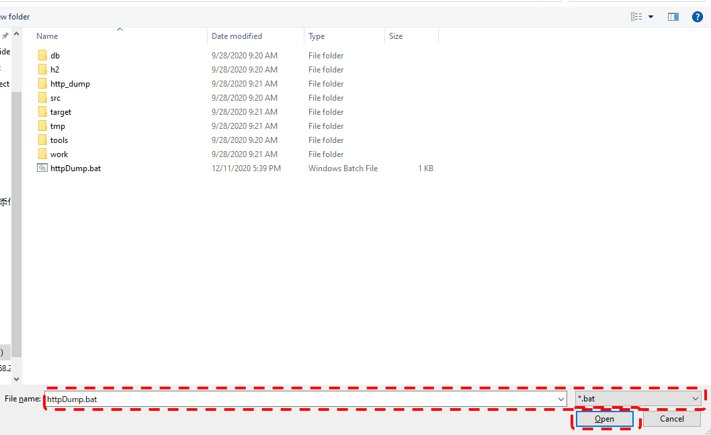

========================================================
Request Unit Data Creation Tool Installation Guide
========================================================

This section describes how to install the :doc:`index`\.

.. _http_dump_tool_prerequisite:

Prerequisites
================

The following prerequisites must be met to use this tool.

* Java command must be included in the path.
* HTML file must be associated with the browser.
* Browser proxy setting must exclude localhost.

Method of provision
=========================

This tool is provided in a package along with Nablarch sample application. 
The tool configuration of this tool is shown below.

 ========================================== ====================================================================================
 File name                                  Description
 ========================================== ====================================================================================
 httpDump.bat                               | Startup batch file (for Windows)
 nablarch-tfw-X.X.jar                       | JAR files of Nablarch Testing Framework (X.X part is the version number)
 poi-X.X.jar                                | JAR files of Apache POI (X.X part is the version number)
 jetty.jar                                  | JAR files of Jetty Server
 jetty-util.jar                             | JAR files of Jetty Utilities
 servlet-api.jar                            | JAR file of Servlet Specification 2.5 API
 ========================================== ====================================================================================

The HttpDump.bat file with the class path configuration to each JAR file is placed in the following path of the sample application.

 .. code-block:: bash

  /test/tool/httpDump.bat

Integration with Eclipse
==============================

This tool can be launched from Eclipse with the following settings.

Configuration Screen Startup
---------------------------------

From the toolbar, select Window → Preference. 
Select General → Editors → File Associations from the left pane, 
select * .html from the right pane and click the Add button.

.. image:: ./_image/01_Eclipse_Preference.png
   :scale: 100

 
External program selection
--------------------------------

Select External Program from the radio button and click the Browse button.

.. image:: ./_image/02_Eclipse_EditorSelection.png
   :scale: 100

Select batch file (shell script) for startup
-----------------------------------------------

Select the batch file (httpDump.bat) for Windows, 
and the shell script (httpDump.sh) for Linux.

.. _howToExecuteFromEclipse:

How from launch from HTML file
----------------------------------

You can start the tool by right-clicking the HTML file from Package Explorer of Eclipse and opening the file with httpDump.

.. image:: ./_image/04_Eclipse_OpenWith.png
   :scale: 100
