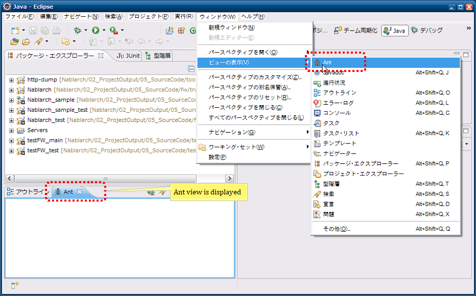
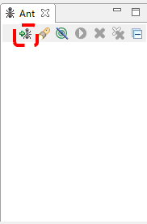
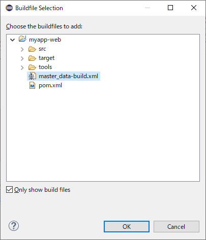
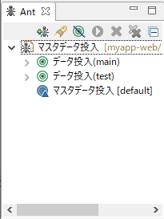

=========================================
マスタデータ投入ツール インストールガイド
=========================================

:doc:`index`\ のインストール方法について説明する。

.. _master_data_setup_prerequisite:

前提事項
========

* Eclipseがインストール済みであること
* テーブルが作成済みであること
* バックアップ用スキーマにテーブルが作成済みであること\ [#]_

.. [#] 
 バックアップ用スキーマおよびそのテーブルの作成については、\
 『\ :doc:`../../06_TestFWGuide/04_MasterDataRestore`\ 』の\ :ref:`master_data_backup_settings`\ を参照。

提供方法
========

本ツールはNablarchのサンプルアプリケーションに同梱して提供する。本ツールのツール構成を下記に示す。

+-----------------------------------------+----------------------------------------+
|ファイル名                               |説明                                    |
+=========================================+========================================+
|master_data-build.properties             |環境設定用プロパティファイル            |
+-----------------------------------------+----------------------------------------+
|master_data-build.xml                    |Antビルドファイル                       |
+-----------------------------------------+----------------------------------------+
|master_data-log.properties               |ログ出力プロパティファイル              |
+-----------------------------------------+----------------------------------------+
|MASTER_DATA.xlsx                         |マスタデータファイル                    |
+-----------------------------------------+----------------------------------------+

プロパティファイルの書き換え
----------------------------

マスタデータ自動復旧機能が使用する、バックアップスキーマ名を設定する。

.. code-block:: bash
 
 # テスト用マスタデータバックアップスキーマ名
 masterdata.test.backup-schema=nablarch_test_master

その他の設定値については、ディレクトリ構造が変わらない限り修正の必要はない。

配置
----

サンプルアプリケーションと同様に、<mainプロジェクト>/tool/db/data直下に配置する。

.. _how_to_setup_ant_view_in_eclipse:

Eclipseとの連携設定
===================

以下の設定をすることでEclipseから本ツールを起動することができる。

Antビュー起動
-------------

ツールバーから、ウィンドウ(Window)→設定(Show View)を選択し、Antビューを開く。

 
ビルドファイル登録
------------------

＋印のアイコンを押下し、ビルドスクリプトを選択する。

Antビルドファイル(master_data-build.xml)を選択する。

Antビューに登録したビルドファイルが表示されることを確認する。

 
