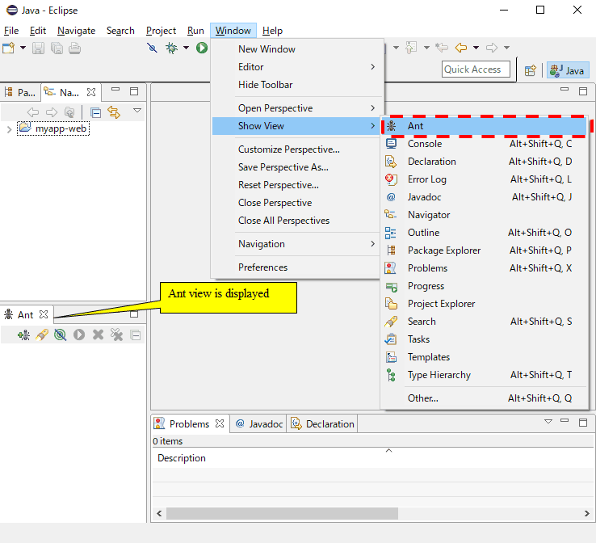

===========================================
Master Data Input Tool Installation Guide
===========================================

This section describes how to install the :doc:`index`\ .

.. _master_data_setup_prerequisite:

Prerequisites
==============

* The following must be installed

  * Eclipse
  * Maven

* Table must be created
* The table is already created in the backup schema\ [#]_

.. [#] 
 For information on creating backup schema and its tables, 
 see \ :ref:`master_data_backup_settings`\  of "\ :doc:`../../06_TestFWGuide/04_MasterDataRestore`\".

Method of provision
========================

This tool is included in nablarch-testing-XXX.jar.

Download a configuration file for launching from the following link.

* :download:`master-data-setup-tool.zip <download/master-data-setup-tool.zip>`

The configuration file included in the above ZIP file is shown below.

+-----------------------------------------+----------------------------------------+
|File name                                |Description                             |
+=========================================+========================================+
|master_data-build.properties             |Configuration property file             |
+-----------------------------------------+----------------------------------------+
|master_data-build.xml                    |Ant build file                          |
+-----------------------------------------+----------------------------------------+
|master_data-log.properties               |Log output property file                |
+-----------------------------------------+----------------------------------------+
|MASTER_DATA.xlsx                         |Master data file                        |
+-----------------------------------------+----------------------------------------+

Execute the following commands before executing this tool.

.. code-block:: text

  mvn compile
  mvn dependency:copy-dependencies -DoutputDirectory=lib

Rewrite a property file
----------------------------

Configure the backup schema name used by the master data automated recovery function.

.. code-block:: bash
 
 # Master data backup schema name for test
 masterdata.test.backup-schema=nablarch_test_master

Other configuration values do not need to be modified as long as the directory structure remains the same.

Placement
------------

Place it directly under <main project>.

.. _how_to_setup_ant_view_in_eclipse:

Integration configuration with Eclipse
==============================================

This tool can be launched from Eclipse with the following settings.

Launch Ant view
--------------------

From the toolbar, select Window(ウィンドウ) → Show View(ビューの表示) to open the Ant view.

 
Build file registration
----------------------------

Click the + icon and select the build script.

.. image:: ./_image/register_build_file.png
   :scale: 100

Select the Ant build file (master_data-build.xml).

.. image:: ./_image/select_build_file.png
   :scale: 100

Confirm that the registered build files are displayed in the Ant view.

 
