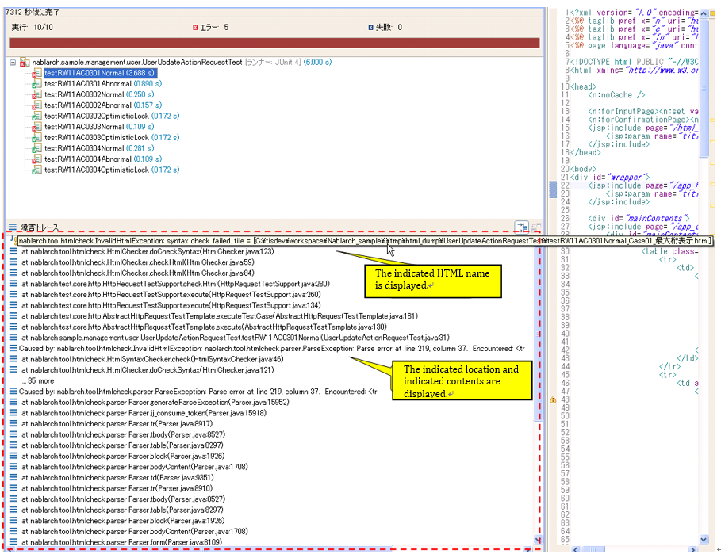

.. _html_check_tool:

======================
HTML Check Tool
======================

Describes the purpose, specifications and usage of the HTML check tool.

Purpose
========

* Prevents the user from seeing a different screen from the intended screen due to syntax errors such as forgetting exit tags.
* Prevents the use of tags that are prohibited by the project conventions.

Specifications
================

The following checks are performed on the HTML file automatically generated by the request unit test, and the test fails if an invalid HTML is detected. 
This tool is available in the Request Unit Test as a standard and is executed when the Request Unit Test is executed.

* By default\ [#]_\ , the syntax of HTML files is checked in accordance with 1 HTML4.01. \ [#]_\
* Check for omissions in the description of the start and end tags. Tags that are defined as optional in HTML4.01 are not allowed to be omitted.
* Check whether the tags and attributes described in the configuration file \ [#]_ \ are used.
* It is not case sensitive. Example: <tr>, <TR>, <Tr>, <tR>
* The boolean attribute can be used. Example: <textarea disabled>
* Omitting quotations in the attribute specification is not allowed. Example: OK: <table align="center"> Not OK: <table align=center>

.. [#] The check contents can be customized by changing the configuration values.

.. [#] There are some exceptions. See the next section, \ `Differences with HTML4.01`_ . 

.. [#]
  The tags and attributes that are deprecated on the  `W3C official website <http://www.w3.org/TR/html401/>`_  (hereinafter abbreviated as "deprecated tags and attributes") are configured by default. 
  By customizing the configuration file, the tags and attributes that should not be used can be changed. (For customization instructions, refer to :ref:`01_custom`.) 

.. tip::

 If two or more "-" appear consecutively in the JavaScript written directly in HTML, the test fails. \
 The following is an implementation example of JavaScript that fails the test and its error messages.
 
 Example of JavaScript implementation that fails the test
 
  .. code-block:: jsp
   
   var message = "--"   // The "-" in the string is consecutive.
     , count = 10;
   count--;             //  Decrement operator with consecutive "-".
 
 Error message
 
  .. code-block:: bash
   
   Lexical error at line 965, column 31.  Encountered: "-" (45), after : "--"

 Handling method

  Instead of directly writing JavaScript in HTML (JSP), it is handled as an external file.

.. エラー内容とHandling methodについては、javascriptコーディング規約の\
 【JavaScriptをHTMLに直接記述する場合、「-」（ハイフン）を2つ以上連続して記述しない。】\
 を参照。

Differences with HTML4.01
-----------------------------

In current web applications, since it is common to perform dynamic DOM operations on the client, this tool allows empty body tags.

For example, the following tags do not constitute an error.

.. code-block:: html

  <!-- Empty span tag -->
  

  <!-- Select tag without options -->
  <select id="bar"></select>  

How to Use
================

Prerequisites
----------------

* Request unit test can be executed

.. _01_custom:

How to customize prohibited tags and attributes
-----------------------------------------------------

If the default configuration is used without changes, there is no need to change the configuration described below at the start of the project.

The path to the configuration file that describes the prohibited tags and attributes for the automated test of the test project is described. 
Since the path to the configuration file is specified in the htmlCheckerConfig property, modify this property when the configuration file is placed in a location that is different from the one during distribution.

  .. code-block:: xml

     <component name="httpTestConfiguration" class="nablarch.test.core.http.HttpTestConfiguration">
      
          (Omitted)

          <property name="htmlCheckerConfig" value="test/resources/httprequesttest/html-check-config.csv" />

          (Omitted)

     </component>

The configuration file (the file specified by the htmlCheckerConfig property) should be modified with the method given below.  

  The configuration file should contain tag names and attribute names separated by commas on one line.
  To configure multiple attributes in a single tag, use multiple lines.
  ::

    body,bgcolor
    body,link
    body,text
    table,align
    table,bgcolor
    td,bgcolor
    td,height
    td,nowrap
    th,bgcolor
    th,height
    th,nowrap
    tr,bgcolor

  Also, if the attribute field is omitted, it points to the use of the tag. :
  ::

    body,

  Even if an attribute field is omitted, the corresponding comma cannot be omitted.

How to configure whether to execute HTML check
---------------------------------------------------

It is possible to configure whether to execute the HTML check when executing the request unit test by modifying the configuration file for automated test.

If the checkHtml property is true, the HTML check is performed. If false, it is not implemented.

  .. code-block:: xml

     <component name="httpTestConfiguration" class="nablarch.test.core.http.HttpTestConfiguration">
      
          (Omitted)

          <property name="checkHtml" value="true" />

          (Omitted)

     </component>

.. _`customize_html_check`:

Change HTML check contents
---------------------------------

The contents of HTML check to be executed with the request unit test can be changed by modifying the htmlChecker property of nablarch.test.core.http.HttpTestConfiguration class.

For example, a class always starting with a <html> tag that performs a simple HTML check is implemented as follows.

  .. code-block:: java

	public class SimpleHtmlChecker implements HtmlChecker {
	
	    private String encoding;
	    
	    @Override
	    public void checkHtml(File html) throws InvalidHtmlException {
	        StringBuilder sb = new StringBuilder();
	        InputStreamReader reader = null;
	        
	        
	        try {
	            reader = new InputStreamReader(new FileInputStream(html), encoding);
	
	            char[] buf = new char[1024];
	            int len = 0;
	            while ((len = reader.read(buf)) > 0) {
	                sb.append(buf, 0, len);
	            }
	        } catch (Exception e) {
	            throw new RuntimeException(e);
	        } finally {
	            FileUtil.closeQuietly(reader);
	        }
	        
	        if (!sb.toString().trim().startsWith("<html>")) {
	            throw new InvalidHtmlException("html not starts with <html>");
	        }
	    }
	
	    public void setEncoding(String encoding) {
	        this.encoding = encoding;
	    }
	}

If you use the above class to check HTML, it can be configured as follows.

  .. code-block:: xml
	
	
	  <component name="httpTestConfiguration"
	      class="nablarch.test.core.http.HttpTestConfiguration">
	          (Omitted)
	    <!-- HTML checker configuration -->
	    <property name="htmlChecker" ref="htmlChecker" /> 
	  </component>
	
	
	  <component name="htmlChecker" class="nablarch.test.core.http.example.htmlcheck.SimpleHtmlChecker">
	  	<property name="encoding" value="UTF-8"/>
	  </component>  

How to confirm the issues during test execution
------------------------------------------------

When a request unit test is executed, if a problem exists in the HTML file that is generated automatically, the corresponding test case will fail.

The location and details of the issue are output to the JUnit console as shown below.

Correct the JSP that is the output source of the corresponding HTML and execute the test again.

