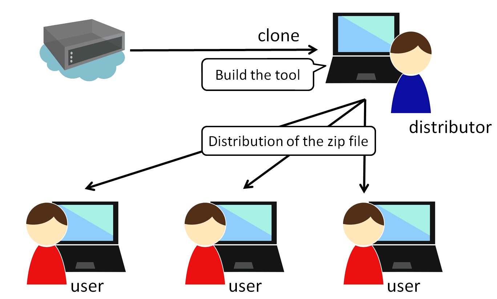
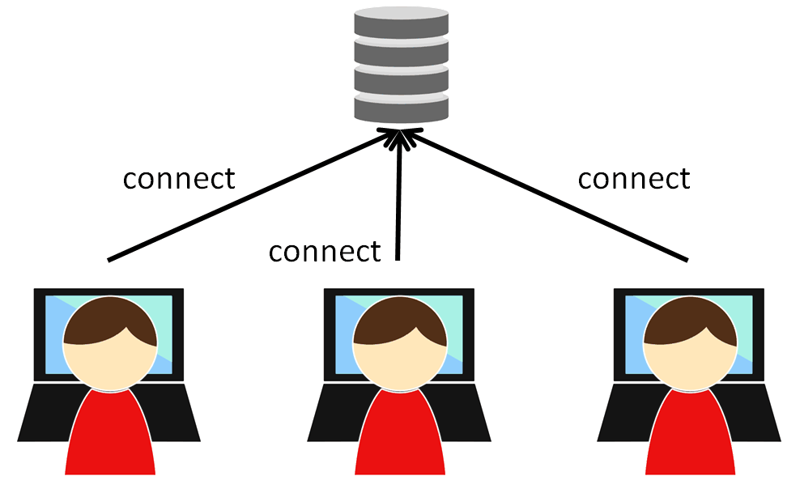

Nablarch SQL Executor
=====================

.. contents:: Table of Contents
  :depth: 2
  :local:

Nablarch SQL Executor is a tool for interactively executing SQL files containing Nablarch special syntax.
This tool is used by designers to design SQL in the project.

This tool should be used to configure and build the DB to be used in the project.

Expected usage
----------------

Expected usage of this tool
^^^^^^^^^^^^^^^^^^^^^^^^^^^^^^^^^^^^^^^^
To use this tool, you need to configure the DB and build it with Maven.
Since the pre-built tool is distributable, only one member of the project needs to do this work.

This tool is intended to be used in the following ways.

* The member in charge of building the project's environment builds and distributes the SQL Executor.
* The distributed files must be used by the designers.

Pre-built tools can be used if you have Java and a DB connection environment.

   [1]_

Selecting the DB connection method
^^^^^^^^^^^^^^^^^^^^^^^^^^^^^^^^^^^^

This tool can take the following two methods for DB connection.

* All users connect to the project common DB
* Each user connects to a local DB

Figure of All users connect to the project common DB:

   [1]_

Figure of Each user connects to a local DB:

   [1]_

 
Limitations
^^^^^^^^^^^

This tool has the following limitations.
Therefore, if you want to execute these SQLs, use the SQL execution environment of the database instead of this tool.

* SQL that starts with a WITH clause cannot be executed
* Cannot include ``,`` in the IN clause
* Cannot search for a DATETIME literal

.. tip::

  Nablarch provides an :ref:`adapter <doma_adaptor>` for `Doma (external site) <https://doma.readthedocs.io/en/stable/>`_  that can describe SQL as 2-way SQL.
  
  When using Doma, the SQL defined for the production environment can be easily test executed without setting up complicated tools such as this one. 
  (Even when constructing a dynamic condition, it can be executed without rewriting SQL)
  
  For this reason, it is recommended to consider the use of Doma.

How to distribution
-------------------

Prerequisites
^^^^^^^^^^^^^

The prerequisites for building and distributing the tool are listed below.

* Firefox or Chrome installed.
* Nablarch development environment set up.
* If you use a RDBMS that does not have a JDBC driver in the Maven Central Repository, the JDBC driver must have been registered in the Project Local Repository or Local Repository.
  See :ref:`customizeDBAddFileMavenRepo` for registration instructions.

Get the source code
^^^^^^^^^^^^^^^^^^^

Clone the repository published on the following site.

https://github.com/nablarch/sql-executor (external site)

.. _db-settings:

DB configuration change
^^^^^^^^^^^^^^^^^^^^^^^

Change the settings according to the RDBMS being used.

~~~~~~~~~~~~~~~~~~~~~~~~~~~~~~~~~~~
Change the basic configuration
~~~~~~~~~~~~~~~~~~~~~~~~~~~~~~~~~~~

Modification of src/main/resources/db.config
~~~~~~~~~~~~~~~~~~~~~~~~~~~~~~~~~~~~~~~~~~~~~~~~

Modify the src/main/resources/db.config if you want to change the connection URL, user, or password.

A configuration example is shown below.

**H2 configuration example (default)**

.. code-block:: text

  db.url=jdbc:h2:./h2/db/SAMPLE
  db.user=SAMPLE
  db.password=SAMPLE

**Oracle configuration example**

.. code-block:: text

  # jdbc:oracle:thin:@Host name: port number: database SID
  db.url=jdbc:oracle:thin:@localhost:1521/xe
  db.user=sample
  db.password=sample

**PostgreSQL configuration example**

.. code-block:: text

  # jdbc:postgresql://Host name: Port number/database name
  db.url=jdbc:postgresql://localhost:5432/postgres
  db.user=sample
  db.password=sample

**DB2 configuration example**

.. code-block:: text

  # jdbc:db2://Host name: Port number/database name
  db.url=jdbc:db2://localhost:50000/SAMPLE
  db.user=sample
  db.password=sample

**SQL Server configuration example**

.. code-block:: text

  # jdbc:sqlserver://Host name: Port number;instanceName= Instance name
  db.url=jdbc:sqlserver://localhost:1433;instanceName=SQLEXPRESS
  db.user=SAMPLE
  db.password=SAMPLE

~~~~~~~~~~~~~~~~~~~~~~~~
Change the JDBC driver
~~~~~~~~~~~~~~~~~~~~~~~~

To change the JDBC driver, modify the following file:

pom.xml
~~~~~~~~~~~~~~~~~~~~~~~~~

"Please update the dependency of the following JDBC driver according to the RDBMS to be used (使用するRDBMSにあわせて、下記JDBCドライバの dependency を更新してください。)" in pom.xml. Correct where there is a comment.

Hereinafter, configuration examples will be described for each type of database.

**H2 configuration example (default)**

.. code-block:: xml

    <dependencies>
      <!-- Middle is omitted -->

      <!--使用するRDBMSにあわせて、下記JDBCドライバの dependency を更新してください。 -->
      <dependency>
        <groupId>com.h2database</groupId>
        <artifactId>h2</artifactId>
        <scope>runtime</scope>
      </dependency>
    </dependencies>

**Oracle configuration example**

.. code-block:: xml

    <dependencies>
      <!-- Middle is omitted -->

      <!--使用するRDBMSにあわせて、下記JDBCドライバの dependency を更新してください。 -->
      <dependency>
        <groupId>com.oracle.database.jdbc</groupId>
        <artifactId>ojdbc6</artifactId>
        <version>11.2.0.4</version>
        <scope>runtime</scope>
      </dependency>
    </dependencies>

**PostgreSQL configuration example**

.. code-block:: xml

    <dependencies>
      <!-- Middle is omitted -->

      <!--使用するRDBMSにあわせて、下記JDBCドライバの dependency を更新してください。 -->
      <dependency>
        <groupId>org.postgresql</groupId>
        <artifactId>postgresql</artifactId>
        <version>9.4.1207</version>
        <scope>runtime</scope>
      </dependency>
    </dependencies>

**DB2 configuration example**

.. code-block:: xml

    <dependencies>
      <!-- Middle is omitted -->

      <!--使用するRDBMSにあわせて、下記JDBCドライバの dependency を更新してください。 -->
      <dependency>
        <groupId>com.ibm</groupId>
        <artifactId>db2jcc4</artifactId>
        <version>10.5.0.7</version>
        <scope>runtime</scope>
      </dependency>
    </dependencies>

src/main/resources/db.xml
~~~~~~~~~~~~~~~~~~~~~~~~~~~
Correct the class name of the JDBC driver and the class name of the dialect. 
Set the driver class name in driverClassName property of dataSource component.

The relevant parts are shown below.

.. code-block:: xml

  <!-- データソース設定 -->
  <!-- Data Source Configuration -->
  <component name="dataSource" class="org.apache.commons.dbcp.BasicDataSource">
    <!-- JDBC driver class name設定 -->
    <!-- Configure JDBC driver class name -->
    <!-- TODO: Database接続情報を変更する場合、ここを修正します -->
    <!--  If you want to change the Database connection information, modify this.-->
    <property name="driverClassName"
              value="org.h2.Driver" />
    <!-- Middle is omitted -->
  </component>

  <!-- Database接続用設定 -->
  <!-- Configuration for Database Connection -->
  <component name="connectionFactory"
      class="nablarch.core.db.connection.BasicDbConnectionFactoryForDataSource">
    <!-- Middle is omitted -->
    <property name="dialect">
      <!-- Dialect class name設定 --> 
      <!-- Configure Dialect class name -->
      <!-- TODO: Databaseを変更する場合、ここを修正します。--> 
      <!--  If you want to change the database, modify this.-->
      <component class="nablarch.core.db.dialect.H2Dialect"/>
    </property>
  </component>

An example of the configuration value is shown below.

.. list-table::
   :widths: 5 8 10
   :header-rows: 1

   * - Database
     - JDBC driver class name
     - Dialect class name
   * - H2
     - org.h2.Driver
     - nablarch.core.db.dialect.H2Dialect
   * - Oracle
     - oracle.jdbc.driver.OracleDriver
     - nablarch.core.db.dialect.OracleDialect
   * - PostgreSQL
     - org.postgresql.Driver
     - nablarch.core.db.dialect.PostgreSQLDialect
   * - DB2
     - com.ibm.db2.jcc.DB2Driver
     - nablarch.core.db.dialect.DB2Dialect
   * - SQL Server
     - com.microsoft.sqlserver.jdbc. |br| SQLServerDriver
     - nablarch.core.db.dialect.SqlServerDialect

How to confirm launch
^^^^^^^^^^^^^^^^^^^^^

Execute the following command.

.. code-block:: text

  mvn compile exec:java

Then launch the browser and display http://localhost:7979/index.html.

.. tip::

  * The browser may time out if it takes longer to start, for example when starting for the first time.
    In such a case, reload the browser after startup is complete.
  * This tool does not work properly on Internet Explorer. If Internet Explorer starts, copy the URL and paste it in the address field of Firefox or Chrome.

How to create the distribution file
^^^^^^^^^^^^^^^^^^^^^^^^^^^^^^^^^^^
Execute the following command.

.. code-block:: text

  mvn package

Can use the tool without Git or Maven by distributing sql-executor-distribution.zip, which is created directly under target.

How to use the distributed tools
--------------------------------

Prerequisites
^^^^^^^^^^^^^

The prerequisites for using the tool are listed below.

- The version of Java used in the project be installed.
- Be able to connect to the database specified in :ref:`db-settings`.
- Firefox or Chrome installed.

How to launch the distributed file
^^^^^^^^^^^^^^^^^^^^^^^^^^^^^^^^^^
Unzip the distributed sql-executor-distribution.zip.

Run the file sql-executor.bat under sql-executor-distribution/sql-executor.
Double-click the file or launch it from the command prompt.

.. code-block:: bat

  sql-executor.bat

A case where you want to connect to a DB other than the one set up at the time of distribution
^^^^^^^^^^^^^^^^^^^^^^^^^^^^^^^^^^^^^^^^^^^^^^^^^^^^^^^^^^^^^^^^^^^^^^^^^^^^^^^^^^^^^^^^^^^^^^^
Edit the file ``sql-executor.bat``. Configuration items are as follows.

.. csv-table:: Setting items

  "db.url", "database URL"
  "db.user", "connect user"
  "db.password", "pssword"

As an example, the editing method when connecting to ``db.url=jdbc:h2:./h2/db/SAMPLE`` , ``db.user=SAMPLE``, ``db.password=SAMPLE`` is as follows.

.. code-block:: bat
  :emphasize-lines: 3

  cd /d %~dp0

  start java -Ddb.url=jdbc:h2:./h2/db/SAMPLE -Ddb.user=SAMPLE -Ddb.password=SAMPLE -jar sql-executor.jar （omitted）
  cmd /c start http://localhost:7979/index.html

See :ref:`faq` , if nothing happens and the process ends abnormally.

How to operate
----------------

The first time it is launched, the list of SQL files under the current directory will be displayed, 
but if it does not exist, the following screen is displayed.

.. figure:: ./_images/initial_screen.png
   :alt: Initial screen

   Initial screen

Specify the path to the local folder in the lower right input column and click **[Search again (再検索)]** as shown below to display the list of SQL files and the statements described in each file under that search.

.. figure:: ./_images/setting_search_root_path.png
   :alt: Search path configuration

   Search path configuration

Click each statement name to display its contents and operation buttons.

.. figure:: ./_images/browsing_sql_scripts.png
   :alt: SQL statement list

   SQL statement list

The embedded variable in the statement is an input field, 
and the statement can be executed by editing the contents and clicking on **[Run]**.

Click **[Fill]** to restore the contents of the input field from the previous execution.

.. figure:: ./_images/running_sql_scripts.png
   :alt: SQL execution result (Query)

   SQL execution result (Query)

.. figure:: ./_images/running_dml_scripts.png
   :alt: SQL execution result (DML)

   SQL execution result (DML)

Syntax of SQLExecutor
^^^^^^^^^^^^^^^^^^^^^^^^^^^^^^
~~~~~~~~~~~~~~~~~~~~~~~~~~
Methods of writing strings
~~~~~~~~~~~~~~~~~~~~~~~~~~

If you want to enter a string as a condition, you need to enclose the string in ``'``.

~~~~~~~~~~~~~~~~~~~~~~~~~~~~~~~~~~~~~
Methods of writing other than strings
~~~~~~~~~~~~~~~~~~~~~~~~~~~~~~~~~~~~~

It should not be enclosed in ``'`` except for strings.

~~~~~~~~~~~~~~~~~~~~~~~~~~~~
Methods of writing IN clause
~~~~~~~~~~~~~~~~~~~~~~~~~~~~

Need to enclose the condition in ``[]`` to execute IN clause. Also, when multiple items are entered, they should be separated by ``,``.

Also, if the same variable name is specified in the ``$if`` special syntax and in the IN clause, the same value must be entered.

Examples are shown below.

.. figure:: ./_images/in-success.png
   :alt: Images with IN clauses enclosed

If ``[]`` is not specified in the IN clause, the following errors are printed.
``java.lang.IllegalArgumentException: object type in field is invalid. valid object type is Collection or Array.``

.. figure:: ./_images/in-fail.png
   :alt: Image with an IllegalArgumentException

.. warning::

    However, this tool does not allow you to use ``,`` as a search condition for IN clauses.

~~~~~~~~~~~~~~~~~~~~~~~~~~~~~
Methods of Date Type Settings
~~~~~~~~~~~~~~~~~~~~~~~~~~~~~

Set the value to date type (DATE) field in the same format as SQL92 DATE literal.

Examples are shown below.

::

  1970-12-11

Also, the current time is set by specifying the keyword ``SYSDATE``.

.. warning::

    Cannot search using a DATETIME literal as a condition.

.. _faq:

FAQ
---

**Q1** :I would like to see the log of the runtime, how can I check the log?

**A1** :At runtime, the following log files are output.

        * sql.log → Runtime log of SQL statements
        * app.log → All execution logs

^^^^^^^^^^^^^^

**Q2** :What is the solution if the program terminates abnormally without any output even after execution?

**A2** :Some errors, such as DB connection errors during launch, are output to the execution log file instead of standard error output. 
Since the execution log is output directly as ``app.log`` under the current directory, check the contents and take appropriate action.

^^^^^^^^^^^^^^

**Q3** : ``パラメータの指定方法が正しくありません。`` (The parameter is specified incorrectly.)  message is displayed, but I do not know what to do.

**A3** :
If you want to enter a string, make sure that the string is enclosed in ``'``.
If you want to enter a boolean or date type, check for spelling and formatting errors.

.. [1] Future Architect, Inc. Japan ( `Attribution 4.0 International (CC BY 4.0) <https://creativecommons.org/licenses/by/4.0/>`_ ） modified and created.

.. |br| raw:: html

   
