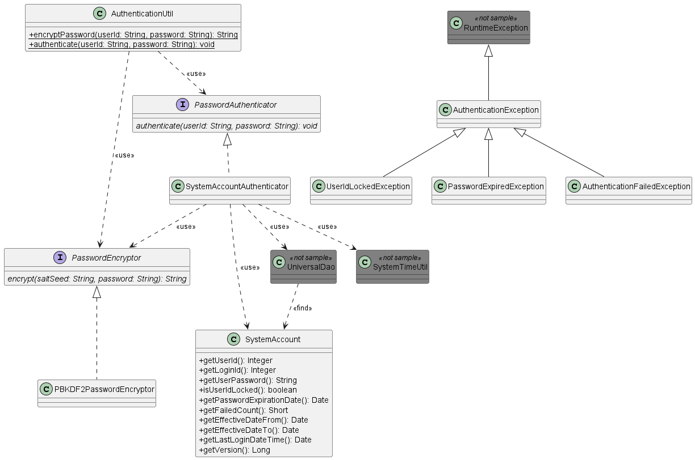

.. _authentication:

====================================================
Sample Password Encryption Function Using Database
====================================================

This is an implementation sample that performs authentication process using account information (user ID, password) stored in the database.

.. toctree::
  :hidden:

  0101_PBKDF2PasswordEncryptor

`Source code <https://github.com/nablarch/nablarch-biz-sample-all/tree/master/nablarch-password-authentication>`_

-------------------
Delivery package
-------------------

The sample is provided in the following package.

  *please.change.me.*\ **common.authentication**

------------
Summary
------------
Provide an implementation sample of the function to perform user authentication (authentication by user ID and password) in web application.

This sample is intended to be used in a business process [#auth_action]_  that executes login process.

.. tip::

  The Nablarch implementation project should modify and use this sample implementation to meet the requirements.

.. [#auth_action]

  This function does not provide the business process that executes the login process. 
  Create a login process according to the requirements in the Nablarch implementation project. 

Since this function uses `PBKDF2 <https://www.ietf.org/rfc/rfc2898.txt>`_  by default to encrypt passwords, 
it is necessary to set the number of stretches and salts for password encryption in each project.

For more information on configuration, see :doc:`0101_PBKDF2PasswordEncryptor` .

------------
Structure
------------
Shows the sample structure.

Class diagram
========================

Responsibilities of each class
^^^^^^^^^^^^^^^^^^^^^^^^^^^^^^^^^^^^^^^

Interface definition
~~~~~~~~~~~~~~~~~~~~~~~~~~~~~~~~~~~~~~~~~~~~~~~~~~~

===================== ===============================================================
Interface Name        Summary
===================== ===============================================================
PasswordAuthenticator  An interface that authenticates users.

PasswordEncryptor      An interface that encrypts a password.

===================== ===============================================================

Class definition
~~~~~~~~~~~~~~~~~~~~~~~~~~~~~~

\a) PasswordAuthenticator implementation class

  =============================== ======================================================================================================
  Class name                      Summary
  =============================== ======================================================================================================
  SystemAccountAuthenticator      Class that performs password authentication for the account information stored in the database.
  =============================== ======================================================================================================

\b) PasswordEncryptor implementation class

  =============================== ==========================================================================
  Class name                      Summary
  =============================== ==========================================================================
  PBKDF2PasswordEncryptor         Class that performs password encryption using PBKDF2.
  =============================== ==========================================================================

\c) Utility class

  =============================== ================================================================================
  Class name                      Summary
  =============================== ================================================================================
  AuthenticationUtil              Utility to get PasswordAuthenticator and PasswordEncryptor
                                  from system repository and perform user authentication and password encryption.
  =============================== ================================================================================

\d) Entity class

  =============================== ==========================================================================
  Class name                      Summary
  =============================== ==========================================================================
  SystemAccount                   Class retains user account information and to which Universal DAO search results are mapped.
  =============================== ==========================================================================

.. tip::

  In the Nablarch implementation project, entity classes are automatically generated using :ref:`gsp-dba-maven-plugin <gsp-maven-plugin>`.
  This sample includes an entity class (in *please.change.me.entity* package) automatically generated according to the definition described in :ref:`system-account-table-definition` for operation confirmation.
  When implementing in a project, instead of using the entity class of this sample, modify to use the entity class automatically generated in each project.

\e) Exception class

  =============================== ========================================================================================================
  Class name                      Summary
  =============================== ========================================================================================================
  AuthenticationException         Exception that occurs when user authentication fails.

                                  Base class of exception related to authentication process.
                                  Create an exception class that inherits from this class according to the authentication architecture.
                                  This class and its subclasses retain information necessary for the creation of 
                                  a message to be presented to a user, but do not create a message.

  AuthenticationFailedException   Exception that occurs when authentication fails due to mismatch of account information.

                                  This function memorizes the user ID of the target user.

  PasswordExpiredException        Exception that occurs when password has expired while authenticating user.

                                  Retains the user ID, password expiration date, and business date used for checking of the target user.

  UserIdLockedException           Exception that occurs when user ID is locked during user authentication.

                                  Stores the user ID of the target user and the number of authentication failures that lock the user ID.
  =============================== ========================================================================================================

.. _system-account-table-definition:

Table definition
~~~~~~~~~~~~~~~~~~~~~~~~~~~~~~
The definition of the account table used in this sample is shown below. 
When importing this sample into the implementation project, modify the SQL file and source code according to the table definition of the implementation project.

**SYSTEM_ACCOUNT**

The system account table stores the account information.

  ============================ ========================= ==================== =====================================
  Logical name                    Physical name          Java type            Limitations
  ============================ ========================= ==================== =====================================
  User ID                      USER_ID                   java.lang.Integer    Primary key

  Login ID                     LOGIN_ID                  java.lang.String

  Password                     USER_PASSWORD             java.lang.String

  User ID lock                 USER_ID_LOCKED            boolean              true when locked

  Password expiration date     PASSWORD_EXPIRATION_DATE  java.util.Date

  Authentication failed count  FAILED_COUNT              java.lang.Short

  Effective date (From)        EFFECTIVE_DATE_FROM       java.util.Date

  Effective date (To)          EFFECTIVE_DATE_TO         java.util.Date

  Last login date and time     LAST_LOGIN_DATE_TIME      java.util.Date
  ============================ ========================= ==================== =====================================

.. tip::

  Only the attributes required for this sample are listed in the above table definition. 
  In the Nablarch implementation project, the table design should be done to meet the requirements by adding necessary user attributes to this table and creating user information tables, etc. that are tied to this table on a one-to-one basis.

------------------------------------------------------------------------
How to Use
------------------------------------------------------------------------
This section describes how to use password authentication using the account information stored in the database.

The features of password authentication are shown below.

* Check the effective date (From/To) of account information during authentication.
* Check the expiration date of the password during authentication.
* Lock the user ID when the specified number of authentications fail consecutively. If the authentication succeeds before the specified number of times is reached, the number of failures is reset.
* Authenticate using an encrypted password. This feature provides password encryption using PBKDF2 by default.
* Record the date and time of the last login. The system date and time is used to update the last login date and time only if the authentication is successful.

In addition, PasswordAuthenticator and PasswordEncryptor are supposed to be obtained from Nablarch system repository and used.
Because components from the system repository should not be retrieved and used at each point in the business function, this function provides AuthenticationUtil, 
which wraps the retrieval of components from the system repository and the password authentication and password encryption processes.

AuthenticationUtil should be used for the login and user registration functions implemented in the project.

.. _passwordAuth-settings-label:

How to Use SystemAccountAuthenticator
=============================================================================================
This section describes how to use the SystemAccountAuthenticator.

.. code-block:: xml

    <component name="authenticator" class="please.change.me.common.authentication.SystemAccountAuthenticator">
      <!-- PasswordEncryptor to encrypt passwords -->
      <property name="passwordEncryptor" ref="passwordEncryptor" />

      <!-- Class that provides transaction control to database -->
      <property name="dbManager">
        <component class="nablarch.core.db.transaction.SimpleDbTransactionManager">
          <property name="dbTransactionName" value="authenticator"/>
          <property name="connectionFactory" ref="connectionFactory"/>
          <property name="transactionFactory" ref="transactionFactory"/>
        </component>
      </property>

      <!-- Number of authentication failures to lock user IDs -->
      <property name="failedCountToLock" value="5"/>
    </component>

A description of the property is given below.

===================================================================== ===================================================================================================================================================================================================================================================================
property name                                                            Settings
===================================================================== ===================================================================================================================================================================================================================================================================
passwordEncryptor (required)                                          A PasswordEncryptor used to encrypt the password.

                                                                      Specify the component name, which was configured by referring to :doc:`0101_PBKDF2PasswordEncryptor` , to ref.

dbManager (required)                                                  SimpleDbTransactionManager, which provides transaction control to the database.

                                                                      Specify an instance of nablarch.core.db.transaction.SimpleDbTransactionManager class.

                                                                      .. important::
                                                                         SystemAccountAuthenticator transaction control shall be configured to use a separate transaction from the individual application so that the transaction control of the PasswordAuthenticator does not affect the processing of the individual application.
                                                                         In the configuration example, since the name "authenticator" is specified for dbTransactionName, configure the transaction settings such that the same name is not used in individual applications.

failedCountToLock                                                     Number of authentication failures to lock the user ID.

                                                                      If this is not specified, it is set to 0 and the user ID lock function is not used.
===================================================================== ===================================================================================================================================================================================================================================================================

How to Use AuthenticaionUtil
=============================================================================================

This section describes how to use AuthenticaionUtil.

AuthenticationUtil implements the following utility methods. 
Since the component name to acquire a component from the system repository needs to be combined with the component name registered in :ref:`passwordAuth-settings-label` , modify the source code if the component name is different from the above configuration example.

================== ==============================================================================================
Method
================== ==============================================================================================
encryptPassword    Obtain PasswordEncryptor from the system repository with the component name passwordEncryptor 
                   and call PasswordEncryptor#encrypt(String, String).

authenticate       Obtain the PasswordAuthenticator from the system repository with the component name authenticator
                   and call PasswordAuthenticator#authenticate(String, String).
================== ==============================================================================================

Usage example of AuthenticaionUtil
^^^^^^^^^^^^^^^^^^^^^^^^^^^^^^^^^^^^^^^^^^^^^^^^^^^^^^^^^^^^^^^^^^^^^^^^^^^^^^^^^^^^^^^

The following is an example of the implementation of the authentication process using this sample.

In the implementation project, implement the authentication process that meets the requirements by referring to this implementation example.

.. code-block:: java

  // Obtain the user ID and password to authenticate in advance.
  // String userId = ・・・;
  // Strign password = ・・・;

  try {

      AuthenticationUtil.authenticate(userId, password);

  } catch (AuthenticationFailedException e) {

      // Process when authentication fails

  } catch (UserIdLockedException e) {

      // Process when a user ID is locked

  } catch (PasswordExpiredException e) {

      // Process when password has expired

  }

.. tip::

   In the above example, the processing is divided finely according to the status of the authentication error. 
   However, if it is not necessary to divide the processing finely, the processing may be performed by supplementing the upper exception class as follows.

  .. code-block:: java

    try {

        AuthenticationUtil.authenticate(userId, password);

    } catch (AuthenticationException e) {
        // Exception handling
    }

