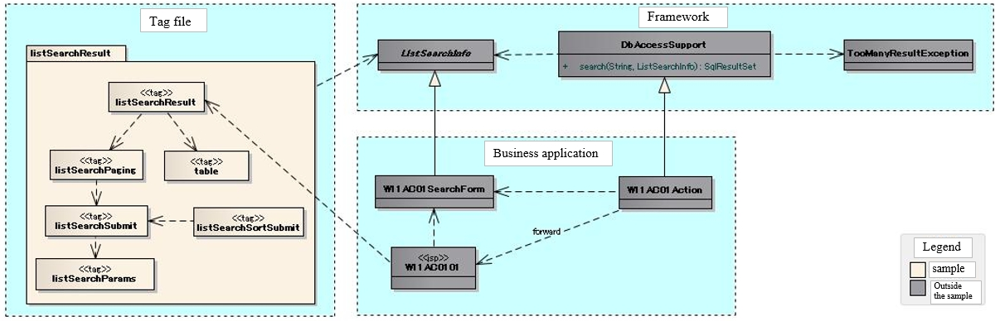
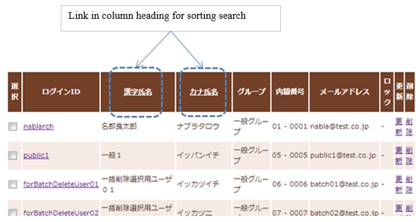

.. _list_search_result:

======================================================
Display a List of Search Results
======================================================

.. important::

  This sample uses a Nablarch 1.4 compliant API.

  When combining with versions later than Nablarch 1.4 series, customize as necessary.

This sample is an implementation sample of the tag file that displays a list of search results.

`Source code <https://github.com/nablarch/nablarch-biz-sample-all>`_

-----------------
Delivery package
-----------------

The sample is provided in the following package.

  *resources/META-INF/tags/*\ **listSearchResult**

------------
Summary
------------
An implementation sample of the tag file that displays a list of search results is provided in this section.
The tag file provides the following functions together with the search function for the list search provided by the framework.

* Function for displaying the number of search results
* Function for displaying the list of all search results on one screen
* Function for displaying the search results by the specified number of results (hereinafter referred to as paging)
* Sort search resultsFunction

An example of the output on the list screen is shown below.

.. image:: ./_images/ListSearchResult_Example.jpg
   :scale: 80

.. _ListSearchResult_Structure:

|

------------
Structure
------------
Shows the sample structure.

Class diagram
========================
To clarify the placement of the classes and tag files provided by the framework,
the classes and JSP of the business application that performs user search are included in the structure.

The application programmer can implement paging without implementing the details since the classes provided
by the framework and the tag files provided by the sample perform the processing required for paging.

Responsibilities of the classes and tag files provided by the framework
^^^^^^^^^^^^^^^^^^^^^^^^^^^^^^^^^^^^^^^^^^^^^^^^^^^^^^^^^^^^^^^^^^^^^^^^^^

\a) Framework

  =============================== =====================================================================================================================================
  Class name                        Summary
  =============================== =====================================================================================================================================
  DBAccessSupport                 Provides a search method that performs a search for list search.
  ListSearchInfo                  Class that retains the information for list search.
  TooManyResultException          Exception that occurs when the number of search results in a list search exceeds the maximum number (upper limit) of search results.
  =============================== =====================================================================================================================================

\b) Tag file

  =============================== ==========================================================================
  Tag name                          Summary
  =============================== ==========================================================================
  listSearchResult                Tag that displays the list of search results.
  listSearchPaging                Tag that outputs paging.
  listSearchSubmit                Tag that outputs the paging submit element.
  listSearchParams                Tag that outputs the changed parameters for the paging submit elements.
  table                           Tag that outputs a table.
  listSearchSortSubmit            Tag that outputs the submit elements for sorting.
  =============================== ==========================================================================

|

---------------------------
How to Use
---------------------------
This section describes how to use the sample, assuming that paging is used.
A business application that performs user search is described as an implementation example below.

.. _ListSearchResult_DbAccessSupport:

DbAccessSupport class
===============================================================================
The DbAccessSupport class is a support class that simply implements the database access process provided by the database access function.

DbAccessSupport provides a search method that executes a search for a list search.
The search method receives the SQL_ID and ListSearchInfo, and performs the following processes.

* Obtains the number of search results from the specified SQL_ID and ListSearchInfo.
* Throws TooManyResultException when the number of search results exceeds the maximum number.
* Executes the search and returns the search results when the number of search results does not exceed the maximum number. Sets the number of search results in ListSearchInfo that is specified by the argument.

The SQL statement specified by the SQL_ID specifies the SQL statement (i.e. the SELECT statement) that performs the search based on the search conditions required for business.
The framework acquires the number of search results based on the SQL statement that executes the search, and to execute the search by specifying the start position of the search results and the number of results obtained.

TooManyResultException retains the maximum number of search results (upper limit) and the (actual) number of search results obtained.
To configure the upper limit for the number of search results, see :ref:`ListSearchResult_Setting`.

An implementation example for the search process using the search method is shown below.

.. code-block:: java

 // Acquire the validated search conditions
 W11AC01SearchForm condition = ...;
 
 // Execute search
 SqlResultSet searchResult = null;
 try {
 
     // Search process with paging.
     // "SELECT_USER_BY_CONDITION" is the SQL_ID for the SELECT statement that performs user search.
     searchResult = search("SELECT_USER_BY_CONDITION", condition);
 
 } catch (TooManyResultException e) {
 
     // Error handling when the number of search results exceeds the maximum number.
     // TooManyResultException provides the maximum number of search results (upper limit) and the actual number of search results.
     // "MSG00024" is the message ID for the message "Search results has exceeded the maximum number of ({0} records)".
     throw new ApplicationException(
         MessageUtil.createMessage(MessageLevel.ERROR, "MSG00024", e.getMaxResultCount()));
 }

.. _ListSearchResult_ListSearcInfo:

----------------------------
ListSearchInfo class
----------------------------
The ListSearchInfo class is a class that retains information for list search.
Create a class that retains the search conditions in a business application by inheriting from ListSearchInfo.

The classes that inherit from ListSearchInfo must implement the following.

* The following properties required in the search process for paging are included in the input validation, similar to other search condition.

 * pageNumber (Page number of the acquisition target)

In addition, the following implementation is required for actions.

* When displaying the search results, set the object of the class that inherits from ListSearchInfo in the request scope.

An implementation example of the class (W11AC01SearchForm) and action (W11AC01Action) that inherit from ListSearchInfo is shown below.

.. code-block:: java

 // Class that inherits from ListSearchInfo.
 public class W11AC01SearchForm extends ListSearchInfo {
     
     // Property definition of the search condition is omitted.
     
     // Constructors corresponding to the validation function.
     public W11AC01SearchForm(Map<String, Object> params) {
     
        // Property configuration of the search condition is omitted.
        
        // Configure the properties of ListSearchInfo.
        setPageNumber((Integer) params.get("pageNumber"));
     }
     
     // Override and add an annotation for input validation.
     // When the maximum number of search results (upper limit) is: 200 results, and the number of results displayed per page is: 20 results.
     @PropertyName("Page number")
     @Required
     @NumberRange(max = 10, min = 1)
     @Digits(integer = 2)
     public void setPageNumber(Integer pageNumber) {
         super.setPageNumber(pageNumber);
     }
     
     /** Properties to be validated (search condition properties are omitted) */
     private static final String[] SEARCH_COND_PROPS = new String[] { ..., "pageNumber"};
     
     // Override and return the property name of the search condition.
     // Usually the same as the property under validation.
     public String[] getSearchConditionProps() {
         return SEARCH_COND_PROPS;
     }
 }

.. code-block:: java

 // Search screen action.
 public class W11AC01Action extends DbAccessSupport {
 
     // Initial display
     public HttpResponse doRW11AC0101(HttpRequest req, ExecutionContext ctx) {
         // Initial display is omitted because it is only for the business process.
     }
     
     // Search
     @OnError(type = ApplicationException.class, path = "/ss11AC/W11AC0101.jsp")
    public HttpResponse doRW11AC0102(HttpRequest req, ExecutionContext ctx) {
         
         // Business process is omitted.
         
         // Input validation
         ValidationContext<W11AC01SearchForm> searchConditionCtx = ...;
         searchConditionCtx.abortIfInvalid();
         
         // Set the class (UserSearchCondition) that has inherited ListSearchInfo to the request scope.
         UserSearchCondition condition = searchConditionCtx.createObject();
         ctx.setRequestScopedVar("11AC_W11AC01", condition);
         
         // Execute search
         SqlResultSet searchResult = null;
         try {
             searchResult = search("SELECT_USER_BY_CONDITION", condition);
         } catch (TooManyResultException e) {
             throw new ApplicationException(
                 MessageUtil.createMessage(MessageLevel.ERROR, "MSG00024", e.getMaxResultCount()));
         }
         
         // Set the search results to the request scope
         ctx.setRequestScopedVar("searchResult", searchResult);
         
         return new HttpResponse("/ss11AC/W11AC0101.jsp");
     }
 }

.. /*

.. _ListSearchResult_ListSearchResultTag:

---------------------------
listSearchResult tag
---------------------------
The :ref:`ListSearchResult_Tag` tag displays the list of search results.
The screen elements output by the listSearchResult tag are shown below.

.. image:: ./_images/ListSearchResult_PagingTableFull.jpg
   :scale: 80

Main attributes of the listSearchResult tag
=============================================
The main attributes of the listSearchResult tag are shown below. For more information on all the attributes, see :ref:`ListSearchResult_Tag`.

If the search result specified by the resultSetName attribute does not exist in the request scope, the listSearchResult tag will not output anything.
This corresponds to the case where the initial display of the search screen does not output anything.

====================================== ===========================================================================================================================
Attribute                              Description
====================================== ===========================================================================================================================
Overall
------------------------------------------------------------------------------------------------------------------------------------------------------------------
listSearchInfoName                     Name used to acquire ListSearchInfo from the Request scope.  |br|
                                       If not specified, "Number of search results" and "Paging" are not displayed.  |br|
                                       Do not specify when displaying only a list such as batch deletion confirmation screen.
Search result list
------------------------------------------------------------------------------------------------------------------------------------------------------------------
useResultCount                         Whether to display the number of search results.  |br|
                                       Default is true.
Paging
------------------------------------------------------------------------------------------------------------------------------------------------------------------
usePaging                              Whether to display paging.  |br|
                                       Default is true.  |br|
searchUri                              URI to use for the paging submit element.  |br|
                                       Must be specified when paging is displayed.
Search result
------------------------------------------------------------------------------------------------------------------------------------------------------------------
resultSetName (required)               Name used to acquire the search results from the request scope.  |br|
headerRowFragment (required)           JSP fragment of the header row. For more information on the header row, see :ref:`ListSearchResult_TableElement`  |br|
bodyRowFragment (required)             JSP fragment for the body row. For information on the body row, see :ref:`ListSearchResult_TableElement`
====================================== ===========================================================================================================================

.. _ListSearchResult_ResultCountElement:

Search result list
=====================================
The number of search results is displayed when true (default is true) is specified in the useResultCount attribute and the search results exist in the request scope.
By default, the number of search results is output in the following format.

.. code-block:: jsp

 Search results <%-- resultCount property of ListSearchInfo --%>Record

To change the default format, specify the JSP fragment in the resultCountFragment attribute.
An example of specifying the resultCountFragment attribute is shown below.
Since the JSP fragment is called from a custom tag for evaluation, the ListSearchInfo object can be accessed
using the name specified in the listSearchInfoName attribute.

.. code-block:: jsp

 <nbs:listSearchResult listSearchInfoName="11AC_W11AC01"
                    searchUri="/action/ss11AC/W11AC01Action/RW11AC0102"
                    resultSetName="searchResult">
    
    <%-- Specify the JSP fragment in the resultCountFragment attribute. --%>
    <jsp:attribute name="resultCountFragment">
    [Search results <n:write name="searchCondition.resultCount" />page]
    </jsp:attribute>
    
    <%-- Other attributes are omitted. --%>
    
 </nbs:listSearchResult>

The format for the number of search results after the specification mentioned above is as follows.

.. code-block:: jsp

 [Search results <%-- resultCount property of ListSearchInfo --%> page]

.. _ListSearchResult_PagingElement:

Paging
=====================================
Paging is displayed when the usePaging attribute is specified as true (the default is true).
The paging screen elements are shown below.
Paging consists of the current page number and the submit elements for moving the page.

|

.. image:: ./_images/ListSearchResult_PagingFull.jpg
   :scale: 80

|

The entire paging is displayed when the number of search results is 1 or more.
Assuming that the entire paging is displayed, the paging screen elements are as shown below.

====================================== ==============================================================================================================================================
Paging screen element                   Description
====================================== ==============================================================================================================================================
Current page number                     The current page number is always displayed.
First, Previous, Next, Last             If moving from the current page number to a page indicated by each screen element is possible, it is displayed as submittable.
                                        When it is not possible to move, a link is displayed as a label and a button is displayed as disabled.
Page number                             All page numbers (1..n) are displayed only when the total number of pages is 2 or more.
                                        As in the case of “First” or “Previous” mentioned above, each page number is displayed according to whether moving is possible or not.
====================================== ==============================================================================================================================================

The typical attributes that can be specified by the paging screen elements are as follows.
For more information on all the attributes, see :ref:`ListSearchResult_Tag`.

* Whether or not each screen element can be used
* Label for each screen element (such as first, previous, next, last)

 * Current page number that is changed by the JSP fragment
 * Page numbers that cannot be changed because they use the page number for the label

* Tags used for each submit element (either n:submitLink, n:submit, n:button)

**Search conditions when paging**

The search conditions when paging uses conditions from the previous search (the conditions from the time when the currently displayed search results were obtained).
This means that when paging is performed after changing the search conditions, the changed values of the search condition are discarded.

The search conditions can be maintained using a windowscope, similar to when input values are carried between screens.
Therefore, when search conditions and a list of search results are arranged on a single screen, it is necessary to implement the forms for search conditions and list of search results separately.

|

.. image:: ./_images/ListSearchResult_FormDivide.jpg
   :scale: 60

|

**What to do when search results are reduced when using paging**

This section describes what to do when the search results are reduced due to other user operations
while switching the search result page with each paging submit element.

This framework performs a search based on the specified page number and displays each paging screen element.
The following is an example of the paging operation when the number of search results is reduced.

As a prerequisite, the number of acquired search results (number displayed per page) is 20 results.

First, assume that a search is performed and the search results are 44 results. Below is the paging display after the third page is selected.

|

.. image:: ./_images/ListSearchResult_PagingBefore.jpg
   :scale: 100

|

The paging display and description of the contents displayed when the second page (or the previous page) is selected and the number of search results is reduced to 10 is described next.
Each paging screen element is displayed as a search result for the second page.

|

.. image:: ./_images/ListSearchResult_PagingAfter.jpg
   :scale: 100

|

====================================== ===========================================================================================================================================
Paging screen element                  Description of the contents displayed
====================================== ===========================================================================================================================================
Current page number                    Since the second page has been specified and the search results are 20 results or less, it becomes page 2/1 (2 of 1).
First, Previous                        Since there are currently 10 search results on the second page, it is possible to move to the previous page which is displayed as a link.
Next, Last                             Since there are currently 10 search results on the second page, it is not possible to move to the next page which is displayed as a label
Page number                            The page number is not displayed since there are 10 search results and the total number of pages is 1.
====================================== ===========================================================================================================================================

Since the current page number and the submit element correspond to each other, it is possible to move to the search results page
by selecting the submit element without it becoming inoperable.
(Of course, if you perform a search again from the search form, the search results will be from the first page.)

The paging display after selecting "Previous" is shown next. The correspondence between the current page number and the total number of pages returns to normal.

|

.. image:: ./_images/ListSearchResult_PagingAfter2.jpg
   :scale: 90

|

.. _ListSearchResult_TableElement:

Search result
=====================================
The screen elements of the search result are shown below.
The search result consists of a header row that displays column headings, and a body row that displays row data.

.. image:: ./_images/ListSearchResult_TableFull.jpg
   :scale: 80

The search results are always displayed when they are in the request scope.
When the search result is 0, only the header row is displayed.

The header row and body row are specified in the headerRowFragment attribute and bodyRowFragment attributes in the JSP fragment.
The JSP fragment in the body row is called and evaluated in the search result loop (c:forEach tag of JSTL).
Hence, the following attributes are provided to access the row data (var attribute of the c:forEach tag) and status (status attribute of the c:forEach tag)
in the JSP fragment of the body row.

====================================== ====================================================================================================================================
Attribute                               Description
====================================== ====================================================================================================================================
varRowName                             Variable name used when referring to row data (var attribute of the c:forEach tag) in the body row fragment.  |br|
                                       Default is "row".  |br|
varStatusName                          Variable name used when referring to the status (status attribute of the c:forEach tag) in the body row fragment.  |br|
                                       Default is "status".
                                       
                                       .. tip::
                                       
                                        When accessing the status using the n:write tag, an error occurs and the value cannot be obtained
                                        since the access method differs between the n:write tag and the EL expression.
                                        This error can be avoided by using the n:set tag to access the status.\
                                        An example of its use is shown below.
                                        
                                        .. code-block:: jsp
                                        
                                         <n:set var="rowCount" value="${status.count}" />
                                         <n:write name="rowCount" />
                                       
varCountName                           Variable name used when referring to the count property of the status (status attribute of the c:forEach tag).  |br|
                                       Default is "count".  |br|
varRowCountName                        Variable name used when referring to the search result count (start position of search result acquisition + status count).  |br|
                                       Default is "rowCount".
====================================== ====================================================================================================================================

In addition, the following attributes are provided in the body row that specify the class attribute for changing the background color of every other row.

====================================== ==============================================================================================
Attribute                              Description
====================================== ==============================================================================================
varOddEvenName                         Variable name used when referring to the class attribute of the body row.  |br|
                                       This variable name is used to change the value of the class attribute every other row.  |br|
                                       Default is "oddEvenCss".  |br|
oddValue                               The class attribute to use for odd lines of body.  |br|
                                       Default is "nablarch_odd".  |br|
evenValue                              The class attribute to use for even lines of body.  |br|
                                       Default is "nablarch_even".
====================================== ==============================================================================================

An example of user search specifications is shown below. The tag file prefix should be nbs.

.. code-block:: jsp

 <nbs:listSearchResult listSearchInfoName="11AC_W11AC01"
                    searchUri="/action/ss11AC/W11AC01Action/RW11AC0102"
                    resultSetName="searchResult">
    
    <%-- Specification of JSP fragment for the header row. --%>
    
    <jsp:attribute name="headerRowFragment">
    
        <tr>
        
            <th>Login ID</th>
            <th> Kanji name</th>
            <th> Kana name</th>
            <th>Group </th>
            <th>Extension number </th>
            <th>Email address</th>
            
        </tr>
        
    </jsp:attribute>
    
    <%-- Specify the JSP fragment for the body row. --%>
    
    <jsp:attribute name="bodyRowFragment">
    
        <%-- Access the class attribute using the default variable name "oddEvenCss". --%>
        
        <tr class="<n:write name='oddEvenCss' />">
        
            <%-- Access the row data using the default variable name "row". --%>
            
            <td>[<n:write name="count" />] [<n:write name="rowCount" />] <n:write name="row.loginId" /></td>
            <td><n:write name="row.kanjiName" /></td>
            <td><n:write name="row.kanaName" /></td>
            <td><n:write name="row.ugroupId" />:<n:write name="row.ugroupName" /></td>
            <td><n:write name="row.extensionNumberBuilding" />-<n:write name="row.extensionNumberPersonal" /></td>
            <td><n:write name="row.mailAddress" /></td>
            
        </tr>
        
    </jsp:attribute>
    
 </nbs:listSearchResult>

The search results after the above specifications are shown below.

.. image:: ./_images/ListSearchResult_TableStatus.jpg
   :scale: 80

.. _ListSearchResult_Sort:

--------------------------------
Sort search results
--------------------------------
You may want to sort data in the list display of search results according to the selected column data by selecting the column heading.
The search results can be sorted through the search process using the :ref:`ListSearchResult_ListSearchSortSubmitTag`,
which outputs the column headings for reordering, and the variable ORDER BY syntax (the syntax to change the ORDER BY clause dynamically) provided by the database access function.
For more information about the variable ORDER BY syntax, see the framework documentation.

The screen image when sorting is applied to the user search is shown below.
The user search provides sorting by kanji name and kana name.

This section describes an implementation example in which sorting is applied to user search.

How to implement the search process
=====================================
To sort the search results, define an SQL statement using the variable ORDER BY syntax.
The following is an example of an SQL statement using variable ORDER BY syntax.

In the SQL statement below, the variable ORDER BY clause is used to sort kanji names and kana names.
To determine which ORDER BY to use, the value obtained from the sortId field of the search condition object is used, as described in $sort (sortId).\
For example, if the sortId field of the search condition object is kanaName_asc, the ORDER BY clause is converted to "ORDER BY USR.KANA_NAME, SA.LOGIN_ID".

.. code-block:: none

 -- SQL statement using variable ORDER BY syntax
 SELECT
 
    -- Omitted
    
 FROM
 
    -- Omitted
    
 WHERE
 
    -- Omitted
    
 $sort (sortId) {
    (kanjiName_asc  USR.KANJI_NAME, SA.LOGIN_ID)
    (kanjiName_desc USR.KANJI_NAME DESC, SA.LOGIN_ID)
    (kanaName_asc   USR.KANA_NAME, SA.LOGIN_ID)
    (kanaName_desc  USR.KANA_NAME DESC, SA.LOGIN_ID) }

The ListSearchInfo class defines sortId property to support sorting.
The sortId property is included in the input validation when sorting the search results.
An implementation example of a class (W11AC01SearchForm) that inherits from ListSearchInfo is shown below.

.. code-block:: java

 // Class that inherits from ListSearchInfo.
 public class W11AC01SearchForm extends ListSearchInfo {
     
     // Property definition of the search condition is omitted.
     
     // Constructors corresponding to the validation function.
     public W11AC01SearchForm(Map<String, Object> params) {
     
        // Property configuration of the search condition is omitted.
        
        // Sets the sortId property of ListSearchInfo.
        setSortId((String) params.get("sortId"));
     }
     
     // Override and add an annotation for input validation.
     @PropertyName("Sort ID")
     @Required
     public void setSortId(String sortId) {
         super.setSortId(sortId);
     }
     
     /** Properties to be validated (search condition properties are omitted) */
     private static final String[] SEARCH_COND_PROPS = new String[] { ..., "sortId"};
     
     // Override and return the property name of the search condition.
     // Usually the same as the property under validation.
     // Used by each paging submit element when submitting search conditions.
     public String[] getSearchConditionProps() {
         return SEARCH_COND_PROPS;
     }
 }

listSearchSortSubmit tag
===============================
The listSearchSortSubmit tag outputs submit elements for sorting.

The required attributes and typical attributes of the listSearchSortSubmit tag are shown below.
For a list of all the attributes that can be specified with the listSearchSortSubmit tag, see :ref:`ListSearchResult_ListSearchSortSubmitTag`.

====================================== ==========================================================================================
Attribute                              Description
====================================== ==========================================================================================
sortCss                                Class attribute of the submit to sort.  |br|
                                       It is always output in the submit class attribute.  |br|
                                       Default is "nablarch_sort".
ascCss                                 Submit class attribute specified when sorting in the ascending order.  |br|
                                       It is output by adding to the sortCss attribute.  |br|
                                       Default is "nablarch_asc".(Output example: class="nablarch_sort nablarch_asc")
descCss                                Submit class attribute specified when sorting in the descending order.  |br|
                                       It is output by adding to the sortCss attribute.  |br|
                                       Default is "nablarch_desc".(Output example: class="nablarch_sort nablarch_desc")
ascSortId (required)                   Sort ID when sorting in ascending order.
descSortId (required)                  Sort ID when sorting in descending order.
defaultSort                            Default sort ID.  |br|
                                       Specify one of the following.  |br|
                                       asc(ascending)  |br|
                                       desc(descending)  |br|
                                       default is"asc".
label (required)                       Label to use for the submit to sort.
name (required)                        Name attribute of the tag used to submit the sort.  |br|
                                       The name attribute should be unique in the screen.
listSearchInfoName (required)          Name used to acquire ListSearchInfo from the Request scope.
====================================== ==========================================================================================

An implementation example of JSP using the listSearchSortSubmit tag is shown below. The tag file prefix should be nbs.

.. code-block:: jsp

 <nbs:listSearchResult listSearchInfoName="11AC_W11AC01"
                    searchUri="/action/ss11AC/W11AC01Action/RW11AC0102"
                    resultSetName="searchResult"
                    usePageNumberSubmit="true"
                    useLastSubmit="true">
                    
    <jsp:attribute name="headerRowFragment">
    
        <tr>
        
            <%-- Columns except for Kanji name are omitted. --%>
            
            <th>
            
                <%-- Set Kanji name as a link for sorting.--%>
                <%-- Specify sort ID for ascending (kanjiName_asc) and descending (kanjiName_desc) according to the SQL statement. --%>
                
                <nbs:listSearchSortSubmit ascSortId="kanjiName_asc" descSortId="kanjiName_desc"
                                        label="Kanji name" uri="/action/ss11AC/W11AC01Action/RW11AC0102"
                                        name="kanjiNameSort" listSearchInfoName="11AC_W11AC01" />
                                        
            </th>
        
        </tr>
        
    </jsp:attribute>
    
    <jsp:attribute name="bodyRowFragment">
    
        <%-- Omitted --%>
        
    </jsp:attribute>
    
 </nbs:listSearchResult>

The sort submit elements executes the search using the search conditions when searching from the search form.
Similar to search conditions when using paging, use a window scope to maintain the search conditions.

The sort submit elements alway search the first page (page number: 1).
This is because if the sorting is changed, the page number before the search becomes a relative position
to the different order and not a meaningful page position after the search.

**How the listSearchSortSubmit tag functions according to the current sort status**

The listSearchSortSubmit tag determines the following values according to the current sort status.
The current sort status is the sort ID used for the search.

* Sort ID to be sent as a request when a submit element is selected
* CSS class specified in the submit element according to ascending or descending order

This section describes the operation of the listSearchSortSubmit tag on the basis of the following implementation example.

.. code-block:: jsp

 <%-- Set Kanji name as a link for sorting.--%>
 <%-- Specify sort ID for ascending (kanjiName_asc) and descending (kanjiName_desc) according to the SQL statement. --%>
 
 <nbs:listSearchSortSubmit ascSortId="kanjiName_asc" descSortId="kanjiName_desc"
                          label="Kanji name" uri="/action/ss11AC/W11AC01Action/RW11AC0102"
                          name="kanjiNameSort" listSearchInfoName="11AC_W11AC01" />

==================================================== ============================================================================================================================== =======================================================================================================================================
Sort ID used for the search                          Sort ID to send a request                                                                         CSS class used
==================================================== ============================================================================================================================== =======================================================================================================================================
kanjiName_asc                                        The value of the descSortId attribute (=kanjiName_desc) is used since it is equal to the ascSortId attribute (=kanjiName_asc). The value of the ascCss attribute (nablarch_asc) is used since it is equal to the ascSortId attribute (=kanjiName_asc).
kanjiName_desc                                       The value of the ascSortId attribute (=kanjiName_asc) is used since it is equal to the descSortId attribute (=kanjiName_desc). The value of the descCss attribute (nablarch_desc) is used since it is equal to the descSortId attribute (=kanjiName_desc).
Sort ID of the column different from the kanji name  Since it is not equal to the ascSortId attribute (=kanjiName_asc) and descSortId attribute (=kanjiName_desc),                  No value to be specified since it is not equal to the ascSortId attribute (=kanjiName_asc) and descSortId attribute (=kanjiName_desc).
                                                     the value of the ascSortId attribute (=kanjiName_asc) is used according to the value of the defaultSortId attribute (=asc).
==================================================== ============================================================================================================================== =======================================================================================================================================

**Implementation example of CSS according to ascending or descending order**

CSS is used to display an image that clearly indicates the ascending or descending order of the links for sorting,
such as a screen image. An implementation example of CSS is shown below.
It is assumed that the image file is placed in a location that can be referenced from the CSS file, and the CSS class name is defined with the default name.

.. code-block:: css

 /*
  * Configuration for sortCss attribute.
  * CSS class name of the sortCss attribute is always output.
  */
 a.nablarch_sort {
     padding-right: 15px;
     background-position: 100% 0%;
     background-repeat: no-repeat;
 }
 
 /*
  * Configuration for ascCss attribute.
  * CSS class name of the ascCss attribute is output only when the submit elements are selected and are in ascending order.
  */
 a.nablarch_asc {
     background-image: url("../img/asc.jpg");
 }
 
 /*
  * Configuration for descCss attribute.
  * CSS class name of the descCss attribute is output only when the submit elements are selected and are in descending order.
  */
 a.nablarch_desc {
     background-image: url("../img/desc.jpg");
 }

.. _ListSearchResult_NoPaging:

---------------------------------------------------------------------------------
How to implement displaying a list of all search results on a single screen
---------------------------------------------------------------------------------
Up to now, we have described how to implement on the basis of paging, but the method of implementation where all search results are listed on a single screen is described below.

When listing all search results on a single screen, the basic implementation method is the same as with paging.
In addition, the search and sorting processes are implemented in the same way as with paging.

The implementation method is described below.
As with paging, the business application class and JSP that perform user search are used in the implementation example.

**Implementation example of a class (W11AC01SearchForm) that inherits from ListSearchInfo**

.. code-block:: java

 // Class that inherits from ListSearchInfo.
 public class W11AC01SearchForm extends ListSearchInfo {
     
     // Property definition of the search condition is omitted.
     
     // Constructors corresponding to the validation function.
     public W11AC01SearchForm(Map<String, Object> params) {
     
        // Property configuration of the search condition is omitted.
        
        // Unlike with paging, it is not necessary to configure pageNumber property of ListSearchInfo.
        // The initial value of the pageNumber property is 1, so it is always the first page.
        
     }
     
     /** Properties to be validated (Only properties of search condition) */
     private static final String[] SEARCH_COND_PROPS = new String[] { ... };
     
     // Override and return the property name of the search condition.
     // Usually the same as the property under validation.
     // Used when each sort submit element submits a search condition
     public String[] getSearchConditionProps() {
         return SEARCH_COND_PROPS;
     }
 }

**Action class that moves to JSP (user search)**

.. code-block:: java

  public class W11AC01Action extends DbAccessSupport {
  
      @OnError(type = ApplicationException.class, path = "/ss11AC/W11AC0101.jsp")
      public HttpResponse doRW11AC0102(HttpRequest req, ExecutionContext ctx) {
          
          // Business process is omitted.
          // Input validation is omitted
          
          // ListSearchInfo inherited class is created.
          W11AC01SearchForm condition = searchConditionCtx.createObject();
          
          // Configure the maximum number of search results (upper limit) to the number search results to be acquired (number of results displayed on one page).
          // Since paging is not used, the following configuration is required.
          condition.setMax(condition.getMaxResultCount());
          
          
          // Search process is omitted
          
      }
  }

**Implementation example of JSP (user search)**

.. code-block:: jsp

 <%-- Specify false in the usePaging attribute since paging is not used. --%> --%>
 <%-- Since paging is not used, the searchUri attribute need not be specified. --%>
 
 <nbs:listSearchResult listSearchInfoName="11AC_W11AC01"
                      usePaging="false"
                      resultSetName="searchResult">
 
    <%-- Other attributes are omitted. --%>
     
 </nbs:listSearchResult>

.. _ListSearchResult_DefaultCondition:

-------------------------------------------------------------------------------------------------
How to implement the initial display of search results with the default search conditions
-------------------------------------------------------------------------------------------------
Up to now, this has been described on the premise that the initial display of the search screen simply displays the search conditions form.
However, there may be a requirement to display the search results using the default search conditions in the initial display of the search screen.

In this case, the search conditions are not sent as a request parameter and the default search conditions are assembled on the server side and searched.
Hence, the search conditions used for paging do not exist in the window scope.
Therefore, it is essential to set the default search conditions in the window scope in the initial display process of the action.
The implementation method is the same as with normal paging, except for the initial display of actions such as JSP.

Since the process of setting the default search conditions in a window scope is common,
it has been provided as a utility (ListSearchInfoUtil) in the sample implementation.

The implementation method is described below.
As with paging, the business application class and JSP that perform user search are used in the implementation example.

**Initial display process of the Action class**

.. code-block:: java

    public HttpResponse doRW11AC0101(HttpRequest req, ExecutionContext ctx) {
        
        // Business process is omitted.

        // Generate form and configure the default search conditions
        W11AC01SearchForm condition = new W11AC01SearchForm();
        condition.setUserIdLocked("0");
        condition.setSortId("kanjiName_asc");
        condition.setDate("20130703");
        condition.setMoney(BigDecimal.valueOf(123456789.12d));

        // To display the default search conditions in the input form,
        // configure the default search conditions in the request scope
        ctx.setRequestScopedVar("11AC_W11AC01", condition);

        // Since paging uses the default search conditions,
        // configure the default search conditions in the window scope.
        // Since this configuration process is common, use the utility.
        ListSearchInfoUtil.setDefaultCondition(req, "11AC_W11AC01", condition);

        // Execute search
        SqlResultSet searchResult;
        try {
            searchResult = selectByCondition(condition);
        } catch (TooManyResultException e) {
            throw new ApplicationException(MessageUtil.createMessage(MessageLevel.ERROR, "MSG00035", e.getMaxResultCount()));
        }

        // Set the search results to the request scope
        ctx.setRequestScopedVar("searchResult", searchResult);
        ctx.setRequestScopedVar("resultCount", condition.getResultCount());

        return new HttpResponse("/ss11AC/W11AC0101.jsp");
    }

.. _ListSearchResult_Setting:

-------------------------------------------------------------
Default settings for the search result list display function
-------------------------------------------------------------
The default settings for the search result list display function are broadly divided into the screen display settings and the settings for the search process for list search.

The default values for the screen display settings are specified directly in the tag file.
For more information on the screen display configuration, see :ref:`ListSearchResult_TagReference`.

The settings for the search process for list search are described below.

The following settings can be made for the search process.

* Maximum number of search results (upper limit)
* Number of acquired search results (number of results displayed on one page)

The configuration values are specified in the environment configuration file of the system repository function.
The property names and settings are shown below.

===================================================================== ===================================================================================
property name                                                         Settings
===================================================================== ===================================================================================
nablarch.listSearch.maxResultCount                                    Maximum number of search results (upper limit)
nablarch.listSearch.max                                               Maximum number of acquired search results (number of results displayed on one page)
===================================================================== ===================================================================================

The above settings are obtained from the system repository when ListSearchInfo is created and set in the properties of ListSearchInfo itself.
If the the system repository settings do not exist, the following default values are set.

* Maximum number of search results (upper limit): 200
* Maximum number of acquired search results (number of results displayed on one page): 20

To individually change the settings for only some functions, implement the individual functions as follows.

* Specify the :ref:`ListSearchResult_Tag` attribute in JSP for the screen display configuration.
* For settings concerned with the search process for paging, set the values in the class that inherits from ListSearchInfo in the Action method that displays the corresponding list display screen.

An implementation example for changing the maximum number of search results (upper limit) to 50 and the number of results displayed to 10 is shown below.

.. code-block:: java

    public class W11AC01Action extends DbAccessSupport {
        
        // Maximum number of records to be displayed in the list
        private static final int MAX_ROWS = 10;
        
        // Number of search results to be displayed on the list (upper limit)
        private static final int MAX_RESULT_COUNT = 50;
        
        
        @OnError(type = ApplicationException.class, path = "/ss11AC/W11AC0101.jsp")
        public HttpResponse doRW11AC0102(HttpRequest req, ExecutionContext ctx) {
            
            // Business process is omitted.
            
            // Input validation is omitted.
            
            W11AC01SearchForm condition = ... ;
            
            // Configure the maximum number to be displayed.
            condition.setMax(MAX_ROWS);
            
            // Configure the maximum number of search results (upper limit).
            condition.setMaxResultCount(MAX_RESULT_COUNT);
            
            // Search process is omitted.
            
            // Subsequent processes are omitted.
        }
    }

.. _ListSearchResult_Customize:

------------------------------------------------------------------------------------
How to import a sample implementation (tag file) into the business application
------------------------------------------------------------------------------------
To import a sample implementation (tag file) into the business application, follow the procedure below.

* Place the tag file in the business application
* Revise the prefix in the tag file

Place the tag file in the business application
=====================================================
Place the listSearchResult package in the business application as follows.\

 Copy from
   *META-INF/tags/*\ **listSearchResult**

 Copy to
  /WEB-INF/tags directory of the business application

Revise the prefix in the tag file
=====================================================
In the sample implementation, "nbs" is added to the prefix in the tag file.\
Revise the prefix definition and prefix according to the location of the business application.
The contents before and after the revision are displayed on the assumption that the file is placed in /WEB-INF/tags/listSearchResult.

 Before revision
   Prefix definition::
   
    <%@ taglib prefix="nbs" uri="http://tis.co.jp/nablarch-biz-sample" %>
   
   Prefix::
   
    nbs

 After revision
   Prefix definition::
   
    <%@ taglib prefix="listSearchResult" tagdir="/WEB-INF/tags/listSearchResult" %>
   
   Prefix::
   
    listSearchResult

.. _ListSearchResult_TagReference:

---------------------------------------------------------
Tag Reference
---------------------------------------------------------

====================================================== ==========================================================================================
Tag                                                     Function
====================================================== ==========================================================================================
:ref:`ListSearchResult_Tag`                            Displays a list of the search results.
:ref:`ListSearchResult_ListSearchSortSubmitTag`        Outputs the column headings that handle sorting in the list of search results.
====================================================== ==========================================================================================

.. _ListSearchResult_Tag:

listSearchResult tag
=====================================
The listSearchResult tag dsiplays attributes for each screen element.

|

.. image:: ./_images/ListSearchResult_PagingTableFull.jpg
   :scale: 80

|

====================================== =================================================================================================================================
Attribute                              Description
====================================== =================================================================================================================================
Overall
------------------------------------------------------------------------------------------------------------------------------------------------------------------------
listSearchInfoName                     Name used to acquire ListSearchInfo from the Request scope. |br|
                                       If not specified, "Number of search results" and "Paging" are not displayed. |br|
                                       Do not specify when displaying only a list such as batch deletion confirmation screen.
listSearchResultWrapperCss             Class attribute of the div tag that wraps the entire table with paging (number of search results, paging, search results). |br|
                                       Default is "nablarch_listSearchResultWrapper".
Search result list
------------------------------------------------------------------------------------------------------------------------------------------------------------------------
useResultCount                         Whether to display the number of search results.  |br|
                                       Default is true.
resultCountCss                         Class attribute of the div tag that wraps the number of search results.  |br|
                                       Default is "nablarch_resultCount".
resultCountFragment                    JSP fragment that outputs the number of search results.  |br|
                                       Default is "search results <resultCount property of PagingInfo> record".
Paging
------------------------------------------------------------------------------------------------------------------------------------------------------------------------
usePaging                              Whether to display paging.  |br|
                                       Default is true.
searchUri                              URI to use for the paging submit element.  |br|
                                       Must be specified when paging is displayed.
pagingPosition                         The display position of paging. |br|
                                       Specify one of the following. |br|
                                       top(top only)  |br|
                                       bottom(bottom only)  |br|
                                       both(both)  |br|
                                       none(no display)  |br|
                                       Default is top.
pagingCss                              Class attribute of the div tag that wraps the entire paging submit elements (previous, next, etc.).   |br|
                                       Default is "nablarch_paging"
====================================== =================================================================================================================================

|

.. image:: ./_images/ListSearchResult_PagingTableFull.jpg
   :scale: 80

|

====================================== ============================================================================================================================================================
Attribute                              Description
====================================== ============================================================================================================================================================
Current page number
---------------------------------------------------------------------------------------------------------------------------------------------------------------------------------------------------
useCurrentPageNumber                   Whether to use the current page number.  |br|
                                       Default is true.
currentPageNumberCss                   Class attribute of the div tag that wraps the current page number.  |br|
                                       Default is "nablarch_currentPageNumber".
currentPageNumberFragment              JSP fragment that outputs the current page number.  |br|
                                       Default is "[<currentPageNumber property of PagingInfo>/<pageCount property of PagingInfo>page]".
First
---------------------------------------------------------------------------------------------------------------------------------------------------------------------------------------------------
useFirstSubmit                         Whether to use the submit to move to the first page.  |br|
                                       Default is false.
firstSubmitTag                         Nablarch tag used by the submit for moving to the first page. |br|
                                       Specify one of the following. |br|
                                       submitLink(a Tag)  |br|
                                       submit(input Tag)  |br|
                                       button(button Tag)  |br|
                                       Default is submitLink.
firstSubmitType                        Type attribute of the tag used by the submit for moving to the first page. |br|
                                       Only the following is supported. |br|
                                       submit  |br|
                                       button  |br|
                                       Not used if the Nablarch tag used for the submit button submit is submitLink.
firstSubmitCss                         Class attribute of the div tag that wraps the submit for moving to the first page.  |br|
                                       Default is "nablarch_firstSubmit".
firstSubmitLabel                       Label used by the submit for moving to the first page.  |br|
                                       Default is "First".
firstSubmitName                        Name attribute of the tag used by the submit for moving to the first page. |br|
                                       Default is "firstSubmit". |br|
                                       Outputs by adding the suffix (upper side is "_top" and lower side is "_bottom") indicating the display position of paging. |br|
                                       For example, if the default and display position is upper, it will be "firstSubmit_top".
Previous
---------------------------------------------------------------------------------------------------------------------------------------------------------------------------------------------------
usePrevSubmit                          Whether to use the submit to move to the previous page.  |br|
                                       Default is true.
prevSubmitTag                          Nablarch tag used by the submit for moving to the previous page. |br|
                                       Specify one of the following. |br|
                                       submitLink(aTag)  |br|
                                       submit(inputTag)  |br|
                                       button(buttonTag)  |br|
                                       Default is submitLink.
prevSubmitType                         Type attribute of the tag used by the submit for moving to the previous page. |br|
                                       Only the following is supported. |br|
                                       submit  |br|
                                       button  |br|
                                       Not used if the Nablarch tag used for the submit button submit is submitLink.
prevSubmitCss                          Class attribute of the div tag that wraps the submit for moving to the previous page.  |br|
                                       Default is "nablarch_prevSubmit".
prevSubmitLabel                        Label used by the submit for moving to the previous page.  |br|
                                       Default is "Previous".
prevSubmitName                         Name attribute of the tag used by the submit for moving to the previous page. |br|
                                       Default is "prevSubmit". |br|
                                       Outputs by adding the suffix (upper side is "_top" and lower side is "_bottom") indicating the display position of paging. |br|
                                       For example, if the default and display position is upper, it will be "firstSubmit_top".
Page number (label is not specified since the page number is used as a label)
---------------------------------------------------------------------------------------------------------------------------------------------------------------------------------------------------
usePageNumberSubmit                    Whether to use the submit to moves to the page specified by the page number.  |br|
                                       Default is false.
pageNumberSubmitTag                    Nablarch tag used by the submit for moving to the page specified by the page number. |br|
                                       Specify one of the following. |br|
                                       submitLink(aTag)  |br|
                                       submit(inputTag)  |br|
                                       button(buttonTag)  |br|
                                       Default is submitLink.
pageNumberSubmitType                   Type attribute of the tag used by the submit for moving to the page specified by the page number. |br|
                                       Only the following is supported.  |br|
                                       submit  |br|
                                       button  |br|
                                       Not used if the Nablarch tag used for the submit button submit is submitLink.
pageNumberSubmitCss                    Class attribute of the div tag that wraps the submit for moving to the page specified by the page number.  |br|
                                       Default is "nablarch_pageNumberSubmit".
pageNumberSubmitName                   Name attribute of the tag used by the submit for moving to the page specified by the page number. |br|
                                       Default is "pageNumberSubmit". |br|
                                       Outputs by adding the page number and suffix (upper side is "_top" and lower side is "_bottom") indicating the display position of paging. |br|
                                       For example, if the default and display position is upper and the page number is 3, it will be " pageNumberSubmit3_top".
Next
---------------------------------------------------------------------------------------------------------------------------------------------------------------------------------------------------
useNextSubmit                          Whether to use the submit to move to the next page.  |br|
                                       Default is true.
nextSubmitTag                          Nablarch tag used by the submit for moving to the next page. |br|
                                       Specify one of the following. |br|
                                       submitLink(aTag)  |br|
                                       submit(inputTag)  |br|
                                       button(buttonTag)  |br|
                                       Default is submitLink.
nextSubmitType                         Type attribute of the tag used by the submit for moving to the next page. |br|
                                       Only the following is supported. |br|
                                       submit  |br|
                                       button  |br|
                                       Not used if the Nablarch tag used for the submit button submit is submitLink.
nextSubmitCss                          Class attribute of the div tag that wraps the submit for moving to the next page. |br|
                                       Default is "nablarch_nextSubmit".
nextSubmitLabel                        Label used by the submit for moving to the next page. |br|
                                       Default is "Next".
nextSubmitName                         Name attribute of the tag used by the submit for moving to the next page. |br|
                                       Default is "nextSubmit". |br|
                                       Outputs by adding the suffix (upper side is "_top" and lower side is "_bottom") indicating the display position of paging. |br|
                                       For example, if the default and display position is upper, it will be "nextSubmit_top".
List
---------------------------------------------------------------------------------------------------------------------------------------------------------------------------------------------------
useLastSubmit                          Whether to use the submit to move to the last page.  |br|
                                       Default is false.
lastSubmitTag                          Nablarch tag used by the submit for moving to the last page. |br|
                                       Specify one of the following. |br|
                                       submitLink(aTag)  |br|
                                       submit(inputTag)  |br|
                                       button(buttonTag)  |br|
                                       Default is submitLink.
lastSubmitType                         Type attribute of the tag used by the submit for moving to the last page. |br|
                                       Only the following is supported. |br|
                                       submit  |br|
                                       button  |br|
                                       Not used if the Nablarch tag used for the submit button submit is submitLink.
lastSubmitCss                          Class attribute of the div tag that wraps the submit for moving to the last page. |br|
                                       Default is "nablarch_lastSubmit".
lastSubmitLabel                        Label used by the submit for moving to the last page. |br|
                                       Default is "List".
lastSubmitName                         Name attribute of the tag used by the submit for moving to the last page. |br|
                                       Default is "lastSubmit".  |br|
                                       Outputs by adding the suffix (upper side is "_top" and lower side is "_bottom") indicating the display position of paging. |br|
                                       For example, if the default and display position is upper, it will be "lastSubmit_top".
====================================== ============================================================================================================================================================

|

.. image:: ./_images/ListSearchResult_PagingTableFull.jpg
   :scale: 80

|

====================================== =================================================================================================================================
Attribute                              Description
====================================== =================================================================================================================================
Search result
------------------------------------------------------------------------------------------------------------------------------------------------------------------------
resultSetName (required)               Name used to acquire the search results from the request scope.
resultSetCss                           Class attribute of the search result table. |br|
                                       Default is "nablarch_resultSet".
headerRowFragment (required)           JSP fragment of the header row.
bodyRowFragment (required)             JSP fragment for the body row.
varRowName                             Variable name used when referring to row data (var attribute of the c:forEach tag) in the body row fragment. |br|
                                       Default is"row".
varStatusName                          Variable name used when referring to the status (status attribute of the c:forEach tag) in the body row fragment.  |br|
                                       Default is "status".
                                       
                                       .. tip::
                                       
                                        When accessing the status using the n:write tag, an error occurs and the value cannot be obtained
                                        since the access method differs between the n:write tag and the EL expression.
                                        This error can be avoided by using the n:set tag to access the status.\
                                        An example of its use is shown below.
                                        
                                        .. code-block:: jsp
                                        
                                         <n:set var="rowCount" value="${status.count}" />
                                         <n:write name="rowCount" />
                                       
varCountName                           Variable name used when referring to the count property of the status (status attribute of the c:forEach tag).  |br|
                                       Default is "count".
varRowCountName                        Variable name used when referring to the search result count (start position of search result acquisition + status count).  |br|
                                       Default is "rowCount".
varOddEvenName                         Variable name used when referring to the class attribute of the body row. |br|
                                       This variable name is used to change the value of the class attribute every other row. |br|
                                       Default is "oddEvenCss".
oddValue                               The class attribute to use for odd lines of body. |br|
                                       Default is "nablarch_odd".
evenValue                              The class attribute to use for even lines of body.  |br|
                                       Default is "nablarch_even".
====================================== =================================================================================================================================

.. _ListSearchResult_ListSearchSortSubmitTag:

listSearchSortSubmit tag
=====================================

====================================== ==========================================================================================
Attribute                              Description
====================================== ==========================================================================================
tag                                    Nablarch tag used to submit the sort. |br|
                                       Specify one of the following. |br|
                                       submitLink(aTag)  |br|
                                       submit(inputTag)  |br|
                                       button(buttonTag)  |br|
                                       Default is submitLink.
type                                   Type attribute of the tag used to submit the sort. |br|
                                       Only the following is supported. |br|
                                       submit  |br|
                                       button  |br|
                                       Not used if the Nablarch tag used for the submit button submit is submitLink.
sortCss                                Class attribute of the submit to sort. |br|
                                       It is always output in the submit class attribute. |br|
                                       Default is "nablarch_sort".
ascCss                                 Submit class attribute specified when sorting in the ascending order. |br|
                                       It is output by adding to the sortCss attribute.  |br|
                                       Default is "nablarch_asc".(Output example: class="nablarch_sort nablarch_asc")
descCss                                Submit class attribute specified when sorting in the descending order.  |br|
                                       It is output by adding to the sortCss attribute. |br|
                                       Default is "nablarch_desc".(Output example: class="nablarch_sort nablarch_desc")
ascSortId (required)                   Sort ID when sorting in ascending order.
descSortId (required)                  Sort ID when sorting in descending order.
defaultSort                            Default sort. |br|
                                       Specify one of the following. |br|
                                       asc(ascending)  |br|
                                       desc(descending)  |br|
                                       Default is "asc".
label (required)                       Label to use for the submit to sort.
name (required)                        Name attribute of the tag used to submit the sort. |br|
                                       The name attribute should be unique in the screen.
listSearchInfoName (required)          Name used to acquire ListSearchInfo from the Request scope.
====================================== ==========================================================================================

..  |br| raw:: html

   