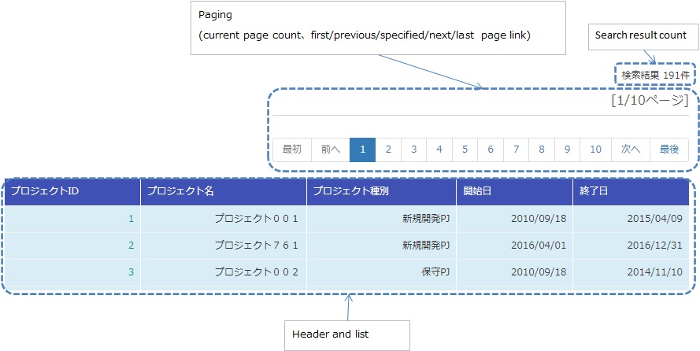
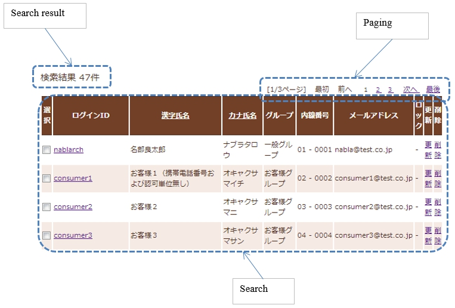
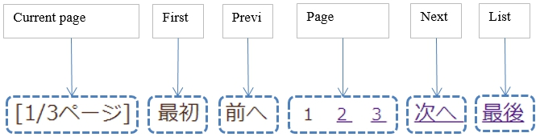
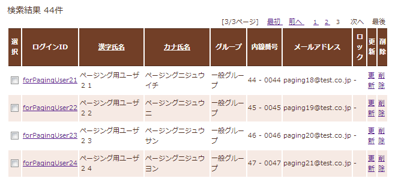
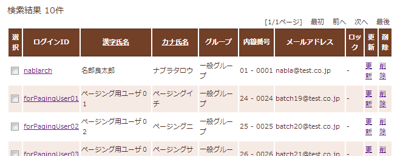
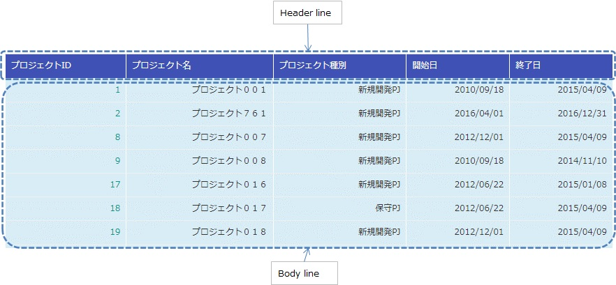

.. _list_search_result:

======================================================
Display a List of Search Results
======================================================

This sample is an implementation sample of the tag file that displays a list of search results.

`Source code <https://github.com/nablarch/nablarch-biz-sample-all/tree/master/nablarch-list-search-result>`_

-----------------
Delivery package
-----------------

The sample is provided in the following package.

  *resources/META-INF/tags/*\ **listSearchResult**

------------
Summary
------------
An implementation sample of the tag file that displays a list of search results is provided in this section.
The tag file provides the following functions together with the search function by the :ref:`universal_dao`.

* Function for displaying the number of search results
* Function for displaying the search results by the specified number of results (hereinafter referred to as paging)

An example of the output on the list screen is shown below.

.. _ListSearchResult_Structure:

|

------------
Structure
------------
Shows the sample structure.

Class diagram
========================

The application programmer can implement paging without implementing the details since the classes provided
by the framework and the tag files provided by the sample perform the processing required for paging.

.. image:: ./_images/ListSearchResult_Structure.png
   :scale: 60

Responsibilities of the classes and tag files provided by the framework
^^^^^^^^^^^^^^^^^^^^^^^^^^^^^^^^^^^^^^^^^^^^^^^^^^^^^^^^^^^^^^^^^^^^^^^^^^

\a) Framework

  =============================== =====================================================================================================================================
  Class name                        Summary
  =============================== =====================================================================================================================================
  UniversalDao                    Provides general-purpose DAO functionality. Please refer to :ref:`universal_dao` for basic usage.
  ListSearchInfo                  Abstract class that holds information for list search.
  Pagination                      A concrete class that inherits from ListSearchInfo.
  EntityList                      A holding class for the result list returned from a UniversalDao.
  =============================== =====================================================================================================================================

\b) Tag file

  =============================== ==========================================================================
  Tag name                          Summary
  =============================== ==========================================================================
  listSearchResult                Tag that displays the list of search results.
  listSearchPaging                Tag that outputs paging.
  listSearchSubmit                Tag that outputs the paging submit element.
  table                           Tag that outputs a table.
  =============================== ==========================================================================

|

.. _ListSearchResult_UniversalDao:

---------------------------
UniversalDao class
---------------------------

:java:extdoc:`UniversalDao <nablarch.common.dao.UniversalDao>` class has an API that returns multiple search results as an EntityList.
See :ref:`universal_dao-paging` when using the paging feature.

.. _ListSearchResult_ListSearchInfo:

----------------------------
ListSearchInfo class
----------------------------

ListSearchInfo class is an abstract class that holds list search information.
Fields and accessor methods such as number of pages for pagination and number of items matching search conditions are defined in this class.
See :java:extdoc:`nablarch.core.db.support.ListSearchInfo` for details.

.. _ListSearchResult_Pagination:

----------------------------
Pagination class
----------------------------
Pagination class inherits ListSearchInfo and is used to refer to pagination information.

.. _ListSearchResult_EntityList:

----------------------------
EntityList class
----------------------------
EntityList class is the holding class of result list returned from UniversalDao.
Inherits the java.util.ArrayList and has an instance of the Pagination class in the field.

.. _ListSearchResult_ListSearchResultTag:

---------------------------
listSearchResult tag
---------------------------
The :ref:`ListSearchResult_Tag` tag displays the list of search results.
The screen elements output by the listSearchResult tag are shown below.

Main attributes of the listSearchResult tag
=============================================
The main attributes of the listSearchResult tag are shown below. For more information on all the attributes, see :ref:`ListSearchResult_Tag`.

If the search result specified by the resultSetName attribute does not exist in the request scope, the listSearchResult tag will not output anything.
This corresponds to the case where the initial display of the search screen does not output anything.

====================================== ===========================================================================================================================
Attribute                              Description
====================================== ===========================================================================================================================
Overall
------------------------------------------------------------------------------------------------------------------------------------------------------------------
listSearchInfoName                     Name used to acquire ListSearchInfo from the Request scope.  |br|
                                       If not specified, "Number of search results" and "Paging" are not displayed.  |br|
                                       Do not specify when displaying only a list such as batch deletion confirmation screen.
searchFormName                         Name used to acquire search form from the Request scope.  |br|
                                       The search form holds search criteria and page numbers for paging.
Search result list
------------------------------------------------------------------------------------------------------------------------------------------------------------------
useResultCount                         Whether to display the number of search results.  |br|
                                       Default is true.
Paging
------------------------------------------------------------------------------------------------------------------------------------------------------------------
usePaging                              Whether to display paging.  |br|
                                       Default is true.  |br|
searchUri                              URI to use for the paging submit element.  |br|
                                       Must be specified when paging is displayed.
Search result
------------------------------------------------------------------------------------------------------------------------------------------------------------------
resultSetName (required)               The name to use when retrieving :java:extdoc:`Universal DAO search results <nablarch.common.dao.EntityList>` from the request scope. The search results also include the number of pages for pagination and the number of items that match the search conditions. |br|
headerRowFragment                      JSP fragment of the header row. For more information on the header row, see :ref:`ListSearchResult_TableElement`  |br|
bodyRowFragment                        JSP fragment for the body row. For information on the body row, see :ref:`ListSearchResult_TableElement`
====================================== ===========================================================================================================================

.. _ListSearchResult_ResultCountElement:

Search result list
=====================================
The number of search results is displayed when true (default is true) is specified in the useResultCount attribute and the search results exist in the request scope.
By default, the number of search results is output in the following format.

.. code-block:: jsp

 Search results <%-- resultCount property of pagination --%>Record

To change the default format, specify the JSP fragment in the resultCountFragment attribute.
An example of specifying the resultCountFragment attribute is shown below.

.. code-block:: jsp

 <app:listSearchResult resultSetName="searchResult" useResultCount="true">
    
    <%-- Specify the JSP fragment in the resultCountFragment attribute. --%>
    <jsp:attribute name="resultCountFragment">
      [Search results <n:write name="searchResult.pagination.resultCount" />page]
    </jsp:attribute>
    
    <%-- Other attributes are omitted. --%>
    
 </app:listSearchResult>

The format for the number of search results after the specification mentioned above is as follows.

.. code-block:: jsp

 [Search results <%-- resultCount property of pagination --%> page]

.. _ListSearchResult_PagingElement:

Paging
=====================================
Paging is displayed when the usePaging attribute is specified as true (the default is true).

When using the paging function, implement so that the form specified by searchFormName receives the page number with the name pageNumber.
Examples are shown below.

.. code-block:: java

  public class ProjectSearchForm {

    @Required
    @Domain("pageNumber")
    private String pageNumber;

    public String getPageNumber(){
      return this.pageNumber;
    }

    public String getPageNumber(){
      return this.pageNumber;
    }

    public void setPageNumber(String pageNumber){
      this.pageNumber = pageNumber;
    }

    // Omit other attributes.
  }

The paging screen elements are shown below.
Paging consists of the current page number and the submit elements for moving the page.

|

|

The entire paging is displayed when the number of search results is 1 or more.
Assuming that the entire paging is displayed, the paging screen elements are as shown below.

====================================== ==============================================================================================================================================
Paging screen element                   Description
====================================== ==============================================================================================================================================
Current page number                     The current page number is displayed when true is specified in the useCurrentPageNumber attribute.
First, Previous, Next, Last             If it is possible to transition from the current page number to the page indicated by each screen element, it will be displayed in a state where it can be submitted.
                                        If transition is not possible, a link is displayed as a label.
Page number                             All page numbers (1..n) are displayed only when the total number of pages is 2 or more.
====================================== ==============================================================================================================================================

The typical attributes that can be specified by the paging screen elements are as follows.
For more information on all the attributes, see :ref:`ListSearchResult_Tag`.

* Whether or not each screen element can be used
* Label for each screen element (such as first, previous, next, last)
* Current page number that is changed by the JSP fragment
* Page numbers that cannot be changed because they use the page number for the label

**Search conditions when paging**

Search conditions for paging can be realized by constructing a URI with search conditions set as parameters and passing it to the searchUri attribute.
An example of specifying a project name as a search condition is shown below.

.. code-block:: jsp

 <%@ taglib prefix="c" uri="jakarta.tags.core" %>
 <%@ taglib prefix="app" tagdir="/WEB-INF/tags/listSearchResult" %>

 <%-- Register the URI that has the search condition used to display the current search result as a parameter in the page scope as a variable.
      This variable is used as URI for paging of <app:listSearchResult> tag. --%>
 <c:url value="/action/project/list" var="uri" context="/">
    <%-- Set the project name obtained from the search form. --%>
    <c:param name="searchForm.projectName" value="${searchForm.projectName}"/>
 </c:url>

 <%-- Pass it to the searchUri attribute. --%>
 <app:listSearchResult resultSetName="searchResult" searchUri="${uri}"

 <%-- Omit other attributes. --%>

|

**What to do when search results are reduced when using paging**

This section describes what to do when the search results are reduced due to other user operations
while switching the search result page with each paging submit element.

This framework performs a search based on the specified page number and displays each paging screen element.
The following is an example of the paging operation when the number of search results is reduced.

As a prerequisite, the number of acquired search results (number displayed per page) is 20 results.

First, assume that a search is performed and the search results are 44 results. Below is the paging display after the third page is selected.

|

|

Next, a description of the paging display and the display contents when "Previous" is selected with the number of search results reduced to 10 will be described.
Each paging screen element is displayed as a search result for the second page.

|

|

====================================== ===========================================================================================================================================
Paging screen element                  Description of the contents displayed
====================================== ===========================================================================================================================================
Current page number                    Since the second page has been specified and the search results are 20 results or less, it becomes page 2/1 (2 of 1).
First, Previous                        Since there are currently 10 search results on the second page, it is possible to move to the previous page which is displayed as a link.
Next, Last                             Since there are currently 10 search results on the second page, it is not possible to move to the next page which is displayed as a label
Page number                            The page number is not displayed since there are 10 search results and the total number of pages is 1.
====================================== ===========================================================================================================================================

Since the current page number and the submit element correspond to each other, it is possible to move to the search results page
by selecting the submit element without it becoming inoperable.
(Of course, if you perform a search again from the search form, the search results will be from the first page.)

The paging display after selecting "Previous" is shown next. The correspondence between the current page number and the total number of pages returns to normal.

|

|

.. _ListSearchResult_TableElement:

Search result
=====================================
The screen elements of the search result are shown below.
The search result consists of a header row that displays column headings, and a body row that displays row data.

The search results are always displayed when they are in the request scope.
When the search result is 0, only the header row is displayed.

The header row and body row are specified in the headerRowFragment attribute and bodyRowFragment attributes in the JSP fragment.
The JSP fragment in the body row is called and evaluated in the search result loop (c:forEach tag of JSTL).
Hence, the following attributes are provided to access the row data (var attribute of the c:forEach tag) and status (status attribute of the c:forEach tag)
in the JSP fragment of the body row.

====================================== ====================================================================================================================================
Attribute                               Description
====================================== ====================================================================================================================================
varRowName                             Variable name used when referring to row data (var attribute of the c:forEach tag) in the body row fragment.  |br|
                                       Default is "row".  |br|
varStatusName                          Variable name used when referring to the status (status attribute of the c:forEach tag) in the body row fragment.  |br|
                                       Default is "status".
                                       
                                       .. tip::
                                       
                                        When accessing the status using the n:write tag, an error occurs and the value cannot be obtained
                                        since the access method differs between the n:write tag and the EL expression.
                                        This error can be avoided by using the n:set tag to access the status.\
                                        An example of its use is shown below.
                                        
                                        .. code-block:: jsp
                                        
                                         <n:set var="rowCount" value="${status.count}" />
                                         <n:write name="rowCount" />
                                       
varCountName                           Variable name used when referring to the count property of the status (status attribute of the c:forEach tag).  |br|
                                       Default is "count".  |br|
varRowCountName                        Variable name used when referring to the search result count (start position of search result acquisition + status count).  |br|
                                       Default is "rowCount".
====================================== ====================================================================================================================================

In addition, the following attributes are provided in the body row that specify the class attribute for changing the background color of every other row.

====================================== ==============================================================================================
Attribute                              Description
====================================== ==============================================================================================
varOddEvenName                         Variable name used when referring to the class attribute of the body row.  |br|
                                       This variable name is used to change the value of the class attribute every other row.  |br|
                                       Default is "oddEvenCss".  |br|
oddValue                               The class attribute to use for odd lines of body.  |br|
                                       Default is "nablarch_odd".  |br|
evenValue                              The class attribute to use for even lines of body.  |br|
                                       Default is "nablarch_even".
====================================== ==============================================================================================

An example of project search specifications is shown below. The tag file prefix should be app.

.. code-block:: jsp

 <app:listSearchResult resultSetName="searchResult">

    <%-- JSP fragment specification for header line. --%>
    <jsp:attribute name="headerRowFragment">
        <tr>
            <th>Project id</th>
            <th>Project name</th>
            <th>Project type</th>
            <th>Start date</th>
            <th>End date</th>
        </tr>
    </jsp:attribute>

    <%-- Body line JSP fragment specification. --%>
    <jsp:attribute name="bodyRowFragment">
        <tr class="info">
            <td>
                <%-- Access the row data using the default variable name "row". --%>
                <n:a href="/action/project/show/${row.projectId}">
                    <n:write name="row.projectId"/>
                </n:a>
            </td>
            <td>
                <n:write name="row.projectName" />
            </td>
            <td>
                <c:forEach var="projectType" items="<%= ProjectType.values() %>">
                    <c:if test="${projectType.code == row.projectType}">
                        <n:write name="projectType.label" />
                    </c:if>
                </c:forEach>
            </td>
            <td>
                <n:write value="${n:formatByDefault('dateTime', row.projectStartDate)}" />
            </td>
            <td>
                <n:write value="${n:formatByDefault('dateTime', row.projectEndDate)}" />
            </td>
        </tr>
    </jsp:attribute>
 </app:listSearchResult>

The search results after the above specifications are shown below.

.. image:: ./_images/ListSearchResult_TableStatus.jpg
   :scale: 80

.. _ListSearchResult_Customize:

------------------------------------------------------------------------------------
How to import a sample implementation (tag file) into the business application
------------------------------------------------------------------------------------

Place the listSearchResult package in the business application as follows.\

 Copy from
   *META-INF/tags/*\ **listSearchResult**

 Copy to
  /WEB-INF/tags directory of the business application

.. _ListSearchResult_TagReference:

---------------------------------------------------------
Tag Reference
---------------------------------------------------------

.. _ListSearchResult_Tag:

listSearchResult tag
=====================================
The listSearchResult tag displays a list of search results.
The attributes for each screen element are shown below.

|

|

====================================== =================================================================================================================================
Attribute                              Description
====================================== =================================================================================================================================
Overall
------------------------------------------------------------------------------------------------------------------------------------------------------------------------
listSearchResultWrapperCss             Class attribute of the div tag that wraps the entire table with paging (number of search results, paging, search results). |br|
                                       Default is "nablarch_listSearchResultWrapper".
listSearchInfoName                     Name used to acquire search form from the Request scope. |br|
                                       Search forms hold page numbers for search criteria and paging.
                                       Do not specify when displaying only a list such as batch deletion confirmation screen.
Search result list
------------------------------------------------------------------------------------------------------------------------------------------------------------------------
useResultCount                         Whether to display the number of search results.  |br|
                                       Default is true.
resultCountCss                         Class attribute of the div tag that wraps the number of search results.  |br|
                                       Default is "nablarch_resultCount".
resultCountFragment                    JSP fragment that outputs the number of search results.  |br|
                                       Default is "search results <resultCount property of pagination> record".
Paging
------------------------------------------------------------------------------------------------------------------------------------------------------------------------
usePaging                              Whether to display paging.  |br|
                                       Default is true.
pagingPosition                         The display position of paging. |br|
                                       Specify one of the following. |br|
                                       top(top only)  |br|
                                       bottom(bottom only)  |br|
                                       both(both)  |br|
                                       none(no display)  |br|
                                       Default is top.
pagingCss                              Class attribute of the div tag that wraps the entire paging submit elements (previous, next, etc.).   |br|
                                       Default is "nablarch_paging"
searchUri                              URI to use for the paging submit element.  |br|
                                       Must be specified when paging is displayed.
====================================== =================================================================================================================================

|

|

====================================== ============================================================================================================================================================
Attribute                              Description
====================================== ============================================================================================================================================================
Current page number
---------------------------------------------------------------------------------------------------------------------------------------------------------------------------------------------------
useCurrentPageNumber                   Whether to use the current page number.  |br|
                                       Default is true.
currentPageNumberCss                   Class attribute of the div tag that wraps the current page number.  |br|
                                       Default is "nablarch_currentPageNumber".
currentPageNumberFragment              JSP fragment that outputs the current page number.  |br|
                                       Default is "[<currentPageNumber property of pagination>/<pageCount property of pagination>page]".
First
---------------------------------------------------------------------------------------------------------------------------------------------------------------------------------------------------
useFirstSubmit                         Whether to use the submit to move to the first page.  |br|
                                       Default is false.
firstSubmitCss                         Class attribute of the div tag that wraps the submit for moving to the first page.  |br|
                                       Default is "nablarch_firstSubmit".
firstSubmitLabel                       Label used by the submit for moving to the first page.  |br|
                                       Default is "First".
firstSubmitName                        Name attribute of the tag used by the submit for moving to the first page. |br|
                                       Default is "firstSubmit". |br|
                                       Outputs by adding the suffix (upper side is "_top" and lower side is "_bottom") indicating the display position of paging. |br|
                                       For example, if the default and display position is upper, it will be "firstSubmit_top".
Previous
---------------------------------------------------------------------------------------------------------------------------------------------------------------------------------------------------
usePrevSubmit                          Whether to use the submit to move to the previous page.  |br|
                                       Default is true.
prevSubmitCss                          Class attribute of the div tag that wraps the submit for moving to the previous page.  |br|
                                       Default is "nablarch_prevSubmit".
prevSubmitLabel                        Label used by the submit for moving to the previous page.  |br|
                                       Default is "Previous".
prevSubmitName                         Name attribute of the tag used by the submit for moving to the previous page. |br|
                                       Default is "prevSubmit". |br|
                                       Outputs by adding the suffix (upper side is "_top" and lower side is "_bottom") indicating the display position of paging. |br|
                                       For example, if the default and display position is upper, it will be "firstSubmit_top".
Page number (label is not specified since the page number is used as a label)
---------------------------------------------------------------------------------------------------------------------------------------------------------------------------------------------------
usePageNumberSubmit                    Whether to use the submit to moves to the page specified by the page number.  |br|
                                       Default is false.
pageNumberSubmitCss                    Class attribute of the div tag that wraps the submit for moving to the page specified by the page number.  |br|
                                       Default is "nablarch_pageNumberSubmit".
pageNumberSubmitName                   Name attribute of the tag used by the submit for moving to the page specified by the page number. |br|
                                       Default is "pageNumberSubmit". |br|
                                       Outputs by adding the page number and suffix (upper side is "_top" and lower side is "_bottom") indicating the display position of paging. |br|
                                       For example, if the default and display position is upper and the page number is 3, it will be " pageNumberSubmit3_top".
Next
---------------------------------------------------------------------------------------------------------------------------------------------------------------------------------------------------
useNextSubmit                          Whether to use the submit to move to the next page.  |br|
                                       Default is true.
nextSubmitCss                          Class attribute of the div tag that wraps the submit for moving to the next page. |br|
                                       Default is "nablarch_nextSubmit".
nextSubmitLabel                        Label used by the submit for moving to the next page. |br|
                                       Default is "Next".
nextSubmitName                         Name attribute of the tag used by the submit for moving to the next page. |br|
                                       Default is "nextSubmit". |br|
                                       Outputs by adding the suffix (upper side is "_top" and lower side is "_bottom") indicating the display position of paging. |br|
                                       For example, if the default and display position is upper, it will be "nextSubmit_top".
List
---------------------------------------------------------------------------------------------------------------------------------------------------------------------------------------------------
useLastSubmit                          Whether to use the submit to move to the last page.  |br|
                                       Default is false.
lastSubmitCss                          Class attribute of the div tag that wraps the submit for moving to the last page. |br|
                                       Default is "nablarch_lastSubmit".
lastSubmitLabel                        Label used by the submit for moving to the last page. |br|
                                       Default is "List".
lastSubmitName                         Name attribute of the tag used by the submit for moving to the last page. |br|
                                       Default is "lastSubmit".  |br|
                                       Outputs by adding the suffix (upper side is "_top" and lower side is "_bottom") indicating the display position of paging. |br|
                                       For example, if the default and display position is upper, it will be "lastSubmit_top".
====================================== ============================================================================================================================================================

|

|

====================================== =================================================================================================================================
Attribute                              Description
====================================== =================================================================================================================================
Search result
------------------------------------------------------------------------------------------------------------------------------------------------------------------------
showResult                             Whether to display search results. |br|
                                       Default is true.
resultSetName(required)                The name to use when fetching :java:extdoc:`Universal DAO search results <nablarch.common.dao.EntityList>` from the request scope. The search results also include the number of pages for pagination and the number of items that match the search conditions.
resultSetCss                           Class attribute of the search result table. |br|
                                       Default is "nablarch_resultSet".
headerRowFragment                      JSP fragment of the header row.
bodyRowFragment                        JSP fragment for the body row.
varRowName                             Variable name used when referring to row data (var attribute of the c:forEach tag) in the body row fragment. |br|
                                       Default is"row".
varStatusName                          Variable name used when referring to the status (status attribute of the c:forEach tag) in the body row fragment.  |br|
                                       Default is "status".
                                       
                                       .. tip::
                                       
                                        When accessing the status using the n:write tag, an error occurs and the value cannot be obtained
                                        since the access method differs between the n:write tag and the EL expression.
                                        This error can be avoided by using the n:set tag to access the status.\
                                        An example of its use is shown below.
                                        
                                        .. code-block:: jsp
                                        
                                         <n:set var="rowCount" value="${status.count}" />
                                         <n:write name="rowCount" />
                                       
varCountName                           Variable name used when referring to the count property of the status (status attribute of the c:forEach tag).  |br|
                                       Default is "count".
varRowCountName                        Variable name used when referring to the search result count (start position of search result acquisition + status count).  |br|
                                       Default is "rowCount".
varOddEvenName                         Variable name used when referring to the class attribute of the body row. |br|
                                       This variable name is used to change the value of the class attribute every other row. |br|
                                       Default is "oddEvenCss".
oddValue                               The class attribute to use for odd lines of body. |br|
                                       Default is "nablarch_odd".
evenValue                              The class attribute to use for even lines of body.  |br|
                                       Default is "nablarch_even".
====================================== =================================================================================================================================

..  |br| raw:: html

   