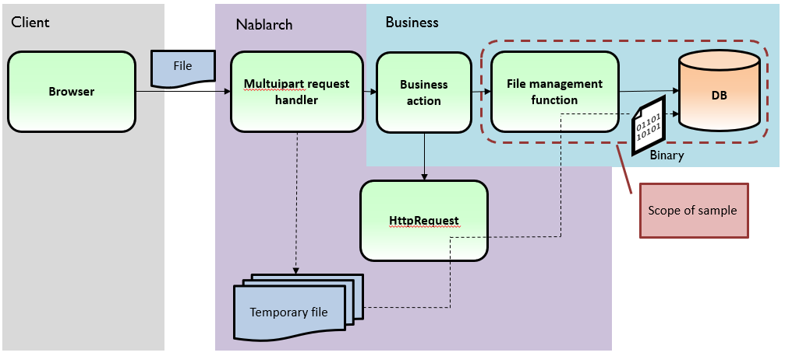

.. _DbFileManagement_result:

==================================================
Sample File Management Function Using Database
==================================================

------------
Summary
------------

Provides an implementation sample of the function to centrally manage the files used in business applications with DB.

`Source code <https://github.com/nablarch/nablarch-biz-sample-all>`_

The sample is intended for the following applications:

- File upload and download from the screen.

- Send and receive file transfers that handle a relatively small number of files. For example, dozens of files can be sent/received at a time.

- Assumed that relatively small files are managed. For example, a small image such as an ID photo.

.. tip::

  This sample uses H2 as a DB. If the DB is not H2, use by modifying the implementation to match the DB used.
  

The following is an example of the processing image during file upload and download.

When uploading files
========================

When the browser sends the file, the multipart request handler of Nablarch analyses the content and stores it in a temporary file.

This sample stores that file to the DB in a binary format.

When downloading files
========================

If a file is requested but clicking on the download tag, the business class action must set Stream to StreamResponse.

This sample gets the Stream from the DB.

.. image:: ./_images/DbFileManagement_outline02.png
   :width: 100%

----------------------
Delivery package
----------------------

The sample is provided in the following package.

  *please.change.me.* **common.file.management**

------------
Functions
------------

Implemented
========================
It has the following functions:

* File registration function

  * The file is stored in binary column based on the file’s Stream. When storing, a unique file management ID is assigned (using Nablarch indexing function), and the file management ID is returned to the caller.
  * Check that the file size does not exceed the column size.

* Function to delete files

  * Perform logical delete by rewriting the delete sign of records based on file management ID.

* Function to retrieve files

  * Retrieve and return the file from the file management table based on the file management ID.

Prerequisite specifications
==============================
* Delete is a specification to perform logical delete. At the time of operation, it is necessary to consider the clean up of records in logical delete status separately.

* There are only minimal columns in the table definition. When other information is required, it is presumed that separate tables be created for each job.

* To check contents of the file, only check that the file size does not exceed the column size. If there are other items to be checked, it is presumed that the checks shall be made by the caller.

* There is no file update process. If a process equivalent to the file update process is to be performed, it is assumed that the file delete process and file record process are executed in order.

------------
Structure
------------
Shows the sample structure.

Class diagram
========================
.. image:: ./_images/DbFileManagement_classdiagram.png
   :width: 100%

Responsibilities of each class
^^^^^^^^^^^^^^^^^^^^^^^^^^^^^^^^^^^^^^^

Class definition
~~~~~~~~~~~~~~~~~~~~~~~~~~~~~~

  =============================== ==========================================================================================================================
  Class name                      Summary
  =============================== ==========================================================================================================================
  FileManagementUtil              Utility class that manages files stored in DB. The process is delegated to the class that implements FileManagement.
  FileManagement                  Interface implementing the class that performs file management.
  DbFileManagement                Main part of the class that manages the files stored in the DB.
  =============================== ==========================================================================================================================

Table definition
~~~~~~~~~~~~~~~~~~~~~~~~~~~~~~

**File management table (FILE_CONTROL)**

The file management ID is stored along with the file in the file management table.

  ==================== ================== ============ =============== ==========================================================================
  Logical name         Physical name      Definition   Limitations      Supplementary notes
  ==================== ================== ============ =============== ==========================================================================
  File management ID   FILE_CONTROL_ID    String       Primary key     Unique ID assigned by the system (Indexed by Nablarch’s index function)

  File contents        FILE_OBJECT        Binary

  Delete sign          SAKUJO_SGN         String                       Sign to denote if the file has been deleted or not.
  
                                                                       0: Not deleted

                                                                       1: Deleted
  ==================== ================== ============ =============== ==========================================================================

---------------------------
How to Use
---------------------------

How to use FileManagementUtil
=============================================================================================

This section describes how to use the FileManagementUtil.

.. _FileManagementUtil-settings-label:

Usage example of FileManagementUtil (component configuration file)
^^^^^^^^^^^^^^^^^^^^^^^^^^^^^^^^^^^^^^^^^^^^^^^^^^^^^^^^^^^^^^^^^^^^^^^^^^^^^^^^^^^^^^^

When using FileManagementUtil, define each component’s property in the component configuration file when needed.

The components to be configured are shown below.

  ================================ ============================================================
  Component to be configured       Logical name used in configuration example
  ================================ ============================================================
  File management function body    fileManagement
  Numbering function               sequenceIdGenerator
  The formatter used for numbering dbFileManagementFormatter
  ================================ ============================================================

The configuration example shown below.

.. code-block:: xml

    <!-- File management function (the component of logical name fileManagement is used by FileManagementUtil class) -->
    <component name="fileManagement" class="please.change.me.common.file.management.DbFileManagement">

      <!-- Maximum length of storage file (unit: bytes) -->
      <property name="maxFileSize" value="10000000"/>

      <!-- Key to identify if the numbering function is used for numbering bFileManagement -->
      <property name="fileIdKey" value="1103" />

      <!-- Numbering function -->
      <property name="idGenerator" ref="sequenceIdGenerator" />

      <!--  Formatter used for numbering -->
      <property name="idFormatter" ref="dbFileManagementFormatter" />
    </component>

    <!-- Numbering function (used from the file management function) -->
    <component name="sequenceIdGenerator" class="nablarch.common.idgenerator.SequenceIdGenerator" />

    <!-- Formatter used for numbering (used from the file management function) -->
    <component name="dbFileManagementFormatter" class="nablarch.common.idgenerator.formatter.LpadFormatter">
      <!-- Number of digits -->
      <property name="length" value="18" />
      <!-- Characters to fill in the missing digits -->
      <property name="paddingChar" value="0" />
    </component>

Usage example of FileManagementUtil (When uploading files)
^^^^^^^^^^^^^^^^^^^^^^^^^^^^^^^^^^^^^^^^^^^^^^^^^^^^^^^^^^^^^^^^^^^^^^^^^^^^^^^^^^^^^^^

The usage of this sample is described assuming that file uploaded from the browser is stored in the DB.

.. code-block:: java

    public void doSaveFile(HttpRequest req, ExecutionContext ctx) {
        // Acquire the part to be saved
        PartInfo part = req.getPart("fileToSave").get(0);
        
        // If needed, file is validated for each job at this timing.
        
        // Register file to the DB
        String fileId = FileManagementUtil.save(part);
        
        // The process using fileId is performed next if necessary.
    }

Usage example of FileManagementUtil (When downloading files)
^^^^^^^^^^^^^^^^^^^^^^^^^^^^^^^^^^^^^^^^^^^^^^^^^^^^^^^^^^^^^^^^^^^^^^^^^^^^^^^^^^^^^^^

The usage of this sample is described assuming that the file is fetched from the DB and downloaded to the browser.

.. code-block:: java

    public HttpResponse doTempFile(HttpRequest req, ExecutionContext ctx) {
        //File ID used for download
        String fileId = "000000000000000001";
        
        // Acquire a file from DB
        Blob blob = FileManagementUtil.find(fileId);

        
        // Configure the response information
        StreamResponse res = new StreamResponse(blob);
        res.setContentDisposition("temp.png");
        res.setContentType("image/png");
        return res;
    }
