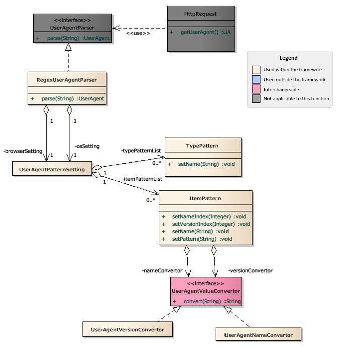

==================================================
 Sample UserAgent Information Acquisition Function
==================================================

.. important::

  This sample uses a Nablarch 1.4 compliant API.

  When combining with versions later than Nablarch 1.4 series, customize as necessary.

--------
Summary
--------

The UserAgent information acquisition function analyzes the value obtained from the HTTP header (User-Agent) according to the contents described in the configuration file,
and obtains the following information.

* OS type
* OS name
* OS version
* Browser type
* Browser name
* Browser version

It can be obtained from the application with ``HttpRequest#getUserAgent()``.

.. toctree::
  :hidden:

  useragent_sample

`Source code <https://github.com/nablarch/nablarch-biz-sample-all>`_

----------
Structure
----------

Class diagram
=============

Responsibilities of each class
===============================

Interface definition
----------------------

================================================================== ====================================================================================================
Class name                                                           Summary
================================================================== ====================================================================================================
please.change.me.fw.web.useragent.UserAgentValueConvertor           | An interface that converts acquired values (browser name, version number, etc.).
================================================================== ====================================================================================================

Class definition
------------------

\a) Implementation class for nablarch.fw.web.UserAgentParser

================================================================== =============================================================================================================
Class name                                                           Summary
================================================================== =============================================================================================================
please.change.me.fw.web.useragent.RegexUserAgentParser             | UserAgent analysis class that obtains various information on the OS and browser using regular expressions.
================================================================== =============================================================================================================

\b) Implementation class of nablarch.fw.web.useragent.UserAgentValueConvertor

================================================================== ====================================================================================================
Class name                                                           Summary
================================================================== ====================================================================================================
please.change.me.fw.web.useragent.UserAgentNameConvertor           | Converter that formats name items.
                                                                   | It has a function that replaces any strings.
please.change.me.fw.web.useragent.UserAgentVersionConvertor        | Converter that formats version items.
                                                                   | It has a function that divides version items and pads each item with an any string.
================================================================== ====================================================================================================

\c) Other classes

================================================================== =======================================================================================================================================
Class name                                                           Summary
================================================================== =======================================================================================================================================
nablarch.fw.web.HttpRequest                                        | Data object that stores the request message in the HTTP protocol.
                                                                   | The application obtains the UserAgent class from the ``getUserAgent`` method of this class.
nablarch.fw.web.useragent.UserAgent                                | Class that stores the results analyzed by the UserAgent analysis class.
                                                                   | Extend this class to customize the UserAgent analysis class and obtain any items.
please.change.me.fw.web.useragent.UserAgentPatternSetting          | Class that stores configuration items such as the list of analysis patterns and default values.
please.change.me.fw.web.useragent.TypePattern                      | Class that stores the regular expressions of parsing patterns to determine the type (OS/browser).
please.change.me.fw.web.useragent.ItemPattern                      | Class that stores the regular expressions of analysis patterns and converters to determine items (such as specific browser names).
================================================================== =======================================================================================================================================

 .. tip::
   **Additional information on the UserAgentVersionConvertor**
    
   This section describes the usage of the ``UserAgentValueConvertor`` class provided in the sample.
   In this class, strings are divided by "D (non-numeric)", each element is padded and the values that are separated by a space are used as the converted values.
   (Example: "34.0.1847.116" → "_34 __0 ___1847")
    
   The reason for this conversion is to use the browser version number after conversion as the CSS class name.
    
   There are various ways to perform this control, although special display control may be required only for certain browsers and terminals.
   If this control method is not standardized for all applications,
   ad hoc judgment processes and control processes will be scattered, and maintainability will be impaired.
    
   To standardize this control method, a method for "using the browser version number obtained from the user agent value as the CSS class name
   and controlling the specific browser or terminal by this CSS designation" has been provided.
   This class is intended to be used for display control applications.

------------------------------
Description of configuration
------------------------------
| The UserAgent information acquisition function can be configured using the system repository function.

Configuration of the UserAgent analysis class
===============================================

Details of configuration contents
----------------------------------

Configuration of please.change.me.fw.web.useragent.RegexUserAgentParser
~~~~~~~~~~~~~~~~~~~~~~~~~~~~~~~~~~~~~~~~~~~~~~~~~~~~~~~~~~~~~~~~~~~~~~~~
  
.. toctree::
  :hidden:
  
  useragent_sample

Configuration examples and more information on the configuration items of RegexUserAgentParser are shown below. Also, more specific configuration and usage examples are shown in :doc:`useragent_sample`.

.. code-block:: xml

 <?xml version="1.0" encoding="UTF-8"?>
 <component-configuration xmlns="http://tis.co.jp/nablarch/component-configuration"
                          xmlns:xsi="http://www.w3.org/2001/XMLSchema-instance">
  
   <!-- OS pattern mapping configuration -->
   <component name="userAgentParser" class="please.change.me.fw.web.useragent.RegexUserAgentParser">
     <property name="osSetting">
       <component class="please.change.me.fw.web.useragent.UserAgentPatternSetting">
         <!-- Pattern configuration for obtaining the OS type -->
         <property name="typePatternList">
           <list>
             <component class="please.change.me.fw.web.useragent.TypePattern">
               <property name="name"             value="desktop" />
               <!-- OS type extraction pattern (regular expression) -->
               <property name="pattern"          value="(?i).*(windows|mac os x).*" />
             </component>
           </list>
         </property>
         <!-- Pattern configuration for acquiring OS information -->
         <property name="itemPatternList">
           <list>
             
             <component class="please.change.me.fw.web.useragent.ItemPattern">
               <!-- OS information extraction pattern (regular expression) -->
               <property name="pattern"          value="(?i).*(windows|mac os x)[\D+]*([\d\._]*).*" />
               <property name="nameIndex"        value="1" />  <!-- Configure the first capture group to the OS name -->
               <property name="versionIndex"     value="2" />  <!-- Configure the second capture group to the OS name -->
               <property name="nameConvertor"    ref="osNameConvertor" />
               <property name="versionConvertor" ref="deviceVersionConvertor" />
             </component>
           </list>
         </property>
       </component>
     </property>
     <property name="browserSetting">
       <component class="please.change.me.fw.web.useragent.UserAgentPatternSetting">
         <property name="typePatternList">
           <list>
             <component class="please.change.me.fw.web.useragent.TypePattern">
               <property name="name"             value="Gecko" /> 
               <property name="pattern"          value=".*Gecko.*" />
             </component>
           </list>
         </property>
         <property name="itemPatternList">
           <list>
             <component class="please.change.me.fw.web.useragent.ItemPattern">
               <property name="pattern"          value="(?i).*(msie\s|trident.+rv:)([\d\.]*).*" />
               <property name="name"             value="ie" /> <!-- Browser name to use when the group index is not specified -->
               <property name="versionIndex"     value="2" />
               <property name="versionConvertor" ref="browserVersionConvertor" />
             </component>
           </list>
         </property>
       </component>
     </property>
   </component>
 </component-configuration>

The property values of RegexUserAgentParser are shown below.

==================== ======================================================================
property name        Settings
==================== ======================================================================
osSetting            | Defines the parsing pattern configuration for OS information.
                     | The value that can be configured is UserAgentPatternSetting.
                     | If not specified, all OS information will be null.
browserSetting       | Defines the parsing pattern configuration for browser information.
                     | The value that can be configured is UserAgentPatternSetting.
                     | If not specified, all browser information will be null.
==================== ======================================================================

The property values of UserAgentPatternSetting are shown below.

==================== =============================================================================================================================================================
property name        Settings
==================== =============================================================================================================================================================
defaultType          | Defines the default item type.
                     | Used when the UserAgent does not match any of the patterns, or when an error occurs during determination.
                     | If not specified, the item type will be "UnknownType".

defaultName          | Defines the default item name.
                     | Used when the UserAgent does not match any of the patterns, or when an error occurs during determination.
                     | If not specified, the item name will be "UnknownName".

defaultVersion       | Defines the default version.
                     | Used when the UserAgent does not match any of the patterns, or when an error occurs during determination.
                     | If not specified, the version will be "UnknownVersion".

typePatternList      | Defines the parsing pattern in List to acquire item types from UserAgent.
                     | UserAgentPattern is used as the element of the list.
                     | Parsing of pattern is performed in the order in which the list is defined and parsing of the corresponding group is terminated when a match is made.
                     | If not specified, parsing will be not performed.

itemPatternList      | Defines the parsing pattern with List to get the item name and version from UserAgent.
                     | UserAgentPattern is used as the element of the list.
                     | Parsing of pattern is performed in the order in which the list is defined and parsing of the corresponding group is terminated when a match is made.
                     | If not specified, parsing will be not performed.
==================== =============================================================================================================================================================

            
             
 

The property values of TypePattern are shown below.

==================== =======================================================================================================================================
property name        Settings
==================== =======================================================================================================================================
name                 | Defines the item name of this pattern.
                     | This value may be set to the same value as other patterns.

pattern              | Defines the parsing pattern as a regular expression.
                     | If an invalid pattern is specified, IllegalArgumentException will be thrown during initialization.
==================== =======================================================================================================================================

The property values of ItemPattern are shown below.

==================== =======================================================================================================================================
property name        Settings
==================== =======================================================================================================================================
name                 | Defines the item name of this pattern.
                     | This value may be set to the same value as other patterns.
                     | This value is used when the group number to be captured with nameIndex is not specified.
                     | If not specified, the item type will be the value specified by defaultType.

pattern              | Defines the parsing pattern as a regular expression.
                     | The group must be configured to capture the value with the group number specified in nameIndex and versionIndex.
                     | If an invalid pattern is specified, IllegalArgumentException will be thrown during initialization.
                     | If not specified, parsing will be not performed.

nameIndex            | Defines a group number to be captured as an item name from the parsing pattern.
                     | If an invalid index is specified, IllegalArgumentException will be thrown during initialization.
                     | If not specified, the item name will have the same value as the item type.
                     | If the item type is not specified, it will be the value specified by defaultName.

versionIndex         | Defines a group number to be captured as a version from the parsing pattern.
                     | If an invalid index is specified, IllegalArgumentException will be thrown during initialization.
                     | If not specified, the version will be the value specified by defaultVersion.

nameConvertor        | Defines an implementation class for UserAgentValueConvertor that performs string conversion after item name extraction.
                     | UserAgentNameConvertor is provided as a standard implementation.
                     | UserAgentNameConvertor simply replaces the specified string before replacement with the string after replacement .
                     | Also, if the toLowerCase property is set, the string is converted to lower case before replacement.
                     | Example: "mac os x" → "mac_os_x"
                     | If not specified, conversion will be not performed.

versionConvertor     | Defines an implementation class for UserAgentValueConvertor that performs string conversion after version extraction.
                     | UserAgentVersionConvertor is provided as a standard implementation.
                     | UserAgentVersionConvertor divides the string by "\D (non-numeric)" into three elements.
                       Each element is padded and the values that are separated by a space are used as the converted values.
                     | Example: "34.0.1847.116" → "_34 __0 ___1847"
                     | If not specified, conversion will be not performed.
==================== =======================================================================================================================================

The property values of UserAgentNameConvertor are shown below.

==================== =======================================================================================================================================
property name        Settings
==================== =======================================================================================================================================
toLowerCase          | Defines the lowercase flag for string.
                     | If not specified, lower case will be used.

replaceFrom          | Defines the string before replacement.

replaceTo            | Defines the string after replacement.
                     | If both replaceFrom and replaceTo are not specified, conversion will not be performed.
==================== =======================================================================================================================================

The property values of UserAgentVersionConvertor are shown below.

==================== =======================================================================================================================================
property name        Settings
==================== =======================================================================================================================================
padding              | Define the padding string.
                     | If not specified, conversion will be not performed.
==================== =======================================================================================================================================

----------
Use case
----------

.. code-block:: java

 public HttpResponse doUserAgentJudgment(HttpRequest req, ExecutionContext context) {
 
     UserAgent userAgent = req.getUserAgent();
     
     if (userAgent.getOsType().equals("android")) {
         ... // Processing when the client is android
     }
     
     if (userAgent.getBrowserName().equals("chrome")) {
         ... // Processing when the browser is chrome
     }
 }
