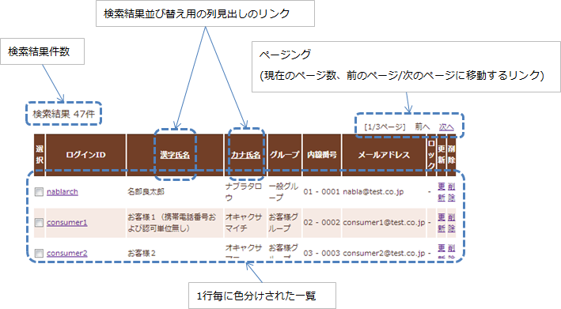

.. _list_search_result:

======================================================
検索結果の一覧表示
======================================================

本サンプルは、検索結果の一覧表示を行うタグファイルの実装サンプルである。

`ソースコード <https://github.com/nablarch/nablarch-biz-sample-all>`_

--------------
提供パッケージ
--------------

本サンプルは、以下のパッケージで提供される。

  *resources/META-INF/tags/*\ **listSearchResult**

------------
概要
------------
ここでは、検索結果の一覧表示を行うタグファイルの実装サンプルを提供する。
タグファイルは、フレームワークが提供する一覧検索用の検索機能と連携して、次の機能を提供する。

* 検索結果件数の表示機能
* 1画面にすべての検索結果を表示する一覧表示機能
* 検索結果を指定件数毎に表示する機能(以降はページングと称す)
* 検索結果の並び替え機能

一覧画面の出力例を示す。

.. _ListSearchResult_Structure:

|

------------
構成
------------
本サンプルの構成を示す。

クラス図
========================
フレームワークが提供するクラスやタグファイルの位置付けを明示するために、\
ユーザ検索を行う業務アプリケーションのクラスとJSPを構成に含めている。

ページングを実現したい場合、フレームワークが提供するクラスとサンプル提供のタグファイルがページングに必要な処理を行うため、\
アプリケーションプログラマはページングを作り込みせずに実現できる。

.. image:: ./_images/ListSearchResult_Structure.jpg
   :scale: 60

フレームワークが提供するクラスとタグファイルの責務
^^^^^^^^^^^^^^^^^^^^^^^^^^^^^^^^^^^^^^^^^^^^^^^^^^^^^^^^^^^^^^^^^^^^^

\a) フレームワーク

  =============================== ==========================================================================
  クラス名                        概要
  =============================== ==========================================================================
  DBAccessSupport                 一覧検索用の検索を行うsearchメソッドを提供する。
  ListSearchInfo                  一覧検索用の情報を保持するクラス。
  TooManyResultException          一覧検索において検索結果件数が検索結果の最大件数(上限)を超えた場合に発生する例外。
  =============================== ==========================================================================

\b) タグファイル

  =============================== ==========================================================================
  タグ名                          概要
  =============================== ==========================================================================
  listSearchResult                検索結果の一覧表示を行うタグ。
  listSearchPaging                ページングを出力するタグ。
  listSearchSubmit                ページングのサブミット要素を出力するタグ。
  listSearchParams                ページングのサブミット要素用に変更パラメータを出力するタグ。
  table                           テーブルを出力するタグ。
  listSearchSortSubmit            ソート用のサブミット要素を出力するタグ。
  =============================== ==========================================================================

|

---------------------------
使用方法
---------------------------
ページングを使用する場合を想定し、本サンプルの使用方法を解説する。
ユーザ検索を行う業務アプリケーションを実装例に解説する。

.. _ListSearchResult_DbAccessSupport:

DbAccessSupportクラス
===============================================================================
DbAccessSupportクラスは、データベースアクセス機能が提供するデータベースアクセス処理を簡易的に実装するためのサポートクラスである。

DbAccessSupportは、一覧検索用の検索を実行するsearchメソッドを提供する。\
searchメソッドは、SQL_IDとListSearchInfoを受け取り、次の処理を行う。

* 指定されたSQL_IDとListSearchInfoから検索結果の件数取得を行う。
* 検索結果件数が上限を超えている場合は、TooManyResultExceptionを送出する。
* 検索結果件数が上限を超えていない場合は、検索を実行し検索結果を返す。検索結果件数は引数で指定されたListSearchInfoに設定する。

SQL_IDで指定するSQL文は、業務に必要な検索条件を基に検索を行うSQL文(つまりSELECT文)を指定する。\
検索を行うSQL文を基にした検索結果の件数取得や検索結果の開始位置と取得件数を指定した検索の実行は、フレームワークで行う。

TooManyResultExceptionは、検索結果の最大件数(上限)と(実際の)検索結果の取得件数を保持する。\
検索結果件数の上限設定については、 :ref:`ListSearchResult_Setting` を参照。

searchメソッドを使用した検索処理の実装例を示す。

.. code-block:: java

 // 入力精査済みの検索条件の取得
 W11AC01SearchForm condition = ...;
 
 // 検索実行
 SqlResultSet searchResult = null;
 try {
 
     // ページング付きの検索処理。
     // "SELECT_USER_BY_CONDITION"は、ユーザ検索を行うSELECT文に対するSQL_ID。
     searchResult = search("SELECT_USER_BY_CONDITION", condition);
 
 } catch (TooManyResultException e) {
 
     // 検索結果件数が上限を超えた場合のエラー処理。
     // TooManyResultExceptionは、検索結果の最大件数(上限)、実際の検索結果件数を提供する。
     // "MSG00024"は「検索結果が上限件数({0}件)を超えました。」というメッセージに対するメッセージID。
     throw new ApplicationException(
         MessageUtil.createMessage(MessageLevel.ERROR, "MSG00024", e.getMaxResultCount()));
 }

.. _ListSearchResult_ListSearcInfo:

----------------------------
ListSearchInfoクラス
----------------------------
ListSearchInfoクラスは、一覧検索用の情報を保持するクラスである。\
業務アプリケーションで検索条件を保持するクラスは、ListSearchInfoを継承して作成する。

ListSearchInfoを継承するクラスでは、下記の実装が必要となる。\

* ページング用の検索処理に必要な下記プロパティを他の検索条件と同様に入力精査に含める。

 * pageNumber(取得対象のページ番号)

さらに、アクションでは、下記の実装が必要となる。

* 検索結果を表示する際は、ListSearchInfoを継承したクラスのオブジェクトをリクエストスコープに設定する。

ListSearchInfoを継承したクラス(W11AC01SearchForm)とアクション(W11AC01Action)の実装例を下記に示す。

.. code-block:: java

 // ListSearchInfoを継承したクラス。
 public class W11AC01SearchForm extends ListSearchInfo {
     
     // 検索条件のプロパティ定義は省略。
     
     // バリデーション機能に対応したコンストラクタ。
     public W11AC01SearchForm(Map<String, Object> params) {
     
        // 検索条件のプロパティ設定は省略。
        
        // ListSearchInfoのプロパティを設定する。
        setPageNumber((Integer) params.get("pageNumber"));
     }
     
     // オーバーライドして入力精査用のアノテーションを付加する。
     // 検索結果の最大件数(上限):200件、1ページの表示件数:20件の場合。
     @PropertyName("ページ番号")
     @Required
     @NumberRange(max = 10, min = 1)
     @Digits(integer = 2)
     public void setPageNumber(Integer pageNumber) {
         super.setPageNumber(pageNumber);
     }
     
     /** 精査対象プロパティ(検索条件のプロパティは省略) */
     private static final String[] SEARCH_COND_PROPS = new String[] { ..., "pageNumber"};
     
     // オーバーライドして検索条件のプロパティ名を返す。
     // 通常は精査対象プロパティと同じとなる。
     public String[] getSearchConditionProps() {
         return SEARCH_COND_PROPS;
     }
 }

.. code-block:: java

 // 検索画面のアクション。
 public class W11AC01Action extends DbAccessSupport {
 
     // 初期表示
     public HttpResponse doRW11AC0101(HttpRequest req, ExecutionContext ctx) {
         // 初期表示は、業務処理のみのため省略。
     }
     
     // 検索
     @OnError(type = ApplicationException.class, path = "/ss11AC/W11AC0101.jsp")
    public HttpResponse doRW11AC0102(HttpRequest req, ExecutionContext ctx) {
         
         // 業務処理は省略。
         
         // 入力精査
         ValidationContext<W11AC01SearchForm> searchConditionCtx = ...;
         searchConditionCtx.abortIfInvalid();
         
         // ListSearchInfoを継承したクラス(UserSearchCondition)をリクエストスコープに設定する。
         UserSearchCondition condition = searchConditionCtx.createObject();
         ctx.setRequestScopedVar("11AC_W11AC01", condition);
         
         // 検索実行
         SqlResultSet searchResult = null;
         try {
             searchResult = search("SELECT_USER_BY_CONDITION", condition);
         } catch (TooManyResultException e) {
             throw new ApplicationException(
                 MessageUtil.createMessage(MessageLevel.ERROR, "MSG00024", e.getMaxResultCount()));
         }
         
         // 検索結果をリクエストスコープに設定
         ctx.setRequestScopedVar("searchResult", searchResult);
         
         return new HttpResponse("/ss11AC/W11AC0101.jsp");
     }
 }

.. /*

.. _ListSearchResult_ListSearchResultTag:

---------------------------
listSearchResultタグ
---------------------------
:ref:`ListSearchResult_Tag` は、検索結果のリスト表示を行うタグである。\
listSearchResultタグで出力する画面要素を下記に示す。 

.. image:: ./_images/ListSearchResult_PagingTableFull.jpg
   :scale: 60

listSearchResultタグの主要な属性
=====================================
listSearchResultタグの主要な属性を下記に示す。全ての属性の詳細については、 :ref:`ListSearchResult_Tag` を参照。

resultSetName属性で指定された検索結果がリクエストスコープに存在しない場合、listSearchResultタグは何も出力しない。\
検索画面の初期表示が何も出力されないケースに該当する。

====================================== ==========================================================================================
属性                                   説明
====================================== ==========================================================================================
全体
---------------------------------------------------------------------------------------------------------------------------------
listSearchInfoName                     ListSearchInfoをリクエストスコープから取得する際に使用する名前。|br|
                                       指定がない場合は「検索結果件数」および「ページング」を表示しない。|br|
                                       一括削除確認画面など、一覧表示のみを行う場合は指定しない。
検索結果件数
---------------------------------------------------------------------------------------------------------------------------------
useResultCount                         検索結果件数を表示するか否か。|br|
                                       デフォルトはtrue。
ページング
---------------------------------------------------------------------------------------------------------------------------------
usePaging                              ページングを表示するか否か。|br|
                                       デフォルトはtrue。|br|
searchUri                              ページングのサブミット要素に使用するURI。|br|
                                       ページングを表示する場合は必ず指定すること。
検索結果
---------------------------------------------------------------------------------------------------------------------------------
resultSetName(必須)                    検索結果をリクエストスコープから取得する際に使用する名前。|br|
headerRowFragment(必須)                ヘッダ行のJSPフラグメント。ヘッダ行については、 :ref:`ListSearchResult_TableElement` を参照。|br|
bodyRowFragment(必須)                  ボディ行のJSPフラグメント。ボディ行については、 :ref:`ListSearchResult_TableElement` を参照。
====================================== ==========================================================================================

.. _ListSearchResult_ResultCountElement:

検索結果件数
=====================================
検索結果件数は、useResultCount属性にtrue(デフォルトはtrue)が指定され、検索結果がリクエストスコープに存在する場合に表示される。\
検索結果件数は、デフォルトでは下記の書式で出力される。

.. code-block:: jsp

 検索結果 <%-- ListSearchInfoのresultCountプロパティ --%>件

デフォルトの書式を変更したい場合は、resultCountFragment属性にJSPフラグメントを指定する。\
resultCountFragment属性の指定例を下記に示す。\
JSPフラグメントは、カスタムタグから呼び出されて評価されるため、listSearchInfoName属性で指定した名前を使用して\
ListSearchInfoオブジェクトにアクセスすることが可能となる。

.. code-block:: jsp

 <nbs:listSearchResult listSearchInfoName="11AC_W11AC01"
                     searchUri="/action/ss11AC/W11AC01Action/RW11AC0102"
                     resultSetName="searchResult">
     
     <%-- resultCountFragment属性にJSPフラグメントを指定する。 --%>
     <jsp:attribute name="resultCountFragment">
        [サーチ結果 <n:write name="searchCondition.resultCount" />頁]
     </jsp:attribute>
     
     <%-- その他の属性は省略。 --%>
     
 </nbs:listSearchResult>

上記指定後の検索結果件数の書式を下記に示す。

.. code-block:: jsp

 [サーチ結果 <%-- ListSearchInfoのresultCountプロパティ --%>頁]

.. _ListSearchResult_PagingElement:

ページング
=====================================
ページングは、usePaging属性にtrue(デフォルトはtrue)が指定された場合に表示される。\
ページングの画面要素を下記に示す。\
ページングは、現在のページ番号とページを移動するためのサブミット要素から構成される。

|

.. image:: ./_images/ListSearchResult_PagingFull.jpg
   :scale: 60

|

ページング全体は、検索結果件数が1件以上の場合に表示される。\
ページング全体が表示される前提で、ページングの画面要素の表示について下記に示す。

====================================== ==========================================================================================
ページングの画面要素                   説明
====================================== ==========================================================================================
現在のページ番号                       現在のページ番号は常に表示される。
最初、前へ、次へ、最後                 現在のページ番号から各画面要素が示すページに遷移可能な場合は、サブミット可能な状態で表示される。
                                       遷移不可の場合は、リンクであればラベル、ボタンであれば使用不可な状態で表示される。
ページ番号                             ページ番号全体(1..n)は、総ページ数が2以上の場合のみ表示される。
                                       各ページ番号は、上記の「最初」や「前へ」と同様に、遷移可否に応じて表示される。
====================================== ==========================================================================================

ページングの画面要素で指定可能な属性のうち、代表的なものを下記に示す。
全ての属性の詳細については、 :ref:`ListSearchResult_Tag` を参照。

* 各画面要素の使用有無
* 各画面要素のラベル(最初、前へ、次へ、最後など)

 * 現在のページ番号はJSPフラグメントによる変更
 * ページ番号はページ番号をラベルに使用するため変更不可

* 各サブミット要素に使用するタグ(n:submitLink、n:submit、n:buttonのいずれか)

**ページング時の検索条件**

ページング時の検索条件は、前回検索時の条件（現在表示されている検索結果を取得した時の条件）を使用する。
つまり、検索条件を変更してからページングを行った場合には、変更した検索条件の値は破棄されることを意味する。

検索条件の維持は、画面間で入力値を持ち回る場合と同様に、ウィンドウスコープを使用して実現する。\
このため、検索条件と検索結果一覧を一つの画面に配置する場合、検索条件と検索結果一覧のフォームを分けて実装する必要がある。

|

.. image:: ./_images/ListSearchResult_FormDivide.jpg
   :scale: 60

|

**ページング使用時に検索結果が減少した場合の動作**

ここでは、ページングの各サブミット要素で検索結果ページを切り替えてる最中に、他のユーザオペレーションなどにより、\
検索結果が減少した場合の動作について解説する。

本フレームワークでは、指定されたページ番号に基づき検索を実施し、ページングの各画面要素の表示を行う。\
下記に検索結果が減少した場合のページングの動作例を示す。

前提として、検索結果の取得件数(1ページの表示件数)は20件とする。

まず、検索を実行し検索結果が44件であったとする。下記は3ページ目を選択した後のページングの表示である。

|

.. image:: ./_images/ListSearchResult_PagingBefore.jpg
   :scale: 60

|

次に2ページ目(又は前へ)を選択した後、かつ検索結果が10件に減少した場合のページングの表示と表示内容の説明を示す。\
2ページ目に対する検索結果としてページングの各画面要素が表示される。

|

.. image:: ./_images/ListSearchResult_PagingAfter.jpg
   :scale: 60

|

====================================== ==========================================================================================
ページングの画面要素                   表示内容の説明
====================================== ==========================================================================================
現在のページ番号                       2ページ目が指定され、検索結果が20件以下のため、2/1ページとなる。
最初、前へ                             現在2ページ目で検索結果が10件のため、前のページに遷移可能となりリンクで表示される。
次へ、最後                             現在2ページ目で検索結果が10件のため、次のページに遷移不可となりラベルで表示される。
ページ番号                             検索結果が10件で総ページ数が1のため、ページ番号は表示されない。
====================================== ==========================================================================================

現在のページ番号とサブミット要素の対応が取れているため、操作不能な状態にならず、\
サブミット要素を選択することで検索結果のページに遷移することが可能である。\
(もちろん検索フォームから検索しなおせば、1ページ目からの検索結果となる)

次に「前へ」を選択した後のページングの表示を示す。現在のページ番号と総ページ数の対応が正常な状態に戻る。

|

.. image:: ./_images/ListSearchResult_PagingAfter2.jpg
   :scale: 60

|

.. _ListSearchResult_TableElement:

検索結果
=====================================
検索結果の画面要素を下記に示す。\
検索結果は、列見出しを表示するヘッダ行と、行データを表示するボディ行から構成される。

.. image:: ./_images/ListSearchResult_TableFull.jpg
   :scale: 60

検索結果は、検索結果がリクエストスコープに存在する場合は常に表示される。\
検索結果が0件の場合は、ヘッダ行のみ表示される。

ヘッダ行とボディ行は、それぞれheaderRowFragment属性、bodyRowFragment属性にJSPフラグメントで指定する。\
ボディ行のJSPフラグメントは、検索結果のループ内(JSTLのc:forEachタグ)で呼び出され評価される。\
このため、ボディ行のJSPフラグメントで行データ(c:forEachタグのvar属性)とステータス(c:forEachタグのstatus属性)にアクセスするために、\
下記の属性を設けている。

====================================== ==========================================================================================
属性                                   説明
====================================== ==========================================================================================
varRowName                             ボディ行のフラグメントで行データ(c:forEachタグのvar属性)を参照する際に使用する変数名。|br|
                                       デフォルトは"row"。|br|
varStatusName                          ボディ行のフラグメントでステータス(c:forEachタグのstatus属性)を参照する際に使用する変数名。|br|
                                       デフォルトは"status"。
                                       
                                       .. tip::
                                       
                                        n:writeタグを使用してステータスにアクセスすると、n:writeタグとEL式でアクセス方法が異なるために\
                                        エラーが発生し値を取得できない。\
                                        n:setタグを使用してステータスにアクセスすることで、このエラーを回避できる。\
                                        下記に使用例を示す。
                                        
                                        .. code-block:: jsp
                                        
                                         <n:set var="rowCount" value="${status.count}" />
                                         <n:write name="rowCount" />
                                       
varCountName                           ステータス(c:forEachタグのstatus属性)のcountプロパティを参照する際に使用する変数名。|br|
                                       デフォルトは"count"。|br|
varRowCountName                        検索結果のカウント(検索結果の取得開始位置＋ステータスのカウント)を参照する際に使用する変数名。|br|
                                       デフォルトは"rowCount"。
====================================== ==========================================================================================

さらに、ボディ行では、1行おきに背景色を変えたい場合に対応するために、ボディ行のclass属性を指定する下記の属性を設けている。

====================================== ==========================================================================================
属性                                   説明
====================================== ==========================================================================================
varOddEvenName                         ボディ行のclass属性を参照する際に使用する変数名。|br|
                                       この変数名は、1行おきにclass属性の値を変更したい場合に使用する。|br|
                                       デフォルトは"oddEvenCss"。|br|
oddValue                               ボディ行の奇数行に使用するclass属性。|br|
                                       デフォルトは"nablarch_odd"。|br|
evenValue                              ボディ行の偶数行に使用するclass属性。|br|
                                       デフォルトは"nablarch_even"。
====================================== ==========================================================================================

ユーザ検索の指定例を下記に示す。タグファイルのプレフィックスは nbs とする。

.. code-block:: jsp

 <nbs:listSearchResult listSearchInfoName="11AC_W11AC01"
                       searchUri="/action/ss11AC/W11AC01Action/RW11AC0102"
                       resultSetName="searchResult">
     
     <%-- ヘッダ行のJSPフラグメント指定。 --%>
     <jsp:attribute name="headerRowFragment">
         <tr>
             <th>ログインID</th>
             <th>漢字氏名</th>
             <th>カナ氏名</th>
             <th>グループ</th>
             <th>内線番号</th>
             <th>メールアドレス</th>
         </tr>
     </jsp:attribute>
     
     <%-- ボディ行のJSPフラグメント指定。 --%>
     <jsp:attribute name="bodyRowFragment">
     
         <%-- デフォルトの変数名"oddEvenCss"を使用してclass属性にアクセスする。 --%>
         <tr class="<n:write name='oddEvenCss' />">
         
             <%-- デフォルトの変数名"row"を使用して行データにアクセスする。 --%>
             <td>[<n:write name="count" />] [<n:write name="rowCount" />] <n:write name="row.loginId" /></td>
             <td><n:write name="row.kanjiName" /></td>
             <td><n:write name="row.kanaName" /></td>
             <td><n:write name="row.ugroupId" />:<n:write name="row.ugroupName" /></td>
             <td><n:write name="row.extensionNumberBuilding" />-<n:write name="row.extensionNumberPersonal" /></td>
             <td><n:write name="row.mailAddress" /></td>
             
         </tr>
     </jsp:attribute>
 </nbs:listSearchResult>

上記指定後の検索結果を下記に示す。

.. image:: ./_images/ListSearchResult_TableStatus.jpg
   :scale: 60

.. _ListSearchResult_Sort:

--------------------------------
検索結果の並び替え
--------------------------------
検索結果の一覧表示では、列見出しを選択することで選択された列データによる並び替えを行いたい場合がある。\
検索結果の並び替えは、並び替え用の列見出しを出力する :ref:`ListSearchResult_ListSearchSortSubmitTag` と、\
データベースアクセス機能が提供する可変ORDER BY構文(ORDER BY句を動的に変更する構文)を使用した検索処理により実現する。\
可変ORDER BY構文の詳細については、フレームワークの解説書を参照。

ユーザ検索に並び替えを適用した場合の画面イメージを下記に示す。\
ユーザ検索では、漢字氏名とカナ氏名による並び替えを提供している。

.. image:: ./_images/ListSearchResult_SortSubmitTag.jpg
   :scale: 60

ここでは、ユーザ検索に並び替えを適用する場合の実装例を使用して解説を行う。

検索処理の実装方法
===============================
検索結果の並び替えを行うには、可変ORDER BY構文を使用してSQL文を定義する。\
可変ORDER BY構文を使用したSQL文の例を下記に示す。

下記のSQL文では、漢字氏名とカナ氏名を並び替えるための可変ORDER BY句を使用している。
どのORDER BYを使用するかは、$sort (sortId)の記述により、検索条件オブジェクトのsortIdフィールドから取得した値が使用される。\
例えば、検索条件オブジェクトのsortIdフィールドが kanaName_asc の場合、ORDER BY句は"ORDER BY USR.KANA_NAME, SA.LOGIN_ID"に変換される。

.. code-block:: sql

 -- 可変ORDER BY構文を使用したSQL文
 SELECT
   -- 省略
 FROM
     -- 省略
 WHERE
     -- 省略
 $sort (sortId) {
    (kanjiName_asc  USR.KANJI_NAME, SA.LOGIN_ID)
    (kanjiName_desc USR.KANJI_NAME DESC, SA.LOGIN_ID)
    (kanaName_asc   USR.KANA_NAME, SA.LOGIN_ID)
    (kanaName_desc  USR.KANA_NAME DESC, SA.LOGIN_ID) }

ListSearchInfoクラスは、並び替えに対応するためにsortIdプロパティを定義している。\
検索結果の並び替えを行う場合は、sortIdプロパティを入力精査に含める。\
ListSearchInfoを継承したクラス(W11AC01SearchForm)の実装例を下記に示す。

.. code-block:: java

 // ListSearchInfoを継承したクラス。
 public class W11AC01SearchForm extends ListSearchInfo {
     
     // 検索条件のプロパティ定義は省略。
     
     // バリデーション機能に対応したコンストラクタ。
     public W11AC01SearchForm(Map<String, Object> params) {
     
        // 検索条件のプロパティ設定は省略。
        
        // ListSearchInfoのsortIdプロパティを設定する。
        setSortId((String) params.get("sortId"));
     }
     
     // オーバーライドして入力精査用のアノテーションを付加する。
     @PropertyName("ソートID")
     @Required
     public void setSortId(String sortId) {
         super.setSortId(sortId);
     }
     
     /** 精査対象プロパティ(検索条件のプロパティは省略) */
     private static final String[] SEARCH_COND_PROPS = new String[] { ..., "sortId"};
     
     // オーバーライドして検索条件のプロパティ名を返す。
     // 通常は精査対象プロパティと同じとなる。
     // ページングの各サブミット要素が検索条件をサブミットする際に使用する。
     public String[] getSearchConditionProps() {
         return SEARCH_COND_PROPS;
     }
 }

listSearchSortSubmitタグ
===============================
listSearchSortSubmitタグは、並び替え用のサブミット要素を出力する。

listSearchSortSubmitタグの必須属性及び代表的な属性を下記に示す。\
listSearchSortSubmitタグで指定できる全ての属性については、 :ref:`ListSearchResult_ListSearchSortSubmitTag` を参照。

====================================== ==========================================================================================
属性                                   説明
====================================== ==========================================================================================
sortCss                                並び替えを行うサブミットのclass属性。|br|
                                       常にサブミットのclass属性に出力される。|br|
                                       デフォルトは"nablarch_sort"。
ascCss                                 昇順に並び替えた場合に指定するサブミットのclass属性。|br|
                                       sortCss属性に付加するかたちで出力される。|br|
                                       デフォルトは"nablarch_asc"。(出力例: class="nablarch_sort nablarch_asc")
descCss                                降順に並び替えた場合に指定するサブミットのclass属性。|br|
                                       sortCss属性に付加するかたちで出力される。|br|
                                       デフォルトは"nablarch_desc"。(出力例: class="nablarch_sort nablarch_desc")
ascSortId(必須)                        昇順に並び替える場合のソートID。
descSortId(必須)                       降順に並び替える場合のソートID。
defaultSort                            デフォルトのソートID。|br|
                                       下記のいずれかを指定する。|br|
                                       asc(昇順) |br|
                                       desc(降順) |br|
                                       デフォルトは"asc"。
label(必須)                            並び替えを行うサブミットに使用するラベル。
name(必須)                             並び替えを行うサブミットに使用するタグのname属性。|br|
                                       name属性は、画面内で一意にすること。
listSearchInfoName(必須)               ListSearchInfoをリクエストスコープから取得する際に使用する名前。
====================================== ==========================================================================================

listSearchSortSubmitタグを使用したJSPの実装例を下記に示す。タグファイルのプレフィックスは nbs とする。

.. code-block:: jsp

 <nbs:listSearchResult listSearchInfoName="11AC_W11AC01"
                     searchUri="/action/ss11AC/W11AC01Action/RW11AC0102"
                     resultSetName="searchResult"
                     usePageNumberSubmit="true"
                     useLastSubmit="true">
     <jsp:attribute name="headerRowFragment">
         <tr>
             <%-- 漢字氏名以外の列は省略。 --%>
             <th>
                 <%-- 漢字氏名を並び替え用のリンクにする。--%>
                 <%-- SQL文に合わせて昇順(kanjiName_asc)と降順(kanjiName_desc)のソートIDを指定する。 --%>
                 <nbs:listSearchSortSubmit ascSortId="kanjiName_asc" descSortId="kanjiName_desc"
                                         label="漢字氏名" uri="/action/ss11AC/W11AC01Action/RW11AC0102"
                                         name="kanjiNameSort" listSearchInfoName="11AC_W11AC01" />
             </th>
         </tr>
     </jsp:attribute>
     <jsp:attribute name="bodyRowFragment">
         <%-- 省略 --%>
     </jsp:attribute>
 </nbs:listSearchResult>

並び替えのサブミット要素では、検索フォームから検索された時点の検索条件を使用して検索を実行する。\
ページング使用時の検索条件と同様に、ウィンドウスコープを使用して検索条件を維持する。

並び替えのサブミット要素では、常に先頭ページ(ページ番号:1)を検索する。\
並び替えが変更された場合、検索前のページ番号は異なる並び順に対する相対位置となり、\
検索後に意味のあるページ位置とならないためである。

**現在の並び替え状態に応じたlistSearchSortSubmitタグの動作**

listSearchSortSubmitタグは、現在の並び替え状態に応じて下記の値を決定する。\
現在の並び替え状態は、検索に使用されたソートIDとなる。

* サブミット要素が選択された場合にリスエスト送信するソートID
* 昇順又は降順に応じてサブミット要素に指定するCSSクラス

ここでは、下記の実装例を前提に、listSearchSortSubmitタグの動作を解説する。\

.. code-block:: jsp

 <%-- 漢字氏名を並び替え用のリンクにする。--%>
 <%-- SQL文に合わせて昇順(kanjiName_asc)と降順(kanjiName_desc)のソートIDを指定する。 --%>
 <nbs:listSearchSortSubmit ascSortId="kanjiName_asc" descSortId="kanjiName_desc"
                           label="漢字氏名" uri="/action/ss11AC/W11AC01Action/RW11AC0102"
                           name="kanjiNameSort" listSearchInfoName="11AC_W11AC01" />

==================================================== ================================================================================================== ======================================================================================================
検索に使用されたソートID                             リクエスト送信するソートID                                                                         使用されるCSSクラス
==================================================== ================================================================================================== ======================================================================================================
kanjiName_asc                                        ascSortId属性(=kanjiName_asc)と等しいため、descSortId属性の値(=kanjiName_desc)を使用する。         ascSortId属性(=kanjiName_asc)と等しいため、ascCss属性の値(nablarch_asc)を使用する。
kanjiName_desc                                       descSortId属性(=kanjiName_desc)と等しいため、ascSortId属性の値(=kanjiName_asc)を使用する。         descSortId属性(=kanjiName_desc)と等しいため、descCss属性の値(nablarch_desc)を使用する。
漢字氏名とは異なる列のソートID                       ascSortId属性(=kanjiName_asc)及びdescSortId属性(=kanjiName_desc)に等しくないため、\                ascSortId属性(=kanjiName_asc)及びdescSortId属性(=kanjiName_desc)に等しくないため、指定する値はなし。
                                                     defaultSortId属性の値(=asc)に応じて、ascSortId属性の値(=kanjiName_asc)を使用する。  
==================================================== ================================================================================================== ======================================================================================================

**昇順又は降順に応じたCSSの実装例**

画面イメージのように、並び替え用のリンクに対して、昇順又は降順を明示するイメージを表示したい場合は、\
CSSにより実現する。CSSの実装例を下記に示す。\
CSSファイルから参照できる位置にイメージファイルが配置されているものとし、CSSクラス名はデフォルトの名前で定義している。

.. code-block:: css

 /*
  * sortCss属性に対する設定。
  * sortCss属性のCSSクラス名は常に出力される。
  */
 a.nablarch_sort {
     padding-right: 15px;
     background-position: 100% 0%;
     background-repeat: no-repeat;
 }
 
 /*
  * ascCss属性に対する設定。
  * ascCss属性のCSSクラス名はサブミット要素が選択され、かつ昇順の場合のみ出力される。
  */
 a.nablarch_asc {
     background-image: url("../img/asc.jpg");
 }
 
 /*
  * descCss属性に対する設定。
  * descCss属性のCSSクラス名はサブミット要素が選択され、かつ降順の場合のみ出力される。
  */
 a.nablarch_desc {
     background-image: url("../img/desc.jpg");
 }

.. _ListSearchResult_NoPaging:

-------------------------------------------------------
1画面にすべての検索結果を一覧表示する場合の実装方法
-------------------------------------------------------
これまではページングを使用することを前提に解説してきたが、ここでは、1画面にすべての検索結果を一覧表示する場合の実装方法について解説する。

1画面にすべての検索結果を一覧表示する場合、基本的な実装方法はページングを使用する場合と変わらない。\
また、検索処理や並び替えの処理もページングを使用する場合と同じ実装方法となる。

以下に実装方法を解説する。\
ページングを使用する場合と同じ、ユーザ検索を行う業務アプリケーションのクラスやJSPを実装例に使用する。

**ListSearchInfoを継承するクラス(W11AC01SearchForm)の実装例**

.. code-block:: java

 // ListSearchInfoを継承したクラス。
 public class W11AC01SearchForm extends ListSearchInfo {
     
     // 検索条件のプロパティ定義は省略。
     
     // バリデーション機能に対応したコンストラクタ。
     public W11AC01SearchForm(Map<String, Object> params) {
     
        // 検索条件のプロパティ設定は省略。
        
        // ページングを使用する場合と異なり、ListSearchInfoのpageNumberプロパティの設定は不要。
        // pageNumberプロパティの初期値は1のため常に1ページ目となる。
        
     }
     
     /** 精査対象プロパティ(検索条件のプロパティのみとなる) */
     private static final String[] SEARCH_COND_PROPS = new String[] { ... };
     
     // オーバーライドして検索条件のプロパティ名を返す。
     // 通常は精査対象プロパティと同じとなる。
     // 並び替えの各サブミット要素が検索条件をサブミットする際に使用する。
     public String[] getSearchConditionProps() {
         return SEARCH_COND_PROPS;
     }
 }

**JSP(ユーザ検索)への遷移を行うActionクラス**

.. code-block:: java

  public class W11AC01Action extends DbAccessSupport {
  
      @OnError(type = ApplicationException.class, path = "/ss11AC/W11AC0101.jsp")
      public HttpResponse doRW11AC0102(HttpRequest req, ExecutionContext ctx) {
          
          // 業務処理は省略。
          // 入力精査省略
          
          // ListSearchInfo継承クラスを作成。
          W11AC01SearchForm condition = searchConditionCtx.createObject();
          
          // 検索結果の取得件数(1ページの表示件数)に検索結果の最大件数(上限)を設定する。
          // ページングを使用しないため下記の設定が必須となる。
          condition.setMax(condition.getMaxResultCount());
          
          
          // 検索処理省略
          
      }
  }

**JSP(ユーザ検索)の実装例**

.. code-block:: jsp

 <%-- ページングを使用しないのでusePaging属性にfalseを指定する。 --%>
 <%-- ページングを使用しないのでsearchUri属性の指定は不要。 --%>
 <nbs:listSearchResult listSearchInfoName="11AC_W11AC01"
                     usePaging="false"
                     resultSetName="searchResult">
 
     <%-- その他の属性は省略。 --%>
     
 </nbs:listSearchResult>

.. _ListSearchResult_DefaultCondition:

-------------------------------------------------------------------------------------------------
デフォルトの検索条件で検索した結果を初期表示する場合の実装方法
-------------------------------------------------------------------------------------------------
これまでは、検索画面の初期表示で単に検索条件フォームを表示する前提で説明してきた。
しかし、検索画面の初期表示にて、デフォルトの検索条件で検索した結果を表示することが求められる場合もある。

この場合、検索条件がリクエストパラメータとして送信されず、サーバサイドでデフォルトの検索条件を組み立てて検索するため、\
ページングで使用する検索条件がウィンドウスコープに存在しない状態となる。\
このため、アクションの初期表示処理にて、デフォルトの検索条件をウィンドウスコープに設定する実装が必要となる。\
JSPなど、アクションの初期表示処理以外は、通常のページングを使用する場合と実装方法は変わらない。

デフォルトの検索条件をウィンドウスコープに設定する処理は、共通処理のため、\
サンプル実装ではユーティリティ(ListSearchInfoUtil)として提供している。

以下に実装方法を解説する。\
ページングを使用する場合と同じ、ユーザ検索を行う業務アプリケーションのクラスやJSPを実装例に使用する。

**Actionクラスの初期表示処理**

.. code-block:: java

    public HttpResponse doRW11AC0101(HttpRequest req, ExecutionContext ctx) {
        
        // 業務処理は省略。

        // フォームを生成しデフォルトの検索条件を設定
        W11AC01SearchForm condition = new W11AC01SearchForm();
        condition.setUserIdLocked("0");
        condition.setSortId("kanjiName_asc");
        condition.setDate("20130703");
        condition.setMoney(BigDecimal.valueOf(123456789.12d));

        // デフォルトの検索条件を入力フォームに表示するため、
        // デフォルトの検索条件をリクエストスコープに設定
        ctx.setRequestScopedVar("11AC_W11AC01", condition);

        // ページングでデフォルトの検索条件を使用するため、
        // デフォルトの検索条件をウィンドウスコープに設定。
        // この設定処理は共通処理のため、ユーティリティを使用。
        ListSearchInfoUtil.setDefaultCondition(req, "11AC_W11AC01", condition);

        // 検索実行
        SqlResultSet searchResult;
        try {
            searchResult = selectByCondition(condition);
        } catch (TooManyResultException e) {
            throw new ApplicationException(MessageUtil.createMessage(MessageLevel.ERROR, "MSG00035", e.getMaxResultCount()));
        }

        // 検索結果をリクエストスコープに設定
        ctx.setRequestScopedVar("searchResult", searchResult);
        ctx.setRequestScopedVar("resultCount", condition.getResultCount());

        return new HttpResponse("/ss11AC/W11AC0101.jsp");
    }

.. _ListSearchResult_Setting:

----------------------------------------------
検索結果の一覧表示機能のデフォルト値設定
----------------------------------------------
検索結果の一覧表示機能のデフォルト値設定は、画面表示に関する設定と、一覧検索用の検索処理に関する設定に大別される。

画面表示に関する設定は、タグファイル内で直接デフォルト値を指定している。\
画面表示に関する設定の詳細は、 :ref:`ListSearchResult_TagReference` を参照。

ここでは、一覧検索用の検索処理に関する設定について解説する。

検索処理の設定では、下記の設定を行える。

* 検索結果の最大件数(上限)
* 検索結果の取得件数(1ページの表示件数)

これらの設定値は、システムリポジトリ機能の環境設定ファイルに指定する。
property名と設定内容を下記に示す。

===================================================================== ===================================================================================
property名                                                            設定内容
===================================================================== ===================================================================================
nablarch.listSearch.maxResultCount                                    検索結果の最大件数(上限)。
nablarch.listSearch.max                                               検索結果の取得最大件数(1ページの表示件数)。
===================================================================== ===================================================================================

上記の設定値は、ListSearchInfoの生成時にシステムリポジトリから取得し、ListSearchInfo自身のプロパティに設定される。\
システムリポジトリの設定値が存在しない場合は、下記のデフォルト値が設定される。

* 検索結果の最大件数(上限)：200
* 検索結果の取得最大件数(1ページの表示件数)：20

尚、一部機能のみ個別に設定値を変更したい場合は、下記の通り個別機能の実装で対応する。

* 画面表示に関する設定は、JSP上で :ref:`ListSearchResult_Tag` の属性を指定する。
* ページング用の検索処理に関する設定は、該当の一覧表示画面を表示するActionのメソッドにて、ListSearchInfoを継承したクラスに値を設定する。

下記に検索結果の最大件数(上限)を50、表示件数を10に変更する場合の実装例を下記に示す。

.. code-block:: java

    public class W11AC01Action extends DbAccessSupport {
        
        // 一覧表示の最大表示件数
        private static final int MAX_ROWS = 10;
        
        // 一覧表示の検索結果件数（上限）
        private static final int MAX_RESULT_COUNT = 50;
        
        
        @OnError(type = ApplicationException.class, path = "/ss11AC/W11AC0101.jsp")
        public HttpResponse doRW11AC0102(HttpRequest req, ExecutionContext ctx) {
            
            // 業務処理は省略。
            
            // 入力精査は省略。
            
            W11AC01SearchForm condition = ... ;
            
            // 最大表示件数を設定。
            condition.setMax(MAX_ROWS);
            
            // 検索結果の最大件数（上限）を設定。
            condition.setMaxResultCount(MAX_RESULT_COUNT);
            
            // 検索処理は省略。
            
            // 以降の処理は省略。
        }
    }

.. _ListSearchResult_Customize:

------------------------------------------------------------------------------------
業務アプリケーションへのサンプル実装(タグファイル)の取り込み方法
------------------------------------------------------------------------------------
業務アプリケーションへサンプル実装(タグファイル)を取り込む場合は、下記の手順で実施する。

* 業務アプリケーションへタグファイルの配置
* タグファイル内のプレフィックスの修正

業務アプリケーションへタグファイルの配置
=====================================================
下記のとおり、listSearchResultパッケージを業務アプリケーションに配置する。\

 コピー元
   *META-INF/tags/*\ **listSearchResult**

 コピー先
  業務アプリケーションの /WEB-INF/tags ディレクトリ

タグファイル内のプレフィックスの修正
=====================================================
サンプル実装では、タグファイル内のプレフィックスに「nbs」を付けている。\
業務アプリケーションの配置場所に応じて、プレフィックスの定義とプレフィックスを修正する。
/WEB-INF/tags/listSearchResult に配置している前提で、修正前後の内容を示す。

 修正前
   プレフィックスの定義::
   
    <%@ taglib prefix="nbs" uri="http://tis.co.jp/nablarch-biz-sample" %>
   
   プレフィックス::
   
    nbs

 修正後
   プレフィックスの定義::
   
    <%@ taglib prefix="listSearchResult" tagdir="/WEB-INF/tags/listSearchResult" %>
   
   プレフィックス::
   
    listSearchResult

.. _ListSearchResult_TagReference:

---------------------------------------------------------
タグリファレンス
---------------------------------------------------------

====================================================== ==========================================================================================
タグ                                                   機能
====================================================== ==========================================================================================
:ref:`ListSearchResult_Tag`                            検索結果の一覧表示を行う。
:ref:`ListSearchResult_ListSearchSortSubmitTag`        検索結果の一覧表示で並び替え対応の列見出しを出力する。
====================================================== ==========================================================================================

.. _ListSearchResult_Tag:

listSearchResultタグ
=====================================
listSearchResultタグでは、画面要素毎に属性を示す。

|

.. image:: ./_images/ListSearchResult_PagingTableFull.jpg
   :scale: 60

|

====================================== ==========================================================================================
属性                                   説明
====================================== ==========================================================================================
全体
---------------------------------------------------------------------------------------------------------------------------------
listSearchInfoName                     ListSearchInfoをリクエストスコープから取得する際に使用する名前。|br|
                                       指定がない場合は「検索結果件数」および「ページング」を表示しない。|br|
                                       一括削除確認画面など、一覧表示のみを行う場合は指定しない。
listSearchResultWrapperCss             ページング付きテーブル全体(検索結果件数、ページング、検索結果)をラップするdivタグのclass属性。|br|
                                       デフォルトは"nablarch_listSearchResultWrapper"。
検索結果件数
---------------------------------------------------------------------------------------------------------------------------------
useResultCount                         検索結果件数を表示するか否か。|br|
                                       デフォルトはtrue。
resultCountCss                         検索結果件数をラップするdivタグのclass属性。|br|
                                       デフォルトは"nablarch_resultCount"。
resultCountFragment                    検索結果件数を出力するJSPフラグメント。|br|
                                       デフォルトは"検索結果 <PagingInfoのresultCountプロパティ>件"。
ページング
---------------------------------------------------------------------------------------------------------------------------------
usePaging                              ページングを表示するか否か。|br|
                                       デフォルトはtrue。
searchUri                              ページングのサブミット要素に使用するURI。|br|
                                       ページングを表示する場合は必ず指定すること。
pagingPosition                         ページングの表示位置。|br|
                                       下記のいずれかを指定する。|br|
                                       top(上側のみ) |br|
                                       bottom(下側のみ) |br|
                                       both(両方) |br|
                                       none(表示なし) |br|
                                       デフォルトはtop。
pagingCss                              ページングのサブミット要素(前へ、次へなど)全体をラップするdivタグのclass属性。 |br|
                                       デフォルトは"nablarch_paging"。
====================================== ==========================================================================================

|

.. image:: ./_images/ListSearchResult_PagingTableFull.jpg
   :scale: 60

|

====================================== ==========================================================================================
属性                                   説明
====================================== ==========================================================================================
現在のページ番号
---------------------------------------------------------------------------------------------------------------------------------
useCurrentPageNumber                   現在のページ番号を使用するか否か。|br|
                                       デフォルトはtrue。
currentPageNumberCss                   現在のページ番号をラップするdivタグのclass属性。|br|
                                       デフォルトは"nablarch_currentPageNumber"。
currentPageNumberFragment              現在のページ番号を出力するJSPフラグメント。|br|
                                       デフォルトは"[<PagingInfoのcurrentPageNumberプロパティ>/<PagingInfoのpageCountプロパティ>ページ]"。
最初
---------------------------------------------------------------------------------------------------------------------------------
useFirstSubmit                         最初のページに遷移するサブミットを使用するか否か。|br|
                                       デフォルトはfalse。
firstSubmitTag                         最初のページに遷移するサブミットに使用するNablarchタグ。|br|
                                       下記のいずれかを指定する。|br|
                                       submitLink(aタグ) |br|
                                       submit(inputタグ) |br|
                                       button(buttonタグ) |br|
                                       デフォルトはsubmitLink。
firstSubmitType                        最初のページに遷移するサブミットに使用するタグのtype属性。|br|
                                       下記のみサポート。|br|
                                       submit |br|
                                       button |br|
                                       サブミットに使用するNablarchタグがsubmitLinkの場合は使用しない。
firstSubmitCss                         最初のページに遷移するサブミットをラップするdivタグのclass属性。|br|
                                       デフォルトは"nablarch_firstSubmit"。
firstSubmitLabel                       最初のページに遷移するサブミットに使用するラベル。|br|
                                       デフォルトは"最初"。
firstSubmitName                        最初のページに遷移するサブミットに使用するタグのname属性。|br|
                                       デフォルトは"firstSubmit"。|br|
                                       ページングの表示位置を表すサフィックス(上側は"_top"、下側は"_bottom")を付けて出力する。|br|
                                       例えば、デフォルトかつ表示位置が上側の場合は"firstSubmit_top"となる。
前へ
---------------------------------------------------------------------------------------------------------------------------------
usePrevSubmit                          前のページに遷移するサブミットを使用するか否か。|br|
                                       デフォルトはtrue。
prevSubmitTag                          前のページに遷移するサブミットに使用するNablarchタグ。|br|
                                       下記のいずれかを指定する。|br|
                                       submitLink(aタグ) |br|
                                       submit(inputタグ) |br|
                                       button(buttonタグ) |br|
                                       デフォルトはsubmitLink。
prevSubmitType                         前のページに遷移するサブミットに使用するタグのtype属性。|br|
                                       下記のみサポート。|br|
                                       submit |br|
                                       button |br|
                                       サブミットに使用するNablarchタグがsubmitLinkの場合は使用しない。
prevSubmitCss                          前のページに遷移するサブミットをラップするdivタグのclass属性。|br|
                                       デフォルトは"nablarch_prevSubmit"。
prevSubmitLabel                        前のページに遷移するサブミットに使用するラベル。|br|
                                       デフォルトは"前へ"。
prevSubmitName                         前のページに遷移するサブミットに使用するタグのname属性。|br|
                                       デフォルトは"prevSubmit"。|br|
                                       ページングの表示位置を表すサフィックス(上側は"_top"、下側は"_bottom")を付けて出力する。|br|
                                       例えば、デフォルトかつ表示位置が上側の場合は"prevSubmit_top"となる。
ページ番号(ページ番号をラベルとして使用するためラベル指定がない)
---------------------------------------------------------------------------------------------------------------------------------
usePageNumberSubmit                    ページ番号のページに遷移するサブミットを使用するか否か。|br|
                                       デフォルトはfalse。
pageNumberSubmitTag                    ページ番号のページに遷移するサブミットに使用するNablarchタグ。|br|
                                       下記のいずれかを指定する。|br|
                                       submitLink(aタグ) |br|
                                       submit(inputタグ) |br|
                                       button(buttonタグ) |br|
                                       デフォルトはsubmitLink。
pageNumberSubmitType                   ページ番号のページに遷移するサブミットに使用するタグのtype属性。|br|
                                       下記のみサポート。 |br|
                                       submit |br|
                                       button |br|
                                       サブミットに使用するNablarchタグがsubmitLinkの場合は使用しない。
pageNumberSubmitCss                    ページ番号のページに遷移するサブミットをラップするdivタグのclass属性。|br|
                                       デフォルトは"nablarch_pageNumberSubmit"。
pageNumberSubmitName                   ページ番号のページに遷移するサブミットに使用するタグのname属性。|br|
                                       デフォルトは"pageNumberSubmit"。|br|
                                       ページ番号とページングの表示位置を表すサフィックス(上側は"_top"、下側は"_bottom")を付けて出力する。|br|
                                       例えば、デフォルトかつ表示位置が上側でページ番号が3の場合は"pageNumberSubmit3_top"となる。
次へ
---------------------------------------------------------------------------------------------------------------------------------
useNextSubmit                          次のページに遷移するサブミットを使用するか否か。|br|
                                       デフォルトはtrue。
nextSubmitTag                          次のページに遷移するサブミットに使用するNablarchタグ。|br|
                                       下記のいずれかを指定する。|br|
                                       submitLink(aタグ) |br|
                                       submit(inputタグ) |br|
                                       button(buttonタグ) |br|
                                       デフォルトはsubmitLink。
nextSubmitType                         次のページに遷移するサブミットに使用するタグのtype属性。|br|
                                       下記のみサポート。|br|
                                       submit |br|
                                       button |br|
                                       サブミットに使用するNablarchタグがsubmitLinkの場合は使用しない。
nextSubmitCss                          次のページに遷移するサブミットをラップするdivタグのclass属性。|br|
                                       デフォルトは"nablarch_nextSubmit"。
nextSubmitLabel                        次のページに遷移するサブミットに使用するラベル。|br|
                                       デフォルトは"次へ"。
nextSubmitName                         次のページに遷移するサブミットに使用するタグのname属性。|br|
                                       デフォルトは"nextSubmit"。|br|
                                       ページングの表示位置を表すサフィックス(上側は"_top"、下側は"_bottom")を付けて出力する。|br|
                                       例えば、デフォルトかつ表示位置が上側の場合は"nextSubmit_top"となる。
最後
---------------------------------------------------------------------------------------------------------------------------------
useLastSubmit                          最後のページに遷移するサブミットを使用するか否か。|br|
                                       デフォルトはfalse。
lastSubmitTag                          最後のページに遷移するサブミットに使用するNablarchタグ。|br|
                                       下記のいずれかを指定する。|br|
                                       submitLink(aタグ) |br|
                                       submit(inputタグ) |br|
                                       button(buttonタグ) |br|
                                       デフォルトはsubmitLink。
lastSubmitType                         最後のページに遷移するサブミットに使用するタグのtype属性。|br|
                                       下記のみサポート。|br|
                                       submit |br|
                                       button |br|
                                       サブミットに使用するNablarchタグがsubmitLinkの場合は使用しない。
lastSubmitCss                          最後のページに遷移するサブミットをラップするdivタグのclass属性。|br|
                                       デフォルトは"nablarch_lastSubmit"。
lastSubmitLabel                        最後のページに遷移するサブミットに使用するラベル。|br|
                                       デフォルトは"最後"。
lastSubmitName                         最後のページに遷移するサブミットに使用するタグのname属性。|br|
                                       デフォルトは"lastSubmit"。 |br|
                                       ページングの表示位置を表すサフィックス(上側は"_top"、下側は"_bottom")を付けて出力する。|br|
                                       例えば、デフォルトかつ表示位置が上側の場合は"lastSubmit_top"となる。
====================================== ==========================================================================================

|

.. image:: ./_images/ListSearchResult_PagingTableFull.jpg
   :scale: 60

|

====================================== ==========================================================================================
属性                                   説明
====================================== ==========================================================================================
検索結果
---------------------------------------------------------------------------------------------------------------------------------
resultSetName(必須)                    検索結果をリクエストスコープから取得する際に使用する名前。
resultSetCss                           検索結果テーブルのclass属性。|br|
                                       デフォルトは"nablarch_resultSet"。
headerRowFragment(必須)                ヘッダ行のJSPフラグメント。
bodyRowFragment(必須)                  ボディ行のJSPフラグメント。
varRowName                             ボディ行のフラグメントで行データ(c:forEachタグのvar属性)を参照する際に使用する変数名。|br|
                                       デフォルトは"row"。
varStatusName                          ボディ行のフラグメントでステータス(c:forEachタグのstatus属性)を参照する際に使用する変数名。|br|
                                       デフォルトは"status"。
                                       
                                       .. tip::
                                       
                                        n:writeタグを使用してステータスにアクセスすると、n:writeタグとEL式でアクセス方法が異なるために\
                                        エラーが発生し値を取得できない。\
                                        n:setタグを使用してステータスにアクセスすることで、このエラーを回避できる。\
                                        下記に使用例を示す。
                                        
                                        .. code-block:: jsp
                                        
                                         <n:set var="rowCount" value="${status.count}" />
                                         <n:write name="rowCount" />
                                       
varCountName                           ステータス(c:forEachタグのstatus属性)のcountプロパティを参照する際に使用する変数名。|br|
                                       デフォルトは"count"。
varRowCountName                        検索結果のカウント(検索結果の取得開始位置＋ステータスのカウント)を参照する際に使用する変数名。|br|
                                       デフォルトは"rowCount"。
varOddEvenName                         ボディ行のclass属性を参照する際に使用する変数名。|br|
                                       この変数名は、1行おきにclass属性の値を変更したい場合に使用する。|br|
                                       デフォルトは"oddEvenCss"。
oddValue                               ボディ行の奇数行に使用するclass属性。|br|
                                       デフォルトは"nablarch_odd"。
evenValue                              ボディ行の偶数行に使用するclass属性。|br|
                                       デフォルトは"nablarch_even"。
====================================== ==========================================================================================

.. _ListSearchResult_ListSearchSortSubmitTag:

listSearchSortSubmitタグ
=====================================

====================================== ==========================================================================================
属性                                   説明
====================================== ==========================================================================================
tag                                    並び替えを行うサブミットに使用するNablarchタグ。|br|
                                       下記のいずれかを指定する。|br|
                                       submitLink(aタグ) |br|
                                       submit(inputタグ) |br|
                                       button(buttonタグ) |br|
                                       デフォルトはsubmitLink。
type                                   並び替えを行うサブミットに使用するタグのtype属性。|br|
                                       下記のみサポート。|br|
                                       submit |br|
                                       button |br|
                                       サブミットに使用するNablarchタグがsubmitLinkの場合は使用しない。
sortCss                                並び替えを行うサブミットのclass属性。|br|
                                       常にサブミットのclass属性に出力される。|br|
                                       デフォルトは"nablarch_sort"。
ascCss                                 昇順に並び替えた場合に指定するサブミットのclass属性。|br|
                                       sortCss属性に付加するかたちで出力される。|br|
                                       デフォルトは"nablarch_asc"。(出力例: class="nablarch_sort nablarch_asc")
descCss                                降順に並び替えた場合に指定するサブミットのclass属性。|br|
                                       sortCss属性に付加するかたちで出力される。|br|
                                       デフォルトは"nablarch_desc"。(出力例: class="nablarch_sort nablarch_desc")
ascSortId(必須)                        昇順に並び替える場合のソートID。
descSortId(必須)                       降順に並び替える場合のソートID。
defaultSort                            デフォルトのソート。|br|
                                       下記のいずれかを指定する。|br|
                                       asc(昇順) |br| 
                                       desc(降順) |br|
                                       デフォルトは"asc"。
label(必須)                            並び替えを行うサブミットに使用するラベル。
name(必須)                             並び替えを行うサブミットに使用するタグのname属性。|br|
                                       name属性は、画面内で一意にすること。
listSearchInfoName(必須)               ListSearchInfoをリクエストスコープから取得する際に使用する名前。
====================================== ==========================================================================================

.. |br| raw:: html

   