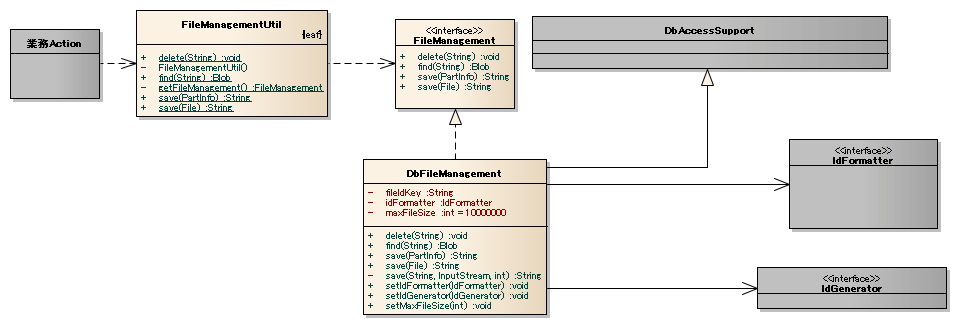

.. _DbFileManagement_result:

============================================
データベースを用いたファイル管理機能サンプル
============================================

------------
概要
------------

業務アプリケーションにて利用するファイルを、DBで一元管理するための機能の実装サンプルを提供する。

`ソースコード <https://github.com/nablarch/nablarch-biz-sample-all>`_

本サンプルは以下の用途を想定している。

- 画面からのファイルアップロード・ダウンロード。

- 比較的少数のファイルを扱うファイル転送の送信・受信。例えば、一度に送信/受信するファイルが、数十個程度。

- 管理対象は、比較的小さなファイルを想定。例えば、証明写真のような小さな画像等。

.. tip::

  本サンプルはDBとしてOracleを使用している。Oracle以外を使用する場合は、各DBに合わせた実装に修正し使用すること。
  

下記に例としてファイルアップロード・ダウンロード時の処理イメージを示す。

ファイルアップロード時
========================

ブラウザがファイルを送信した際、Nablarchのマルチパートリクエストハンドラはその内容を解析し一時ファイルに保存する。

そのファイルを、本サンプルはバイナリ形式でDBに格納する。

.. image:: ./_images/DbFileManagement_outline01.png
   :scale: 100

ファイルダウンロード時
========================

ダウンロードタグのクリックにより、ファイルの要求があった場合、業務ActionクラスはStreamをStreamResponseに設定する必要がある。

そのStreamを、本サンプルはDBから取得する。

.. image:: ./_images/DbFileManagement_outline02.png
   :scale: 100

--------------
提供パッケージ
--------------

本サンプルは、以下のパッケージで提供される。

  *please.change.me.* **common.file.management**

------------
機能
------------

実装済み
========================
以下の機能を持つ。

* ファイル登録機能

  * ファイルのStreamを元に、ファイルをバイナリのカラムに格納する。格納時には、ユニークなファイル管理IDを採番(Nablarchの採番機能を使用)し、呼び出し元にファイル管理IDを返却する。
  * ファイルサイズがカラムのサイズを超えないことをチェックする。

* ファイルの削除機能

  * ファイル管理IDを元にレコードの削除サイン書き換え、論理削除する。

* ファイルの取得機能

  * ファイル管理IDを元にファイル管理テーブルからファイルを取得し、返却する。

前提としている仕様
========================
* 削除は論理削除を行う仕様である。運用時には、別途、論理削除状態のレコードのクリンナップについて検討する必要がある。

* テーブル定義には、最小限のカラムしか存在しない。他に情報が必要な場合は、別途業務ごとにテーブルを作成することを想定している。

* ファイル内容のチェックについて、ファイルサイズがカラムのサイズを超えないことのみチェックする。他にチェック項目が存在する場合は、呼び出し側でチェックを行うことを想定している。

* ファイルの更新処理は存在しない。ファイルの更新処理相当の処理を行いたい場合は、ファイルの削除処理とファイルの登録処理を順に実行する想定となっている。

------------
構成
------------
本サンプルの構成を示す。

クラス図
========================

各クラスの責務
^^^^^^^^^^^^^^^^^^^^^^^^^^^^^^^^^^^^^^^

クラス定義
~~~~~~~~~~~~~~~~~~~~~~~~~~~~~~

  =============================== ====================================================================================================
  クラス名                        概要
  =============================== ====================================================================================================
  FileManagementUtil              DBへ格納したファイルを管理するユーティリティクラス。処理はFileManagementを実装するクラスに委譲する。
  FileManagement                  ファイル管理を行うクラスが実装するインターフェース。
  DbFileManagement                DBへ格納したファイルを管理するクラスの本体。
  =============================== ====================================================================================================

テーブル定義
~~~~~~~~~~~~~~~~~~~~~~~~~~~~~~

**ファイル管理テーブル(FILE_CONTROL)**

ファイル管理テーブルには、ファイル管理IDと共にファイルを格納する。

  ================ ================== ============ ========= ========================================================
  論理名           物理名             定義         制約      補足
  ================ ================== ============ ========= ========================================================
  ファイル管理ID   FILE_CONTROL_ID    文字列       主キー    システムで採番した一意なID(Nablarchの採番機能で採番する)

  ファイル内容     FILE_OBJECT        バイナリ

  削除サイン       SAKUJO_SGN         文字列                 ファイルを削除したか否かを判定するためのサイン
  
                                                             0:未削除

                                                             1:削除済
  ================ ================== ============ ========= ========================================================

.. tip::

  上記テーブルの他、サンプルではNablarchの採番機能でファイル管理IDを採番する際に、Oracleのシーケンスを使用している。
  

---------------------------
使用方法
---------------------------

FileManagementUtilの使用方法
=============================================================================================

FileManagementUtilの使用方法について説明する。

.. _FileManagementUtil-settings-label:

FileManagementUtilの使用例(コンポーネント定義ファイル設定)
^^^^^^^^^^^^^^^^^^^^^^^^^^^^^^^^^^^^^^^^^^^^^^^^^^^^^^^^^^^^^^^^^^^^^^^^^^^^^^^^^^^^^^^

FileManagementUtil使用時に必要となる各コンポーネントのプロパティを、コンポーネント定義ファイルに設定する。

設定対象のコンポーネントを以下に示す。

  ============================== ============================================================
  設定対象のコンポーネント       設定例で使用している論理名
  ============================== ============================================================
  ファイル管理機能本体           fileManagement
  採番機能                       oracleSequenceIdGenerator
  採番時に使用するフォーマッター dbFileManagementFormatter
  ============================== ============================================================

設定例を以下に示す。
なお、下記の例では採番機能として「ベンダー依存のデータベース関連拡張サンプル実装」に含まれるOracleSequenceIdGeneratorを使用している。

.. code-block:: xml

    <!-- ファイル管理機能(論理名dbFileManagementのコンポーネントを、FileManagementUtilクラスが使用する) -->
    <component name="fileManagement" class="please.change.me.common.file.management.fileManagement">

      <!-- 格納ファイルの最大長(単位：バイト) -->
      <property name="maxFileSize" value="10000000"/>

      <!-- 採番機能で、DbFileManagement用の採番である旨を識別するためのKey -->
      <property name="fileIdKey" value="1103" />

      <!-- 採番機能 -->
      <property name="idGenerator" ref="oracleSequenceIdGenerator" />

      <!-- 採番時に使用するフォーマッター -->
      <property name="idFormatter" ref="dbFileManagementFormatter" />
    </component>

    <!-- 採番機能(ファイル管理機能から使用) -->
    <component name="oracleSequenceIdGenerator" class="nablarch.common.idgenerator.OracleSequenceIdGenerator">
      <property name="idTable">
        <map>
          <!-- keyとシーケンス名の対応付け-->
          <entry key="1103" value="FILE_ID_SEQ"/>
        </map>
      </property>
    </component>

    <!-- 採番時に使用するフォーマッター(ファイル管理機能から使用) -->
    <component name="dbFileManagementFormatter" class="nablarch.common.idgenerator.formatter.LpadFormatter">
      <!-- 桁数 -->
      <property name="length" value="18" />
      <!-- 不足している桁を埋める文字 -->
      <property name="paddingChar" value="0" />
    </component>

FileManagementUtilの使用例(ファイルアップロード時)
^^^^^^^^^^^^^^^^^^^^^^^^^^^^^^^^^^^^^^^^^^^^^^^^^^^^^^^^^^^^^^^^^^^^^^^^^^^^^^^^^^^^^^^

ブラウザからアップロードされたファイルをDBに保存する場合を想定し、本サンプルの使用方法を解説する。

.. code-block:: java

    public void doSaveFile(HttpRequest req, ExecutionContext ctx) {
        // 保存対象のパートを取得
        PartInfo part = req.getPart("fileToSave").get(0);
        
        //必要であれば、このタイミングで業務個別のファイル精査を実施。
        
        //DBにファイルを登録
        String fileId = FileManagementUtil.save(part);
        
        //以降、必要に応じてfileIdを使用した処理を行う。
    }

FileManagementUtilの使用例(ダウンロード時)
^^^^^^^^^^^^^^^^^^^^^^^^^^^^^^^^^^^^^^^^^^^^^^^^^^^^^^^^^^^^^^^^^^^^^^^^^^^^^^^^^^^^^^^

ファイルをDBから取り出し、ブラウザにダウンロードさせる場合を想定し、本サンプルの使用方法を解説する。

.. code-block:: java

    public HttpResponse doTempFile(HttpRequest req, ExecutionContext ctx) {
        //ダウンロードに使用するファイルID
        String fileId = "000000000000000001";
        
        // ファイルをDBから取得
        Blob blob = FileManagementUtil.find(fileId);

        
        // レスポンス情報を設定
        StreamResponse res = new StreamResponse(blob);
        res.setContentDisposition("temp.png");
        res.setContentType("image/png");
        return res;
    }
