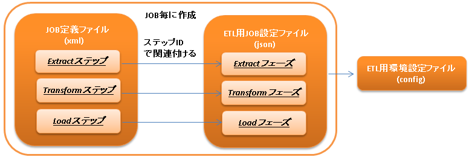

.. _etl:

ETL
==============================
.. contents:: 目次
  :depth: 3
  :local:

:ref:`jsr352_batch` 上で動作するETL(Extract/Transform/Load)機能を提供する。

ETLとは `Extract` 、 `Transform` 、 `Load` の略であり、以下の一連の処理を行う機能である。

:Extract: 外部データの抽出
:Transform: 抽出したデータの検証・変換
:Load: 変換したデータのデータベースやファイルへの出力

ETLを使うことで以下のメリットが得られる。

* インタフェースファイルの取り込みや作成処理を、設定ファイルとSQL、Beanの作成のみで実現できる。
* :ref:`jsr352_batch` のBatchletやChunkステップとして各フェーズが提供されている。
  このため、プロジェクト側で実装の差し替えや追加が容易に行える。

以下にETLの処理イメージを示す。

ファイルの内容をデータベースへ登録
  .. image:: images/file_to_db.png
    :scale: 65

データベースの内容をファイルへ出力
  .. image:: images/db_to_file.png
    :scale: 65

.. important::

  ETLを使用したバッチアプリケーションの実例は、`Exampleアプリケーション <https://github.com/nablarch/nablarch-example-batch-ee>`_
  の以下のJOBを参照。

  * etl-zip-code-csv-to-db-insert-batchlet
  * etl-zip-code-csv-to-db-chunk
  * etl-zip-code-db-to-csv-chunk
    
モジュール一覧
--------------------
.. code-block:: xml

  <dependency>
    <groupId>com.nablarch.framework</groupId>
    <artifactId>nablarch-etl</artifactId>
  </dependency>

ETLの各フェーズの仕様
----------------------
Extractフェーズ
~~~~~~~~~~~~~~~~~~~~~~~~~~~~~~~~~~~~~~~~~~~~~~~~~~
Extractフェーズでは、ファイルの内容をデータベース上のワークテーブルに取り込む。

ワークテーブルの設計時の注意点
  ワークテーブルはファイルの内容が不正であった場合でも、ファイルの内容を登録出来るように以下の定義とする必要がある。
  ※ファイルの内容が不正とは、数値項目に非数値が設定されていた場合などのことを指す。

  * 全てのカラムのデータ型を可変長の文字列型とする
  * データ長はデータベースで定義可能な最も大きい値とする

データのロード方法の選択
  次の中からデータのロード方法を選択する。

  なお、使用するデータベース付属のデータロードツールなどを使用することで、高速にデータをロード出来るのであればプロジェクト独自の実装を追加するとよい。

  * :ref:`Oracle SQL*Loaderを使用したデータのロード <etl-sql_loader>`
  * :ref:`JSR352のChunkステップを使用したデータのロード <etl-chunk_loader>`

  .. _etl-sql_loader:

  Oracle SQL*Loaderを使用したデータのロード
    Oracleデータベースに付属のSQL*Loaderユーティリティを用いたロード処理を行う。

    JOB定義ファイルのExtractフェーズに対応するステップ定義に :java:extdoc:`sqlLoaderBatchlet <nablarch.etl.SqlLoaderBatchlet>` を設定することで、SQL*Loaderを使用したロードが行われる。

  .. _etl-chunk_loader:

  :ref:`JSR352 <jsr352_batch>` のChunkステップを使用したデータのロード
    :ref:`JSR352 <jsr352_batch>` のChunkステップを使用して、ファイルからデータを読み込み順次ワークテーブルに登録(INSERT)を行う。

    JOB定義ファイルのExtractフェーズに対応するステップ定義は、以下のChunkステップを定義する。

    * readerには、 :java:extdoc:`fileItemReader <nablarch.etl.FileItemReader>` を登録する
    * writerには、 :java:extdoc:`databaseItemWriter <nablarch.etl.DatabaseItemWriter>` を登録する

    .. tip::

      ワークテーブルをクリーニングする必要がある場合には、データのロード処理の前にクリーニングのステップを配置すること。
      クリーニング処理を使用する場合には、JOB定義ファイルのクリーニングに対応するステップ定義に :java:extdoc:`tableCleaningBatchlet <nablarch.etl.TableCleaningBatchlet>` を設定する。

    .. tip::

      ワークテーブルにデータを登録するためのINSERT文は、ワークテーブルに対応したBeanオブジェクト(Entity)から自動生成される。

Transformフェーズ
~~~~~~~~~~~~~~~~~~~~~~~~~~~~~~
Transformフェーズでは、Extractフェーズでワークテーブルに取り込んだファイルの内容のバリデーションとデータの変換(編集)処理を行う。

データの変換(編集)処理は、SQL文のSELECT句によって実現する。
例えば、SQLファンクションを呼び出したり他のテーブルと結合するなどして、データの変換処理を実現する。

.. tip::

  データの変換処理は、LoadフェーズのSQL文実行タイミングで実施される。

データのバリデーション
  データのバリデーションを行う場合は、 JOB定義ファイルにバリデーション用のステップを定義する。
  バリデーションステップの定義には、 :java:extdoc:`validationBatchlet <nablarch.etl.ValidationBatchlet>` を登録する。

  バリデーションエラーが発生した場合、そのレコードの情報はワークテーブルと全く同じレイアウトのエラーテーブルに移動される。
  エラーの情報(エラー内容やエラーが発生した項目名)はアプリケーションログに出力される。

  バリデーションエラーが発生した場合の動作を次から選択できる。

  :アボートモード(デフォルト): バリデーションエラーが発生した場合、JOBを異常終了する。
  :継続モード: JOBは終了せずに次のフェーズ(ステップ)に処理が移動する。

  .. tip::
    上記のモードとは別に、許容するエラー数を設定することができる。
    許容するエラー数を設定した場合、モード設定とは関係なく、設定値を超えるバリデーションエラーが発生した時点でJOBは異常終了する。

データの変換処理
  データの変換のために作成するSQLは以下のルールに従うこと。

  #. SELECT句に列挙する項目には、データのロード先テーブルのカラム名を別名として設定する。

     ロード先がファイルの場合には、ファイルに対応したBeanオブジェクトのプロパティ名を別名(スネークケースでも可)として設定する必要がある。

  #. SQL文にはパラメータ(バインド変数)を使用しない。

     パラメータを使用したい場合には、パラメータを持つ別テーブルを定義して結合するなどして回避すること。

.. _etl-load:

Loadフェーズ
~~~~~~~~~~~~~~~~~~~~~~~~~~~~~~
Transformフェーズのデータ変換用SQL文を実行し、データをデータベースやファイルに出力する。

データベース出力
  データベース出力用に次のモードを提供する。要件に応じて適切なモードを選択すること。

  :洗い替えモード: 既存のデータを全て削除後に登録処理を行う。

                   JOB定義ファイルの該当ステップには、 :java:extdoc:`deleteInsertBatchlet <nablarch.etl.DeleteInsertBatchlet>` を設定する。

  :マージモード: 既存のデータが存在している場合には更新処理を、データが存在していない場合には、追加処理を行う。

                 JOB定義ファイルの該当ステップには、 :java:extdoc:`mergeBatchlet <nablarch.etl.MergeBatchlet>` を設定する。

  大量データを一括で登録(更新)した場合、UNDO表領域(Oracleの場合)が不足する可能性があるため、分割実行する機能を提供する。
  分割実行する場合には、一度に実行する単位と実行対象を取得するための条件を設定する。

  データの変換がSQLでは実施できない場合(Javaのライブラリを使用する等)、以下のChunkステップをJOB定義ファイルの該当ステップに定義する。

  * readerには、 :java:extdoc:`databaseItemReader <nablarch.etl.DatabaseItemReader>` を登録する
  * writerには、 :java:extdoc:`databaseItemWriter <nablarch.etl.DatabaseItemWriter>` を登録する
  * processorには、プロジェクト側で独自にデータ変換処理を実装した :java:extdoc:`ItemProcessor <javax.batch.api.chunk.ItemProcessor>` を登録する

  Oracleデータベースの場合には、ダイレクトパスインサートモードを選択することで、一括でデータを登録することもできる。(洗い替えモードの場合のみ)

ファイル出力
  データをファイルに出力する場合は、JOB定義ファイルの該当ステップに以下のChunkステップを定義する。

  * readerには、 :java:extdoc:`databaseItemReader <nablarch.etl.DatabaseItemReader>` を登録する
  * writerには、 :java:extdoc:`fileItemWriter <nablarch.etl.FileItemWriter>` を登録する

使用方法
--------------------------------------------------

ETL JOBを実行するための設定を行う
~~~~~~~~~~~~~~~~~~~~~~~~~~~~~~~~~~~~~

ETL JOBを実行するためには以下の設定ファイルが必要となる。

JOB定義ファイル
  ETL JOBのJOB構成を定義するファイル。

  詳細は、 :ref:`etl-json-configuration` および :ref:`jsr352_batch` 及び `JSR352 Specification <https://jcp.org/en/jsr/detail?id=352>`_ を参照。

ETL用環境設定ファイル
  読み込むファイルパスなどの環境依存値の設定を行うファイル。

  詳細は、 :ref:`etl-common-configuration` を参照。

ETL用JOB設定ファイル
  JOB毎に必要となる各フェーズ(Extract/Transform/Load)の設定を行うファイル。

  詳細は、 :ref:`etl-json-configuration` を参照。

.. _etl-common-configuration:

ETL用環境設定ファイルを作成する
~~~~~~~~~~~~~~~~~~~~~~~~~~~~~~~~~~~~~~~~~~~~~~~~~~
環境依存値はシステムリポジトリ機能の環境設定ファイルに設定する。
設定方法は、 :ref:`repository-environment_configuration` を参照。

ETLでは以下の環境依存値を設定する。

ファイル入力を行う場合
  +-------------------------------+-------------------------------------------+
  | nablarch.etl.inputFileBasePath| 入力ファイルを配置するディレクトリのパス  |
  +-------------------------------+-------------------------------------------+

ファイル出力を行う場合
  +--------------------------------+-------------------------------------------+
  | nablarch.etl.outputFileBasePath| 出力ファイルを配置するディレクトリのパス  |
  +--------------------------------+-------------------------------------------+

:ref:`Oracle SQL*Loaderを使用したデータのロード <etl-sql_loader>` を行う場合
  +------------------------------------------+-------------------------------------------+
  | nablarch.etl.sqlLoaderControlFileBasePath| ctlファイルを配置するディレクトリのパス   |
  +------------------------------------------+-------------------------------------------+
  | nablarch.etl.sqlLoaderOutputFileBasePath | 実行ログを出力するディレクトリのパス      |
  +------------------------------------------+-------------------------------------------+

.. _etl-json-configuration:

JOB定義ファイルとETL用JOB設定ファイルを作成する
~~~~~~~~~~~~~~~~~~~~~~~~~~~~~~~~~~~~~~~~~~~~~~~~~~

ETL用JOB設定ファイルを作成する際は、ファイル名を ``<<JOB ID>>.json`` とし、``META-INF/etl-config/`` 配下に配置する。

.. tip::
  ETL用JOB設定ファイルを配置するディレクトリのパスを変更したい場合は、 :ref:`etl-loader-dir-path` を参照。

ジョブ設定ファイルは、以下からテンプレートをダウンロードし、ファイル内のコメントを参照し編集すること。

Oracle SQL*Loaderを使用したファイル取り込みテンプレート
  :ref:`etl-load` で洗い替えモードを使用する場合のテンプレート
    * :download:`JOB定義ファイルのテンプレート <templates/sql_loader_replace.xml>`
    * :download:`ETL用JOB設定ファイルテンプレート <templates/sql_loader_replace_config.json>`
    
  :ref:`etl-load` でマージモードを使用する場合のテンプレート
    * :download:`JOB定義ファイルのテンプレート <templates/sql_loader_merge.xml>`
    * :download:`ETL用JOB設定ファイルテンプレート <templates/sql_loader_merge_config.json>`

JSR352のChunkを使用したファイル取り込みのテンプレート
  * :download:`JOB定義ファイルのテンプレート <templates/chunk_replace.xml>`
  * :download:`ETL用JOB設定ファイルテンプレート <templates/chunk_replace.json>`

ファイル出力のテンプレート
  * :download:`JOB定義ファイルのテンプレート <templates/file_output.xml>`
  * :download:`ETL用JOB設定ファイルテンプレート <templates/file_output.json>`
  
.. tip::

 テンプレートで要件を満たせない場合には、テンプレートをベースとしステップの追加や変更などを行うことで対応すること。
 例えば、Chunkステップを用いてファイルをワークテーブルにロードし、マージモードを使用して本テーブルにデータをロードしたい場合には、
 SQL*LoaderとChunkのテンプレートから必要なものを組み合わせてジョブを構成すると良い。

拡張例
--------------------------------------------------

.. _etl-loader-dir-path:

ETL用JOB設定ファイルを配置するディレクトリのパスを変更する
~~~~~~~~~~~~~~~~~~~~~~~~~~~~~~~~~~~~~~~~~~~~~~~~~~~~~~~~~~

ETL用JOB設定ファイルを配置するディレクトリのパスを変更したい場合は、コンポーネント設定ファイルに設定を行う。

設定例を以下に示す。

  .. code-block:: xml

    <component name="etlConfigLoader" class="nablarch.etl.config.JsonConfigLoader">
      <property name="configBasePath" value="classpath:META-INF/sample" />
    </component>

ポイント
  * コンポーネント名は、 ``etlConfigLoader`` とすること。
  * :java:extdoc:`JsonConfigLoader <nablarch.etl.config.JsonConfigLoader>` の ``configBasePath`` プロパティにパスを設定すること。

