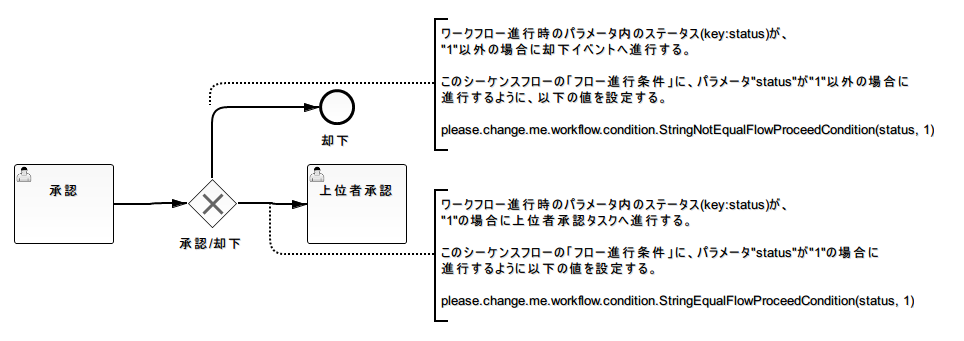

.. _workflowAPI:

======================================
ワークフローAPI
======================================

本章では、業務アプリケーションからワークフローを開始/進行するAPIやタスク実行ユーザ/グループを割り当てるAPIについて解説する。

--------------------------------------
ワークフローの開始
--------------------------------------
ワークフローは、 ``nablarch.integration.workflow.WorkflowManager`` の ``startInstance`` メソッドを呼び出すことで開始される。

指定したワークフローIDに複数のバージョンの定義がある場合、適用日がシステム日付(コンポーネント定義で指定したシステム日付)以前
で最もバージョンの大きい定義を使用する。

**メソッド詳細**

.. function:: nablarch.integration.workflow.WorkflowManager#startInstance(workflowId)
              nablarch.integration.workflow.WorkflowManager#startInstance(workflowId, parameter)

    :param java.lang.String workflowId: 開始対象のワークフローのID
    :param java.util.Map<String,?> parameter: :ref:`flowProceedCondition` や :ref:`completionCondition` で使用するパラメータ
                                              （必要な場合のみ。 :ref:`workflow_element_event_start` から最初のタスクに遷移するまでに
                                              :ref:`workflow_element_gateway_xor` が存在する場合などに指定する。）
    :return: * ワークフローインスタンス(WorkflowInstance)
    :rtype: * nablarch.integration.workflow.WorkflowInstance

**実装例**

.. code-block:: java

   // ワークフローIDを指定して、WorkflowManagerクラスのstartInstanceメソッドを呼び出す。
   WorkflowInstance workflow = WorkflowManager.startInstance("WF00001");

   // インスタンスIDを業務アプリケーション側のテーブルに格納する。
   String instanceId = workflow.getInstanceId();

-------------------------
インスタンスIDの取得
-------------------------
`ワークフローの開始`_ で開始したワークフローインスタンスを一意に識別するインスタンスIDを、
``nablarch.integration.workflow.WorkflowInstance`` の ``getInstanceId`` メソッドで取得できる。

業務側のテーブル（申請フォームの情報を保持するテーブル）と、
ワークフローの進行状態を管理するテーブルのデータを紐付ける必要がある。
本メソッドで取得したインスタンスIDを業務側のテーブルに保存すること。

**メソッド詳細**

.. function:: nablarch.integration.workflow.WorkflowInstance#getInstanceId()

    :return: * インスタンスID
    :rtype: * java.lang.String

**実装例**

.. code-block:: java

   // ワークフローの開始
   WorkflowInstance workflow = WorkflowManager.startInstance("WF00001");

   // インスタンスIDの取得
   String instanceId = workflow.getInstanceId();

   // 取得したインスタンスIDを業務テーブルに保存
   LeaveApplicationEntity entity = new LeaveApplicationEntity();
   entity.setInstanceId(instanceId);

   register(entity);
   

.. _workflow_api_find:

--------------------------------------
開始済みワークフローの検索
--------------------------------------
開始済みワークフローは、 ``nablarch.integration.workflow.WorkflowManager`` の ``findInstance`` メソッドで取得する。

ワークフローの進行や担当ユーザ(グループ)等の割り当て、ワークフローの状態確認などを行う際には、
事前にワークフローインスタンスを検索する必要がある。

指定されたインスタンスIDのワークフローインスタンスが取得できなかった場合、
ワークフローインスタンスは既に完了しているものとして判断し、完了状態をあらわすワークフローインスタンスを
返却する。このインスタンスは、 ``isCompleted`` に対して常に ``true`` を返却し、 ``isActive`` は
常に ``false`` を返却する。また、このインスタンスに対してタスクの進行や担当ユーザ/グループの割り当てを
行うことはできない。（実行時例外が送出される。）

**メソッド詳細**

.. function:: nablarch.integration.workflow.WorkflowManager#findInstance(instanceId)

  進行中ワークフローの検索を行う。

  :param java.lang.String instanceId: * インスタンスID
  :return: * ワークフローインスタンス(WorkflowInstance)
  :rtype: * nablarch.integration.workflow.WorkflowInstance

**実装例**

.. code-block:: java

   // インスタンスIDを指定してワークフローの状態を復元
   // ※ワークフロー開始時点のバージョンに対応するワークフロー定義が自動的に適用される。
   WorkflowInstance workflow = WorkflowManager.findInstance(instanceId);

.. _workflow_complete_task:

--------------------------------------
ワークフローの進行
--------------------------------------
ワークフローの進行は、 ``nablarch.integration.workflow.WorkflowInstance`` の ``completeUserTask`` もしくは
``completeGroupTask`` メソッドで行う。
これらのメソッドの呼び出し前には、 `開始済みワークフローの検索`_ を使用して、WorkflowInstanceインスタンスを取得する必要がある。

ワークフローの進行を行う際には、担当ユーザとして割り当てられているタスクの場合には ``completeUserTask`` を、
担当グループとして割り当てられているタスクの場合には ``completeGroupTask`` を呼び出すこと。

進行後に :ref:`workflow_element_gateway_xor` が存在する場合や、:ref:`workflow_element_multi_instance_task` の場合などに、
分岐や完了の業務ロジックを柔軟に設計できるように、 :ref:`flowProceedCondition` や :ref:`completionCondition` の実装クラスに
パラメータを渡すことができる。

**メソッド詳細**

.. function:: nablarch.integration.workflow.WorkflowInstance#completeUserTask()
              nablarch.integration.workflow.WorkflowInstance#completeUserTask(parameter)
              nablarch.integration.workflow.WorkflowInstance#completeUserTask(assigned)
              nablarch.integration.workflow.WorkflowInstance#completeUserTask(parameter, assigned)
              nablarch.integration.workflow.WorkflowInstance#completeGroupTask(assigned)
              nablarch.integration.workflow.WorkflowInstance#completeGroupTask(parameter, assigned)

   ワークフローの進行処理を行う。

   :param java.util.Map<String,?> parameter: :ref:`flowProceedCondition` や :ref:`completionCondition` で使用するパラメータ（必要な場合のみ）
   :param java.lang.String assigned: 処理対象ユーザまたはグループを識別するIDを指定する。

                                     グループの場合には、必ずグループを識別するIDを指定する必要がある。

                                     ユーザの場合は、未指定の場合 ``ThreadContext`` 内のユーザを使用してワークフローの進行処理を行う。

**実装例**

.. code-block:: java

   // インスタンスIDを指定してワークフローの状態を復元
   WorkflowInstance workflow = WorkflowManager.findInstance(instanceId);

   // completeUserTaskを呼び出して現在のタスクを完了させる
   workflow.completeUserTask();

   // グループが担当として割り当てられているタスクを完了させる場合
   workflow.completeGroupTask(groupId);

   // 進行制御やタスク終了判定で使用するパラメータを指定する場合
   Map<String, Integer> parameter = new HashMap<String, Integer>();
   parameter.put("amount", amount);

   workflow.completeGroupTask(parameter, groupId);

------------------------------------------------
境界イベントによるワークフローの進行
------------------------------------------------

:ref:`workflow_element_boundary_event` を発生させて、タスクを中断してワークフローを進行させるためには、
``nablarch.integration.workflow.WorkflowInstance`` の ``triggerEvent`` メソッドを使用する。

`ワークフローの進行`_ と同様、分岐の業務ロジックを柔軟に設計できるように、 :ref:`flowProceedCondition` の
実装クラスにパラメータを渡すことができる。なお、 `ワークフローの進行`_ とは異なり、
``triggerEvent`` によってタスクが中断された場合、 :ref:`completionCondition` は行われない。

**メソッド詳細**

.. function:: nablarch.integration.workflow.WorkflowInstance#triggerEvent(eventTriggerId)
              nablarch.integration.workflow.WorkflowInstance#triggerEvent(eventTriggerId, parameter)

   アクティブタスク上に定義されている境界イベントのうち、境界イベントトリガーIDに対応する境界イベントを発生させる。

   :param java.lang.String eventTriggerId: 境界イベントトリガーID

   :param java.util.Map<String,?> parameter: :ref:`flowProceedCondition` で使用するパラメータ（必要な場合のみ）

**実装例**

.. code-block:: java

   // インスタンスIDを指定してワークフローの状態を復元
   WorkflowInstance workflow = WorkflowManager.findInstance(instanceId);

   // triggerEventを呼び出して、現在のタスクを中断する。
   workflow.triggerEvent(CANCEL_TRIGGER);

---------------------------------
ユーザ/グループの割り当て
---------------------------------
タスクに対するユーザ/グループの割り当ては、 ``nablarch.integration.me.workflow.WorkflowInstance`` の
:ref:`ユーザ割り当てメソッド <assignUser>` および :ref:`グループ割り当てメソッド <assignGroup>` を使用して行う。

タスクに対してユーザ/グループの割り当てを実行した場合、今までそのタスクに割り当てられていたユーザ及びグループの情報は削除され、
今回指定したユーザ/グループのみが割り当てられた状態となる。

.. _assignUser:

**メソッド詳細**

.. function:: nablarch.integration.workflow.WorkflowInstance#assignUser(taskId, assignee)
.. function:: nablarch.integration.workflow.WorkflowInstance#assignGroup(taskId, assignee)

     指定したタスクに対して、指定したユーザ/グループを割り当てる。

     :param java.lang.String taskId: ユーザを割り当てる対象のタスクID
     :param java.lang.String assignee: 割り当てるユーザ/グループ

.. _assignGroup:

.. function:: nablarch.integration.workflow.WorkflowInstance#assignUsers(taskId, assignee)
.. function:: nablarch.integration.workflow.WorkflowInstance#assignGroups(taskId, assignee)

     指定したタスクに対して、指定したユーザ/グループを割り当てる。

     非マルチインスタンスのタスクに対して、複数のユーザ/グループを指定した場合はエラーとなる。
     **順次** :ref:`workflow_element_multi_instance_task` の場合、
     本メソッドに指定したユーザの順に、ユーザ/グループがタスクを実行する必要がある。

     :param java.lang.String taskId: ユーザ/グループを割り当てる対象のタスクID
     :param java.util.List<String> assignee: 割り当てるユーザ/グループのリスト

.. function:: nablarch.integration.workflow.WorkflowInstance#assignUserToLane(laneId, assignee)
.. function:: nablarch.integration.workflow.WorkflowInstance#assignGroupToLane(laneId, assignee)

     指定したレーンに属する全てのタスクに対して、指定したユーザ/グループを割り当てる。

     :param java.lang.String taskId: ユーザ/グループを割り当てる対象のレーンID
     :param java.lang.String assignee: 割り当てるユーザ/グループ

.. function:: nablarch.integration.workflow.WorkflowInstance#assignUsersToLane(laneId, assignee)
.. function:: nablarch.integration.workflow.WorkflowInstance#assignGroupsToLane(laneId, assignee)

     指定したレーンに属する全てのタスクに対して、指定したユーザ/グループ一覧を割り当てる。

     ユーザ/グループのリストの指定方法の詳細は、 :ref:`タスクへのユーザ/グループ一覧の割り当て <assignGroup>` を参照。

     :param java.lang.String taskId: ユーザ/グループを割り当てる対象のレーンID
     :param java.util.List<String> assignee: 割り当てるユーザ/グループのリスト

**実装例**

.. code-block:: java

   // 事前にワークフローの検索または開始処理を行う必要がある。
   WorkflowInstance workflow = WorkflowManager.startInstance("WF00001");

   // タスクに対して単一のユーザを担当者として割り当てる。
   workflow.assignUser("T01", userId);

   // タスクに対して複数のユーザを担当者として割り当てる。
   workflow.assignUsers("T02", users);

   // レーンに対して単一のユーザを担当者として割り当てる。
   workflow.assignUserToLane("T03", userId);

   // レーンに対して複数のユーザを担当者として割り当てる。
   workflow.assignUsersToLane("T04", users);

--------------------------------------------------
割り当て済みユーザ/グループの変更
--------------------------------------------------
`ユーザ/グループの割り当て`_ で割り当てたユーザ/グループを別のユーザ/グループに振り替える場合には、 ``nablarch.integration.workflow.WorkflowInstance`` の ``changeAssignedUser`` もしくは ``changeAssignedGroup`` を使用して行う。

特定ユーザ/グループの振り替えではなく、タスクのユーザ/グループ全体を再割り当てする場合には、 `ユーザ/グループの割り当て`_ を使用する。

.. tip::

   ワークフローライブラリでは、一つのタスクには、ユーザもしくはグループのいずれかしか割り当てることはできない。
   そのため、 ``changeAssignedUser`` や ``changeAssignedGroup`` を利用して、割り当てられているユーザを振り替えて
   グループを割り当てたり、その逆を行うことはできない。

**メソッド詳細**

.. function:: nablarch.integration.workflow.WorkflowInstance#changeAssignedUser(taskId, oldAssignee, newAssingee)
.. function:: nablarch.integration.workflow.WorkflowInstance#changeAssignedGroup(taskId, oldAssignee, newAssingee)

    :param java.lang.String taskId: ユーザ/グループの振り替え対象のタスクID
    :param java.lang.String oldUser: 振り替え対象のユーザ/グループ
    :param java.lang.String newUser: 振り替え後のユーザ/グループ

**実装例**

.. code-block:: java

   // 事前にワークフローの検索を行う必要がある
   WorkflowInstance workflow = WorkflowManager.findInstance(instanceId);

   // ユーザを振り替える
   workflow.changeAssignedUser("T02", oldUserId, newUserId);

------------------------------------------------
フローノードがアクティブか否かの問い合わせ
------------------------------------------------
フローノードIDを指定して、そのフローノード(タスクやイベント)が現在アクティブか否かを問い合わせすることができる。

**メソッド詳細**

.. function:: nablarch.integration.workflow.WorkflowInstance#isActive(flowNodeId)

  :param java.lang.Strng flowNodeId: * フローノードID
  :return: * 指定されたフローノードIDがアクティブな場合true
  :rtype: * boolean

**実装例**

.. code-block:: java

   if (workflow.isActive("t01")) {
     // フローノードID:t01がアクティブな場合の処理
   }

---------------------------------------------------------------
ユーザ/グループのアクティブタスクが存在するか否かの問い合わせ
---------------------------------------------------------------
ユーザ/グループを指定して、現在そのユーザ/グループのアクティブタスクが存在するか否かを問い合わせすることができる。

**メソッド詳細**

.. function:: nablarch.integration.workflow.WorkflowInstance#hasActiveUserTask(user)

  :param java.lang.Strng user: * ユーザ
  :return: * ユーザのアクティブタスクが存在する場合true
  :rtype: * boolean

.. function:: nablarch.integration.workflow.WorkflowInstance#hasActiveGroupTask(group)

  :param java.lang.Strng group: * グループ
  :return: * グループのアクティブタスクが存在する場合true
  :rtype: * boolean

**実装例**

.. code-block:: java

   if (workflow.hasActiveUserTask("0000000001")) {
     // ユーザ:0000000001 のアクティブタスクが存在する場合の処理
   }

------------------------------------------------
ワークフローが完了したか否かの問い合わせ
------------------------------------------------
`ワークフローの進行`_ 後に、ワークフローが完了したか否かを問い合わせることができる。

ワークフローが完了状態となると、本機能で管理している :ref:`データ <instanceTable>` は削除される。
このため、ワークフローが完了したかの問い合わせは、 `ワークフローの進行`_  と同一トランザクション内のみに限られる。
(他トランザクションからは、完了状態のワークフローインスタンスを取得することはできない。)

.. tip::

   ワークフローの完了状態とは、停止イベントがアクティブになった状態のことを指す。

**メソッド詳細**

.. function:: nablarch.integration.workflow.WorkflowInstance#isCompleted()

  :return: * ワークフローが完了状態の場合true
  :rtype: * boolean

**実装例**

.. code-block:: java

   if (workflow.isCompleted()) {
     // ワークフローが完了した場合の処理
   }

------------------------------------------------
現在有効なワークフローバージョンの取得
------------------------------------------------

複数のバージョンのワークフロー定義が同時に存在している場合、
それぞれのワークフロー定義の内容によっては、アプリケーションの実装でバージョンに応じて分岐する必要がある。

たとえば、バージョン1のワークフロー定義では担当ユーザを一人しか割り当てられないものとしていたが、
バージョン2のワークフロー定義では、担当ユーザを複数割り当てることが出来るように修正した場合、
変更画面などで担当者を選択するユーザインタフェースは、「バージョン1の場合はプルダウンが一つ」
「バージョン2の場合はプルダウンが複数個」などのように分岐しておく必要がある。

ワークフローが既に開始している場合には、ワークフローインスタンスからバージョンを取得することができるが、
ワークフローが未開始の場合にも、以下のAPIを利用して、現在有効なワークフローバージョンを取得することができる。

**メソッド詳細**

.. function:: nablarch.integration.workflow.WorkflowManager#getCurrentVersion(workflowId)

  :param java.lang.Strng workflowId: * ワークフローID
  :return: * 指定されたワークフローIDで現在有効なバージョン
  :rtype: * int

**実装例**

.. code-block:: java

   int version = WorkflowManager.getCurrentVersion("WF00001");

   if (version == 1) {
     // バージョン1の場合の処理
   } else if (version == 2) {
     // バージョン1の場合の処理
   }

.. _flowProceedCondition:

======================================
ゲートウェイの進行先ノードの判定制御
======================================
:ref:`workflow_element_gateway_xor` を使用した場合、次のフローノード(タスクやイベントなど)のフロー定義が複数存在する。

本機能では、 `ワークフローの進行`_ で指定されたパラメータと、 :ref:`workflow_element_sequence_flows` に対して設定された
フロー進行条件( ``nablarch.integration.workflow.condition.FlowProceedCondition`` の実装クラス ) を使用して、
遷移先のフローノードを判断する。

フロー進行条件は、:ref:`ワークフロー定義ローダー <definitionLoader>` がワークフロー定義を読み込む際に、
インスタンス化され、ワークフローライブラリから利用される。

---------------------------------------
FlowProceedConditionインタフェース
---------------------------------------
本インタフェースには、シーケンスフローへ進行可能かを判断するための ``isMatch`` メソッドが定義されている。

ワークフローライブラリでは、 `ワークフローの進行`_ の際に :ref:`workflow_element_gateway_xor` での分岐が存在すると、
そのXORゲートウェイから流出するシーケンスフローそれぞれに対して、設定されているフロー進行条件の ``isMatch`` を評価し、
``true`` を返却したシーケンスフローに従ってワークフローを進行させる。

本インタフェースの実装クラスに属性を設定する場合には、コンストラクタの引数で値を受け取る必要がある。
コンストラクタ引数に指定可能な型は ``java.lang.String`` のみである。
クラスの属性としてString以外の方を用いる必要がある場合には、コンストラクタ内で型変換を行うこと。

isMatchメソッドの定義
===========================
``isMatch`` メソッドの定義を以下に示す。

.. code-block:: java

    /**
     * シーケンスフローに従ってワークフローが進行可能か判定する。
     *
     * @param instanceId インスタンスID
     * @param param パラメータ
     * @param sequenceFlow シーケンス
     * @return 遷移可能な場合はtrue
     */
    boolean isMatch(String instanceId, Map<String, ?> param, SequenceFlow sequenceFlow);

``isMatch`` メソッドにはワークフローインスタンスのインスタンスID、 `ワークフローの進行`_ 時にパラメータとして
引数に渡されている ``Map`` 、評価対象となっているシーケンスフロー自体が渡される。

実装クラスでは、これらの情報と、ワークフローの進行状態を管理するテーブルや業務テーブルなどの情報を
利用して、そのシーケンスフローに従って進行させるかどうかを判断し、進行させる場合には ``true`` を返却する必要がある。

本機能で提供するFlowProceedCondition実装クラス
==================================================
本機能で提供する進行条件クラスについて説明する。

**文字列比較を行う進行条件クラス**

文字列比較を行う進行条件クラスでは、タスク進行時に指定されたパラメータの中から進行条件クラスに指定されたキー値の値を取得し、
文字列として期待値と比較処理を行う。

比較対象のパラメータのキー値と期待する値は、コンストラクタで指定する。

+------------------------------------+----------------------------------------------------------------------------------+
| クラス名                           | 概要                                                                             |
+====================================+==================================================================================+
| StringEqualFlowProceedCondition    | パラメータ値と期待値が一致する場合に、このシーケンスフローへ進行可能と判断する。 |
|                                    |                                                                                  |
+------------------------------------+----------------------------------------------------------------------------------+
| StringNotEqualFlowProceedCondition | パラメータ値と期待値が不一致の場合に、このシーケンスフローへ進行可能と判断する。 |
|                                    |                                                                                  |
+------------------------------------+----------------------------------------------------------------------------------+

**数値比較を行う進行条件クラス**

数値比較を行う進行条件クラスでは、タスク進行時に指定されたパラメータの中から進行条件クラスに指定されたキー値の値を取得し、
数値として期待値と比較処理を行う。

* パラメータ値がjava.lang.Numberのサブタイプの場合には、Number#longValue()を使用して数値に変換して比較を行う。

* パラメータ値がjava.lang.Stringの場合には、Long#valueOfを使用して数値に変換して比較を行う。

  Stringから数値への変換に失敗した場合は、このシーケンスフローでは進行不可能として結果を返却する。（異常終了とはしない）

* 上記以外の型の場合には、比較処理は実施せずにこのシーケンスフローでは進行不可能として結果を返却する。（異常終了とはしない）

比較対象のパラメータのキー値と期待する値は、コンストラクタで指定する。

+------------------------+----------------------------------------------------------------------------------+
| クラス名               | 概要                                                                             |
+========================+==================================================================================+
| EqFlowProceedCondition | パラメータ値と期待値が一致する場合に、このシーケンスフローへ進行可能と判断する。 |
|                        |                                                                                  |
+------------------------+----------------------------------------------------------------------------------+
| NeFlowProceedCondition | パラメータ値と期待値が不一致の場合に、このシーケンスフローへ進行可能と判断する。 |
|                        |                                                                                  |
+------------------------+----------------------------------------------------------------------------------+
| GtFlowProceedCondition | パラメータ値が期待値より大きい場合に、このシーケンスフローへ進行可能と判断する。 |
|                        |                                                                                  |
+------------------------+----------------------------------------------------------------------------------+
| GeFlowProceedCondition | パラメータ値が期待値以上の場合に、このシーケンスフローへ進行可能と判断する。     |
+------------------------+----------------------------------------------------------------------------------+
| LtFlowProceedCondition | パラメータ値が期待値より小さい場合に、このシーケンスフローへ進行可能と判断する。 |
|                        |                                                                                  |
+------------------------+----------------------------------------------------------------------------------+
| LeFlowProceedCondition | パラメータ値が期待値以下の場合に、このシーケンスフローへ進行可能と判断する。     |
+------------------------+----------------------------------------------------------------------------------+

--------------------------------------------------
使用例
--------------------------------------------------
以下のワークフロー定義で、承認タスクがアクティブな状態での次タスクへの遷移例を示す。

**実装例**

.. code-block:: java

   // インスタンスIDを元に承認(却下)対象のワークフローを検索する。
   WorkflowInstance workflow = WorkflowManager.findInstance(instanceId);

   // 進行条件で使用するパラメータを作成する。
   Map<Stirng, String> parameter = new HashMap<String, String>();
   parameter.put("status", "1");

   // ワークフローの進行
   // パラメータのステータスに"1"を設定してワークフローを進行したので、上位者承認タスクがアクティブとなる
   workflow.completeUserTask(parameter);

.. _completionCondition:

=========================================
マルチインスタンス・タスクの終了判定
=========================================
:ref:`workflow_element_multi_instance_task` （複数のユーザやグループが割り当て可能なタスク)の場合、タスクを終了させるための条件が必要となる。
例えば、複数ユーザが割り当てられているタスクで2人がタスクの実行(承認行為などのこと)を行えば、タスクを終了する等の定義が必要となる。

終了判定は、タスクに対して設定された終了条件( ``nablarch.integration.workflow.condition.CompletionCondition`` の実装クラス)を用いて行う。
ユーザやグループがタスク実行した際に、この終了条件を都度判定し、条件にマッチするとタスクが終了し次のフローノード(タスクやイベント)がアクティブとなる。

-----------------------------------------
CompletionConditionインタフェース
-----------------------------------------
本インタフェースには、タスクを終了していいかを判断するための ``isCompletedUserTask`` および ``isCompletedGroupTask`` メソッドが定義されている。
実装クラスは、 ``isCompletedUserTask`` メソッドでユーザタスク場合の終了判断を、 ``isCompletedGroupTask`` でグループタスクの場合の終了判断を行い、
終了条件にマッチした場合は、 ``true`` を返却する。

本インタフェースの実装クラスに属性を設定する場合には、コンストラクタの引数で値を受け取る必要がある。
コンストラクタ引数に指定可能な型は ``java.lang.String`` のみである。
クラスの属性としてString以外の型を用いる必要がある場合には、コンストラクタ内で型変換を行うこと。

isCompletionメソッドの定義
========================================
``isCompletion`` メソッドの定義を以下に示す。

.. code-block:: java

    /**
     * ユーザタスクの終了判定を行う。
     *
     * @param param パラメータ
     * @param instanceId インスタンスID
     * @param task タスク
     * @return 終了条件と一致した場合はtrue
     */
    boolean isCompletedUserTask(Map<String, ?> param, String instanceId, Task task);

    /**
     * グループタスクの終了判定を行う。
     *
     * @param param パラメータ
     * @param instanceId インスタンスID
     * @param task タスク
     * @return 終了条件と一致した場合はtrue
     */
    boolean isCompletedGroupTask(Map<String, ?> param, String instanceId, Task task);

``isCompletedUserTask`` メソッドおよび ``isCompletedGroupTask`` メソッドにはワークフローインスタンスのインスタンスID、
`ワークフローの進行`_ 時にパラメータとして引数に渡されている ``Map`` 、完了判定の対象となっているタスク自体が渡される。

実装クラスでは、これらの情報と、ワークフローの進行状態を管理するテーブルや業務テーブルなどの情報を利用して、
タスクを完了としてよいかを判断し、完了させる場合には ``true`` を返却する必要がある。

本機能で提供するCompletionCondition実装クラス
=============================================
本機能で提供するマルチインスタンス終了判定クラスについて説明する。

+------------------------+--------------------------------------------------------------------------------------------+
| クラス名               | 概要                                                                                       |
+========================+============================================================================================+
| AllCompletionCondition | 割り当てられている全てのユーザ(グループ)がタスク実行済みの場合、                           |
|                        | マルチインスタンスタスクを終了と判断する。                                                 |
+------------------------+--------------------------------------------------------------------------------------------+
| OrCompletionCondition  | 一定の数のユーザ(グループ)がタスク実行済みの場合、                                         |
|                        | マルチインスタンスタスクを終了と判断する。                                                 |
|                        |                                                                                            |
|                        | 実際に割り当てられているユーザ(グループ)数より、本クラスに指定されている数が大きい場合は、 |
|                        | 全てのユーザ(グループ)がタスク実行済みとなった場合にマルチインスタンスを終了と判断する。   |
+------------------------+--------------------------------------------------------------------------------------------+
