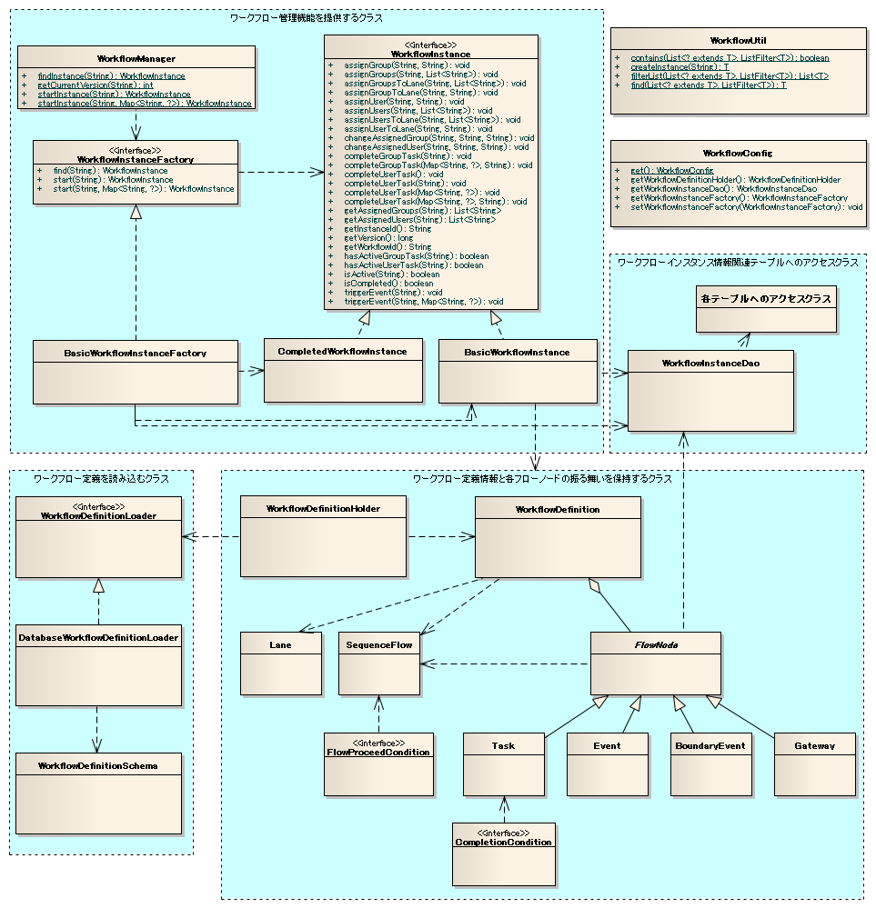
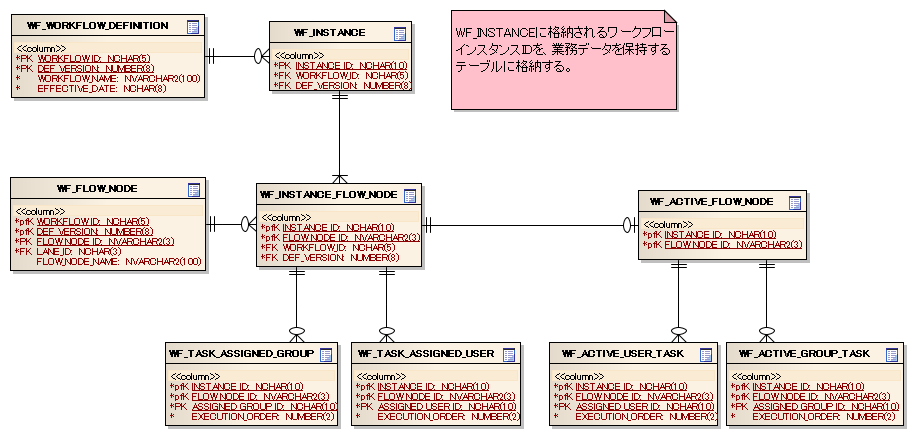

============================================
ワークフローライブラリの全体構造
============================================

----
構造
----

クラス図
========

インタフェース定義
==================

+---------------------------------------------------------------+------------------------------------------------------------------------------------------------------------+
| インタフェース名                                              | 概要                                                                                                       |
+===============================================================+============================================================================================================+
| .. _workflowInstance:                                         | :doc:`WorkflowInstanceElement` をあらわすインタフェース。                                                  |
|                                                               |                                                                                                            |
| package:: ``nablarch.integration.workflow``                   | 業務アプリケーションは、本インタフェースを通じてワークフローの進行や担当者（グループ）の割り当て等を行う。 |
|                                                               |                                                                                                            |
| interface:: ``WorkflowInstance``                              |                                                                                                            |
|                                                               |                                                                                                            |
+---------------------------------------------------------------+------------------------------------------------------------------------------------------------------------+
| .. _workflowInstanceFactory:                                  | :ref:`WorkflowInstance <workflowInstance>` を生成するインタフェース。                                      |
|                                                               |                                                                                                            |
| package:: ``nablarch.integration.workflow``                   |                                                                                                            |
|                                                               |                                                                                                            |
| interface:: ``WorkflowInstanceFactory``                       |                                                                                                            |
|                                                               |                                                                                                            |
+---------------------------------------------------------------+------------------------------------------------------------------------------------------------------------+
| .. _definitionLoader:                                         | :ref:`ワークフロー定義 <workflowDefinitionClass>` を読み込むインタフェース。                               |
|                                                               |                                                                                                            |
| package:: ``nablarch.integration.workflow.definition.loader`` |                                                                                                            |
|                                                               |                                                                                                            |
| interface:: ``WorkflowDefinitionLoader``                      |                                                                                                            |
|                                                               |                                                                                                            |
+---------------------------------------------------------------+------------------------------------------------------------------------------------------------------------+
| package:: ``nablarch.integration.workflow.condition``         | :ref:`workflow_element_task` の終了条件を定義するインタフェース。                                          |
|                                                               |                                                                                                            |
| interface:: ``CompletionCondition``                           | 本インタフェースの詳細及び本サンプルで提供する実装クラスの一覧は、                                         |
|                                                               | :ref:`completionCondition` を参照。                                                                        |
|                                                               |                                                                                                            |
+---------------------------------------------------------------+------------------------------------------------------------------------------------------------------------+
| package:: ``nablarch.integration.workflow.condition``         | :ref:`workflow_element_sequence_flows` のフロー進行条件を定義する                                          |
|                                                               | インタフェース。                                                                                           |
|                                                               |                                                                                                            |
| interface:: ``FlowProceedCondition``                          | 本インタフェースの詳細及び本サンプルで提供する実装クラスの一覧は、                                         |
|                                                               | :ref:`flowProceedCondition` を参照。                                                                       |
+---------------------------------------------------------------+------------------------------------------------------------------------------------------------------------+

クラス定義
==========

+---------------------------------------------------------------+-----------------------------------------------------------------------------------------------------------------------------+
| クラス名                                                      | 概要                                                                                                                        |
+===============================================================+=============================================================================================================================+
|  package:: ``nablarch.integration.workflow``                  | ワークフローインスタンスの開始や検索を行うクラス。                                                                          |
|                                                               |                                                                                                                             |
|  class:: ``WorkflowManager``                                  | :ref:`WorkflowInstanceFactory <workflowInstanceFactory>` を使用して :ref:`WorkflowInstance <workflowInstance>` を生成する。 |
|                                                               | :ref:`WorkflowInstanceFactory <workflowInstanceFactory>` の実装クラスは、                                                   |
|                                                               | :ref:`workflowComponentDefinition` に定義されているクラスを使用する。                                                       |
|                                                               |                                                                                                                             |
+---------------------------------------------------------------+-----------------------------------------------------------------------------------------------------------------------------+
| .. _basicWorkflowInstance:                                    | :ref:`WorkflowInstance <workflowInstance>` の基本実装クラス。                                                               |
|                                                               |                                                                                                                             |
| package:: ``nablarch.integration.workflow``                   |                                                                                                                             |
|                                                               |                                                                                                                             |
| class:: ``BasicWorkflowInstance``                             |                                                                                                                             |
+---------------------------------------------------------------+-----------------------------------------------------------------------------------------------------------------------------+
| package:: ``nablarch.integration.workflow``                   | 完了状態のワークフローインスタンスをあらわす、 :ref:`WorkflowInstance <workflowInstance>` の実装クラス。                    |
|                                                               |                                                                                                                             |
| class:: ``CompletedWorkflowInstance``                         | :ref:`workflow_api_find` で、対象インスタンスが見つからず、完了状態のワークフローインスタンスが必要な場合に利用される。     |
|                                                               |                                                                                                                             |
+---------------------------------------------------------------+-----------------------------------------------------------------------------------------------------------------------------+
| package:: ``nablarch.integration.workflow``                   | :ref:`WorkflowInstanceFactory <workflowInstanceFactory>` の実装クラスで、                                                   |
|                                                               | :ref:`BasicWorkflowInstance <basicWorkflowInstance>` を生成する。                                                           |
| class:: ``BasicWorkflowInstanceFactory``                      |                                                                                                                             |
|                                                               |                                                                                                                             |
+---------------------------------------------------------------+-----------------------------------------------------------------------------------------------------------------------------+
| package:: ``nablarch.integration.workflow``                   | ワークフローのコンポーネント設定情報を保持するクラス。                                                                      |
|                                                               |                                                                                                                             |
| class:: ``WorkflowConfig``                                    | コンポーネント定義の詳細は、 :ref:`workflowComponentDefinition` を参照。                                                    |
|                                                               |                                                                                                                             |
+---------------------------------------------------------------+-----------------------------------------------------------------------------------------------------------------------------+
| package:: ``nablarch.integration.workflow.util``              | ワークフロー機能で使用するユーティリティメソッドを提供するクラス。                                                          |
|                                                               |                                                                                                                             |
| class:: ``WorkflowUtil``                                      |                                                                                                                             |
+---------------------------------------------------------------+-----------------------------------------------------------------------------------------------------------------------------+
| package:: ``nablarch.integration.workflow.definition.loader`` | :ref:`WorkflowDefinitionLoader <definitionLoader>` の実装クラスで、                                                         |
|                                                               | :ref:`データベース <definitionTable>` から :ref:`ワークフロー定義 <workflowDefinitionClass>` を読み込むクラス。             |
| class:: ``DatabaseWorkflowDefinitionLoader``                  |                                                                                                                             |
|                                                               | テーブル定義(テーブル名やカラム名)は、 :ref:`WorkflowDefinitionSchema <definitionSchema>`                                   |
|                                                               | から取得する。                                                                                                              |
|                                                               |                                                                                                                             |
+---------------------------------------------------------------+-----------------------------------------------------------------------------------------------------------------------------+
| .. _definitionSchema:                                         |  :ref:`ワークフローの定義情報を保持するテーブル <definitionTable>` の                                                       |
|                                                               |  テーブル名やカラム名情報を保持するクラス。                                                                                 |
| package:: ``nablarch.integration.workflow.definition.loader`` |                                                                                                                             |
|                                                               |                                                                                                                             |
| class:: ``WorkflowDefinitionSchema``                          |                                                                                                                             |
|                                                               |                                                                                                                             |
+---------------------------------------------------------------+-----------------------------------------------------------------------------------------------------------------------------+
| package:: ``nablarch.integration.workflow.definition``        | :ref:`ワークフロー定義ローダー <definitionLoader>` から読み込んだ                                                           |
|                                                               | :ref:`ワークフロー定義 <workflowDefinitionClass>` を保持するクラス。                                                        |
| class:: ``WorkflowDefinitionHolder``                          |                                                                                                                             |
|                                                               | 本クラスで保持しているワークフロー定義は、以下の方法で取得できる。                                                          |
|                                                               |                                                                                                                             |
|                                                               | * ワークフローIDに対応する適用期間内の最新（バージョン番号が最も大きい）のワークフロー定義                                  |
|                                                               | * ワークフローIDとバージョン番号に対応するワークフロー定義                                                                  |
|                                                               |                                                                                                                             |
+---------------------------------------------------------------+-----------------------------------------------------------------------------------------------------------------------------+
| .. _workflowDefinitionClass:                                  | ワークフロー定義を保持するクラス。                                                                                          |
|                                                               |                                                                                                                             |
| package:: ``nablarch.integration.workflow.definition``        | 以下の定義情報を保持する。                                                                                                  |
|                                                               |                                                                                                                             |
| class:: ``WorkflowDefinition``                                | * :ref:`レーン定義情報 <laneDefinitionClass>`                                                                               |
|                                                               | * :ref:`タスク定義情報 <taskDefinitionClass>`                                                                               |
|                                                               | * :ref:`イベント定義情報 <eventDefinitionClass>`                                                                            |
|                                                               | * :ref:`ゲートウェイ定義情報 <gatewayDefinitionClass>`                                                                      |
|                                                               | * :ref:`境界イベント定義情報 <boundaryEventDefinitionClass>`                                                                |
|                                                               | * :ref:`シーケンスフロー定義情報 <sequenceFlowDefinitionClass>`                                                             |
+---------------------------------------------------------------+-----------------------------------------------------------------------------------------------------------------------------+
| .. _laneDefinitionClass:                                      | レーン定義情報を保持する。                                                                                                  |
|                                                               |                                                                                                                             |
| package:: ``nablarch.integration.workflow.definition``        |                                                                                                                             |
|                                                               |                                                                                                                             |
| class:: ``Lane``                                              |                                                                                                                             |
+---------------------------------------------------------------+-----------------------------------------------------------------------------------------------------------------------------+
| .. _flowNodeDefinitionClass:                                  | フローノード定義を保持する抽象クラス。                                                                                      |
|                                                               |                                                                                                                             |
| package:: ``nablarch.integration.workflow.definition``        |                                                                                                                             |
|                                                               |                                                                                                                             |
| class:: ``FlowNode``                                          |                                                                                                                             |
+---------------------------------------------------------------+-----------------------------------------------------------------------------------------------------------------------------+
| .. _taskDefinitionClass:                                      | :ref:`フローノード定義 <flowNodeDefinitionClass>` のサブクラスでタスク定義情報を保持する。                                  |
|                                                               |                                                                                                                             |
| package:: ``nablarch.integration.workflow.definition``        |                                                                                                                             |
|                                                               |                                                                                                                             |
| class:: ``Task``                                              |                                                                                                                             |
+---------------------------------------------------------------+-----------------------------------------------------------------------------------------------------------------------------+
| .. _eventDefinitionClass:                                     | :ref:`フローノード定義 <flowNodeDefinitionClass>` のサブクラスでイベント定義情報を保持する。                                |
|                                                               |                                                                                                                             |
| package:: ``nablarch.integration.workflow.definition``        |                                                                                                                             |
|                                                               |                                                                                                                             |
| class:: ``Event``                                             |                                                                                                                             |
+---------------------------------------------------------------+-----------------------------------------------------------------------------------------------------------------------------+
| .. _gatewayDefinitionClass:                                   | :ref:`フローノード定義 <flowNodeDefinitionClass>` のサブクラスでゲートウェイ定義情報を保持する。                            |
|                                                               |                                                                                                                             |
| package:: ``nablarch.integration.workflow.definition``        |                                                                                                                             |
|                                                               |                                                                                                                             |
| class:: ``Gateway``                                           |                                                                                                                             |
|                                                               |                                                                                                                             |
+---------------------------------------------------------------+-----------------------------------------------------------------------------------------------------------------------------+
| .. _boundaryEventDefinitionClass:                             | :ref:`フローノード定義 <flowNodeDefinitionClass>` のサブクラスで境界イベント定義情報を保持する。                            |
|                                                               |                                                                                                                             |
| package:: ``nablarch.integration.workflow.definition``        |                                                                                                                             |
|                                                               |                                                                                                                             |
| class:: ``BoundaryEvent``                                     |                                                                                                                             |
|                                                               |                                                                                                                             |
+---------------------------------------------------------------+-----------------------------------------------------------------------------------------------------------------------------+
| .. _sequenceFlowDefinitionClass:                              | シーケンスフロー定義を保持するクラス。                                                                                      |
|                                                               |                                                                                                                             |
| package:: ``nablarch.integration.workflow.definition``        |                                                                                                                             |
|                                                               |                                                                                                                             |
| class:: ``SequenceFlow``                                      |                                                                                                                             |
+---------------------------------------------------------------+-----------------------------------------------------------------------------------------------------------------------------+
| package:: ``nablarch.integration.workflow.dao``               | :ref:`instanceTable` にアクセスするデータベースアクセスクラス。                                                             |
|                                                               |                                                                                                                             |
| class::``WorkflowInstanceDao``                                | テーブル定義(テーブル名やカラム名)は、 :ref:`workflowInstanceSchema <WorkflowInstanceSchema>` から取得する。                |
|                                                               |                                                                                                                             |
|                                                               | 本クラスは、各テーブルのデータベースアクセスクラス（以下のクラス）に対して処理を移譲する。                                  |
|                                                               |                                                                                                                             |
|                                                               | * InstanceDao(ワークフローインスタンステーブル)                                                                             |
|                                                               | * InstanceFlowNodeDao(インスタンスフローノードテーブル)                                                                     |
|                                                               | * TaskAssignedUserDao(タスク担当ユーザテーブル)                                                                             |
|                                                               | * TaskAssignedGroupDao(タスク担当グループテーブル)                                                                          |
|                                                               | * ActiveFlowNodeDao(アクティブフローノードテーブル)                                                                         |
|                                                               | * ActiveUserTaskDao(アクティブユーザタスクテーブル)                                                                         |
|                                                               | * ActiveGroupTaskDao(アクティブグループタスクテーブル)                                                                      |
|                                                               |                                                                                                                             |
|                                                               | データの取得処理を提供するデータベースアクセスクラスでは、取得結果をテーブルに対応するエンティティクラスで返却する。        |
|                                                               | エンティティクラスは以下のとおり。                                                                                          |
|                                                               |                                                                                                                             |
|                                                               | * WorkflowInstanceEntity(ワークフローインスタンスエンティティ)                                                              |
|                                                               | * TaskAssignedUserEntity(タスク担当ユーザエンティティ)                                                                      |
|                                                               | * TaskAssignedGroupEntity(タスク担当グループエンティティ)                                                                   |
|                                                               | * ActiveFlowNodeEntity(アクティブフローノードエンティティ)                                                                  |
|                                                               | * ActiveUserTaskEntity(アクティブユーザタスクエンティティ)                                                                  |
|                                                               | * ActiveGroupTaskEntity(アクティブグループタスクエンティティ)                                                               |
|                                                               |                                                                                                                             |
+---------------------------------------------------------------+-----------------------------------------------------------------------------------------------------------------------------+
|  .. _workflowInstanceSchema:                                  | :ref:`instanceTable` のテーブル名やカラム名を保持するクラス。                                                               |
|                                                               |                                                                                                                             |
| package:: ``nablarch.integration.workflow.dao``               |                                                                                                                             |
|                                                               |                                                                                                                             |
| class:: ``WorkflowInstanceSchema``                            |                                                                                                                             |
|                                                               |                                                                                                                             |
+---------------------------------------------------------------+-----------------------------------------------------------------------------------------------------------------------------+

-----------------------------
テーブル定義
-----------------------------
ワークフロー機能で必要となるテーブルの情報を以下に示す。

テーブル名やカラム名は、プロジェクトの命名規則に従い設定することが想定される
このため、これらの情報はコンポーネント定義ファイルを用いて設定可能としている。

コンポーネント定義ファイルの設定例は、\ `コンポーネント定義`_\ を参照。

.. _definitionTable: 

ワークフローの定義情報を格納するテーブル
==================================================
ワークフローの定義情報を格納するテーブルの定義を下記に示す。

**ワークフロー定義テーブルの定義**

ワークフロー定義情報を管理するテーブル。

========================  =================== ============================================================
定義                      Javaの型            制約など
========================  =================== ============================================================
ワークフローID            java.lang.String    PK

バージョン                java.lang.Integer   PK
                          (int)

ワークフロー名            java.lang.String

適用日                    java.lang.String    8桁(yyyyMMdd)の文字列表記

========================  =================== ============================================================

**レーンテーブルの定義**

ワークフローの :ref:`workflow_element_lane` を管理するテーブル。

========================  =================== ============================================================
定義                      Javaの型            制約など
========================  =================== ============================================================
ワークフローID            java.lang.String    PK

バージョン                java.lang.Integer   PK
                          (int)

レーンID                  java.lang.String    PK

レーン名                  java.lang.String

========================  =================== ============================================================

**フローノードテーブルの定義**

:ref:`workflow_flow_node` の定義を管理するテーブル。

========================  =================== ============================================================
定義                      Javaの型            制約など
========================  =================== ============================================================
ワークフローID            java.lang.String    PK

バージョン                java.lang.Integer   PK
                          (int)

フローノードID            java.lang.String    PK

フローノード名            java.lang.String

========================  =================== ============================================================

**タスクテーブルの定義**

:ref:`workflow_element_task` の定義を管理するテーブル。

========================  =================== ============================================================
定義                      Javaの型            制約など
========================  =================== ============================================================
ワークフローID            java.lang.String    PK

バージョン                java.lang.Integer   PK
                          (int)

フローノードID            java.lang.String    PK

マルチインスタンス種別    java.lang.String    以下の値が格納される。

                                              * NONE(:ref:`workflow_element_task`)
                                              * SEQUENTIAL(順次 :ref:`workflow_element_multi_instance_task`)
                                              * PARALLEL(並行 :ref:`workflow_element_multi_instance_task`)

完了条件                  java.lang.String    ``nablarch.integration.workflow.condition.CompletionCondition``
                                              の実装クラスをFQCNで登録する。

                                              ``CompletionCondition``\ の詳細は :ref:`completionCondition` を参照

========================  =================== ============================================================

**イベントテーブルの定義**

イベント(:ref:`workflow_element_event_start` 、 :ref:`workflow_element_event_terminate`)の定義を管理するテーブル。

========================  =================== ============================================================
定義                      Javaの型            制約など
========================  =================== ============================================================
ワークフローID            java.lang.String    PK

バージョン                java.lang.Integer   PK
                          (int)

フローノードID            java.lang.String    PK

イベント種別              java.lant.String    以下の値が格納される。

                                              * START(:ref:`workflow_element_event_start`)
                                              * TERMINATE(:ref:`workflow_element_event_terminate`)

========================  =================== ============================================================

**ゲートウェイテーブル定義**

:ref:`workflow_element_gateway_xor` の定義を管理するテーブル。

========================  =================== ============================================================
定義                      Javaの型            制約など
========================  =================== ============================================================
ワークフローID            java.lang.String    PK

バージョン                java.lang.Integer   PK
                          (int)

フローノードID            java.lang.String    PK

ゲートウェイ種別          java.lant.String    以下の値が格納される。

                                              * EXCLUSIVE(:ref:`workflow_element_gateway_xor`)

========================  =================== ============================================================

**境界イベントテーブル定義**

:ref:`workflow_element_boundary_event` の定義を管理するテーブル。

========================  =================== ============================================================
定義                      Javaの型            制約など
========================  =================== ============================================================
ワークフローID            java.lang.String    PK

バージョン                java.lang.Integer   PK
                          (int)

フローノードID            java.lang.String    PK

境界イベントトリガーID    java.lang.String

接続先タスクID            java.lang.String

========================  =================== ============================================================

**境界イベントトリガーテーブル定義**

境界イベントトリガーの定義を管理するテーブル。境界イベントトリガーについては、 :ref:`workflow_element_boundary_event` を参照。

========================  =================== ============================================================
定義                      Javaの型            制約など
========================  =================== ============================================================
ワークフローID            java.lang.String    PK

バージョン                java.lang.Integer   PK
                          (int)

境界イベントトリガーID    java.lang.String    PK

境界イベントトリガー名    java.lang.String

========================  =================== ============================================================

.. _sequenceFlowDefinition:

**シーケンスフローテーブル定義**

:ref:`workflow_element_sequence_flows` の定義を管理するテーブル。

========================  =================== ============================================================
定義                      Javaの型            制約など
========================  =================== ============================================================
ワークフローID            java.lang.String    PK

バージョン                java.lang.Integer   PK
                          (int)

シーケンスフローID        java.lang.String    PK

 接続元フローノードID     java.lang.String

 接続先フローノードID     java.lang.String

 フロー進行条件           java.lang.String    ``nablarch.integration.workflow.condition.FlowProceedCondition``
                                              の実装クラス名をFQCNで登録する。

                                              ``FlowProceedCondition``\ の詳細は :ref:`flowProceedCondition` を参照

 シーケンスフロー名       java.lang.String
========================  =================== ============================================================

テーブル定義の例
--------------------------------------------------

.. image:: _images/workflow-table-example-definition.png
   :align: center
   :scale: 80

.. _instanceTable:

ワークフローの進行状態を管理するテーブル
==================================================
ワークフローの進行状態を管理するテーブルの定義を下記に示す。

.. tip::

 ワークフローの進行状態は、ワークフローが終了するまでの状態を管理する。
 ワークフローが完了した場合には、本テーブル群のデータはクリーニング（削除）される。

**ワークフローインスタンステーブル定義**

進行中のワークフローを管理するテーブル。

========================  =================== ============================================================
定義                      Javaの型            制約など
========================  =================== ============================================================
インスタンスID            java.lang.String    PK

                                              進行中のインスタンスIDを識別する情報。

                                              インスタンスIDは、業務側のワークフローデータを保持する
                                              テーブルに格納する必要がある。

                                              業務側テーブルに格納することで、ワークフローの進行状態と
                                              業務データを紐付けて管理することができる。

ワークフローID            java.lang.String

バージョン                java.lang.Integer
                          (int)

========================  =================== ============================================================

**インスタンスフローノードテーブル**

進行中のワークフローに含まれるタスクの情報を管理するテーブル。

========================  =================== ============================================================
定義                      Javaの型            制約など
========================  =================== ============================================================
インスタンスID            java.lang.String    PK

フローノードID            java.lang.String    PK

ワークフローID            java.lang.String

バージョン                java.lang.Integer
                          (int)

========================  =================== ============================================================

.. _assign_user:

**タスク担当ユーザテーブル**

タスクに割り当てられた担当ユーザを管理するテーブル。 [#assign]_

タスクへの担当ユーザの割り当てについては :ref:`workflow_task_assignee` を参照。

========================  =================== ============================================================
定義                      Javaの型            制約など
========================  =================== ============================================================
インスタンスID            java.lang.String    PK

フローノードID            java.lang.String    PK

担当ユーザID              java.lang.String    PK

実行順                    java.lang.Integer   **順次** :ref:`workflow_element_multi_instance_task` の場合に
                          (int)               ユーザの処理実行順を管理するために使用する。

                                              非マルチインスタンスタスクや並行
                                              :ref:`workflow_element_multi_instance_task` の場合には、
                                              本属性値は使用しない。

========================  =================== ============================================================

.. _assign_group:

**タスク担当グループテーブル**

タスクに割り当てられた担当グループを管理するテーブル。 [#assign]_

タスクへの担当グループの割り当てについては :ref:`workflow_task_assignee` を参照。

========================  =================== ============================================================
定義                      Javaの型            制約など
========================  =================== ============================================================
インスタンスID            java.lang.String    PK

フローノードID            java.lang.String    PK

担当グループID            java.lang.String    PK

実行順                    java.lang.Integer   **順次** :ref:`workflow_element_multi_instance_task` の場合に
                          (int)               ユーザの処理実行順を管理するために使用する。

                                              非マルチインスタンスタスクや並行
                                              :ref:`workflow_element_multi_instance_task` の場合には、
                                              本属性値は使用しない。

========================  =================== ============================================================

.. [#assign]
  
  同一フローノードに対しては、ユーザかグループの一方のみの割り当てとなる。
  このため、同一フローノードに対して、ユーザとグループの両方のデータが存在することはない。

**アクティブフローノードテーブル**

:ref:`workflow_active_flow_node` の情報を保持するテーブル

========================  =================== ============================================================
定義                      Javaの型            制約など
========================  =================== ============================================================
インスタンスID            java.lang.String    PK

フローノードID            java.lang.String    PK

========================  =================== ============================================================

.. _activeUserTask:

**アクティブユーザタスクテーブル**

ユーザが実行可能なタスクを管理するテーブル。

ユーザが実行可能なタスク（アクティブユーザタスク）については、 :ref:`workflow_active_task` を参照。

========================  =================== ============================================================
定義                      Javaの型            制約など
========================  =================== ============================================================
インスタンスID            java.lang.String    PK

フローノードID            java.lang.String    PK

担当ユーザID              java.lang.String    PK

実行順                    java.lang.Integer   :ref:`タスク担当ユーザテーブル <assign_user>` を参照
                          (int)

========================  =================== ============================================================

.. _activeGroupTask:

**アクティブグループタスクテーブル**

グループが実行可能なタスクを管理するテーブル。

グループが実行可能なタスク（アクティブグループタスク）については、 :ref:`workflow_active_task` を参照。

========================  =================== ============================================================
定義                      Javaの型            制約など
========================  =================== ============================================================
インスタンスID            java.lang.String    PK

フローノードID            java.lang.String    PK

担当グループID            java.lang.String    PK

実行順                    java.lang.Integer   :ref:`タスク担当グループテーブル <assign_group>` を参照
                          (int)

========================  =================== ============================================================

テーブル定義の例
--------------------------------------------------

.. _workflowComponentDefinition:

-----------------------------
コンポーネント定義
-----------------------------

ワークフロー機能では、システムリポジトリ機能するためコンポーネント定義ファイルへの設定が必要となる。
以下にワークフロー機能のコンポーネント定義方法を記述する。

**設定するコンポーネント**

+---------------------------------------------------------------+------------------------------------------------------------------+
| クラス                                                        | 説明                                                             |
+===============================================================+==================================================================+
| package:: ``nablarch.integration.workflow``                   | ワークフローの設定情報を保持するクラス。                         |
|                                                               |                                                                  |
| class:: ``WorkflowConfig``                                    |                                                                  |
|                                                               | .. tip::                                                         |
|                                                               |                                                                  |
|                                                               |   本クラスは、コンポーネント名を **workflowConfig** として       |
|                                                               |   コンポーネント定義ファイルに登録する必要がある。               |
|                                                               |                                                                  |
+---------------------------------------------------------------+------------------------------------------------------------------+
| package:: ``nablarch.integration.workflow.definition``        | ワークフローの定義情報を保持するクラス。                         |
|                                                               |                                                                  |
| class:: ``WorkflowDefinitionHolder``                          | 本クラスには、ワークロー定義をロードするクラスと、               |
|                                                               | ワークフローの適用日判定に使用するための                         |
|                                                               | システム日付(nablarch.core.date.SystemTimeProviderの実装クラス)  |
|                                                               | を設定する。                                                     |
|                                                               |                                                                  |
|                                                               | システムリポジトリ構築時にワークフロー定義情報を、               |
|                                                               | ローダを使用しロードする。このため、初期化対象コンポーネントに   |
|                                                               | 本クラスを設定する必要がある。                                   |
|                                                               |                                                                  |
+---------------------------------------------------------------+------------------------------------------------------------------+
| package:: ``nablarch.integration.workflow.definition.loader`` | データベースからワークフロー定義をロードするクラス。             |
|                                                               |                                                                  |
| class:: ``DatabaseWorkflowDefinitionLoader``                  | 本クラスには、データベースへアクセスするための設定と、           |
|                                                               | ワークフロー定義関連テーブルの定義情報を設定する。               |
|                                                               |                                                                  |
+---------------------------------------------------------------+------------------------------------------------------------------+
| package:: ``nablarch.integration.workflow.definition.loader`` | `ワークフローの定義情報を格納するテーブル`_ のテーブル名と       |
|                                                               | カラム名を設定する。                                             |
| class:: ``WorkflowDefinitionSchema``                          |                                                                  |
|                                                               |                                                                  |
+---------------------------------------------------------------+------------------------------------------------------------------+
| package:: ``nablarch.integration.workflow.dao``               | `ワークフローの進行状態を管理するテーブル`_ へアクセスする       |
|                                                               | クラスを設定する。                                               |
| class:: ``WorkflowInstanceDao``                               |                                                                  |
|                                                               | 本クラスには、インスタンスIDを採番するための採番クラスと         |
|                                                               | `ワークフローの進行状態を管理するテーブル`_ の定義情報を         |
|                                                               | 設定する。                                                       |
|                                                               |                                                                  |
|                                                               | システムリポジトリ構築時にデータベースアクセス用の               |
|                                                               | SQL文の組み立てを行う。                                          |
|                                                               | このため、初期化対象コンポーネントに本クラスを設定する必要がある |
|                                                               |                                                                  |
+---------------------------------------------------------------+------------------------------------------------------------------+
| package:: ``nablarch.integration.workflow.dao``               | `ワークフローの進行状態を管理するテーブル`_ のテーブル名と       |
|                                                               | カラム名を設定する。                                             |
| class:: ``WorkflowInstanceSchema``                            |                                                                  |
|                                                               |                                                                  |
+---------------------------------------------------------------+------------------------------------------------------------------+
| package:: ``nablarch.integration.workflow``                   | :ref:`WorkflowInstance <workflowInstance>` を生成するクラス。    |
|                                                               |                                                                  |
| class:: ``WorkflowInstanceFactory``                           |                                                                  |
|                                                               |                                                                  |
+---------------------------------------------------------------+------------------------------------------------------------------+

**設定例**

  .. code-block:: xml

    <!--
    ワークフロー設定クラス
    このクラスは、「workflowConfig」という名前でコンポーネント定義する。
    -->
    <component name="workflowConfig" class="nablarch.integration.workflow.WorkflowConfig">
      <property name="workflowDefinitionHolder" ref="workflowDefinitionHolder" />
      <property name="workflowInstanceDao" ref="workflowInstanceDao" />
      <property name="workflowInstanceFactory" ref="workflowInstanceFactory" />
    </component>

    <!--
    ワークフロー定義保持クラス

    ワークフロー定義のローダーとシステム日付を取得するための
    nablarch.core.date.SystemTimeProvider実装クラスを設定する。
    -->
    <component name="workflowDefinitionHolder"
        class="nablarch.integration.workflow.definition.WorkflowDefinitionHolder">
      <property name="workflowDefinitionLoader" ref="workflowLoader" />
      <property name="systemTimeProvider">
        <component class="nablarch.core.date.BasicSystemTimeProvider" />
      </property>
    </component>

    <!--
    ワークフロー定義のロードクラス
    -->
    <component name="workflowLoader"
        class="nablarch.integration.workflow.definition.loader.DatabaseWorkflowDefinitionLoader">
      <!--
      データベースへアクセスするための設定(SimpleDbTransactionManager )

      データベース接続設定の詳細な設定例は省略する。
      -->
      <property name="transactionManager" ref="tran" />
      <property name="workflowDefinitionSchema" ref="workflowDefinitionSchema" />
    </component>

    <!-- ワークフロー定義関連テーブルのテーブル名とカラム名の設定 -->
    <component name="workflowDefinitionSchema"
        class="nablarch.integration.workflow.definition.loader.WorkflowDefinitionSchema">
      <!-- テーブル名 -->
      <property name="workflowDefinitionTableName" value="WF_WORKFLOW_DEFINITION" />
      <property name="laneTableName" value="WF_LANE" />
      <property name="flowNodeTableName" value="WF_FLOW_NODE" />
      <property name="eventTableName" value="WF_EVENT" />
      <property name="taskTableName" value="WF_TASK" />
      <property name="gatewayTableName" value="WF_GATEWAY" />
      <property name="boundaryEventTableName" value="WF_BOUNDARY_EVENT" />
      <property name="eventTriggerTableName" value="WF_BOUNDARY_EVENT_TRIGGER" />
      <property name="sequenceFlowTableName" value="WF_SEQUENCE_FLOW" />

      <!-- ワークフロー定義テーブルのカラム名 -->
      <property name="workflowIdColumnName" value="WORKFLOW_ID" />
      <property name="workflowNameColumnName" value="WORKFLOW_NAME" />
      <property name="versionColumnName" value="DEF_VERSION" />
      <property name="effectiveDateColumnName" value="EFFECTIVE_DATE" />

      <!-- レーンテーブルのカラム名 -->
      <property name="laneIdColumnName" value="LANE_ID" />
      <property name="laneNameColumnName" value="LANE_NAME" />

      <!-- フローノードテーブルのカラム名 -->
      <property name="flowNodeIdColumnName" value="FLOW_NODE_ID" />
      <property name="flowNodeNameColumnName" value="FLOW_NODE_NAME" />

      <!-- イベント、タスク、ゲートウェイテーブルのカラム名 -->
      <property name="eventTypeColumnName" value="EVENT_TYPE" />
      <property name="multiInstanceTypeColumnName" value="MULTI_INSTANCE_TYPE" />
      <property name="completionConditionColumnName" value="COMPLETION_CONDITION" />
      <property name="gatewayTypeColumnName" value="GATEWAY_TYPE" />

      <!-- 境界イベント、境界イベントトリガーテーブルのカラム名 -->
      <property name="boundaryEventTriggerIdColumnName" value="BOUNDARY_EVENT_TRIGGER_ID" />
      <property name="boundaryEventTriggerNameColumnName" value="BOUNDARY_EVENT_TRIGGER_NAME" />
      <property name="attachedTaskIdColumnName" value="ATTACHED_TASK_ID" />

      <!-- シーケンスフローテーブルのカラム名 -->
      <property name="sequenceFlowIdColumnName" value="SEQUENCE_FLOW_ID" />
      <property name="sequenceFlowNameColumnName" value="SEQUENCE_FLOW_NAME" />
      <property name="sourceFlowNodeIdColumnName" value="SOURCE_FLOW_NODE_ID" />
      <property name="targetFlowNodeIdColumnName" value="TARGET_FLOW_NODE_ID" />
      <property name="flowProceedConditionColumnName" value="FLOW_PROCEED_CONDITION" />
    </component>

    <!-- ワークフローの進行状況を管理するテーブルへのアクセスクラス -->
    <component name="workflowInstanceDao"
        class="nablarch.integration.workflow.dao.WorkflowInstanceDao">

      <!--
      インスタンスIDを生成する採番機能の設定

      採番クラス名とあわせて、採番対象IDを設定する。
      -->
      <property name="instanceIdGenerator" ref="instanceIdGenerator" />
      <property name="instanceIdGenerateId" value="01" />

      <!--
      インスタンスIDの桁数を設定する。
      設定を省略した場合は、デフォルト値(10桁)となる。

      インスタンスIDは指定された桁数で固定長化される。
      固定長化は、先頭に"0"を付加することで実現する。
      -->
      <property name="instanceIdLength" value="15" />

      <!-- テーブル定義情報の設定 -->
      <property name="workflowInstanceSchema" ref="workflowInstanceSchema" />
    </component>

    <!-- ワークフローの進行状況を管理するテーブルのカラム名とテーブル名の設定 -->
    <component name="workflowInstanceSchema"
        class="nablarch.integration.workflow.dao.WorkflowInstanceSchema">

      <!-- テーブル名 -->
      <property name="instanceTableName" value="WF_INSTANCE" />
      <property name="instanceFlowNodeTableName" value="WF_INSTANCE_FLOW_NODE" />
      <property name="assignedUserTableName" value="WF_TASK_ASSIGNED_USER" />
      <property name="assignedGroupTableName" value="WF_TASK_ASSIGNED_GROUP" />
      <property name="activeFlowNodeTableName" value="WF_ACTIVE_FLOW_NODE" />
      <property name="activeUserTaskTableName" value="WF_ACTIVE_USER_TASK" />
      <property name="activeGroupTaskTableName" value="WF_ACTIVE_GROUP_TASK" />

      <!-- ワークフローインスタンステーブルのカラム名 -->
      <property name="instanceIdColumnName" value="INSTANCE_ID" />
      <property name="workflowIdColumnName" value="WORKFLOW_ID" />
      <property name="versionColumnName" value="DEF_VERSION" />

      <!-- ワークフローインスタンステーブルの関連テーブルのカラム名 -->
      <property name="flowNodeIdColumnName" value="FLOW_NODE_ID" />
      <property name="assignedUserColumnName" value="ASSIGNED_USER_ID" />
      <property name="executionOrderColumnName" value="EXECUTION_ORDER" />
      <property name="assignedGroupColumnName" value="ASSIGNED_GROUP_ID" />
    </component>

    <!-- インスタンスIDを採番するための採番クラスの設定 -->
    <component name="instanceIdGenerator"
        class="please.change.me.common.idgenerator.OracleSequenceIdGenerator">
      <!-- 詳細な設定は省略 -->
    </component>

    <!-- ワークフローインスタンスファクトリ -->
    <component name="workflowInstanceFactory" class="nablarch.integration.workflow.BasicWorkflowInstanceFactory" />

    <!-- 初期化コンポーネントの設定 -->
    <component name="initializer"
        class="nablarch.core.repository.initialization.BasicApplicationInitializer">
      <property name="initializeList">
        <list>
          <component-ref name="workflowDefinitionHolder" />
          <component-ref name="workflowInstanceDao" />
        </list>
      </property>
    </component>

