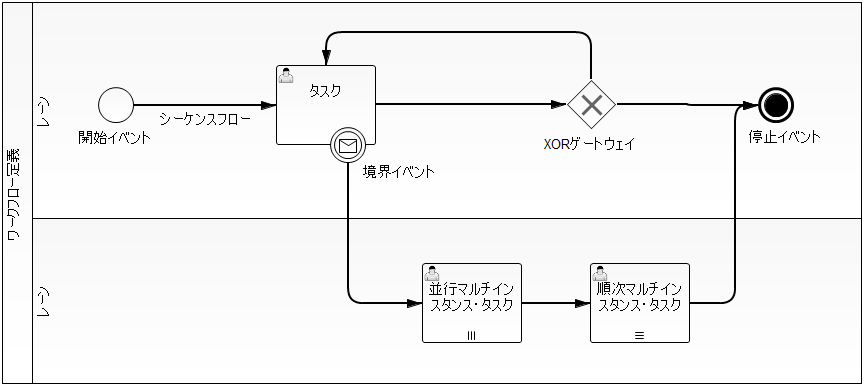

====================================================
ワークフロー定義
====================================================

:doc:`../index` で使用するワークフロー定義について、定義に使用される要素の意味および定義内容について記載する。

.. tip::

   :doc:`../index` では、基本的にはBPMNで定義されている用語を踏襲している。

   ただし、一部についてはNablarchの他の機能での用語との重複や紛らわしさを排除するために、独自の用語に置き換えている。
   そういった用語については、各要素の定義に対応するBPMNの用語を記載している。

:doc:`../index` でワークフロー定義に使用可能な要素は、BPMNの表記法で以下のように描かれる。

BPMNでは、他にも多くの要素が用意されているが、 :doc:`../index` で利用することができるのは、
以下に挙げる要素だけである。これら以外の要素は、サポートしていない。

* :ref:`workflow_element_sequence_flows`
* :ref:`workflow_element_task` （ :ref:`workflow_element_multi_instance_task` を含む）
* :ref:`workflow_element_gateway_xor`
* :ref:`workflow_element_event_start`
* :ref:`workflow_element_event_terminate`
* :ref:`workflow_element_boundary_event`
* :ref:`workflow_element_lane`

.. tip::

   上記以外の要素がワークフロー定義で使用されていた場合、ワークフロー定義データ作成ツールの実行時にエラーとなる。

ワークフロー定義は、上図のように、 :ref:`workflow_flow_node` を :ref:`workflow_element_sequence_flows` で
繋ぎ合わせていくことで作成する。

.. _workflow_flow_node:

--------------------------------------------
フローノード
--------------------------------------------

:ref:`workflow_element_task` 、 :ref:`workflow_element_gateway_xor` 、 :ref:`workflow_element_event_start` 、
:ref:`workflow_element_event_terminate` 、 :ref:`workflow_element_boundary_event` の総称。

:ref:`workflow_element_sequence_flows` の接続元フローノード、接続先フローノードに設定することができる要素をあらわす。

.. _workflow_element_sequence_flows:

--------------------------------------------
シーケンスフロー
--------------------------------------------

**記法**
   .. image:: _images/sequence-flow.png
      :align: left

|br|
フローノード間の進行方向と、そのフローに沿ってワークフローが進行するための条件（フロー進行条件）を定義する要素。

:doc:`../index` では並行処理となるようなワークフローの分岐・合流をサポートしないため、 :ref:`workflow_element_gateway_xor` からは
複数のシーケンスフローが流出することができるが、それ以外の要素からは、複数のシーケンスフローが流出することはできない。

:ref:`workflow_element_gateway_xor` 以外の要素からは複数のシーケンスフローが流出することはできないため、
それらの要素から流出するシーケンスフローについては、フロー進行条件を定義する必要はなく、また、定義しても
無視される。

:doc:`../index` であらかじめ提供しているフロー進行条件については、 :ref:`flowProceedCondition` を参照。

.. _workflow_element_task:

--------------------------------------------
タスク
--------------------------------------------

**記法**
   .. image:: _images/task.png
      :align: left

|br|
|br|
|br|
|br|
ワークフロープロセスで、ユーザが画面などから実行する処理や、バッチなどにより自動的に実行される処理などの
存在を定義するフローノード。

実際にタスクを行うユーザとして単一の :ref:`workflow_task_assignee` をアサインすることができる。

.. tip::

   BPMNでは、「ユーザタスク」と呼ばれている要素であるが、ユーザだけでなくグループとしても担当の割り当てができること、
   その他の種類のタスクをサポートしないことから、単に「タスク」としている。

.. _workflow_element_multi_instance_task:

マルチインスタンス・タスク
============================================

**記法**
   .. image:: _images/mi-task.png
      :align: left

|br|
|br|
|br|
|br|
複数の :ref:`workflow_task_assignee` を設定することのできるタスク。それらの実行ユーザが順番に処理するか、
並行して処理するかを指定することができる。

マルチインスタンス・タスクでは、そのタスクが実際に処理されるまでに、実行ユーザの数を動的に決定することができる。

マルチインスタンス・タスクには、タスクが完了して次のフローノードに進行する条件（完了条件）を定義する必要がある。
これは自由に定義することができ、「合議」や「AND承認」「OR承認」は、完了条件を適切に設定することで実現できる。

:doc:`../index` であらかじめ提供しているマルチインスタンス・タスクの完了条件については、 :ref:`completionCondition` を参照。

.. tip::

   BPMNでは、「マルチインスタンスアクティビティ」と呼ばれている要素であるが、
   タスク以外のアクティビティをサポートしないことから、「マルチインスタンス・タスク」としている。

.. _workflow_element_gateway_xor:

--------------------------------------------
XORゲートウェイ
--------------------------------------------

**記法**
   .. image:: _images/xor-gateway.png
      :align: left

|br|
|br|
|br|
ワークフローでの条件分岐をあらわすフローノード。

この要素からワークフローが進行する場合、流出する各シーケンスフローのフロー進行条件が評価されて、
進行可能と判定されたシーケンスフローに従ってワークフローを進行させる。

条件に合致するシーケンスフローが複数存在した場合、いずれかのシーケンスフローに従ってワークフローが進行するが、
どのシーケンスフローに従うかは不定となる。XORゲートウェイから流出するシーケンスフローのフロー進行条件は、
必ず排他的になるように設定すること。

フロー進行条件についての詳細は、 :ref:`flowProceedCondition` を参照。

.. _workflow_element_event_start:

--------------------------------------------
開始イベント
--------------------------------------------

**記法**
   .. image:: _images/start-event.png
      :align: left

|br|
|br|
ワークフローの開始を定義するフローノード。

ワークフロー定義には必ず一つの開始イベントが存在している必要がある。開始を定義するフローノードなので、
このフローノードにシーケンスフローが流入することはできない。

.. _workflow_element_event_terminate:

--------------------------------------------
停止イベント
--------------------------------------------

**記法**
   .. image:: _images/terminate-event.png
      :align: left

|br|
|br|
ワークフローの完了を定義するフローノード。

ワークフローがこのフローノードに到達したとき、ワークフローは完了する。完了を定義するフローノードなので、
このフローノードからシーケンスフローが流出することはできない。

.. _workflow_element_boundary_event:

--------------------------------------------
境界イベント
--------------------------------------------

**記法**
   .. image:: _images/boundary-event.png
      :align: left

|br|
|br|
タスクと関連付けて定義され、タスクを中断して別のフローノードに強制的に移動させるようなワークフローを定義するためのフローノード。

申請フローにおける、「 :ref:`申請者による引戻 <workflow_pullback>` 」などを実現するために利用することができる。

関連付けられたタスクが処理可能（ :ref:`workflow_active_flow_node` ）となっているときに境界イベントが発生すると、
そのタスクを中断し、境界イベントから流出するシーケンスフローに従ってワークフローが進行する。

各境界イベントには、そのイベントを発生させる「境界イベントトリガー」を定義しておき、
アプリケーションは境界イベントトリガーを使用して、各境界イベントを発生させる。

異なるタスクに対して、同じ境界イベントトリガーを持つ境界イベントを定義することもできる。

.. tip::

   「境界イベント」は、BPMNでは「中断メッセージ境界イベント」と呼ばれている要素であるが、
   「メッセージ」という単語を含むと紛らわしくなることと、 :doc:`../index` では他の境界イベントをサポートしないことから、
   単に「境界イベント」としている。

   また、上記で「境界イベントトリガー」と呼んでいるものは、BPMNでは「メッセージ」として定義されている。
   しかし、Nablarchでは既に「メッセージ」が複数の異なる意味で使用されているため、本機能では、
   「メッセージ」という単語を使用せず、「境界イベントトリガー」としている。

.. _workflow_element_lane:

--------------------------------------------
レーン
--------------------------------------------

**記法**
   .. image:: _images/lane.png
      :align: left

|br|
|br|
|br|
|br|
|br|
|br|
|br|
|br|
|br|
|br|
ワークフロー上に担当ユーザとして現れるユーザの分類を表すために利用する。ワークフローの進行に利用されることはないが、
レーンに対して担当ユーザ/担当グループを割り当てることができる。

.. |br| raw:: html

   