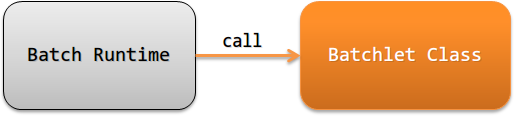

アプリケーションの責務配置
================================
JSR352に準拠したバッチアプリケーションを作成する際に実装すべきクラスとその責務を説明する。

.. _jsr352-batchlet_design:

Batchletステップの場合
--------------------------------------------------
Batchletステップの場合の実装すべきクラスとその責務について説明する。

  

バッチレット(Batchlet class)
  バッチレットで業務ロジックを実行し、ステップの処理結果を表す文字列 [#batchlet_status]_ を返却する。

  例えば、インターネット上のファイルをダウンロードしたり、SQL1つだけで完結するような処理 [#insert_select]_ を行う。

.. _jsr352-chunk_design:

Chunkステップの場合
--------------------------------------------------
Chunkステップの場合の実装すべきクラスとその責務について説明する。

.. image:: images/chunk-design.png
  :scale: 80

アイテムリーダ(ItemReader class)
  データソース(ファイルやデータベース等)から処理対象のデータを読み込む処理を実装する。
  読み込んだデータは、フォームに変換し返却する。

  アイテムリーダは、JSR352で規定されているインタフェースである。
  このため実装方法などの詳細は、 `JSR352 Specification(外部サイト、英語) <https://jcp.org/en/jsr/detail?id=352>`_ を参照。

アイテムプロセッサ(ItemProcessor class)
  アイテムリーダが読み込んだデータを元に業務ロジックを実行し出力対象のデータを生成する。

  出力対象がデータベースの場合には、業務ロジック実行後のデータをエンティティに変換する。
  データベース以外の場合には、業務ロジック実行後のデータを出力用のフォームに変換する。

  アイテムプロセッサは、JSR352で規定されているインタフェースである。
  このため実装方法などの詳細は、 `JSR352 Specification(外部サイト、英語) <https://jcp.org/en/jsr/detail?id=352>`_ を参照。

  .. tip::
    アイテムリーダで読み込んだデータが外部から取得したデータの場合は、業務ロジックの実行前に入力値のチェックを行うこと。
    入力値のチェックについては、 :ref:`入力値のチェック <validation>` を参照。

アイテムライタ(ItemWriter class)
  アイテムプロセッサで変換したエンティティ(フォーム)をデータベースやファイルなどに出力する処理を実装する。

  アイテムライタは、JSR352で規定されているインタフェースである。
  このため実装方法などの詳細は、 `JSR352 Specification(外部サイト、英語) <https://jcp.org/en/jsr/detail?id=352>`_ を参照。

フォーム(form class)
  アイテムリーダが読み込んだデータを保持するクラス。また出力対象がデータベース以外の場合に、出力するデータを保持するクラス。

  外部から受け付けたファイルなどの信用出来ない値を保持するフォームの場合には、プロパティの型は全てStringとすること。
  理由は、 :ref:`Bean Validation <bean_validation-form_property>` 参照。
  ただし、バイナリ項目の場合はバイト配列で定義する。

エンティティ(entity class)
  テーブルと1対1で対応するクラス。カラムに対応するプロパティを持つ。

.. [#batchlet_status] バッチレットが返却する文字列(バッチレットの終了ステータス)の詳細は、 `JSR352 Specification(外部サイト、英語) <https://jcp.org/en/jsr/detail?id=352>`_ を参照。
.. [#insert_select] 例えば、 ``insert～select`` のみで処理が完結するSQLの実行などを指す。
