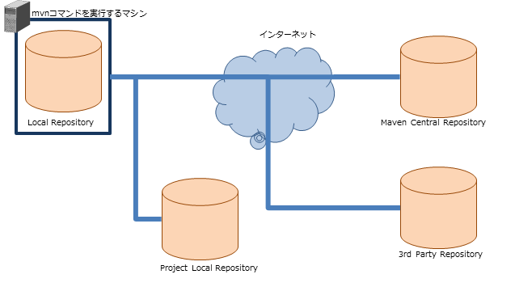

.. _`maven`:

===========================================
Apache Mavenについて
===========================================

.. contents:: 目次
  :depth: 3
  :local:

Nablarchはモジュール管理に `Apache Maven(外部サイト、英語) <https://maven.apache.org/>`_ (以下Maven)を使用することを推奨している。

ブランクプロジェクトの生成についてもMavenを使用するため、インストール方法を含む最低限知っておくべき内容を記載する。

Mavenとは
===========

Mavenとは、Apache Software Foudationで開発しているビルドツールである。Mavenは、ビルドや単体テストの実行を、簡単な設定ファイル(pom.xmlと呼ばれる)で実現することが出来る。

以下の特徴を持っている。

.. list-table::
  :header-rows: 1
  :class: white-space-normal
  :widths: 11,20

  * - 特徴
    - 説明
  * - ブランクプロジェクトの生成機能
    - アーキタイプと呼ばれるテンプレートに沿ったブランクプロジェクトの生成機能が存在する。|br|
      Nablarchのプロジェクトもこの機能で生成することが出来る。
  * - 依存関係の管理機能
    - プロジェクトの依存するライブラリを、リポジトリから自動的にダウンロードする機能がある。
  * - モデルベースビルド
    - あらかじめ定義されているWAR、JARといったモデルについて、スクリプトを書くことなく生成することが出来る。
  * - プラグインによる機能拡張が容易
    - 多数のプラグインが公開されている。プラグインは、組み込むことでプロジェクトのコンパイル時等に自動的に実行することができる。|br|
      また、プラグイン単独で起動させることも可能である。

Mavenリポジトリ
========================

Mavenは、依存するライブラリをMavenリポジトリから取得する。

以下にNablarchを使用した開発で登場するリポジトリを示す。

.. list-table::
  :header-rows: 1
  :class: white-space-normal
  :widths: 5,18

  * - 名称
    - 説明

  * - Local Repository
    - mvnコマンド\ [#mvn_command]_\ を実行するマシン上に自動的に作られるリポジトリ。|br|
      他のリポジトリから取得したjarをキャッシュするのが主な役割である。
  
  * - Project Local Repository
    - 各プロジェクト毎のjarを格納するリポジトリ。|br|
      以下の用途に使用する。各プロジェクトで作成する。
      
      * 複数のモジュールに分けて開発する際に、共通部品となるモジュールを格納する。
      * プロプライエタリなライブラリを格納する。一般的には、プロプライエタリなRDBMSのJDBCドライバが該当する。

  * - Maven Central Repository
    - Nablarchが依存するモジュール、Mavenの各種プラグイン、各種OSSが格納されているリポジトリ。

  * - 3rd Party Repository
    - プロダクト独自のMavenリポジトリ。
      gsp-dba-maven-pluginが使用するjarが格納されている http://maven.seasar.org/maven2/ (外部サイト)等が該当する。

.. [#mvn_command] ``mvn`` は、Mavenの実行に使用するコマンドである。

.. tip::

  Project Local Repositoryの管理に使用するリポジトリ管理ツール(Artifactory等)には、別のリポジトリへのプロキシとなる機能が存在する。

  プロキシ機能を使用することで、mvnコマンドを実行するマシンからインターネットに直接できない環境であっても、Project Local Repository経由でモジュールの取得ができる。

Mavenのインストール方法
=======================

以下参照してインストールを行う。インストールするバージョンは、 :ref:`firstStepPreamble` を参照。

================= ========================================================
サイト            URL
================= ========================================================
ダウンロード元    https://maven.apache.org/download.cgi (外部サイト、英語)
インストール方法  https://maven.apache.org/install.html (外部サイト、英語)
================= ========================================================

インストール方法にも記載があるが、以下の環境変数の設定を行うこと。

================= ======================================================================
環境変数          説明
================= ======================================================================
JAVA_HOME         JDKのインストールされているディレクトリを設定する。
PATH              mavenをインストールしたディレクトリのbinディレクトリをパスに追加する。
================= ======================================================================

.. _mvnSetting:

Mavenの設定
===============

Mavenには以下の設定を行う必要がある。

* Project Local Repositoryと3rd Party RepositoryのリポジトリのURL設定。Mavenは初期状態ではMaven Central RepositoryのURLしか保持していないためである。

設定は、<ホームディレクトリ>/.m2/settings.xmlに行う。

.. important::

  mavenの設定ファイルは、<Mavenのインストール先>/conf/settings.xml にも存在する。

  こちらに設定を書いても良いが、両方の設定ファイルを併用すると、どちらのファイルの設定が有効になっているのか分からなくなり混乱の元になる。設定ファイルはどちらかのみ使うこと。

以下に、Project Local Repositoryの設定例を示す。

.. code-block:: xml

  <settings>
    <!-- 中略 -->
    <profiles>
      <profile>
        <id>my-repository</id>
        <repositories>
          <repository>
            <id>my-repository-release</id>
            <url><!-- Project Local Release Repository の URL --></url>
            <releases>
              <enabled>true</enabled>
            </releases>
            <snapshots>
              <enabled>false</enabled>
            </snapshots>
          </repository>
          <repository>
            <id>my-repository-snapshot</id>
            <url><!-- Project Local Snapshot Repository の URL --></url>
            <releases>
              <enabled>false</enabled>
            </releases>
            <snapshots>
              <enabled>true</enabled>
            </snapshots>
          </repository>
        </repositories>
        <pluginRepositories>
          <pluginRepository>
            <id>my-repository-release</id>
            <url><!-- Project Local Release Repository の URL --></url>
            <releases>
              <enabled>true</enabled>
            </releases>
            <snapshots>
              <enabled>false</enabled>
            </snapshots>
          </pluginRepository>
          <pluginRepository>
            <id>my-repository-snapshot</id>
            <url><!-- Project Local Snapshot Repository の URL --></url>
            <releases>
              <enabled>false</enabled>
            </releases>
            <snapshots>
              <enabled>true</enabled>
            </snapshots>
          </pluginRepository>
        </pluginRepositories>
      </profile>
    </profiles>
 
    <!-- 上記のリポジトリ設定を有効化する。 -->
    <activeProfiles>
      <activeProfile>my-repository</activeProfile>
    </activeProfiles>
    <!-- 中略 -->
  </settings>

.. tip::

  プロキシを使用するようにMavenを設定している場合は、必要に応じてnonProxyHosts(除外設定)を記述すること。

  (Project Local Repositoryがローカルネットワーク環境にある場合、除外設定が必要となる)

  .. code-block:: xml

    <settings>
      <!-- 中略 -->
      <proxies>
        <proxy>
          <id>proxy1</id>
          <active>true</active>
          <protocol>http</protocol>
          <host><!-- プロキシサーバのホスト --></host>
          <port><!-- プロキシサーバのポート--></port>
          <nonProxyHosts>localhost|127.0.0.1|<!-- Project Local Repository --></nonProxyHosts>
        </proxy>
        <proxy>
          <id>proxy2</id>
          <active>true</active>
          <protocol>https</protocol>
          <host><!-- プロキシサーバのホスト --></host>
          <port><!-- プロキシサーバのポート--></port>
          <nonProxyHosts>localhost|127.0.0.1|<!-- Project Local Repository --></nonProxyHosts>
        </proxy>
      </proxies>
      <!-- 中略 -->
    </settings>

Mavenのゴール
===============

Mavenを実行する際は、ゴールを指定する。コマンド例は以下のようになる。

.. code-block:: bat

  mvn clean

利用頻度の高いゴールを以下に示す (表内のリンクは、全て英語の外部サイトへのリンク)。

.. list-table::
  :header-rows: 1
  :class: white-space-normal
  :widths: 6,20

  * - ゴール
    - 説明
  * - `archetype:generate <https://maven.apache.org/archetype/maven-archetype-plugin/generate-mojo.html>`_
    - ブランクプロジェクトを生成する際に使用する。どのようなプロジェクトを生成するかは実行時引数で指定する。
  * - `clean <https://maven.apache.org/plugins/maven-clean-plugin/>`_ 
    - ビルドに使用するワークディレクトリ(targetディレクトリ)を削除する。
  * - `Install <https://maven.apache.org/plugins/maven-install-plugin/>`_
    - モジュールをビルドし、ローカルリポジトリにインストールする。
  * - `test <http://maven.apache.org/guides/introduction/introduction-to-the-lifecycle.html#Lifecycle_Reference>`_
    - ユニットテストを実行する。
  * - `package <http://maven.apache.org/guides/introduction/introduction-to-the-lifecycle.html#Lifecycle_Reference>`_
    - warまたはjarを生成する。どちらが生成されるかは、設定ファイル(pom.xml)で決定される。なお、test等、warファイル生成に必要なゴールもあわせて実行される。
  * - `dependency:tree <https://maven.apache.org/plugins/maven-dependency-plugin/tree-mojo.html>`_ 
    - 依存するモジュールをツリー表示する。

.. tip::

  ゴール全般については、`Introduction to the Build Lifecycle(外部サイト、英語) <http://maven.apache.org/guides/introduction/introduction-to-the-lifecycle.html>`_ を参照。

.. _mvnFrequentlyTrouble:

Mavenのよくあるトラブル
=======================

-------------------------------------------------------------------
Return code is: 503 , ReasonPhrase:Service Unavailable.が返ってくる
-------------------------------------------------------------------

以下のように「Return code is: 503」のエラーがコンソールに出力されることがある。

.. code-block:: text

  [ERROR] Failed to execute goal on project myapp-batch: Could not resolve dependencies for project com.example:myapp-batch:jar:0.1.0: Failed to collect dependencies at com.nablarch.profile:nablarch-batch:jar:1.0.4 -> com.nablarch.framework:nablarch-fw-batch:jar:1.0.0: Failed to read artifact descriptor for com.nablarch.framework:nablarch-fw-batch:jar:1.0.0: Could not transfer artifact com.nablarch.framework:nablarch-fw-batch:pom:1.0.0 from/to nablarch-example-release (http://nablarch.intra.tis.co.jp/repository/nablarch-release): Failed to transfer file: http://nablarch.intra.tis.co.jp/repository/nablarch-release/com/nablarch/framework/nablarch-fw-batch/1.0.0/nablarch-fw-batch-1.0.0.pom. Return code is: 503 , ReasonPhrase:Service Unavailable. -> [Help 1]

この場合、Mavenリポジトリに到達できていないことが多い。

repositoryの設定や、proxyの設定が誤っていないか確認すること。

-------------------------------------------------------------------
mvnコマンドの結果が期待と異なる
-------------------------------------------------------------------

mvnコマンドの結果が期待と異なる場合(warに想定外のファイルが含まれる等)は、IDEを終了し、「mvn clean」を実行してから、本来実行したかったゴールを実行することで解決することがある。

これは、以下の二つが原因となっていることが多いためである。

* IDEが自動的にビルドした結果を使用してしまっている。
* 前回のビルド結果を参照してしまっている。

.. |br| raw:: html

   