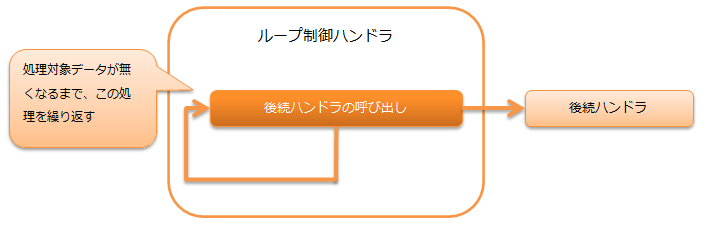

.. _dbless_loop_handler:

ループ制御ハンドラ
==================================================
.. contents:: 目次
  :depth: 3
  :local:

本ハンドラは、データリーダ上に処理対象のデータが存在する間、後続ハンドラの処理を繰り返し実行する。

.. important::

  DBに接続するバッチアプリケーションではトランザクション管理が必要になるため、本ハンドラではなく :ref:`loop_handler` を使用すること。

処理の流れは以下のとおり。

ハンドラクラス名
--------------------------------------------------
* :java:extdoc:`nablarch.fw.handler.DbLessLoopHandler`

モジュール一覧
--------------------------------------------------

.. code-block:: xml

  <dependency>
    <groupId>com.nablarch.framework</groupId>
    <artifactId>nablarch-fw-standalone</artifactId>
  </dependency>

制約
------------------------------
なし。
