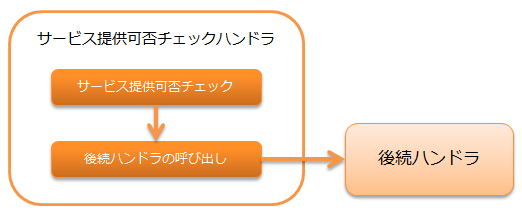

.. _`ServiceAvailabilityCheckHandler`:

サービス提供可否チェックハンドラ
=======================================

.. contents:: 目次
  :depth: 3
  :local:

本ハンドラでは、 :ref:`ServiceAvailabilityCheckHandler-request_checking` を行う。

サービス提供可否チェックは、ライブラリの :ref:`service_availability` を使用して行う。
そのため、本ハンドラを使用するには、
:java:extdoc:`ServiceAvailability <nablarch.common.availability.ServiceAvailability>` を実装したクラスを本ハンドラに設定する必要がある。

本ハンドラでは、以下の処理を行う。

* サービス提供可否チェック

処理の流れは以下のとおり。

ハンドラクラス名
--------------------------------------------------
* :java:extdoc:`nablarch.common.availability.ServiceAvailabilityCheckHandler`

モジュール一覧
--------------------------------------------------
.. code-block:: xml

  <dependency>
    <groupId>com.nablarch.framework</groupId>
    <artifactId>nablarch-common-auth</artifactId>
  </dependency>

制約
------------------------------
:ref:`thread_context_handler` より後ろに配置すること
  本ハンドラではスレッドコンテキスト上に設定されたリクエストIDをもとにサービス提供可否チェックを行うため、
  :ref:`thread_context_handler` より後ろに本ハンドラを配置する必要がある。

:ref:`forwarding_handler` より後ろに配置すること
  内部フォーワードが行われた際に、フォーワード先のリクエストIDをもとに
  サービス提供可否チェックを行いたい場合は、 :ref:`forwarding_handler` より後ろに本ハンドラを配置する必要がある。

.. _ServiceAvailabilityCheckHandler-request_checking:

リクエストに対するサービス提供可否チェック
--------------------------------------------------------------
:java:extdoc:`ThreadContext <nablarch.core.ThreadContext>` からリクエストIDを取得し、サービス提供可否をチェックする。
チェックの詳細は、 :ref:`service_availability` を参照。

OK(サービス提供可)の場合
 後続ハンドラを呼び出す。

NG(サービス提供不可)の場合
 :java:extdoc:`ServiceUnavailable <nablarch.fw.results.ServiceUnavailable>` (503) を送出する。

:java:extdoc:`ThreadContext <nablarch.core.ThreadContext>` から取得するリクエストIDをフォーワード先のリクエストIDに変更したい場合は、
:java:extdoc:`usesInternalRequestId <nablarch.common.availability.ServiceAvailabilityCheckHandler.setUsesInternalRequestId(boolean)>` にtrueを指定する。デフォルトはfalseである。

