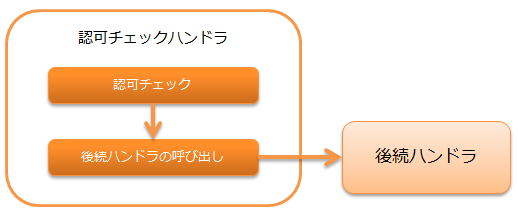

.. _`permission_check_handler`:

認可チェックハンドラ
=======================================

.. contents:: 目次
  :depth: 3
  :local:

本ハンドラでは、 :ref:`permission_check_handler-request_checking` を行う。

認可チェックは、ライブラリの :ref:`permission_check` を使用して行う。
そのため、本ハンドラを使用するには、
:java:extdoc:`PermissionFactory <nablarch.common.permission.PermissionFactory>` を実装したクラスを本ハンドラに設定する必要がある。

本ハンドラでは、以下の処理を行う。

* 認可チェック

処理の流れは以下のとおり。

ハンドラクラス名
--------------------------------------------------
* :java:extdoc:`nablarch.common.permission.PermissionCheckHandler`

モジュール一覧
--------------------------------------------------
.. code-block:: xml

  <dependency>
    <groupId>com.nablarch.framework</groupId>
    <artifactId>nablarch-common-auth</artifactId>
  </dependency>

制約
------------------------------
:ref:`thread_context_handler` より後ろに配置すること
  本ハンドラではスレッドコンテキスト上に設定されたリクエストIDとユーザIDをもとに認可チェックを行うため、
  :ref:`thread_context_handler` より後ろに本ハンドラを配置する必要がある。

:ref:`forwarding_handler` より後ろに配置すること
  内部フォーワードが行われた際に、フォーワード先のリクエストIDをもとに
  認可チェックを行いたい場合は、 :ref:`forwarding_handler` より後ろに本ハンドラを配置する必要がある。

:ref:`http_error_handler` より後ろに配置すること
  認可チェックエラーの場合に表示するエラーページを指定するため、
  :ref:`http_error_handler` より後ろに本ハンドラを配置する必要がある。

.. _permission_check_handler-request_checking:

リクエストに対する認可チェック
--------------------------------------------------------------
ログイン中のユーザが、現在のリクエスト(リクエストID)に対して権限を持っているかをチェックする。
チェックの詳細は、 :ref:`permission_check` を参照。

権限がある場合
 :ref:`業務ロジック <permission_check-server_side_check>` や
 :ref:`画面表示の制御 <permission_check-view_control>` で参照できるように、
 認可チェックに使用した :java:extdoc:`Permission <nablarch.common.permission.Permission>` をスレッドローカルに設定する。
 そして、後続ハンドラを呼び出す。

権限がない場合
 :java:extdoc:`Forbidden(403) <nablarch.fw.results.Forbidden>` を送出する。

チェック対象のリクエストIDをフォーワード先のリクエストIDに変更したい場合は、
:java:extdoc:`PermissionCheckHandler.setUsesInternalRequestId <nablarch.common.permission.PermissionCheckHandler.setUsesInternalRequestId(boolean)>`
でtrueを指定する。デフォルトはfalseである。

権限がない場合に表示するエラーページを指定する
--------------------------------------------------------------
権限がない場合に表示するエラーページは、HTTPエラー制御ハンドラで指定する。
指定方法は、 :ref:`HttpErrorHandler_DefaultPage` を参照。

特定のリクエストを認可チェックから除外する
--------------------------------------------------------------
ログイン前のリクエストなど、認可チェックを除外したいリクエストがある場合は、
:java:extdoc:`PermissionCheckHandler.setIgnoreRequestIds <nablarch.common.permission.PermissionCheckHandler.setIgnoreRequestIds(java.lang.String...)>`
で指定する。

.. code-block:: xml

  <component name="permissionCheckHandler"
             class="nablarch.common.permission.PermissionCheckHandler">
    <property name="permissionFactory" ref="permissionFactory"/>
    <!-- 認可チェックを除外するリクエストIDをカンマ区切りで指定する -->
    <property name="ignoreRequestIds" value="/action/login,/action/logout" />
  </component>
