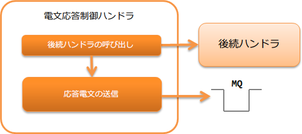

.. _message_reply_handler:

電文応答制御ハンドラ
==================================================
.. contents:: 目次
  :depth: 3
  :local:

本ハンドラでは、後続ハンドラの処理結果である :java:extdoc:`ResponseMessage <nablarch.fw.messaging.ResponseMessage>` オブジェクトの内容をもとに、
応答電文を作成し接続先システムに返却(送信)する。

本ハンドラでは、以下の処理を行う。

* 応答電文の送信処理を行う

処理の流れは以下のとおり。

  
ハンドラクラス名
--------------------------------------------------
* :java:extdoc:`nablarch.fw.messaging.handler.MessageReplyHandler`

モジュール一覧
--------------------------------------------------
.. code-block:: xml

  <dependency>
    <groupId>com.nablarch.framework</groupId>
    <artifactId>nablarch-fw-messaging</artifactId>
  </dependency>

制約
------------------------------
:ref:`messaging_context_handler` よりも後ろに設定すること
  本ハンドラは、応答電文を送信(メッセージキューへのプット)する。
  このため、MQへの接続を確立する :ref:`messaging_context_handler` より後ろに本ハンドラを設定する必要がある。

:ref:`transaction_management_handler` との位置関係について
  :ref:`transaction_management_handler` との位置関係は、2相コミットを使用するか否かで変わる。

  2相コミットを使用する場合
    データベースのトランザクションとメッセージキュー(JMS)のトランザクションを、トランザクションマネージャで纏めてコミットする。
    このため、トランザクション制御前に応答電文を送信する必要があり、 :ref:`transaction_management_handler` より後ろに本ハンドラを設定する必要がある。

  2相コミットを使用しない場合
    本ハンドラが応答を送信する前に業務処理の結果を確定させる必要がある。
    このため、 :ref:`transaction_management_handler` は、本ハンドラより後ろに設定する必要がある。

フレームワーク制御ヘッダの設定
--------------------------------------------------
応答電文内のフレームワーク制御ヘッダの定義を変更する場合には、プロジェクトで拡張したフレームワーク制御ヘッダの定義を設定する必要がある。
設定を行わない場合は、デフォルトの :java:extdoc:`StandardFwHeaderDefinition <nablarch.fw.messaging.StandardFwHeaderDefinition>` が使用される。

フレームワーク制御ヘッダの詳細は、 :ref:`フレームワーク制御ヘッダ <mom_system_messaging-fw_header>` を参照。

以下に設定例を示す。

.. code-block:: xml

  <component class="nablarch.fw.messaging.handler.MessageReplyHandler">
    <!-- フレームワーク制御ヘッダの設定 -->
    <property name="fwHeaderDefinition">
      <component class="sample.SampleFwHeaderDefinition" />
    </property>
  </component> 
