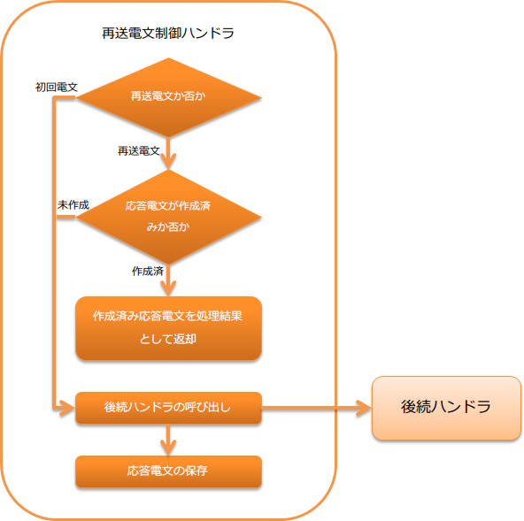

.. _message_resend_handler:

再送電文制御ハンドラ
==================================================
.. contents:: 目次
  :depth: 3
  :local:

本ハンドラでは、同一の電文を繰り返し受信した際の再送制御を行う。

具体的には、同一の電文を繰り返し受信した際に、その電文に対する処理が終わっているかどうか(応答電文が作成されているかどうか)を判断する。
もし、既に処理が終わっていた場合(応答電文が作成されていた場合)には、業務処理を再度行うのではなく作成済みの応答電文を自動的に送信する。

同一電文かの判定方法は :ref:`message_resend_handler-resent_message` を参照。

.. tip::
  本ハンドラを適用するメリットは以下のとおり。

  * 既に応答電文が作成済みの場合、業務処理が省略出来るため、システム負荷を低減できる。
  * データベースへの登録を行う処理の場合に、業務処理を省略できるため2重取り込みの防止ロジックなどを実装する必要がない。

本ハンドラでは、以下の処理を行う。

* 応答電文の保存処理
* 再送電文の場合は、保存した応答電文の送信処理
* 再送電文以外及び保存済み応答電文がない場合は、後続ハンドラへの処理の委譲

処理の流れは以下のとおり。

  
ハンドラクラス名
--------------------------------------------------
* :java:extdoc:`nablarch.fw.messaging.handler.MessageResendHandler`

モジュール一覧
--------------------------------------------------
.. code-block:: xml

  <dependency>
    <groupId>com.nablarch.framework</groupId>
    <artifactId>nablarch-fw-messaging</artifactId>
  </dependency>

制約
------------------------------
:ref:`message_reply_handler` よりも後ろに設定すること
  本ハンドラで作成した応答電文を送信する必要がある。
  このため、電文を送信するための :ref:`message_reply_handler` よりも後ろに本ハンドラを設定する必要がある。

:ref:`transaction_management_handler` よりも後ろに設定すること
  本ハンドラでは、応答電文をデータベースに保存する。
  このため、データベースへのトランザクション制御を実現する :ref:`transaction_management_handler` よりも後ろに本ハンドラを設定する必要がある。

応答電文の保存先について
--------------------------------------------------
後続ハンドラで作成された応答電文は、データベース上のテーブルに格納する。
このため、予め応答電文の保存用テーブルを作成しておく必要がある。

応答電文を格納するテーブルの定義は以下の通り。
デフォルトのテーブル名や物理名の値は、 :java:extdoc:`SentMessageTableSchema <nablarch.fw.messaging.tableschema.SentMessageTableSchema>` を参照。

.. list-table::
  :header-rows: 1
  :class: white-space-normal
  :widths: 30 30 40

  * - カラム名
    - 制約等
    - 格納する値

  * - リクエストID
    - 主キー |br| 文字列型
    - 要求電文のリクエストID

  * - メッセージID
    - 主キー |br| 文字列型
    - 要求電文のメッセージID

      再送電文の場合には、メッセージIDではなく相関メッセージIDを使用する。

      詳細は、 :ref:`message_resend_handler-resent_message` を参照

  * - 宛先キューの論理名
    - 文字列型
    - 応答電文を送信するための宛先キューの論理名 |br|
      (:java:extdoc:`InterSystemMessage#getDestination() <nablarch.fw.messaging.InterSystemMessage.getDestination()>`)

  * - 処理結果コード
    - 文字列型
    - 応答電文の処理結果コード |br| 
      (:java:extdoc:`ResponseMessage#getStatusCode() <nablarch.fw.messaging.ResponseMessage.getStatusCode()>`)

  * - 応答電文
    - バイナリ型
    - 応答電文の内容 |br|
      (:java:extdoc:`ResponseMessage#getBodyBytes() <nablarch.fw.messaging.ResponseMessage.getBodyBytes()>`)

デフォルトのテーブル名やカラム名を変更したい場合には、設定により変更することができる。
詳細は、 :java:extdoc:`SentMessageTableSchema <nablarch.fw.messaging.tableschema.SentMessageTableSchema>` 及び
:java:extdoc:`sentMessageTableSchemaプロパティ <nablarch.fw.messaging.handler.MessageResendHandler.setSentMessageTableSchema(nablarch.fw.messaging.tableschema.SentMessageTableSchema)>` を参照。

.. _message_resend_handler-resent_message:

同一電文(再送電文)の判定方法
--------------------------------------------------
本ハンドラが受信した電文が以下の条件を満たす場合、既に処理済みの要求電文を受信したと判断し、保存した応答電文を処理結果として返却する。

* フレームワーク制御ヘッダの再送要求フラグに値が設定されている
* 受信した要求電文のリクエストIDとメッセージIDに紐づくデータが、応答電文を保存したテーブルに存在している

フレームワーク制御ヘッダの詳細は、 :ref:`フレームワーク制御ヘッダ <mom_system_messaging-fw_header>` を参照。

.. important::

  相手先システムが要求電文を再送する際には、以下の制約を満たす必要がある。
  この制約を満たせない場合、本ハンドラを利用することはできないので、プロジェクト側で再送制御を実現するハンドラを新たに作成する必要がある。

  * 再送電文の相関メッセージIDには、初回送信時の要求電文のメッセージIDを設定すること
  * フレームワーク制御ヘッダの再送要求フラグに値を設定すること

フレームワーク制御ヘッダの設定
--------------------------------------------------
応答電文内のフレームワーク制御ヘッダの定義を変更する場合には、プロジェクトで拡張したフレームワーク制御ヘッダの定義を設定する必要がある。
設定を行わない場合は、デフォルトの :java:extdoc:`StandardFwHeaderDefinition <nablarch.fw.messaging.StandardFwHeaderDefinition>` が使用される。

フレームワーク制御ヘッダの詳細は、 :ref:`フレームワーク制御ヘッダ <mom_system_messaging-fw_header>` を参照。

以下に設定例を示す。

.. code-block:: xml

  <component class="nablarch.fw.messaging.handler.MessageResendHandler">
    <!-- フレームワーク制御ヘッダの設定 -->
    <property name="fwHeaderDefinition">
      <component class="sample.SampleFwHeaderDefinition" />
    </property>
  </component> 

.. |br| raw:: html

   

