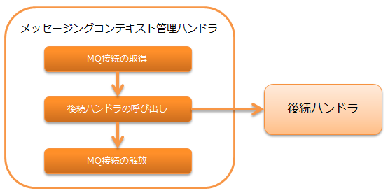

.. _messaging_context_handler:

メッセージングコンテキスト管理ハンドラ
==================================================

.. contents:: 目次
  :depth: 3
  :local:

後続のハンドラ及びライブラリで使用するためのMQ接続を、スレッド上で管理するハンドラ。

MOMメッセージングの詳細は、 :ref:`system_messaging` を参照。

本ハンドラでは、以下の処理を行う。

* MQ接続の取得
* MQ接続の解放

処理の流れは以下のとおり。

ハンドラクラス名
--------------------------------------------------
* :java:extdoc:`nablarch.fw.messaging.handler.MessagingContextHandler`

モジュール一覧
--------------------------------------------------
.. code-block:: xml

  <dependency>
    <groupId>com.nablarch.framework</groupId>
    <artifactId>nablarch-fw-messaging</artifactId>
  </dependency>

制約
------------------------------
なし。

MQの接続先の設定を行う
--------------------------------------------------
このハンドラは、 :java:extdoc:`messagingProvider <nablarch.fw.messaging.handler.MessagingContextHandler.setMessagingProvider(nablarch.fw.messaging.MessagingProvider)>`
プロパティに設定されたプロバイダクラス( :java:extdoc:`MessagingProvider <nablarch.fw.messaging.MessagingProvider>` 実装クラス)を使用してMQ接続を取得する。

以下に設定例を示す。
プロバイダクラスの設定内容については、使用する
:java:extdoc:`MessagingProvider <nablarch.fw.messaging.MessagingProvider>` 実装クラスのJavadocを参照。

.. code-block:: xml

 <!-- メッセージコンテキスト管理ハンドラ -->
 <component class="nablarch.fw.messaging.handler.MessagingContextHandler">
   <property name="messagingProvider" ref="messagingProvider" />
 </component>

 <!-- プロバイダクラス -->
 <component name="messagingProvider"
     class="nablarch.fw.messaging.provider.JmsMessagingProvider">
   <!-- プロパティの設定は省略 -->
 </component>
