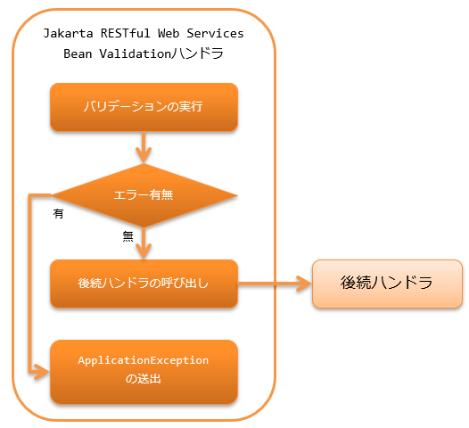

.. _jaxrs_bean_validation_handler:

JAX-RS BeanValidationハンドラ
==================================================
.. contents:: 目次
  :depth: 3
  :local:

本ハンドラは、リソース(アクション)クラスが受け取るForm(Bean)に対して、:ref:`bean_validation` を実行する。
バリデーションでバリデーションエラーが発生した場合には、後続のハンドラに処理は委譲せずに、
:java:extdoc:`ApplicationException <nablarch.core.message.ApplicationException>` を送出して処理を終了する。

本ハンドラでは、以下の処理を行う。

* リソース(アクション)クラスのメソッドが受け取るFormに対する :ref:`bean_validation` を行う。

処理の流れは以下のとおり。

  
ハンドラクラス名
--------------------------------------------------
* :java:extdoc:`nablarch.fw.jaxrs.JaxRsBeanValidationHandler`

モジュール一覧
--------------------------------------------------
.. code-block:: xml

  <dependency>
    <groupId>com.nablarch.framework</groupId>
    <artifactId>nablarch-fw-jaxrs</artifactId>
  </dependency>

  <!-- Bean Validationのモジュール -->
  <dependency>
    <groupId>com.nablarch.framework</groupId>
    <artifactId>nablarch-core-validation-ee</artifactId>
  </dependency>

制約
------------------------------
:ref:`body_convert_handler` よりも後ろに設定すること
  このハンドラは、 :ref:`body_convert_handler` がリクエストボディから変換したForm(Bean)に対してバリデーションを行うため。

.. _jaxrs_bean_validation_handler_perform_validation:

リソース(アクション)で受け取るForm(Bean)に対してバリデーションを実行する
----------------------------------------------------------------------------------------------------
リソース(アクション)のメソッドで受け取るForm(Bean)に対して、バリデーションを実行したい場合は、
そのメソッドに対して :java:extdoc:`Valid <javax.validation.Valid>` アノテーションを設定する。

以下に例を示す。

.. code-block:: java

  // Personオブジェクトに対してバリデーションを実行したいので、
  // Validアノテーションを設定する。
  @POST
  @Consumes(MediaType.APPLICATION_JSON)
  @Valid
  public HttpResponse save(Person person) {
      UniversalDao.insert(person);
      return new HttpResponse();
  }

Bean Validationのグループを指定する
-------------------------------------------------
:java:extdoc:`Valid <javax.validation.Valid>` アノテーションを設定したメソッドに対して
:java:extdoc:`ConvertGroup <javax.validation.groups.ConvertGroup>` アノテーションを設定することで、Bean Validationのグループを指定することができる。

:java:extdoc:`ConvertGroup <javax.validation.groups.ConvertGroup>` アノテーションは ``from`` 属性と ``to`` 属性の指定が必須である。
それぞれ以下のように指定すること。

* ``from`` ・・・ :java:extdoc:`Default.class <javax.validation.groups.Default>` 固定

  * メソッドに :java:extdoc:`Valid <javax.validation.Valid>` アノテーションを設定する場合、
    バリデーションは :java:extdoc:`Default <javax.validation.groups.Default>` グループを設定したものとして実行されるため。

* ``to`` ・・・Bean Validationのグループを指定する

以下に例を示す。

.. code-block:: java

  // Personクラス内で設定されたバリデーションルールのうち、
  // Createグループに所属するルールのみを使用して検証する。
  @POST
  @Consumes(MediaType.APPLICATION_JSON)
  @Valid
  @ConvertGroup(from = Default.class, to = Create.class)
  public HttpResponse save(Person person) {
      UniversalDao.insert(person);
      return new HttpResponse();
  }
