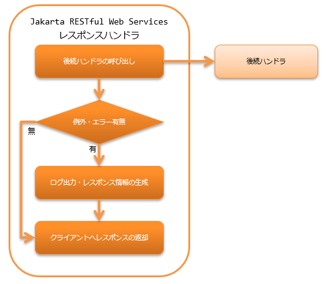

.. _jaxrs_response_handler:

JAX-RSレスポンスハンドラ
==================================================
.. contents:: 目次
  :depth: 3
  :local:

本ハンドラでは、後続のハンドラ(リソース(アクション)クラスや :ref:`body_convert_handler`)
から戻されたレスポンス情報を、クライアントに返却する。
後続のハンドラで例外及びエラーが送出された場合には、エラー及び例外に対応したレスポンス情報を構築しクライアントに返却する。

本ハンドラでは、以下の処理を行う。

* 例外及びエラー発生時のレスポンス情報の生成を行う。
  詳細は、 :ref:`jaxrs_response_handler-error_response` を参照。
* 例外及びエラー発生時のログ出力を行う。
  詳細は、 :ref:`jaxrs_response_handler-error_log` を参照
* クライアントへのレスポンスの返却を行う。

処理の流れは以下のとおり。

  
ハンドラクラス名
--------------------------------------------------
* :java:extdoc:`nablarch.fw.jaxrs.JaxRsResponseHandler`

モジュール一覧
--------------------------------------------------
.. code-block:: xml

  <dependency>
    <groupId>com.nablarch.framework</groupId>
    <artifactId>nablarch-fw-jaxrs</artifactId>
  </dependency>

制約
------------------------------
なし。

.. _jaxrs_response_handler-error_response:

例外及びエラーに応じたレスポンスの生成
--------------------------------------------------
例外及びエラーに応じたレスポンス情報の生成は、 :java:extdoc:`errorResponseBuilder <nablarch.fw.jaxrs.JaxRsResponseHandler.setErrorResponseBuilder(nablarch.fw.jaxrs.ErrorResponseBuilder)>` プロパティに設定された
:java:extdoc:`ErrorResponseBuilder <nablarch.fw.jaxrs.ErrorResponseBuilder>` により行われる。
ただし、発生した例外クラスが :java:extdoc:`HttpErrorResponse <nablarch.fw.web.HttpErrorResponse>` の場合は、
:java:extdoc:`HttpErrorResponse#getResponse() <nablarch.fw.web.HttpErrorResponse.getResponse()>` から戻される
:java:extdoc:`HttpResponse <nablarch.fw.web.HttpResponse>` がクライアントに戻される。

設定を省略した場合は、デフォルト実装の :java:extdoc:`ErrorResponseBuilder <nablarch.fw.jaxrs.ErrorResponseBuilder>` が使用される。
デフォルト実装では、プロジェクト要件を満たせない場合は、デフォルト実装クラスを継承して対応すること。

以下に設定例を示す。

.. code-block:: xml

  <component class="nablarch.fw.jaxrs.JaxRsResponseHandler">
    <property name="errorResponseBuilder">
      <component class="sample.SampleErrorResponseBuilder" />
    </property>
  </component>

.. important::
  ErrorResponseBuilderは例外及びエラーに応じたレスポンス生成を行う役割のため、ErrorResponseBuilderの処理中に例外が発生するとレスポンスが生成されず、クライアントにレスポンスを返せない状態となる。
  そのため、プロジェクトでErrorResponseBuilderをカスタマイズする場合は、ErrorResponseBuilderの処理中に例外が発生しないように実装すること。
  ErrorResponseBuilderの処理中に例外が発生した場合、フレームワークはErrorResponseBuilderの処理中に発生した例外をWARNレベルで
  ログ出力を行い、ステータスコード500のレスポンスを生成し、後続処理を継続する。

.. _jaxrs_response_handler-error_log:

例外及びエラーに応じたログ出力
--------------------------------------------------
例外及びエラーに応じたログ出力は :java:extdoc:`errorLogWriter <nablarch.fw.jaxrs.JaxRsResponseHandler.setErrorLogWriter(nablarch.fw.jaxrs.JaxRsErrorLogWriter)>` プロパティに設定された
:java:extdoc:`JaxRsErrorLogWriter <nablarch.fw.jaxrs.JaxRsErrorLogWriter>` により行われる。

設定を省略した場合は、デフォルト実装の :java:extdoc:`JaxRsErrorLogWriter <nablarch.fw.jaxrs.JaxRsErrorLogWriter>` が使用される。
デフォルト実装では、プロジェクト要件を満たせない場合は、デフォルト実装クラスを継承して対応すること。

以下に設定例を示す。

.. code-block:: xml

  <component class="nablarch.fw.jaxrs.JaxRsResponseHandler">
    <property name="errorLogWriter">
      <component class="sample.SampleJaxRsErrorLogWriter" />
    </property>
  </component>

拡張例
--------------------------------------------------

.. _jaxrs_response_handler-error_response_body:

エラー時のレスポンスにメッセージを設定する
~~~~~~~~~~~~~~~~~~~~~~~~~~~~~~~~~~~~~~~~~~~~~~~~~~~~~
バリデーションエラー発生時など、エラーレスポンスのボディにエラーメッセージを設定して返却したい場合がある。
このような場合は、 :java:extdoc:`ErrorResponseBuilder <nablarch.fw.jaxrs.ErrorResponseBuilder>` の継承クラスを作成して対応する。

以下に、JSON形式のエラーメッセージをレスポンスに設定する場合の実装例を示す。

.. code-block:: java

  public class SampleErrorResponseBuilder extends ErrorResponseBuilder {

      private final ObjectMapper objectMapper = new ObjectMapper();

      @Override
      public HttpResponse build(final HttpRequest request,
              final ExecutionContext context, final Throwable throwable) {
          if (throwable instanceof ApplicationException) {
              return createResponseBody((ApplicationException) throwable);
          } else {
              return super.build(request, context, throwable);
          }
      }

      private HttpResponse createResponseBody(final ApplicationException ae) {
          final HttpResponse response = new HttpResponse(400);
          response.setContentType(MediaType.APPLICATION_JSON);

          // エラーメッセージの生成処理は省略

          try {
              response.write(objectMapper.writeValueAsString(errorMessages));
          } catch (JsonProcessingException ignored) {
              return new HttpResponse(500);
          }
          return response;
      }
  }

.. _jaxrs_response_handler-individually_error_response:

特定のエラーの場合に個別に定義したエラーレスポンスを返却する
~~~~~~~~~~~~~~~~~~~~~~~~~~~~~~~~~~~~~~~~~~~~~~~~~~~~~~~~~~~~~
本ハンドラの後続の処理で発生したエラーに対し、
個別にステータスコードやボディを定義したエラーレスポンスを返却したい場合がある。

その場合は :java:extdoc:`ErrorResponseBuilder <nablarch.fw.jaxrs.ErrorResponseBuilder>` の継承クラスを作成し、
送出された例外に応じたレスポンスの生成処理を個別に実装する。

実装例を以下に示す。

.. code-block:: java

  public class SampleErrorResponseBuilder extends ErrorResponseBuilder {

      @Override
      public HttpResponse build(final HttpRequest request,
              final ExecutionContext context, final Throwable throwable) {
          if (throwable instanceof NoDataException) {
              return new HttpResponse(404);
          } else {
              return super.build(request, context, throwable);
          }
      }
  }

.. _jaxrs_response_handler-response_finisher:

クライアントに返すレスポンスに共通処理を追加する
~~~~~~~~~~~~~~~~~~~~~~~~~~~~~~~~~~~~~~~~~~~~~~~~~~~~~~~~~~~~~
正常時やエラー発生時を問わず、クライアントに返すレスポンスに対してCORS対応やセキュリティ対応で共通的にレスポンスヘッダを指定したい場合がある。

そのような場合に対応するため、フレームワークはレスポンスを仕上げる :java:extdoc:`ResponseFinisher <nablarch.fw.jaxrs.ResponseFinisher>` インタフェースを提供している。
レスポンスに共通処理を追加したい場合は、ResponseFinisherインタフェースを実装したクラスを作成し、
本ハンドラのresponseFinishersプロパティに指定すればよい。

実装例と設定例を以下に示す。

.. code-block:: java

  public class CustomResponseFinisher implements ResponseFinisher {
      @Override
      public void finish(HttpRequest request, HttpResponse response, ExecutionContext context) {
          // レスポンスヘッダを設定するなど、共通処理を行う。
      }
  }

.. code-block:: xml

  <component class="nablarch.fw.jaxrs.JaxRsResponseHandler">
    <property name="responseFinishers">
      <list>
        <!-- ResponseFinisherを実装したクラスを指定 -->
        <component class="sample.CustomResponseFinisher" />
      </list>
    </property>
  </component>

セキュリティ関連のレスポンスヘッダを設定する :ref:`secure_handler` のような既存のハンドラをResponseFinisherとして利用したい場合がある。
このような場合に対応するため、ハンドラをResponseFinisherに適用する
:java:extdoc:`AdoptHandlerResponseFinisher <nablarch.fw.jaxrs.AdoptHandlerResponseFinisher>` クラスを提供している。

AdoptHandlerResponseFinisherで使用できるハンドラは、自らレスポンスを作成せず、後続ハンドラが返すレスポンスに変更を加えるハンドラに限定される。

AdoptHandlerResponseFinisherの使用例を下記に示す。

.. code-block:: xml

  <component class="nablarch.fw.jaxrs.JaxRsResponseHandler">
    <property name="responseFinishers">
      <list>
        <!-- AdoptHandlerResponseFinisher -->
        <component class="nablarch.fw.jaxrs.AdoptHandlerResponseFinisher">
          <!-- handlerプロパティにハンドラを指定 -->
          <property name="handler" ref="secureHandler" />
        </component>
      </list>
    </property>
  </component>
