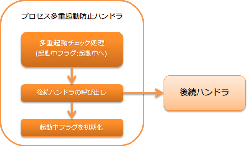

.. _duplicate_process_check_handler:

プロセス多重起動防止ハンドラ
==================================================
.. contents:: 目次
  :depth: 3
  :local:

このハンドラは、同一のバッチプロセスを同時に複数実行した場合に、後に実行されたプロセスを異常終了させる機能を持つ。
このハンドラを適用することで、同一のバッチプロセスの同時実行を防止でき、データの2重取り込みなどを未然に防ぐことが出来る。

同一のバッチプロセスの識別には、スレッド変数上に設定されたリクエストIDを使用する。
このため、同一のバッチアクションで処理を行うバッチであってもリクエストIDが異なる場合には、異なるバッチプロセスとして扱われる。

.. important::
 原則JP1などのジョブスケジューラ側で制御を行うこと。
 ジョブスケジューラ側で制御出来ない場合などは、本ハンドラを適用しアプリケーションレイヤーで多重起動を防止する。

本ハンドラでは、以下の処理を行う。

* プロセスの多重起動チェック処理(多重起動チェック時に起動中フラグを起動中に変更)
* 起動中フラグを初期化(未起動)に変更

処理の流れは以下のとおり。

ハンドラクラス名
--------------------------------------------------
* :java:extdoc:`nablarch.fw.handler.DuplicateProcessCheckHandler`

モジュール一覧
--------------------------------------------------
.. code-block:: xml

  <dependency>
    <groupId>com.nablarch.framework</groupId>
    <artifactId>nablarch-fw-batch</artifactId>
  </dependency>

制約
------------------------------

本ハンドラは、スレッドコンテキスト変数管理ハンドラよりも後ろに設定すること
  本ハンドラではスレッドコンテキスト上に設定されたリクエストIDを元にプロセス多重起動のチェックを行う。
  このため、 :ref:`thread_context_handler` より後ろに本ハンドラを設定する必要がある。

.. _duplicate_process_check_handler-configuration:

多重起動防止チェックを行うための設定
--------------------------------------------------
本ハンドラには、バッチプロセスの多重起動防止チェックを行うクラスなどを設定する必要がある。
設定する項目の詳細は、 :java:extdoc:`DuplicateProcessCheckHandler <nablarch.fw.handler.DuplicateProcessCheckHandler>` を参照。

多重起動防止チェックを行うクラスの詳細は、 :java:extdoc:`BasicDuplicateProcessChecker <nablarch.fw.handler.BasicDuplicateProcessChecker>` を参照。

以下に例を示す。

.. code-block:: xml

  <!-- 多重起動防止チェックを行うクラス -->
  <component name="duplicateProcessChecker" class="nablarch.fw.handler.BasicDuplicateProcessChecker">
    <!-- データベースへアクセスするためのトランザクション設定 -->
    <property name="dbTransactionManager" ref="transaction" />

    <!-- チェックで使用するテーブルの定義情報 -->
    <property name="tableName" value="BATCH_REQUEST" />
    <property name="processIdentifierColumnName" value="REQUEST_ID" />
    <property name="processActiveFlgColumnName" value="PROCESS_ACTIVE_FLG" />
  </component>

  <!-- プロセス多重起動防止ハンドラ -->
  <component name="duplicateProcessCheckHandler"
      class="nablarch.fw.handler.DuplicateProcessCheckHandler">

    <!-- 多重起動防止チェックを行うクラスを設定する -->
    <property name="duplicateProcessChecker" ref="duplicateProcessChecker" />

    <!-- 終了コードを設定する(任意) -->
    <property name="exitCode" value="10" />
  </component>

  <!-- BasicDuplicateProcessCheckerは、初期化が必要なクラスなので初期化対象リストに追加する -->
  <component name="initializer"
      class="nablarch.core.repository.initialization.BasicApplicationInitializer">
    <property name="initializeList">
      <list>
        <component-ref name="duplicateProcessChecker" />
        <!-- 他のコンポーネントの設定 -->
      </list>
    </property>
  </component>

多重起動防止チェック処理をカスタマイズする
--------------------------------------------------
多重起動防止チェック処理をカスタマイズしたい場合は、 :java:extdoc:`DuplicateProcessChecker <nablarch.fw.handler.DuplicateProcessChecker>` の実装クラスを作成することで対応出来る。

実装したクラスは、 :ref:`duplicate_process_check_handler-configuration` で説明したように、本ハンドラに設定することで利用することが出来る。

