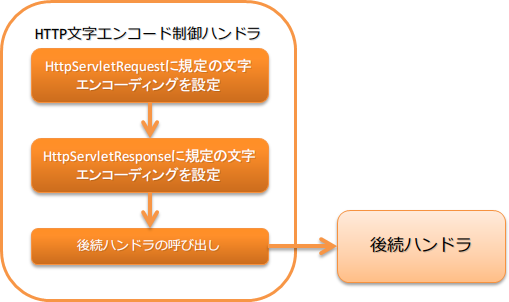

.. _http_character_encoding_handler:

HTTP文字エンコード制御ハンドラ
==================================================
.. contents:: 目次
  :depth: 3
  :local:

本ハンドラではリクエスト( :java:extdoc:`HttpServletRequest <javax.servlet.http.HttpServletRequest>` )
及びレスポンス( :java:extdoc:`HttpServletResponse <javax.servlet.http.HttpServletResponse>` )に対して規定の文字エンコーディングを設定する。

本ハンドラでは、以下の処理を行う。

* リクエスト及びレスポンスへの規定の文字エンコーディングの設定

処理の流れは以下のとおり。

ハンドラクラス名
--------------------------------------------------
* :java:extdoc:`nablarch.fw.web.handler.HttpCharacterEncodingHandler`

モジュール一覧
--------------------------------------------------
.. code-block:: xml

  <dependency>
    <groupId>com.nablarch.framework</groupId>
    <artifactId>nablarch-fw-web</artifactId>
  </dependency>

制約
------------------------------
本ハンドラは、どのハンドラよりも前に設定すること。
  このハンドラより前にハンドラを設定した場合、以下の問題が発生する可能性がある。

  * レスポンスに対する規定の文字エンコーディングが設定されない
  * リクエストパラメータにアクセスすることで規定の文字エンコーディングの設定が有効とならずサーバサイドで文字化けの原因となる

  このため、本ハンドラはどのハンドラよりも前に配置すること。

規定の文字エンコーディングを設定する
--------------------------------------------------
文字エンコーディングは、 :java:extdoc:`defaultEncoding <nablarch.fw.web.handler.HttpCharacterEncodingHandler.setDefaultEncoding(java.lang.String)>` プロパティに対して設定する。
設定を省略した場合は、 ``UTF-8`` が使用される。

以下に ``Windows-31J`` を設定する例を示す。

.. code-block:: xml

  <component class="nablarch.fw.web.handler.HttpCharacterEncodingHandler">
    <property name="defaultEncoding" value="Windows-31J" />
  </component>

レスポンスに対する規定の文字エンコーディングの設定を切り替える
--------------------------------------------------------------------------------
本ハンドラでレスポンスに対して規定の文字エンコーディングを設定した場合、
後続のハンドラで処理した全てのレスポンスに対して文字エンコーディングが設定される。

例えば、後続で画像を返却した場合に、Content-Typeヘッダーが「image/jpeg;charset=UTF-8」となる。
このため、本ハンドラのデフォルトの動作では、レスポンスに対しては、規定の文字エンコーディングを設定していない。

WEB APIのように全てのレスポンスに対して規定の文字エンコーディングを設定する必要がある場合には、
以下の例を参照し :java:extdoc:`appendResponseCharacterEncoding <nablarch.fw.web.handler.HttpCharacterEncodingHandler.setAppendResponseCharacterEncoding(boolean)>` プロパティに ``true`` を設定すること。

.. code-block:: xml

  <component class="nablarch.fw.web.handler.HttpCharacterEncodingHandler">
    <property name="appendResponseCharacterEncoding" value="true" />
  </component>

一律ではなくリクエストごとに文字エンコーディングを変更したい
----------------------------------------------------------------------
リクエスト毎に文字エンコーディングを変更する場合には、本ハンドラを継承して対応すること。

例えば、外部サイトからのリクエストを処理するシステムで、外部サイト毎にエンコーディングが異なる場合には、この対応が必要となる。

以下に例を示す。

ポイント
  * リクエストのエンコーディングを変更する場合は、 :java:extdoc:`resolveRequestEncoding <nablarch.fw.web.handler.HttpCharacterEncodingHandler.resolveRequestEncoding(javax.servlet.http.HttpServletRequest)>` をオーバライドする。
  * レスポンスのエンコーディングを変更する場合は、 :java:extdoc:`resolveResponseEncoding <nablarch.fw.web.handler.HttpCharacterEncodingHandler.resolveResponseEncoding(javax.servlet.http.HttpServletRequest)>` をオーバライドする。

.. code-block:: java

  public class CustomHttpCharacterEncodingHandler extends
          HttpCharacterEncodingHandler {

    @Override
    protected Charset resolveRequestEncoding(HttpServletRequest req) {
      return resolveCharacterEncoding(req);
    }

    @Override
    protected Charset resolveResponseEncoding(HttpServletRequest req) {
      return resolveCharacterEncoding(req);
    }

    /**
     * 文字エンコードを解決する。 
     *
     * URIに{@code /shop1}が含まれている場合は、{@code Windows-31J}として扱う。
     *
     * @param req リクエスト
     * @return 文字エンコード
     */
    private Charset resolveCharacterEncoding(HttpServletRequest req) {
      if (req.getRequestURI().contains("/shop1")) {
        return Charset.forName("Windows-31J");
      }
      return getDefaultEncoding();
    }
  }
