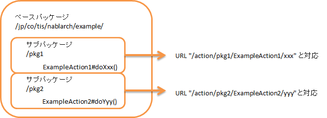

.. _http_request_java_package_mapping:

HTTPリクエストディスパッチハンドラ
==================================================

.. contents:: 目次
  :depth: 3
  :local:

本ハンドラは、アプリケーションの機能ごとに行う処理を記載するアクションに処理を委譲する。\
委譲先のクラス、メソッドは、アクセスしたURLによって決定される。\
本クラスを使用したディスパッチでは、URL形式は下記の通りであることを想定している。

URL形式
  /\<baseUri\>/\<className\>/\<methodName\>

上記形式の\<\>で囲まれた部分はそれぞれ下記を意味する。

.. list-table::
  :class: white-space-normal
  :header-rows: 1
  :widths: 20 80

  * - ラベル
    - 意味
  
  * - baseUri
    - コンテキストルートからの相対パス

  * - className
    - クラス名

  * - methodName    
    - アクションクラスのメソッド名は、HTTPのメソッド + メソッド名として実装する。

      httpのメソッドが ``post`` の場合で、URLのmethodNameが ``register`` の場合には、
      アクションクラスのメソッド名は、 ``postRegister`` とする。

      なお、 ``get`` と ``post`` の場合には、 ``do`` を使用できる。
      上記の例の場合、 ``doRegister`` となる。

.. tip::
  URLとアクションとのマッピングの指定方法については、 :ref:`java_package_mapping_entry-dispatch_settings` を参照。

.. _http_request_java_package_mapping-router_adaptor:

.. important::
  HTTPリクエストディスパッチハンドラでは、クラス名を元にURLが決まるため、柔軟なURLを使用することができない。
  例えば、  ``/user/index`` のようなURLを使用したい場合、クラス名を ``user`` とする必要がある。
  これは、Javaの一般的なクラス名の規約に違反しており、推奨されない。

  このため、このハンドラを使うよりも、URLとアクションクラスとのマッピングを柔軟に設定できる :ref:`router_adaptor` を使用することを推奨する。

本ハンドラでは、以下の処理を行う。

* URIを解析し、対応するアクションのメソッドを呼び出す。

処理の流れは以下のとおり。

.. image:: ../images/HttpRequestJavaPackageMapping/flow.png

ハンドラクラス名
--------------------------------------------------
* :java:extdoc:`nablarch.fw.web.handler.HttpRequestJavaPackageMapping`

モジュール一覧
--------------------------------------------------
.. code-block:: xml

  <dependency>
    <groupId>com.nablarch.framework</groupId>
    <artifactId>nablarch-fw-web</artifactId>
  </dependency>
  
制約
-----------------------

ハンドラキューの最後に置くこと
  本ハンドラは、後続のハンドラの呼び出しを行わない。
  このため、本ハンドラの配置はハンドラキューの最後に置くこと。

.. _java_package_mapping_entry-dispatch_settings:

ディスパッチの設定を行う
----------------------------------------------------------------------------------------------------

本クラスを使用する際は、前述の baseUri と、アクションを配置するパッケージ(ベースパッケージ)の設定が必須となる。
以下にbaseUri を ``action`` 、ベースパッケージを ``jp.co.tis.nablarch.example`` に設定する例を示す。

.. code-block:: xml

  <component name="packageMapping"
             class="nablarch.fw.web.handler.HttpRequestJavaPackageMapping">
    <property name="baseUri" value="/action/"/>
    <property name="basePackage" value="jp.co.tis.nablarch.example"/>
  </component>

上記設定の場合のディスパッチ例を以下に示す。

:URL: /action/UserAction/index
:ディスパッチ先クラス: jp.co.tis.nablarch.example.UserAction

.. _java_package_mapping_entry-multi_package:

アクションが複数のパッケージに配置される場合の設定を行う
-------------------------------------------------------------------------------------

アクションは、複数のパッケージにまたがって配置できる。
この場合、前述の :ref:`java_package_mapping_entry-dispatch_settings` に記載のベースパッケージを全Actionが置かれるパッケージに
設定し、URIのクラス名にベースパッケージから対応づける Action までのパスを記載する。

以下にクラスの配置とURLの対応付けの例を示す。

