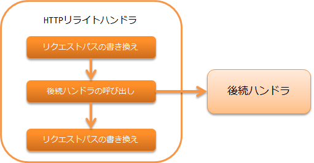

.. _http_rewrite_handler:

HTTPリライトハンドラ
==================================================
.. contents:: 目次
  :depth: 3
  :local:

本ハンドラは、HTTPのリクエストおよびレスポンスに対して、リクエストパスとコンテンツパス、
および変数の書き換えを行う機能を提供する。
このハンドラは、「未ログイン状態の際は強制的にログイン画面に遷移させる」といった、特殊な
遷移が必要になった際に使用する。

本ハンドラでは、以下の処理を行う。

* リクエストパスの書き換えを行う
* コンテンツパスの書き換えを行う

処理の流れは以下のとおり。

ハンドラクラス名
--------------------------------------------------
* :java:extdoc:`nablarch.fw.web.handler.HttpRewriteHandler`

モジュール一覧
--------------------------------------------------
.. code-block:: xml

  <dependency>
    <groupId>com.nablarch.framework</groupId>
    <artifactId>nablarch-fw-web</artifactId>
  </dependency>

制約
------------------------------

:ref:`http_response_handler` より後ろに配置すること
  本ハンドラで書き換えたコンテンツパスは、レスポンスハンドラにより使用される。
  このため、本ハンドラは :ref:`http_response_handler` の後ろに配置する必要がある。

:ref:`thread_context_handler` より後ろに配置すること
  本ハンドラでは、スレッドコンテキストに入れられるリクエストパスの書き換えを行う。
  このため、本ハンドラは :ref:`thread_context_handler` より前に配置する必要がある。

書き換えの設定
------------------------------

書き換えの設定は、 :java:extdoc:`本ハンドラ <nablarch.fw.web.handler.HttpRewriteHandler>`  のプロパティ requestPathRewriteRules または contentPathRewriteRules に対して行う。

以下に設定例を示す。

.. code-block:: xml

  <component class="nablarch.fw.web.handler.HttpRewriteHandler">
    <!-- リクエストパスに対するリライトルール -->
    <property name="requestPathRewriteRules">
      <list>
        <!-- サーブレットコンテキストルートへのアクセスに対して、
             既にログインが成立していればメニュー画面へ遷移させる。 -->
        <component class="nablarch.fw.web.handler.HttpRequestRewriteRule">
          <property name="pattern" value="^/$" />
          <property name="conditions">
          <list>
            <value>%{session:user.id} ^\S+$</value>
          </list>
          </property>
          <property name="rewriteTo" value="/action/MenuAction/show" />
        </component>

        <!-- ログインが成立していない場合はログイン画面へ遷移させる。 -->
        <component class="nablarch.fw.web.handler.HttpRequestRewriteRule">
          <property name="pattern"   value="^/$" />
          <property name="rewriteTo" value="/action/LoginAction/authenticate" />
        </component>
      </list>
    </property>

    <!-- レスポンスのコンテンツパスに対するリライトルール -->
    <property name="contentPathRewriteRules">
      <list>

        <!-- ステータスコードが401であった場合はログイン画面に遷移させる -->
        <component class="nablarch.fw.web.handler.ContentPathRewriteRule">
          <property name="pattern"   value="^.*" />
          <property name="rewriteTo" value="redirect:///action/LoginAction/authenticate" />
          <property name="conditions">
            <list>
            <value>%{statusCode} ^401$</value>
            </list>
          </property>
        </component>
      </list>
    </property>
  </component>

この例からわかる通り、設定は :java:extdoc:`HttpRequestRewriteRule <nablarch.fw.web.handler.HttpRequestRewriteRule>`
(リクエストパスを書き換える場合)または :java:extdoc:`ContentPathRewriteRule <nablarch.fw.web.handler.ContentPathRewriteRule>`
(コンテンツパスを書き換える場合)を使用して行う。

:java:extdoc:`HttpRequestRewriteRule <nablarch.fw.web.handler.HttpRequestRewriteRule>`
および :java:extdoc:`ContentPathRewriteRule <nablarch.fw.web.handler.ContentPathRewriteRule>`
には、下記のプロパティが存在する。(プロパティは、スーパークラスの
:java:extdoc:`RewriteRule <nablarch.fw.handler.RewriteRule>` に定義されている。)

==================== ====================================================
プロパティ名         説明
==================== ====================================================
pattern              適用する対象のパスのパターン
rewriteTo            書き換え後の文字列
conditions           パス以外の追加の適用条件
exports              変数の書き換え設定
==================== ====================================================

:java:extdoc:`HttpRequestRewriteRule <nablarch.fw.web.handler.HttpRequestRewriteRule>`
および :java:extdoc:`ContentPathRewriteRule <nablarch.fw.web.handler.ContentPathRewriteRule>`
では、conditionsの設定に変数を使用できる。
:java:extdoc:`HttpRequestRewriteRule <nablarch.fw.web.handler.HttpRequestRewriteRule>`
、 :java:extdoc:`ContentPathRewriteRule <nablarch.fw.web.handler.ContentPathRewriteRule>`
それぞれで使用可能な変数は下記の通り。

============================ ============================== ===========================================================
変数種別                     書式                           適用可能なクラス
============================ ============================== ===========================================================
セッションスコープ           %{session:(変数名)}            HttpRequestRewriteRule / ContentPathRewriteRule
リクエストスコープ           %{request:(変数名)}            HttpRequestRewriteRule / ContentPathRewriteRule
スレッドコンテキスト         %{thread:(変数名)}             HttpRequestRewriteRule / ContentPathRewriteRule
リクエストパラメータ         %{param:(変数名)}              HttpRequestRewriteRule
HTTPヘッダ                   %{header:(ヘッダー名)}         HttpRequestRewriteRule / ContentPathRewriteRule
HTTPリクエストメソッド       %{httpMethod}                  HttpRequestRewriteRule
HTTPバージョン               %{httpVersion}                 HttpRequestRewriteRule
全リクエストパラメータ名     %{paramNames}                  HttpRequestRewriteRule
ステータスコード             %{statusCode}                  ContentPathRewriteRule
============================ ============================== ===========================================================

変数に値を設定
---------------------------

HTTPリライトハンドラでは、パスの書き換え以外に リクエストスコープ、セッションスコープ、
スレッドコンテキスト、ウィンドウスコープへ変数を設定できる。

変数を設定するには、:java:extdoc:`HttpRequestRewriteRule <nablarch.fw.web.handler.HttpRequestRewriteRule>`
または :java:extdoc:`ContentPathRewriteRule <nablarch.fw.web.handler.ContentPathRewriteRule>` の
export プロパティを設定する。

以下に設定例を示す。

.. code-block:: xml

  <!--リファラヘッダが送信された場合は、リクエストスコープにその値を設定する。-->
  <component class="nablarch.fw.web.handler.HttpRequestRewriteRule">
    <!-- 全リクエストを対象とする。 -->
    <property name="pattern" value=".*" />
    <!-- リファラヘッダが定義されていた場合のみ適用する。-->
    <property name="conditions">
      <list>
        <value>%{header:Referer} ^\S+$</value>
      </list>
    </property>
    <!-- リクエストスコープ上の変数 prevUrl に、リファラヘッダの値を設定する。-->
    <property name="exports">
      <list>
        <value>%{request:prevUrl} ${header:Referer}</value>
      </list>
    </property>
  </component>

このように、 exports プロパティに 「設定する変数名」(上記例の場合、"%{request:prevUrl}")と
「設定する値」(上記例の場合 "${header:Referer}")をリストで設定することで、各スコープへ変数の
設定ができる。

exports で、「設定する変数名」に設定できる変数スコープは下記の通り。

============================ ======================= ========================================================
変数スコープ                 書式                    対象
============================ ======================= ========================================================
セッションスコープ           %{session:(変数名)}     HttpRequestRewriteRule / ContentPathRewriteRule
リクエストスコープ           %{request:(変数名)}     HttpRequestRewriteRule / ContentPathRewriteRule
スレッドコンテキスト         %{thread:(変数名)}      HttpRequestRewriteRule / ContentPathRewriteRule
ウィンドウスコープ           %{param:(変数名)}       HttpRequestRewriteRule
============================ ======================= ========================================================
